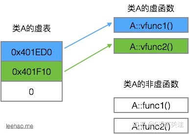
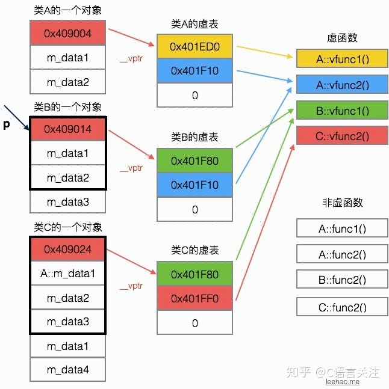

---

* [https://zhuanlan.zhihu.com/p/75172640 - 知乎专栏](https://zhuanlan.zhihu.com/p/75172640)
* [虚函数实现机制](https://blog.twofei.com/496/)

---

## 一、概述

为了实现C++的多态，C++使用了一种动态绑定的技术。这个技术的核心是虚函数表（下文简称虚表）。本文介绍虚函数表是如何实现动态绑定的。

## 二、类的虚表

每个包含了虚函数的类都包含一个虚表。

我们知道，当一个类（A）继承另一个类（B）时，类A会继承类B的函数的调用权。所以如果一个基类包含了虚函数，那么其继承类也可调用这些虚函数，换句话说，一个类继承了包含虚函数的基类，那么这个类也拥有自己的虚表。

我们来看以下的代码。类A包含虚函数vfunc1，vfunc2，由于类A包含虚函数，故类A拥有一个虚表。

```cpp
class A {
public:
    virtual void vfunc1();
    virtual void vfunc2();
    void func1();
    void func2();
private:
    int m_data1, m_data2;
};
```

类A的虚表如图1所示。



 图1：类A的虚表示意图

虚表是一个指针数组，其元素是虚函数的指针，每个元素对应一个虚函数的函数指针。需要指出的是，普通的函数即非虚函数，其调用并不需要经过虚表，所以虚表的元素并不包括普通函数的函数指针。  
虚表内的条目，即虚函数指针的赋值发生在编译器的编译阶段，也就是说在代码的编译阶段，虚表就可以构造出来了。

## 三、虚表指针

虚表是属于类的，而不是属于某个具体的对象，一个类只需要一个虚表即可。同一个类的所有对象都使用同一个虚表。

为了指定对象的虚表，对象内部包含一个虚表的指针，来指向自己所使用的虚表。为了让每个包含虚表的类的对象都拥有一个虚表指针，编译器在类中添加了一个指针，`*__vptr`，用来指向虚表。这样，当类的对象在创建时便拥有了这个指针，且这个指针的值会自动被设置为指向类的虚表。


 图2：对象与它的虚表

上面指出，一个继承类的基类如果包含虚函数，那个这个继承类也有拥有自己的虚表，故这个继承类的对象也包含一个虚表指针，用来指向它的虚表。

## 四、动态绑定

说到这里，大家一定会好奇C++是如何利用虚表和虚表指针来实现动态绑定的。我们先看下面的代码。

```cpp
class A {
public:
    virtual void vfunc1();
    virtual void vfunc2();
    void func1();
    void func2();
private:
    int m_data1, m_data2;
};
class B : public A {
public:
    virtual void vfunc1();
    void func1();
private:
    int m_data3;
};
class C: public B {
public:
    virtual void vfunc2();
    void func2();
private:
    int m_data1, m_data4;
};
```

类A是基类，类B继承类A，类C又继承类B。类A，类B，类C，其对象模型如下图3所示。



 图3：类A，类B，类C的对象模型

由于这三个类都有虚函数，故编译器为每个类都创建了一个虚表，即类A的虚表（A vtbl），类B的虚表（B vtbl），类C的虚表（C vtbl）。类A，类B，类C的对象都拥有一个虚表指针，`*__vptr`，用来指向自己所属类的虚表。

类A包括两个虚函数，故A vtbl包含两个指针，分别指向`A::vfunc1()`和`A::vfunc2()`。

类B继承于类A，故类B可以调用类A的函数，但由于类B重写了`B::vfunc1()`函数，故B vtbl的两个指针分别指向`B::vfunc1()`和`A::vfunc2()`。

类C继承于类B，故类C可以调用类B的函数，但由于类C重写了`C::vfunc2()`函数，故C vtbl的两个指针分别指向`B::vfunc1()`（指向继承的最近的一个类的函数）和`C::vfunc2()`。

虽然图3看起来有点复杂，但是只要抓住“**对象的虚表指针用来指向自己所属类的虚表，虚表中的指针会指向其继承的最近的一个类的虚函数**”这个特点，便可以快速将这几个类的对象模型在自己的脑海中描绘出来。

非虚函数的调用不用经过虚表，故不需要虚表中的指针指向这些函数。

假设我们定义一个类B的对象`bObject`。由于`bObject`是类B的一个对象，故`bObject`包含一个虚表指针，指向类B的虚表。

```cpp
int main() 
{
    B bObject;
}
```

现在，我们声明一个类A的指针p来指向对象`bObject`。虽然`p`是基类的指针只能指向基类的部分，但是虚表指针亦属于基类部分，所以`p`可以访问到对象`bObject`的虚表指针。`bObject`的虚表指针指向类B的虚表，所以`p`可以访问到B vtbl。如图3所示。

```cpp
int main() 
{
    B bObject;
    A *p = & bObject;
}
```

当我们使用`p`来调用`vfunc1()`函数时，会发生什么现象？

```cpp
int main() 
{
    B bObject;
    A *p = & bObject;
    p->vfunc1();
}
```

程序在执行`p->vfunc1()`时，会发现`p`是个指针，且调用的函数是虚函数，接下来便会进行以下的步骤。

首先，根据虚表指针`p->__vptr`来访问对象`bObject`对应的虚表。虽然指针`p`是基类`A*`类型，但是`*__vptr`也是基类的一部分，所以可以通过`p->__vptr`可以访问到对象对应的虚表。

然后，在虚表中查找所调用的函数对应的条目。由于虚表在编译阶段就可以构造出来了，所以可以根据所调用的函数定位到虚表中的对应条目。对于`p->vfunc1()`的调用，B vtbl的第一项即是`vfunc1`对应的条目。

最后，根据虚表中找到的函数指针，调用函数。从图3可以看到，B vtbl的第一项指向`B::vfunc1()`，所以`p->vfunc1()`实质会调用`B::vfunc1()`函数。

如果`p`指向类A的对象，情况又是怎么样？

```cpp
int main() 
{
    A aObject;
    A *p = &aObject;
    p->vfunc1();
}
```

当`aObject`在创建时，它的虚表指针`__vptr`已设置为指向A vtbl，这样`p->__vptr`就指向A vtbl。`vfunc1`在A vtbl对应在条目指向了`A::vfunc1()`函数，所以`p->vfunc1()`实质会调用`A::vfunc1()`函数。

可以把以上三个调用函数的步骤用以下表达式来表示：

可以看到，通过使用这些虚函数表，即使使用的是基类的指针来调用函数，也可以达到正确调用运行中实际对象的虚函数。

我们把经过虚表调用虚函数的过程称为动态绑定，其表现出来的现象称为运行时多态。动态绑定区别于传统的函数调用，传统的函数调用我们称之为静态绑定，即函数的调用在编译阶段就可以确定下来了。

那么，什么时候会执行函数的动态绑定？这需要符合以下三个条件。

* 通过指针来调用函数
* 指针upcast向上转型（继承类向基类的转换称为upcast，关于什么是upcast，可以参考本文的参考资料）
* 调用的是虚函数

如果一个函数调用符合以上三个条件，编译器就会把该函数调用编译成动态绑定，其函数的调用过程走的是上述通过虚表的机制。

## 五、总结

封装，继承，多态是面向对象设计的三个特征，而多态可以说是面向对象设计的关键。C++通过虚函数表，实现了虚函数与对象的动态绑定，从而构建了C++面向对象程序设计的基石。

## 参考资料

* 《C++ Primer》第三版，中文版，潘爱民等译
* [http://www.**learncpp.com/cpp-tutori**al/125-the-virtual-table/](https://link.zhihu.com/?target=http%3A//www.learncpp.com/cpp-tutorial/125-the-virtual-table/)
* 侯捷《C++最佳编程实践》视频，极客班，2015
* Upcasting and Downcasting, [http://www.**bogotobogo.com/cplusplu**s/upcasting_downcasting.php](https://link.zhihu.com/?target=http%3A//www.bogotobogo.com/cplusplus/upcasting_downcasting.php)

## 附录

[示例代码](https://link.zhihu.com/?target=https%3A//github.com/haozlee/vtable/blob/master/main.cpp)
