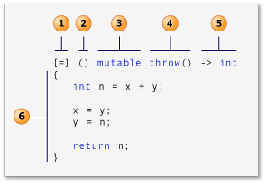

## nullptr

* NULL：预处理变量，是一个宏，它的值是 0，定义在头文件 <cstdlib> 中，即 #define NULL 0。
* nullptr：C++ 11 中的关键字，是一种特殊类型的字面值，可以被转换成任意其他类型。

nullptr 的优势：

* 有类型，类型是 typdef decltype(nullptr) nullptr_t;，使用 nullptr 提高代码的健壮性。
* 函数重载：因为 NULL 本质上是 0，在函数调用过程中，若出现函数重载并且传递的实参是 NULL，可能会出现，不知和哪一个函数匹配的情况；但是传递实参 nullptr 就不会出现这种情况。

## 自动类型推导

```cpp
auto var = val1 + val2;
decltype(val1 + val2) var1 = 0;
```

* auto 根据 = 右边的初始值 val1 + val2 推导出变量的类型，并将该初始值赋值给变量 var；decltype 根据 val1 + val2 表达式推导出变量的类型，变量的初始值和与表达式的值无关。
* auto 要求变量必须初始化，因为它是根据初始化的值推导出变量的类型，而 decltype 不要求，定义变量的时候可初始化也可以不初始化。

## lambda表达式

* 声明式编程风格：就地匿名定义目标函数或函数对象，不需要额外写一个命名函数或者函数对象。以更直接的方式去写程序，好的可读性和可维护性。
* 简洁：不需要额外再写一个函数或者函数对象，避免了代码膨胀和功能分散，让开发者更加集中精力在手边的问题，同时也获取了更高的生产率。
* 在需要的时间和地点实现功能闭包，使程序更灵活。



1. *apture 子句* (在 C++ specification.) 中也称为 *lambda-introducer*

    * [] 不捕获任何变量。
    * [&] 捕获外部作用域中所有变量，并作为引用在函数体中使用（按引用捕获）。
    * [=] 捕获外部作用域中所有变量，并作为副本在函数体中使用（按值捕获）。
    * [=，&foo] 按值捕获外部作用域中所有变量，并按引用捕获 foo 变量。
    * [bar] 按值捕获 bar 变量，同时不捕获其他变量。
    * [this] 捕获当前类中的 this [指针](http://c.biancheng.net/c/80/)，让 lambda 表达式拥有和当前类成员函数同样的访问权限。如果已经使用了 & 或者 =，就默认添加此选项。捕获 this 的目的是可以在 lamda 中使用当前类的成员函数和成员变量。
2. *参数列表* 选。 (也称为 *lambda 声明符)*
3. *可变规范* 选。
4. *exception-specification* 选。
5. *trailing-return-type* 选。
6. *lambda 正文* 。

## 范围for语句

```cpp
for (declaration : expression){
    statement
}
```

## 右值引用

###什么是左值、右值？

* 左值 **可以取地址、位于等号左边** ；而右值 **没法取地址，位于等号右边** 。

### 什么是左值引用？

* **能指向左值，不能指向右值的就是左值引用**

```cpp
int a = 5;
int &ref_a = a; // 左值引用指向左值，编译通过
int &ref_a = 5; // 左值引用指向了右值，会编译失败
```

**引用是变量的别名，由于右值没有地址，没法被修改，所以左值引用无法指向右值。**

但是，const左值引用是可以指向右值的：

```cpp
const int &ref_a = 5;  // 编译通过
```

const左值引用不会修改指向值，因此可以指向右值，这也是为什么要使用`const &`作为函数参数的原因之一，如`std::vector`的`push_back`：

```cpp
void push_back (const value_type& val);
```

### 什么是右值引用？

* 右值引用的标志是`&&`，顾名思义，右值引用专门为右值而生， **可以指向右值，不能指向左值** ：

```cpp
int &&ref_a_right = 5; // ok
 
int a = 5;
int &&ref_a_left = a; // 编译不过，右值引用不可以指向左值
 
ref_a_right = 6; // 右值引用的用途：可以修改右值
```

### 区别

1. **从性能上讲，左右值引用没有区别，传参使用左右值引用都可以避免拷贝。**
2. **右值引用可以直接指向右值，也可以通过std::move指向左值；而左值引用只能指向左值(const左值引用也能指向右值)。**
3. **作为函数形参时，右值引用更灵活。虽然const左值引用也可以做到左右值都接受，但它无法修改，有一定局限性。**

```cpp
void f(const int& n) {
    n += 1; // 编译失败，const左值引用不能修改指向变量
}

void f2(int && n) {
    n += 1; // ok
}

int main() {
    f(5);
    f2(5);
}
```

## 移动构造与移动赋值
