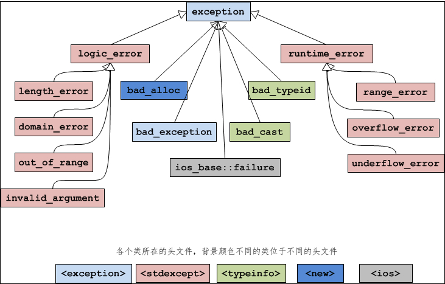

程序的错误大致可以分为三种，分别是语法错误、逻辑错误和运行时错误：

1. 语法错误在编译和链接阶段就能发现，只有 100% 符合语法规则的代码才能生成可执行程序。语法错误是最容易发现、最容易定位、最容易排除的错误，程序员最不需要担心的就是这种错误。
2. 逻辑错误是说我们编写的代码思路有问题，不能够达到最终的目标，这种错误可以通过调试来解决。
3. 运行时错误是指程序在运行期间发生的错误，例如除数为 0、内存分配失败、数组越界、文件不存在等。C++ 异常（Exception）机制就是为解决运行时错误而引入的。

运行时错误如果放任不管，系统就会执行默认的操作，终止程序运行，也就是我们常说的程序崩溃（Crash）。C++ 提供了异常（Exception）机制，让我们能够捕获运行时错误，给程序一次“起死回生”的机会，或者至少告诉用户发生了什么再终止程序。

```cpp
#include <iostream>
#include <string>
#include <exception>
using namespace std;

int main(){
    string str = "http://c.biancheng.net";
  
    try{
        char ch1 = str[100];
        cout<<ch1<<endl;
    }catch(exception e){
        cout<<"[1]out of bound!"<<endl;
    }

    try{
        char ch2 = str.at(100);
        cout<<ch2<<endl;
    }catch(exception &e){  //exception类位于<exception>头文件中
        cout<<"[2]out of bound!"<<endl;
    }

    return 0;
}
```

## 异常的类型与多级catch

C++ 规定，异常类型可以是 int、char、float、bool 等基本类型，也可以是指针、数组、字符串、结构体、类等聚合类型。C++ 语言本身以及标准库中的函数抛出的异常，都是 exception 类或其子类的异常。也就是说，抛出异常时，会创建一个 exception 类或其子类的对象。

```cpp
#include <iostream>
#include <string>
using namespace std;

class Base{ };
class Derived: public Base{ };

int main(){
    try{
        throw Derived();  //抛出自己的异常类型，实际上是创建一个Derived类型的匿名对象
        cout<<"This statement will not be executed."<<endl;
    }catch(int){
        cout<<"Exception type: int"<<endl;
    }catch(char *){
        cout<<"Exception type: cahr *"<<endl;
    }catch(Base){  //匹配成功（向上转型）
        cout<<"Exception type: Base"<<endl;
    }catch(Derived){
        cout<<"Exception type: Derived"<<endl;
    }

    return 0;
}
```

## exception类

C++语言本身或者标准库抛出的异常都是 exception 的子类，称为标准异常（S[tan](http://c.biancheng.net/ref/tan.html)dard Exception）。

```cpp
try{
    //可能抛出异常的语句
}catch(exception &e){  // 之所以使用引用，是为了提高效率。如果不使用引用，就要经历一次对象拷贝的过程。
    //处理异常的语句
}
```


