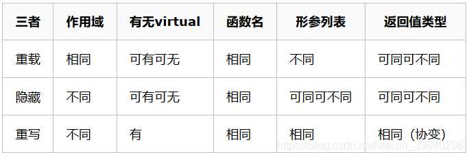
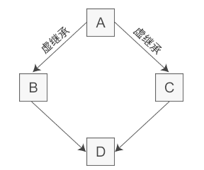

## 面向对象的三大特性

* 封装：将具体的实现过程和数据封装成一个函数，只能通过接口进行访问，降低耦合性。
* 继承：子类继承父类的特征和行为，子类有父类的非 private 方法或成员变量，子类可以对父类的方法进行重写，增强了类之间的耦合性，但是当父类中的成员变量、成员函数或者类本身被 final 关键字修饰时，修饰的类不能继承，修饰的成员不能重写或修改。
* 多态：多态就是不同继承类的对象，对同一消息做出不同的响应，基类的指针指向或绑定到派生类的对象，使得基类指针呈现不同的表现方式。

  * 多态是通过虚函数实现的，虚函数的地址保存在虚函数表中，虚函数表的地址保存在含有虚函数的类的实例对象的内存空间中。

## 重载、重写、隐藏的区别

### 重载

重载：是指同一可访问区内被声明几个具有不同参数列（参数的类型、个数、顺序）的同名函数，根据参数列表确定调用哪个函数，重载不关心函数返回类型。（如果函数参数列表相同，返回类型不同，则并不构成重载）

> **类的静态成员函数与普通成员函数可以形成重载**
>

```cpp
class A
{
public:
    void fun(int tmp);
    void fun(float tmp);        // 重载 参数类型不同（相对于上一个函数）
    void fun(int tmp, float tmp1); // 重载 参数个数不同（相对于上一个函数）
    void fun(float tmp, int tmp1); // 重载 参数顺序不同（相对于上一个函数）
    int fun(int tmp);            // error: 'int A::fun(int)' cannot be overloaded 错误：注意重载不关心函数返回类型
};
```

> const重载
>

### 隐藏

隐藏：是指派生类的函数屏蔽了与其同名的基类函数，主要只要同名函数，不管参数列表是否相同，基类函数都会被隐藏。

```cpp
#include <iostream>
using namespace std;

class Base
{
public:
    void fun(int tmp, float tmp1) { cout << "Base::fun(int tmp, float tmp1)" << endl; }
};

class Derive : public Base
{
public:
    void fun(int tmp) { cout << "Derive::fun(int tmp)" << endl; } // 隐藏基类中的同名函数
};

int main()
{
    Derive ex;
    ex.fun(1);       // Derive::fun(int tmp)
    ex.fun(1, 0.01); // error: candidate expects 1 argument, 2 provided
    return 0;
}
```

说明：上述代码中 ex.fun(1, 0.01); 出现错误，说明派生类中将基类的同名函数隐藏了。若是想调用基类中的同名函数，可以加上类型名指明 ex.Base::fun(1, 0.01);，这样就可以调用基类中的同名函数。

### 重写（覆盖）

重写(覆盖)：是指派生类中存在重新定义的函数。**函数名、参数列表、返回值类型都必须同基类中被重写的函数一致**，只有函数体不同。派生类调用时会调用派生类的重写函数，不会调用被重写函数。

> **重写的基类中被重写的函数必须有 `virtual` 修饰**。**重写的子类函数最好有`override`修饰**。
>

```cpp
#include <iostream>
using namespace std;

class Base
{
public:
    virtual void fun(int tmp) { cout << "Base::fun(int tmp) : " << tmp << endl; }
};

class Derived : public Base
{
public:
    virtual void fun(int tmp) { cout << "Derived::fun(int tmp) : " << tmp << endl; } // 重写基类中的 fun 函数
};
int main()
{
    Base *p = new Derived();
    p->fun(3); // Derived::fun(int) : 3
    return 0;
}
```

### 区别

* 重写和重载的区别：

  * 范围区别：对于类中函数的重载或者重写而言，重载发生在同一个类的内部，重写发生在不同的类之间（子类和父类之间）。
  * 参数区别：重载的函数需要与原函数有相同的函数名、不同的参数列表，不关注函数的返回值类型；重写的函数的函数名、参数列表和返回值类型都需要和原函数相同，父类中被重写的函数需要有 virtual 修饰。  
    virtual 关键字：重写的函数基类中必须有 virtual关键字的修饰，重载的函数可以有 virtual 关键字的修饰也可以没有。

* 隐藏和重写，重载的区别：

  * 范围区别：隐藏与重载范围不同，隐藏发生在不同类中。
  * 参数区别：隐藏函数和被隐藏函数参数列表可以相同，也可以不同，但函数名一定相同；当参数不同时，无论基类中的函数是否被 virtual 修饰，基类函数都是被隐藏，而不是重写。



## 成员初始化列表

C++ 规定，对象的成员变量的初始化动作发生在进入构造函数本体之前  

这句话是说无论是否在列表中显式初始化成员变量对象，都会在此初始化一次默认构造函数，所以如果不在此处初始化，而是跑到类的构造函数里去初始化的话，等于平白空耗在列表的这次初始化，然后在类的构造函数中再去初始化+拷贝。


## const成员变量和const成员函数

### const成员变量

const 成员变量的用法和普通 const 变量的用法相似，只需要在声明时加上 const 关键字。**初始化 const 成员变量只有一种方法，就是通过构造函数的初始化列表**。

```cpp
class VLA{
private:
    const int m_len;
    int *m_arr;
public:
    VLA(int len);
};

//必须使用初始化列表来初始化 m_len
VLA::VLA(int len): m_len(len){
    m_arr = new int[len];
}
```

### const成员函数

const 成员函数可以使用类中的所有成员变量，但是不能修改它们的值，这种措施主要还是为了保护数据而设置的。const 成员函数也称为常成员函数。

我们通常将 get 函数设置为常成员函数。读取成员变量的函数的名字通常以`get`开头，后跟成员变量的名字，所以通常将它们称为 get 函数。

常成员函数需要在声明和定义的时候在**函数头部的结尾**加上 const 关键字

```cpp
class Student{
public:
    Student(char *name, int age, float score);
    void show();
    //声明常成员函数
    char *getname() const;
    int getage() const;
    float getscore() const;
private:
    char *m_name;
    int m_age;
    float m_score;
};

Student::Student(char *name, int age, float score): m_name(name), m_age(age), m_score(score){ }
void Student::show(){
    cout<<m_name<<"的年龄是"<<m_age<<"，成绩是"<<m_score<<endl;
}
//定义常成员函数
char * Student::getname() const{
    return m_name;
}
int Student::getage() const{
    return m_age;
}
float Student::getscore() const{
    return m_score;
}
```

需要强调的是，**必须在成员函数的声明和定义处同时加上 const 关键字**。`char *getname() const`和`char *getname()`是两个不同的函数原型，如果只在一个地方加 const 会导致声明和定义处的函数原型冲突。

最后再来区分一下 const 的位置：

* 函数开头的 const 用来修饰函数的返回值，表示返回值是 const 类型，也就是不能被修改，例如`const char * getname()`。
* 函数头部的结尾加上 const 表示常成员函数，这种函数只能读取成员变量的值，而不能修改成员变量的值，例如`char * getname() const`。

## const对象

在 C++ 中，const 也可以用来修饰对象，称为**常对象**。

一旦将对象定义为常对象之后，不管是哪种形式，该对象就只能访问被 const 修饰的成员了（包括 const 成员变量和 const 成员函数），因为非 const 成员可能会修改对象的数据（编译器也会这样假设），C++禁止这样做。

```cpp
#include <iostream>
using namespace std;

class Student{
public:
    Student(char *name, int age, float score);
public:
    void show();
    char *getname() const;
    int getage() const;
    float getscore() const;
private:
    char *m_name;
    int m_age;
    float m_score;
};

Student::Student(char *name, int age, float score): m_name(name), m_age(age), m_score(score){ }
void Student::show(){
    cout<<m_name<<"的年龄是"<<m_age<<"，成绩是"<<m_score<<endl;
}
char * Student::getname() const{
    return m_name;
}
int Student::getage() const{
    return m_age;
}
float Student::getscore() const{
    return m_score;
}

int main(){
    const Student stu("小明", 15, 90.6);
    //stu.show();  //error
    cout<<stu.getname()<<"的年龄是"<<stu.getage()<<"，成绩是"<<stu.getscore()<<endl;

    const Student *pstu = new Student("李磊", 16, 80.5);
    //pstu -> show();  //error
    cout<<pstu->getname()<<"的年龄是"<<pstu->getage()<<"，成绩是"<<pstu->getscore()<<endl;

    return 0;
}
```

## 友元函数和友元类

在 C++ 中，一个类中可以有 public、protected、private 三种属性的成员，通过对象可以访问 public 成员，只有本类中的函数可以访问本类的 private 成员。现在，我们来介绍一种例外情况——友元（friend）。借助友元（friend），可以使得其他类中的成员函数以及全局范围内的函数访问当前类的 private 成员。

### 友元函数

在当前类以外定义的、不属于当前类的函数也可以在类中声明，但要在前面加 friend 关键字，这样就构成了友元函数。友元函数可以是不属于任何类的非成员函数，也可以是其他类的成员函数。

友元函数可以访问当前类中的所有成员，包括 public、protected、private 属性的。

```cpp
#include <iostream>
using namespace std;

class Student{
public:
    Student(char *name, int age, float score);
public:
    friend void show(Student *pstu);  //将show()声明为友元函数
private:
    char *m_name;
    int m_age;
    float m_score;
};

Student::Student(char *name, int age, float score): m_name(name), m_age(age), m_score(score){ }

//非成员函数
void show(Student *pstu){
    cout<<pstu->m_name<<"的年龄是 "<<pstu->m_age<<"，成绩是 "<<pstu->m_score<<endl;
}

int main(){
    Student stu("小明", 15, 90.6);
    show(&stu);  //调用友元函数
    Student *pstu = new Student("李磊", 16, 80.5);
    show(pstu);  //调用友元函数

    return 0;
}
```

注意，友元函数不同于类的成员函数，在友元函数中不能直接访问类的成员，必须要借助对象。

通常对于普通函数来说,要访问类的保护成员是不可能的，如果想这么做那么必须把类的成员都生命成为public(共用的)，然而这做带来的问题遍是任何外部函数都可以毫无约束的访问它操作它，c++利用friend修饰符，可以让一些你设定的函数能够对这些保护数据进行操作，避免把类成员全部设置成public，最大限度的保护数据成员的安全。

友元能够使得普通函数直接访问类的保护数据，避免了类成员函数的频繁调用，可以节约处理器开销，提高程序的效率，但所矛盾的是，即使是最大限度大保护，同样也破坏了类的封装特性，这即是友元的缺点，在现在cpu速度越来越快的今天我们并不推荐使用它，但它作为c++一个必要的知识点，一个完整的组成部分，我们还是需要讨论一下的。

### 友元类

不仅可以将一个函数声明为一个类的“朋友”，还可以将整个类声明为另一个类的“朋友”，这就是友元类。友元类中的所有成员函数都是另外一个类的友元函数。

例如将类 B 声明为类 A 的友元类，那么类 B 中的所有成员函数都是类 A 的友元函数，可以访问类 A 的所有成员，包括 public、protected、private 属性的。

```cpp
#include <iostream>
using namespace std;

class Address;  //提前声明Address类

//声明Student类
class Student{
public:
    Student(char *name, int age, float score);
public:
    void show(Address *addr);
private:
    char *m_name;
    int m_age;
    float m_score;
};

//声明Address类
class Address{
public:
    Address(char *province, char *city, char *district);
public:
    //将Student类声明为Address类的友元类
    friend class Student;
private:
    char *m_province;  //省份
    char *m_city;  //城市
    char *m_district;  //区（市区）
};

//实现Student类
Student::Student(char *name, int age, float score): m_name(name), m_age(age), m_score(score){ }
void Student::show(Address *addr){
    cout<<m_name<<"的年龄是 "<<m_age<<"，成绩是 "<<m_score<<endl;
    cout<<"家庭住址："<<addr->m_province<<"省"<<addr->m_city<<"市"<<addr->m_district<<"区"<<endl;
}

//实现Address类
Address::Address(char *province, char *city, char *district){
    m_province = province;
    m_city = city;
    m_district = district;
}

int main(){
    Student stu("小明", 16, 95.5f);
    Address addr("陕西", "西安", "雁塔");
    stu.show(&addr);
   
    Student *pstu = new Student("李磊", 16, 80.5);
    Address *paddr = new Address("河北", "衡水", "桃城");
    pstu -> show(paddr);

    return 0;
}
```

关于友元，有两点需要说明：

* 友元的关系是单向的而不是双向的。如果声明了类 B 是类 A 的友元类，不等于类 A 是类 B 的友元类，类 A 中的成员函数不能访问类 B 中的 private 成员。
* 友元的关系不能传递。如果类 B 是类 A 的友元类，类 C 是类 B 的友元类，不等于类 C 是类 A 的友元类。

除非有必要，一般不建议把整个类声明为友元类，而只将某些成员函数声明为友元函数，这样更安全一些。

## class与struct的区别

C++ 中保留了C语言的 struct 关键字，并且加以扩充。在C语言中，struct 只能包含成员变量，不能包含成员函数。而在C++中，struct 类似于 class，既可以包含成员变量，又可以包含成员函数。

C++中的 struct 和 class 基本是通用的，唯有几个细节不同：使用 class 时，类中的成员默认都是 private 属性的；而使用 struct 时，结构体中的成员默认都是 public 属性的。

* class 继承默认是 private 继承，而 struct 继承默认是 public 继承。
* class 可以使用模板，而 struct 不能。

## 继承与派生

C++ 中的继承是类与类之间的关系，是一个很简单很直观的概念，与现实世界中的继承类似，例如儿子继承父亲的财产。

**继承**可以理解为一个类从另一个类获取成员变量和成员函数的过程。例如类 B 继承于类 A，那么 B 就拥有 A 的成员变量和成员函数。

在C++中， **派生**和继承是一个概念，只是站的角度不同。继承是儿子接收父亲的产业，派生是父亲把产业传承给儿子。

被继承的类称为父类或基类，继承的类称为子类或派生类。“子类”和“父类”通常放在一起称呼，“基类”和“派生类”通常放在一起称呼。

## C++三种继承方式

**public继承方式**

* 基类中所有 public 成员在派生类中为 public 属性；
* 基类中所有 protected 成员在派生类中为 protected 属性；
* 基类中所有 private 成员在派生类中不能使用。

**protected继承方式**

* 基类中的所有 public 成员在派生类中为 protected 属性；
* 基类中的所有 protected 成员在派生类中为 protected 属性；
* 基类中的所有 private 成员在派生类中不能使用。

**private继承方式**

* 基类中的所有 public 成员在派生类中均为 private 属性；
* 基类中的所有 protected 成员在派生类中均为 private 属性；
* 基类中的所有 private 成员在派生类中不能使用。

总结：

1. ==基类成员在派生类中的访问权限不得高于继承方式中指定的权限==。也就是说，继承方式中的 public、protected、private 是用来指明基类成员在派生类中的最高访问权限的。
2. 不管继承方式如何，基类中的 private 成员在派生类中始终不能使用
3. 如果希望基类的成员能够被派生类继承并且毫无障碍地使用，那么这些成员只能声明为 public 或 protected；只有那些不希望在派生类中使用的成员才声明为 private。
4. 如果希望基类的成员既不向外暴露（不能通过对象访问），还能在派生类中使用，那么只能声明为 protected。

### 改变访问权限

使用 using 关键字可以改变基类成员在派生类中的访问权限，例如将 public 改为 private、将 protected 改为 public。

> 注意：using 只能改变基类中 public 和 protected 成员的访问权限，不能改变 private 成员的访问权限，因为基类中 private 成员在派生类中是不可见的，根本不能使用，所以基类中的 private 成员在派生类中无论如何都不能访问。
>

```cpp
#include<iostream>
using namespace std;

//基类People
class People {
public:
    void show();
protected:
    char *m_name;
    int m_age;
};
void People::show() {
    cout << m_name << "的年龄是" << m_age << endl;
}

//派生类Student
class Student : public People {
public:
    void learning();
public:
    using People::m_name;  //将protected改为public
    using People::m_age;  //将protected改为public
    float m_score;
private:
    using People::show;  //将public改为private
};
void Student::learning() {
    cout << "我是" << m_name << "，今年" << m_age << "岁，这次考了" << m_score << "分！" << endl;
}

int main() {
    Student stu;
    stu.m_name = "小明";
    stu.m_age = 16;
    stu.m_score = 99.5f;
    stu.show();  //compile error
    stu.learning();

    return 0;
}
```

## C++继承时的名字遮蔽问题

如果派生类中的成员（包括成员变量和成员函数）和基类中的成员重名，那么就会遮蔽从基类继承过来的成员。所谓遮蔽，就是在派生类中使用该成员（包括在定义派生类时使用，也包括通过派生类对象访问该成员）时，实际上使用的是派生类新增的成员，而不是从基类继承来的。

==基类成员函数和派生类成员函数不构成重载==

基类成员和派生类成员的名字一样时会造成遮蔽，这句话对于成员变量很好理解，对于成员函数要引起注意，不管函数的参数如何，只要名字一样就会造成遮蔽。换句话说，基类成员函数和派生类成员函数不会构成重载，如果派生类有同名函数，那么就会遮蔽基类中的所有同名函数，不管它们的参数是否一样。

```cpp
#include<iostream>
using namespace std;

//基类Base
class Base{
public:
    void func();
    void func(int);
};
void Base::func(){ cout<<"Base::func()"<<endl; }
void Base::func(int a){ cout<<"Base::func(int)"<<endl; }

//派生类Derived
class Derived: public Base{
public:
    void func(char *);
    void func(bool);
};
void Derived::func(char *str){ cout<<"Derived::func(char *)"<<endl; }
void Derived::func(bool is){ cout<<"Derived::func(bool)"<<endl; }

int main(){
    Derived d;
    d.func("c.biancheng.net");
    d.func(true);
    d.func();  //compile error
    d.func(10);  //compile error
    d.Base::func();
    d.Base::func(100);

    return 0;
}
```

## 基类和派生类的构造函数

基类的成员函数可以被继承，可以通过派生类的对象访问，但这仅仅指的是普通的成员函数，**类的构造函数不能被继承**。构造函数不能被继承是有道理的，因为即使继承了，它的名字和派生类的名字也不一样，不能成为派生类的构造函数，当然更不能成为普通的成员函数。

在设计派生类时，对继承过来的成员变量的初始化工作也要由派生类的构造函数完成，但是大部分基类都有 private 属性的成员变量，它们在派生类中无法访问，更不能使用派生类的构造函数来初始化。

这种矛盾在C++继承中是普遍存在的，解决这个问题的思路是：**在派生类的构造函数中调用基类的构造函数**。

> 基类的构造函数只能放在参数化列表中，不能放在子类构造函数的函数体中
>

```cpp
#include<iostream>
using namespace std;

//基类People
class People{
protected:
    char *m_name;
    int m_age;
public:
    People(char*, int);
};
People::People(char *name, int age): m_name(name), m_age(age){}

//派生类Student
class Student: public People{
private:
    float m_score;
public:
    Student(char *name, int age, float score);
    void display();
};
//People(name, age)就是调用基类的构造函数
Student::Student(char *name, int age, float score): People(name, age), m_score(score){ }
void Student::display(){
    cout<<m_name<<"的年龄是"<<m_age<<"，成绩是"<<m_score<<"。"<<endl;
}

int main(){
    Student stu("小明", 16, 90.5);
    stu.display();

    return 0;
}
```

> **派生类构造函数总是先调用基类构造函数再执行其他代码（包括参数初始化表以及函数体中的代码）**
>

### 构造函数的调用顺序

创建派生类对象时，会先调用基类构造函数，再调用派生类构造函数。如果继承关系有好几层的话，例如：

A --> B --> C

那么创建 C 类对象时构造函数的执行顺序为：

A类构造函数 --> B类构造函数 --> C类构造函数

> 定义派生类构造函数时最好指明基类构造函数；如果不指明，就调用基类的默认构造函数（不带参数的构造函数）；如果没有默认构造函数，那么编译失败。
>

## 基类和派生类的析构函数

和构造函数类似，析构函数也不能被继承。与构造函数不同的是，在派生类的析构函数中不用显式地调用基类的析构函数，因为每个类只有一个析构函数，编译器知道如何选择，无需程序员干涉。

另外析构函数的执行顺序和构造函数的执行顺序也刚好相反：

* 创建派生类对象时，构造函数的执行顺序和继承顺序相同，即先执行基类构造函数，再执行派生类构造函数。
* 而销毁派生类对象时，析构函数的执行顺序和继承顺序相反，即先执行派生类析构函数，再执行基类析构函数。

## 多重继承

即一个派生类可以有两个或多个基类。

```cpp
class D: public A, private B, protected C{
    //类D新增加的成员
}
```

### 多重继承下的构造函数

多继承形式下的构造函数和单继承形式基本相同，只是要在派生类的构造函数中调用多个基类的构造函数。

```cpp
D(形参列表): A(实参列表), B(实参列表), C(实参列表){
    //其他操作
}
```

基类构造函数的调用顺序和和它们在派生类构造函数中出现的顺序无关，而是和声明派生类时基类出现的顺序相同。(在上例中先调用 A 类的构造函数，再调用 B 类构造函数，最后调用 C 类构造函数)

### 命名冲突

当两个或多个基类中有同名的成员时，如果直接访问该成员，就会产生命名冲突，编译器不知道使用哪个基类的成员。这个时候需要在成员名字前面加上类名和域解析符`::`，以显式地指明到底使用哪个类的成员，消除二义性。

## 虚继承与虚基类

多继承时很容易产生命名冲突，即使我们很小心地将所有类中的成员变量和成员函数都命名为不同的名字，命名冲突依然有可能发生，比如典型的是菱形继承，类 A 派生出类 B 和类 C，类 D 继承自类 B 和类 C，这个时候类 A 中的成员变量和成员函数继承到类 D 中变成了两份，一份来自 A-->B-->D 这条路径，另一份来自 A-->C-->D 这条路径。

为了解决多继承时的命名冲突和冗余数据问题，C++ 提出了虚继承，使得在派生类中只保留一份间接基类的成员。

在继承方式前面加上 virtual 关键字就是虚继承

```cpp
//间接基类A
class A{
protected:
    int m_a;
};

//直接基类B
class B: virtual public A{  //虚继承
protected:
    int m_b;
};

//直接基类C
class C: virtual public A{  //虚继承
protected:
    int m_c;
};

//派生类D
class D: public B, public C{
public:
    void seta(int a){ m_a = a; }  //正确
    void setb(int b){ m_b = b; }  //正确
    void setc(int c){ m_c = c; }  //正确
    void setd(int d){ m_d = d; }  //正确
private:
    int m_d;
};

int main(){
    D d;
    return 0;
}
```

虚继承的目的是让某个类做出声明，承诺愿意共享它的基类。其中，这个被共享的基类就称为虚基类（Virtual Base Class），本例中的 A 就是一个虚基类。在这种机制下，不论虚基类在继承体系中出现了多少次，在派生类中都只包含一份虚基类的成员。



观察这个新的继承体系，我们会发现虚继承的一个不太直观的特征：必须在虚派生的真实需求出现前就已经完成虚派生的操作。在上图中，当定义 D 类时才出现了对虚派生的需求，但是如果 B 类和 C 类不是从 A 类虚派生得到的，那么 D 类还是会保留 A 类的两份成员。

换个角度讲，虚派生只影响从指定了虚基类的派生类中进一步派生出来的类，它不会影响派生类本身。

在实际开发中，位于中间层次的基类将其继承声明为虚继承一般不会带来什么问题。通常情况下，使用虚继承的类层次是由一个人或者一个项目组一次性设计完成的。对于一个独立开发的类来说，很少需要基类中的某一个类是虚基类，况且新类的开发者也无法改变已经存在的类体系。

> ==不建议使用多继承==
>

## 向上转型

[向上转型](http://c.biancheng.net/view/2284.html)


## 拷贝构造函数（复制构造函数）

用于通过拷贝的方式初始化一个对象

```cpp
#include <iostream>
#include <string>
using namespace std;

class Student{
public:
    Student(string name = "", int age = 0, float score = 0.0f);  //普通构造函数
    Student(const Student &stu);  //拷贝构造函数（声明）
    // 拷贝构造函数只有一个参数，它的类型是当前类的引用，而且一般都是 const 引用。
public:
    void display();
private:
    string m_name;
    int m_age;
    float m_score;
};

Student::Student(string name, int age, float score): m_name(name), m_age(age), m_score(score){ }

//拷贝构造函数（定义）
Student::Student(const Student &stu){
    this->m_name = stu.m_name;
    this->m_age = stu.m_age;
    this->m_score = stu.m_score;
    cout<<"Copy constructor was called."<<endl;
}

void Student::display(){
    cout<<m_name<<"的年龄是"<<m_age<<"，成绩是"<<m_score<<endl;
}

int main(){
    Student stu1("小明", 16, 90.5);
    Student stu2 = stu1;  //调用拷贝构造函数
    Student stu3(stu1);  //调用拷贝构造函数
    stu1.display();
    stu2.display();
    stu3.display();
    return 0;
}
```

> 为什么拷贝构造函数的参数必须是当前类的引用呢？
>
> * 如果拷贝构造函数的参数不是当前类的引用，而是当前类的对象，那么在调用拷贝构造函数时，会将另外一个对象直接传递给形参，这本身就是一次拷贝，会再次调用拷贝构造函数，然后又将一个对象直接传递给了形参，将继续调用拷贝构造函数……这个过程会一直持续下去，没有尽头，陷入死循环。只有当参数是当前类的引用时，才不会导致再次调用拷贝构造函数，这不仅是逻辑上的要求，也是 C++ 语法的要求。
>
> 为什么是const引用？
>
> * 拷贝构造函数的目的是用其它对象的数据来初始化当前对象，并没有期望更改其它对象的数据，添加 const 限制后，这个含义更加明确了。
> * 另外一个原因是，添加 const 限制后，可以将 const 对象和非 const 对象传递给形参了，因为非 const 类型可以转换为 const 类型。如果没有 const 限制，就不能将 const 对象传递给形参，因为 const 类型不能转换为非 const 类型，这就意味着，不能使用 const 对象来初始化当前对象了。
>

如果程序员没有显式地定义拷贝构造函数，那么编译器会自动生成一个默认的拷贝构造函数。这个默认的拷贝构造函数很简单，就是使用“老对象”的成员变量对“新对象”的成员变量进行一一赋值，和上面 Student 类的拷贝构造函数非常类似。

对于简单的类，默认拷贝构造函数一般是够用的，我们也没有必要再显式地定义一个功能类似的拷贝构造函数。但是当类持有其它资源时，如动态分配的内存、打开的文件、指向其他数据的指针、网络连接等，默认拷贝构造函数就不能拷贝这些资源，我们必须显式地定义拷贝构造函数，以完整地拷贝对象的所有数据

### 调用时机

```cpp
#include "iostream"

class A {
public:
    A() = default;

    A(const A &obj) {
        std::cout << "call copy func" << std::endl;
    }
};

void func1(A a) {

}

A func2() {
    A a;
    return a;
}

int main() {
    A a1;
    A a2 = a1;           // 调用拷贝构造函数(用一个已存在的对象初始化一个新对象)
    A a3(a1);            // 调用拷贝构造函数(同上)
    func1(a3);           // 调用拷贝构造函数(实参初始化形参时发生拷贝)
    A a4 = func2();      // 调用拷贝构造函数(函数的返回值是类对象，函数返回时调用拷贝构造函数)
    return 0;
}
```

> 对于函数返回值是类对象这种情况，一般gcc会对其进行优化，当返回值是对象时，不再产生临时对象，因此不再调用拷贝构造函数。可以在编译时禁止gcc进行优化：
>
> ```bash
> g++ -fno-elide-constructors .\main.cpp
> ```
>

## 拷贝构造与赋值函数

```cpp
// 拷贝构造函数
string(const string &s);
// 赋值构造(重载赋值运算符)
string& operator=(const string &s);
```

拷贝构造函数是在对象被创建时调用的，而赋值函数只能在已经存在了的对象调用

```cpp
String a("hello");
String b("world);
String c = a; // 这里调用的是拷贝构造函数
c = b;        // 前面的c对象已经被创建，所以这里是赋值函数
```

## 深拷贝与浅拷贝

如果一个类拥有指针类型的成员变量，那么绝大部分情况下就需要深拷贝，因为只有这样，才能将指针指向的内容再复制出一份来，让原有对象和新生对象相互独立，彼此之间不受影响。如果类的成员变量没有指针，一般浅拷贝足以。

另外一种需要深拷贝的情况就是在创建对象时进行一些预处理工作，比如统计创建过的对象的数目、记录对象创建的时间等。

## 重载赋值运算符

当以拷贝的方式初始化一个对象时，会调用拷贝构造函数；当给一个对象赋值时，会调用重载过的赋值运算符。

即使我们没有显式的重载赋值运算符，编译器也会以默认地方式重载它。默认重载的赋值运算符功能很简单，就是将原有对象的所有成员变量一一赋值给新对象，这和默认拷贝构造函数的功能类似。

对于简单的类，默认的赋值运算符一般就够用了，我们也没有必要再显式地重载它。但是当类持有其它资源时，例如动态分配的内存、打开的文件、指向其他数据的指针、网络连接等，默认的赋值运算符就不能处理了，我们必须显式地重载它，这样才能将原有对象的所有数据都赋值给新对象。

```cpp
#include "iostream"

class A {
public:
    A() = default;

    A(const A &obj) {
        std::cout << "call copy func" << std::endl;
    }
    // 使用引用能够避免在返回数据时调用拷贝构造函数，还能够达到连续赋值的目的
    A &operator=(const A &obj) {
        if (this == &obj) {
            // 判断是否给自己赋值
        }
        std::cout << "call = operator" << std::endl;
        return *this;      // 表示返回当前对象
    }

};

int main() {
    A a1;
    A a5;
    a5 = a1;
    return 0;
}
// 输出:
// call = operator
```

## 转换构造函数

将其它类型转换为当前类类型需要借助转换构造函数（Conversion constructor）。转换构造函数也是一种构造函数，它遵循构造函数的一般规则。转换构造函数只有一个参数。

转换构造函数也是构造函数的一种，它除了可以用来将其它类型转换为当前类类型，还可以用来初始化对象，这是构造函数本来的意义。

```cpp
#include <iostream>

using namespace std;

//复数类
class Complex {
public:
    Complex() : m_real(0.0), m_imag(0.0) {}

    Complex(double real, double imag) : m_real(real), m_imag(imag) {}

    Complex(double real) : m_real(real), m_imag(0.0) {}  //转换构造函数
public:
    friend ostream &operator<<(ostream &out, Complex &c);  //友元函数
private:
    double m_real;  //实部
    double m_imag;  //虚部
};

//重载>>运算符
ostream &operator<<(ostream &out, Complex &c) {
    out << c.m_real << " + " << c.m_imag << "i";;
    return out;
}

int main() {
    Complex a(10.0, 20.0);
    cout << a << endl;
    a = 25.5;  //调用转换构造函数
    cout << a << endl;
    return 0;
}
```
