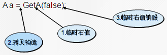
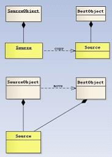

---

* [https://www.cnblogs.com/qicosmos/p/4283455.html](https://www.cnblogs.com/qicosmos/p/4283455.html)

---

## 从4行代码看右值引用

## 概述

　　右值引用的概念有些读者可能会感到陌生，其实他和C++98/03中的左值引用有些类似，例如，c++98/03中的左值引用是这样的：

　　这里的int&是对左值进行绑定（但是int&却不能绑定右值），相应的，对右值进行绑定的引用就是右值引用，他的语法是这样的A&&，通过双引号来表示绑定类型为A的右值。通过&&我们就可以很方便的绑定右值了，比如我们可以这样绑定一个右值：

　　这里我们绑定了一个右值0，关于右值的概念会在后面介绍。右值引用是C++11中新增加的一个很重要的特性，他主是要用来解决C++98/03中遇到的两个问题，第一个问题就是临时对象非必要的昂贵的拷贝操作，第二个问题是在模板函数中如何按照参数的实际类型进行转发。通过引入右值引用，很好的解决了这两个问题，改进了程序性能，后面将会详细介绍右值引用是如何解决这两个问题的。

　　和右值引用相关的概念比较多，比如：右值、纯右值、将亡值、universal references、引用折叠、移动语义、move语义和完美转发等等。很多都是新概念，对于刚学习C++11右值引用的初学者来说，可能会觉得右值引用过于复杂，概念之间的关系难以理清。

右值引用实际上并没有那么复杂，其实是关于4行代码的故事，通过简单的4行代码我们就能清晰的理解右值引用相关的概念了。本文希望带领读者通过4行代码来理解右值引用相关的概念，理清他们之间的关系，并最终能透彻地掌握C++11的新特性--右值引用。

## 四行代码的故事

### 第1行代码的故事

　　上面的这行代码很简单，从getVar()函数获取一个整形值，然而，这行代码会产生几种类型的值呢？答案是会产生两种类型的值，一种是左值i，一种是函数getVar()返回的临时值，这个临时值在表达式结束后就销毁了，而左值i在表达式结束后仍然存在，这个临时值就是右值，具体来说是一个纯右值，右值是不具名的。区分左值和右值的一个简单办法是：看能不能对表达式取地址，如果能，则为左值，否则为右值。

　　所有的具名变量或对象都是左值，而匿名变量则是右值，比如，简单的赋值语句：

　　在这条语句中，i 是左值，0 是字面量，就是右值。在上面的代码中，i 可以被引用，0 就不可以了。具体来说上面的表达式中等号右边的0是纯右值（prvalue），在C++11中所有的值必属于左值、将亡值、纯右值三者之一。比如，非引用返回的临时变量、运算表达式产生的临时变量、原始字面量和lambda表达式等都是纯右值。而将亡值是C++11新增的、与右值引用相关的表达式，比如，将要被移动的对象、T&&函数返回值、std::move返回值和转换为T&&的类型的转换函数的返回值等。关于将亡值我们会在后面介绍，先看下面的代码：

```cpp
int j = 5;

auto f = []{return 5;};
```

　　上面的代码中5是一个原始字面量， []{return 5;}是一个lambda表达式，都是属于纯右值，他们的特点是在表达式结束之后就销毁了。

　　通过地行代码我们对右值有了一个初步的认识，知道了什么是右值，接下来再来看看第二行代码。

### 第2行代码的故事

　　第二行代码和第一行代码很像，只是相比第一行代码多了“&&”，他就是右值引用，我们知道左值引用是对左值的引用，那么，对应的，对右值的引用就是右值引用，而且右值是匿名变量，我们也只能通过引用的方式来获取右值。虽然第二行代码和第一行代码看起来差别不大，但是实际上语义的差别很大，这里，getVar()产生的临时值不会像第一行代码那样，在表达式结束之后就销毁了，而是会被“续命”，他的生命周期将会通过右值引用得以延续，和变量k的声明周期一样长。

#### 右值引用的第一个特点

　　通过右值引用的声明，右值又“重获新生”，其生命周期与右值引用类型变量的生命周期一样长，只要该变量还活着，该右值临时量将会一直存活下去。让我们通过一个简单的例子来看看右值的生命周期。如代码清单1-1所示。

代码清单1-1

```cpp
#include <iostream>
using namespace std;

int g_constructCount=0;
int g_copyConstructCount=0;
int g_destructCount=0;
struct A
{
    A(){
        cout<<"construct: "<<++g_constructCount<<endl;  
    }
  
    A(const A& a)
    {
        cout<<"copy construct: "<<++g_copyConstructCount <<endl;
    }
    ~A()
    {
        cout<<"destruct: "<<++g_destructCount<<endl;
    }
};

A GetA()
{
    return A();
}

int main() {
    A a = GetA();
    return 0;
}
```

　　为了清楚的观察临时值，在编译时设置编译选项-fno-elide-constructors用来关闭返回值优化效果。

　　输出结果：

```cpp
construct: 1
copy construct: 1
destruct: 1
copy construct: 2
destruct: 2
destruct: 3
```

　　从上面的例子中可以看到，在没有返回值优化的情况下，拷贝构造函数调用了两次，一次是GetA()函数内部创建的对象返回出来构造一个临时对象产生的，另一次是在main函数中构造a对象产生的。第二次的destruct是因为临时对象在构造a对象之后就销毁了。如果开启返回值优化的话，输出结果将是：

construct: 1

destruct: 1

　　可以看到返回值优化将会把临时对象优化掉，但这不是c++标准，是各编译器的优化规则。我们在回到之前提到的可以通过右值引用来延长临时右值的生命周期，如果上面的代码中我们通过右值引用来绑定函数返回值的话，结果又会是什么样的呢？在编译时设置编译选项-fno-elide-constructors。

```cpp
int main() {
    A&& a = GetA();
    return 0;
}
输出结果：
construct: 1
copy construct: 1
destruct: 1
destruct: 2
```

　　通过右值引用，比之前少了一次拷贝构造和一次析构，原因在于右值引用绑定了右值，让临时右值的生命周期延长了。我们可以利用这个特点做一些性能优化，即避免临时对象的拷贝构造和析构，事实上，在c++98/03中，通过常量左值引用也经常用来做性能优化。上面的代码改成：

　　const A& a = GetA();

　　输出的结果和右值引用一样，因为常量左值引用是一个“万能”的引用类型，可以接受左值、右值、常量左值和常量右值。需要注意的是普通的左值引用不能接受右值，比如这样的写法是不对的：

　　A& a = GetA();

　　上面的代码会报一个编译错误，因为非常量左值引用只能接受左值。

#### 右值引用的第二个特点

　　右值引用独立于左值和右值。意思是右值引用类型的变量可能是左值也可能是右值。比如下面的例子：

　　var1类型为右值引用，但var1本身是左值，因为具名变量都是左值。

　　关于右值引用一个有意思的问题是：T&&是什么，一定是右值吗？让我们来看看下面的例子：

```cpp
template<typename T>
void f(T&& t){}

f(10); //t是右值

int x = 10;
f(x); //t是左值
```

　　从上面的代码中可以看到，T&&表示的值类型不确定，可能是左值又可能是右值，这一点看起来有点奇怪，这就是右值引用的一个特点。

#### 右值引用的第三个特点

　　T&& t在发生自动类型推断的时候，它是未定的引用类型（universal references），如果被一个左值初始化，它就是一个左值；如果它被一个右值初始化，它就是一个右值，它是左值还是右值取决于它的初始化。

我们再回过头看上面的代码，对于函数template<typename T>void f(T&& t)，当参数为右值10的时候，根据universal references的特点，t被一个右值初始化，那么t就是右值；当参数为左值x时，t被一个左值引用初始化，那么t就是一个左值。需要注意的是，仅仅是当发生自动类型推导（如函数模板的类型自动推导，或auto关键字）的时候，T&&才是universal references。再看看下面的例子：

```cpp
template<typename T>
void f(T&& param); 

template<typename T>
class Test {
    Test(Test&& rhs); 
};
```

　　上面的例子中，param是universal reference，rhs是Test&&右值引用，因为模版函数f发生了类型推断，而Test&&并没有发生类型推导，因为Test&&是确定的类型了。

　　正是因为右值引用可能是左值也可能是右值，依赖于初始化，并不是一下子就确定的特点，我们可以利用这一点做很多文章，比如后面要介绍的移动语义和完美转发。

　　这里再提一下引用折叠，正是因为引入了右值引用，所以可能存在左值引用与右值引用和右值引用与右值引用的折叠，C++11确定了引用折叠的规则，规则是这样的：

* 所有的右值引用叠加到右值引用上仍然还是一个右值引用；
* 所有的其他引用类型之间的叠加都将变成左值引用。

### 第3行代码的故事

```cpp
T(T&& a) : m_val(val){ a.m_val=nullptr; }
```

　　这行代码实际上来自于一个类的构造函数，构造函数的一个参数是一个右值引用，为什么将右值引用作为构造函数的参数呢？在解答这个问题之前我们先看一个例子。如代码清单1-2所示。

代码清单1-2

```cpp
class A
{
public:
    A():m_ptr(new int(0)){cout << "construct" << endl;}
    A(const A& a):m_ptr(new int(*a.m_ptr)) //深拷贝的拷贝构造函数
    {
        cout << "copy construct" << endl;
    }
    ~A(){ delete m_ptr;}
private:
    int* m_ptr;
};
int main() {
    A a = GetA();
    return 0;
}
    输出：
construct
copy construct
copy construct
```

　　这个例子很简单，一个带有堆内存的类，必须提供一个深拷贝拷贝构造函数，因为默认的拷贝构造函数是浅拷贝，会发生“指针悬挂”的问题。如果不提供深拷贝的拷贝构造函数，上面的测试代码将会发生错误（编译选项-fno-elide-constructors），内部的m_ptr将会被删除两次，一次是临时右值析构的时候删除一次，第二次外面构造的a对象释放时删除一次，而这两个对象的m_ptr是同一个指针，这就是所谓的指针悬挂问题。提供深拷贝的拷贝构造函数虽然可以保证正确，但是在有些时候会造成额外的性能损耗，因为有时候这种深拷贝是不必要的。比如下面的代码：



　　上面代码中的GetA函数会返回临时变量，然后通过这个临时变量拷贝构造了一个新的对象a，临时变量在拷贝构造完成之后就销毁了，如果堆内存很大的话，那么，这个拷贝构造的代价会很大，带来了额外的性能损失。每次都会产生临时变量并造成额外的性能损失，有没有办法避免临时变量造成的性能损失呢？答案是肯定的，C++11已经有了解决方法，看看下面的代码。如代码清单1-3所示。

代码清单1-3

```cpp
class A
{
public:
    A() :m_ptr(new int(0)){}
    A(const A& a):m_ptr(new int(*a.m_ptr)) //深拷贝的拷贝构造函数
    {
        cout << "copy construct" << endl;
    }
    A(A&& a) :m_ptr(a.m_ptr)
    {
        a.m_ptr = nullptr;
        cout << "move construct" << endl;
    }
    ~A(){ delete m_ptr;}
private:
    int* m_ptr;
};
int main(){
    A a = Get(false); 
} 
输出：
construct
move construct
move construct
```

　　代码清单1-3和1-2相比只多了一个构造函数，输出结果表明，并没有调用拷贝构造函数，只调用了move construct函数，让我们来看看这个move construct函数：

```cpp
A(A&& a) :m_ptr(a.m_ptr)
{
    a.m_ptr = nullptr;
    cout << "move construct" << endl;
}
```

　　这个构造函数并没有做深拷贝，仅仅是将指针的所有者转移到了另外一个对象，同时，将参数对象a的指针置为空，这里仅仅是做了浅拷贝，因此，这个构造函数避免了临时变量的深拷贝问题。

　　上面这个函数其实就是移动构造函数，他的参数是一个右值引用类型，这里的A&&表示右值，为什么？前面已经提到，这里没有发生类型推断，是确定的右值引用类型。为什么会匹配到这个构造函数？因为这个构造函数只能接受右值参数，而函数返回值是右值，所以就会匹配到这个构造函数。这里的A&&可以看作是临时值的标识，对于临时值我们仅仅需要做浅拷贝即可，无需再做深拷贝，从而解决了前面提到的临时变量拷贝构造产生的性能损失的问题。这就是所谓的移动语义，右值引用的一个重要作用是用来支持移动语义的。

　　需要注意的一个细节是，我们提供移动构造函数的同时也会提供一个拷贝构造函数，以防止移动不成功的时候还能拷贝构造，使我们的代码更安全。

　　我们知道移动语义是通过右值引用来匹配临时值的，那么，普通的左值是否也能借助移动语义来优化性能呢，那该怎么做呢？事实上C++11为了解决这个问题，提供了std::move方法来将左值转换为右值，从而方便应用移动语义。move是将对象资源的所有权从一个对象转移到另一个对象，只是转移，没有内存的拷贝，这就是所谓的move语义。如图1-1所示是深拷贝和move的区别。



图1-1 深拷贝和move的区别

　　再看看下面的例子：

```cpp
{
    std::list< std::string> tokens;
    //省略初始化...
    std::list< std::string> t = tokens; //这里存在拷贝 
}
std::list< std::string> tokens;
std::list< std::string> t = std::move(tokens);  //这里没有拷贝 
```

　　如果不用std::move，拷贝的代价很大，性能较低。使用move几乎没有任何代价，只是转换了资源的所有权。他实际上将左值变成右值引用，然后应用移动语义，调用移动构造函数，就避免了拷贝，提高了程序性能。如果一个对象内部有较大的对内存或者动态数组时，很有必要写move语义的拷贝构造函数和赋值函数，避免无谓的深拷贝，以提高性能。事实上，C++11中所有的容器都实现了移动语义，方便我们做性能优化。

　　这里也要注意对move语义的误解，move实际上它并不能移动任何东西，它唯一的功能是将一个左值强制转换为一个右值引用。如果是一些基本类型比如int和char[10]定长数组等类型，使用move的话仍然会发生拷贝（因为没有对应的移动构造函数）。所以，move对于含资源（堆内存或句柄）的对象来说更有意义。

### 第4行代码故事

```cpp
template <typename T>void f(T&& val){ foo(std::forward<T>(val)); }
```

　　C++11之前调用模板函数时，存在一个比较头疼的问题，如何正确的传递参数。比如：

```cpp
template <typename T>
void forwardValue(T& val)
{
    processValue(val); //右值参数会变成左值 
}
template <typename T>
void forwardValue(const T& val)
{
    processValue(val); //参数都变成常量左值引用了 
}
```

都不能按照参数的本来的类型进行转发。

　　C++11引入了完美转发：在函数模板中，完全依照模板的参数的类型（即保持参数的左值、右值特征），将参数传递给函数模板中调用的另外一个函数。C++11中的std::forward正是做这个事情的，他会按照参数的实际类型进行转发。看下面的例子：

```cpp
void processValue(int& a){ cout << "lvalue" << endl; }
void processValue(int&& a){ cout << "rvalue" << endl; }
template <typename T>
void forwardValue(T&& val)
{
    processValue(std::forward<T>(val)); //照参数本来的类型进行转发。
}
void Testdelcl()
{
    int i = 0;
    forwardValue(i); //传入左值 
    forwardValue(0);//传入右值 
}
输出：
lvaue 
rvalue
```

　　右值引用T&&是一个universal references，可以接受左值或者右值，正是这个特性让他适合作为一个参数的路由，然后再通过std::forward按照参数的实际类型去匹配对应的重载函数，最终实现完美转发。

　　我们可以结合完美转发和移动语义来实现一个泛型的工厂函数，这个工厂函数可以创建所有类型的对象。具体实现如下：

```cpp
template<typename…  Args>
T* Instance(Args&&… args)
{
    return new T(std::forward<Args >(args)…);
}
```

　　这个工厂函数的参数是右值引用类型，内部使用std::forward按照参数的实际类型进行转发，如果参数的实际类型是右值，那么创建的时候会自动匹配移动构造，如果是左值则会匹配拷贝构造。

## 总结

　　通过4行代码我们知道了什么是右值和右值引用，以及右值引用的一些特点，利用这些特点我们才方便实现移动语义和完美转发。C++11正是通过引入右值引用来优化性能，具体来说是通过移动语义来避免无谓拷贝的问题，通过move语义来将临时生成的左值中的资源无代价的转移到另外一个对象中去，通过完美转发来解决不能按照参数实际类型来转发的问题（同时，完美转发获得的一个好处是可以实现移动语义）。
