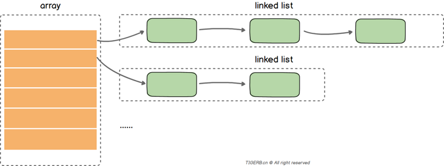
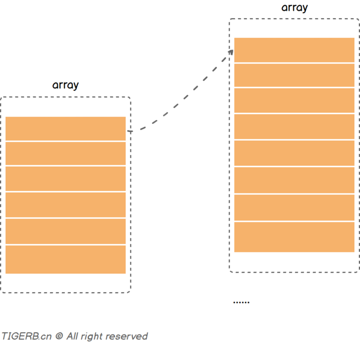
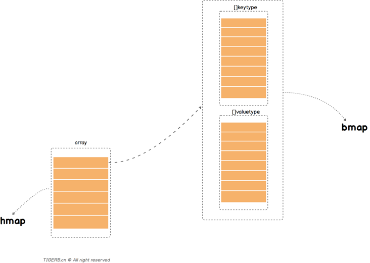
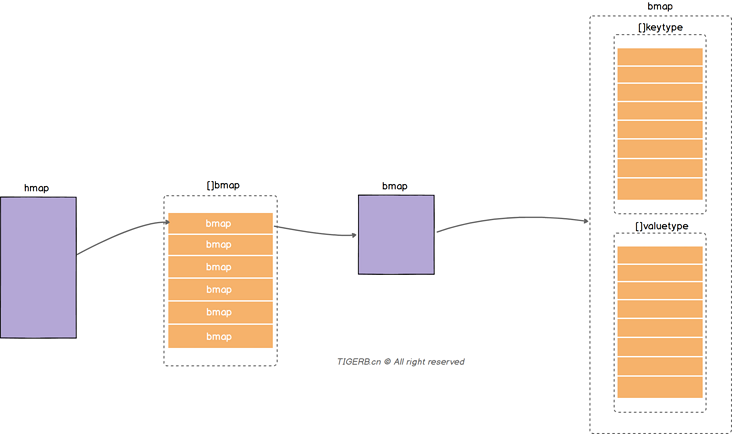
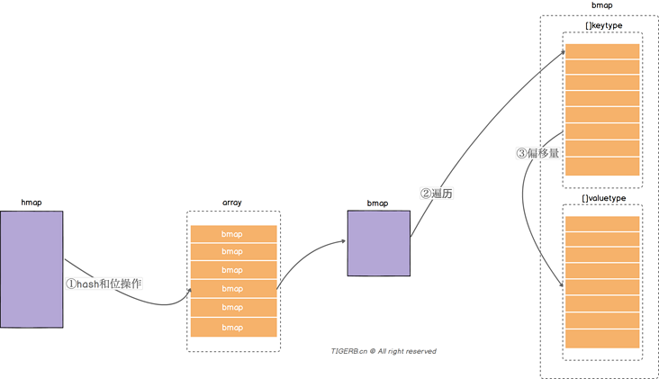
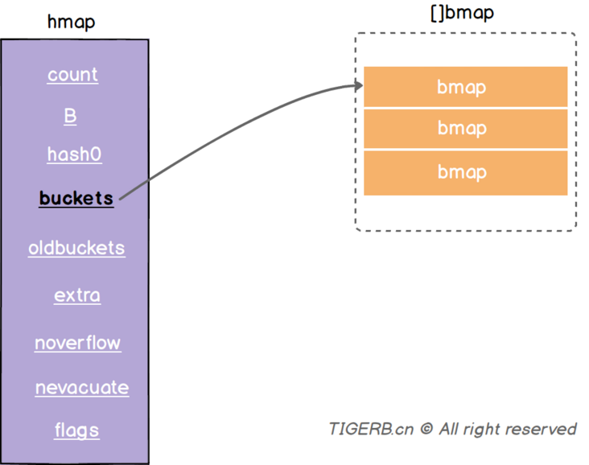
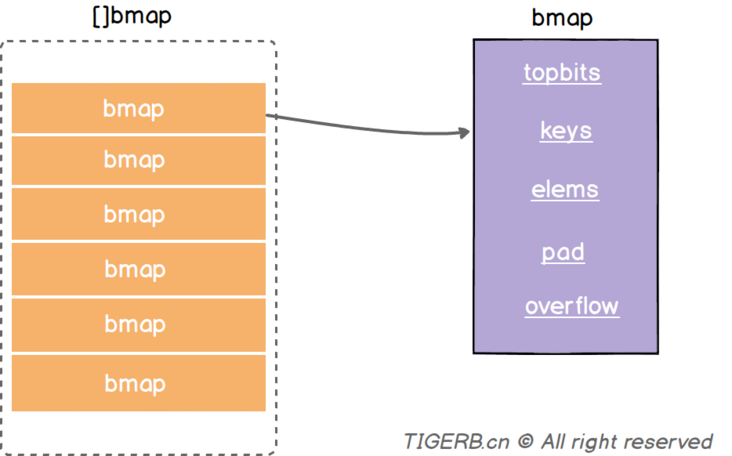
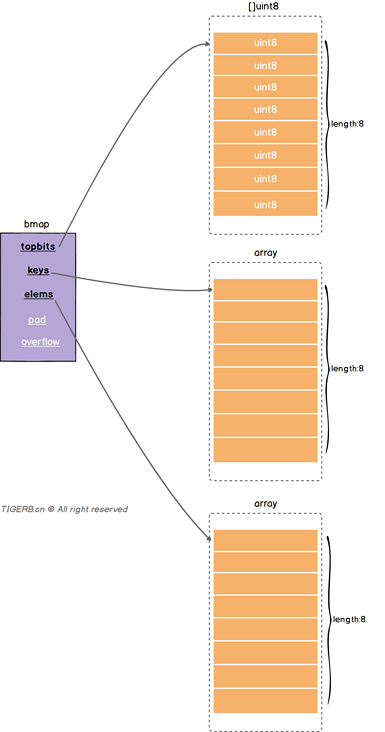
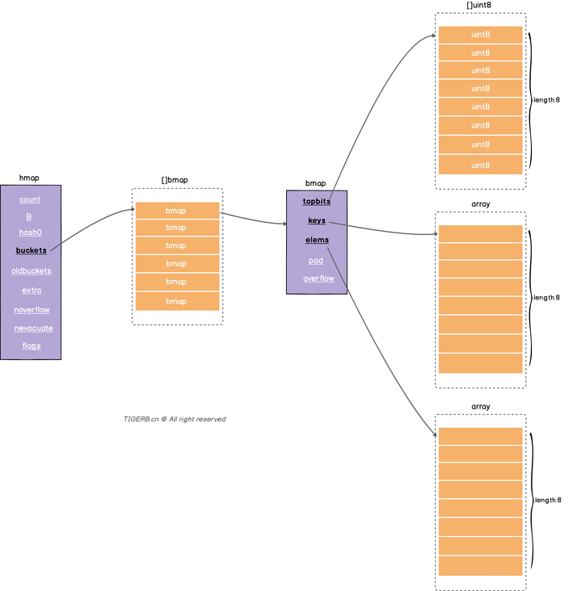
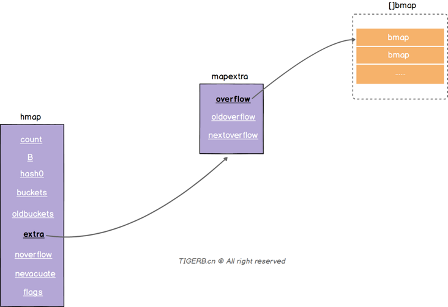

一般的Map会包含两个主要结构：

* 数组：数组里的值指向一个链表
* 链表：目的解决hash冲突的问题，并存放键值

大致结构如下：



读取一个key值的过程大致如下：`key` -> `key通过hash函数得到key的hash` -> `key的hash通过取模或者位操作得到key在数组上的索引` -> `通过索引找到对应的链表` -> `遍历链表对比key和目标key` -> `相等则返回value` -> `value`

## Go语言Map实现思路

Go语言解决hash冲突不是链表，实际主要用的数组(内存上的连续空间)，如下图所示：

备注：后面我们会解释上面为啥用的“主要”两个字。



但是并不是只使用一个数组(连续内存空间)存放键和值，而是使用了两个数组分别存储键和值，图示如下：



上图中：

* 分别对应的是两个核心的结构体hmap和bmap
* bmap里有两个数组分别存放key和value

把上面简化的关系转换一下，其实就是这样的一个大致关系，如下图所示：



我们通过一次读操作为例，看看读取某个key的值的一个大致过程：

* 通过hash函数获取目标key的哈希，哈希和数组的长度通过位操作获取数组位置的索引(备注：获取索引值的方式一般有取模或位操作，位操作的性能好些)
* 遍历bmap里的键，和目标key对比获取key的索引(找不到则返回空值)
* 根据key的索引通过计算偏移量，获取到对应value

读过程图示如下：



## hmap

```go
// runtime.hmap

type hmap struct {
	count     int
	flags     uint8
	B         uint8
	noverflow uint16
	hash0     uint32

	buckets    unsafe.Pointer
	oldbuckets unsafe.Pointer
	nevacuate  uintptr

	extra *mapextra
}

type mapextra struct {
	overflow    *[]*bmap
	oldoverflow *[]*bmap
	nextOverflow *bmap
}
```

1. `count` 表示当前哈希表中的元素数量；
2. `B` 表示当前哈希表持有的 `buckets` 数量，但是因为哈希表中桶的数量都 2 的倍数，所以该字段会存储对数，也就是 `len(buckets) == 2^B`；
3. `hash0` 是哈希的种子，它能为哈希函数的结果引入随机性，这个值在创建哈希表时确定，并在调用哈希函数时作为参数传入；
4. `oldbuckets` 是哈希在扩容时用于保存之前 `buckets` 的字段，它的大小是当前 `buckets` 的一半；



buckets指向了一个数组(连续的内存空间)，数组的元素是bmap类型，这个字段我们称之为正常桶

## bmap



```go
type bmap struct {
    topbits  [8]uint8
    keys     [8]keytype
    values   [8]valuetype
    pad      uintptr
    overflow uintptr
}
```

|topbits|长度为8的数组，[]uint8，元素为：key获取的hash的高8位，遍历时对比使用，提高性能。如下图所示|
| ----------| -------------------------------------------------------------------------------------------------------------------------------|
|keys|长度为8的数组，[]keytype，元素为：具体的key值。如下图所示|
|elems|长度为8的数组，[]elemtype，元素为：键值对的key对应的值。如下图所示|
|overflow|指向的hmap.extra.overflow溢出桶里的bmap，上面的字段topbits、keys、elems长度为8，最多存8组键值对，存满了就往指向的这个bmap里存|
|pad|对齐内存使用的，不是每个bmap都有会这个字段，需要满足一定条件|



分别了解了hmap和bmap的基本结构后，我们把上面的内容合并起来，就得到如下的Map结构图：



上面讲bmap的时候，我们不是得到了个结论么“每个bmap结构最多存放8组键值对。”，所以问题来了：

正常桶里的bmap存满了怎么办?

解决这个问题我们就要说到hmap.extra结构了，hmap.extra是个结构体，结构图示和字段释义如下：




## 扩容

什么时候扩容

* 触发 load factor 的最大值，负载因子已达到当前界限
* 溢出桶 overflow buckets 过多

Go里的扩容

* 根据需扩容的原因不同（overLoadFactor/tooManyOverflowBuckets），分为两类容量规则方向，为等量扩容（不改变原有大小）或双倍扩容
* 新申请的扩容空间（newbuckets/newoverflow）都是预分配，等真正使用的时候才会初始化
* 扩容完毕后（预分配），不会马上就进行迁移。而是采取增量扩容的方式，当有访问到具体 bukcet 时，才会逐渐的进行迁移（将 oldbucket 迁移到 bucket）
