[参考文献](https://zhuanlan.zhihu.com/p/297177002)

## 什么是垃圾回收

垃圾回收（英语：Garbage Collection，缩写为GC），在计算机科学中是一种自动的存储器管理机制。当一个计算机上的动态存储器不再需要时，就应该予以释放，以让出存储器，这种存储器资源管理，称为垃圾回收。垃圾回收器可以让程序员减轻许多负担，也减少程序员犯错的机会。来自[维基百科](https://link.juejin.cn/?target=https%3A%2F%2Fzh.wikipedia.org%2Fwiki%2F%E5%9E%83%E5%9C%BE%E5%9B%9E%E6%94%B6_(%E8%A8%88%E7%AE%97%E6%A9%9F%E7%A7%91%E5%AD%B8))

简单地说，**垃圾回收(GC)是在后台运行一个守护线程，它的作用是在监控各个对象的状态，识别并且丢弃不再使用的对象来释放和重用资源。**

以不支持自动垃圾回收的C++为例：

```c++
void foo()
{
  char *p = new char[128];
  // 对指针的使用
  delete[] p; // delete语句释放对象数组
}
```

如果由于异常或者其他原因导致 delete 语句没有正常执行，且该函数被频繁调用，那么很容易占用所有系统内存从而导致程序崩溃，如果泄漏的是系统资源的话甚至还会导致系统崩溃。另一方面如果我们在不该释放内存的时候释放内存，那么仍然在使用这块内存的指针就会变成野指针 wild pointer，使用该指针对内存进行读写是未定义的行为。

由于 C++ 支持比较强大的指针计算功能，因此在 C++ 中引入自动垃圾回收是一件比较困难的事情：

```c++
int *p = new int;
p += 10; // 指针偏移, 原来p指向的内存不再被引用
// 原来p指向的内存可能被回收
p -= 10; // 偏移为指针p初始指向的位置
*p = 10; // 如果p指向的内存被回收的话, 那么这里就会出现野指针的问题
```

由于 Golang 没有 C++ 这种对指针偏移的操作，因此可以在语言层面包含自动的垃圾回收功能，系统可以在 CPU 相对空闲的时候进行垃圾回收。

## 垃圾回收过程

用户程序 Mutator 通过内存分配器 Allocator 在堆 Heap 上申请内存，垃圾回收器 Collector 会定时清理堆上的内存

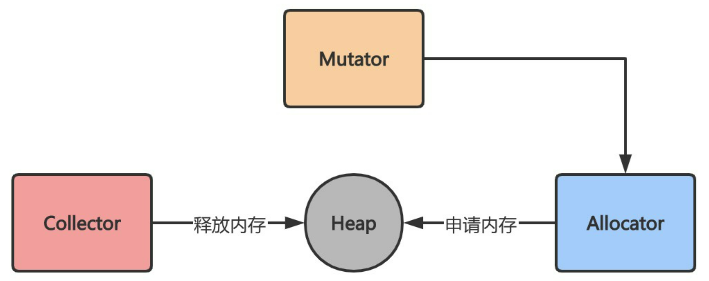

## 自动垃圾回收与手动垃圾回收

C 语言这种较为传统的语言通过 malloc 和 free 手动向操作系统申请和释放内存，这种自由管理内存的方式给予程序员极大的自由度，但是也相应地提高了对程序员的要求。C 语言的内存分配和回收方式主要包括三种：

- 函数体内的局部变量：在栈上创建，函数作用域结束后自动释放内存
- 静态变量：在静态存储区域上分配内存，整个程序运行结束后释放（全局生命周期）
- 动态分配内存的变量：在堆上分配，通过 malloc 申请，free 释放

`C`、`C++`和`Rust`等较早的语言采用的是手动垃圾回收，需要程序员通过向操作系统申请和释放内存来手动管理内存，程序员极容易忘记释放自己申请的内存，对于一个长期运行的程序往往是一个致命的缺点。`Python`、`Java`和`Golang`等较新的语言采取的都是自动垃圾回收方式，程序员只需要负责申请内存，垃圾回收器会周期性释放结束生命周期的变量所占用的内存空间。

## 垃圾回收目标

垃圾回收器主要包括三个目标：

- 无内存泄漏：垃圾回收器最基本的目标就是减少防止程序员未及时释放导致的内存泄漏，垃圾回收器会识别并清理内存中的垃圾
- 自动回收无用内存：垃圾回收器作为独立的子任务，不需要程序员显式调用即可自动清理内存垃圾
- 内存整理：如果只是简单回收无用内存，那么堆上的内存空间会存在较多碎片而无法满足分配较大对象的需求，因此垃圾回收器需要重整内存空间，提高内存利用率

## 垃圾回收的常见方法

根据判断对象是否存活的方法，可以简单将 GC 算法分为“引用计数式”垃圾回收和“追踪回收式”垃圾回收。前者根据每个对象的引用计数器是否为 0 来判断该对象是否为未引用的垃圾对象，后者先判断哪些对象存活，然后将其余的所有对象作为垃圾进行回收。追踪回收本身包括**标记-清除Mark-Sweep**、**标记-复制Mark-Copy**和**标记-整理Mark-Compact**三种回收算法。

### 引用计数法

引用计数Reference counting会为每个对象维护一个计数器，当该对象被其他对象引用时加一，引用失效时减一，当引用次数归零后即可回收对象。使用这类`GC`方法的语言包括`python`、`php`、`objective-C`和`C++`标准库中的`std::shared_ptr`等。

以`python`为例，`python`中的每个对象都包含如下结构：

```c
typedef struct_object {
    int ob_refcnt;
    struct_typeobject *ob_type;
}PyObject;
```

其中`ob_refcnt`为引用计数器，当一个对象有新的引用时计数器增一，当引用它的对象被删除时计数器减一。

引用计数法优点包括：

- 原理和实现都比较简单
- 回收的即时性：当对象的引用计数为`0`时立即回收，不像其他`GC`机制需要等待特定时机再回收，提高了内存的利用率
- 不需要暂停应用即可完成回收

缺点包括：

- 无法解决循环引用的回收问题：当`ObjA`引用了`ObjB`，`ObjB`也引用`ObjA`时，这两个对象的引用次数始终大于`0`，从而占用的内存无法被回收
- 时间和空间成本较高：一方面是因为每个对象需要额外的空间存储引用计数器变量，另一方面是在栈上的赋值时修改引用次数时间成本较高（原本只需要修改寄存器中的值，现在计数器需要不断更新因此不是只读的，需要额外的原子操作来保证线程安全）
- 引用计数是一种摊销算法，会将内存的回收分摊到整个程序的运行过程，但是当销毁一个很大的树形结构时无法保证响应时间

### 追踪基础：可达性分析算法

尽管前面提到的三种追踪式垃圾回收算法实现起来各不相同，但是第一步都是通过可达性分析算法标记`Mark`对象是否“可达”。一般可到达的对象主要包括两类：

- `GC Root`对象：包括全局对象、栈上的对象（函数参数与内部变量）
- 与`GC Root`对象通过引用链`Reference Chain`相连的对象

对于“不可达”的对象，我们可以认为该对象为垃圾对象并回收对应的内存空间

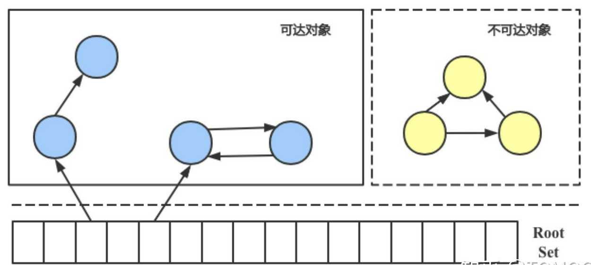

可达性算法中判断对象是否“可达”依赖于“引用”的定义，`java`中的引用从强到弱可分为四类，不同的引用类型可以满足多样化的场景：

- 强引用`Strong Reference`：使用`Object obj = new Object()`定义的引用，这类对象无论在什么情况下都不会被垃圾回收机制清理掉
- 软引用`Soft Reference`：用于描述有用但非必需的对象，只有在内存不足的时候才会回收该对象，适合实现内存敏感的高速缓存（网页缓存和图片缓存等）；软引用可以和引用队列`ReferenceQueue`一起使用，当软引用所引用的对象被回收时`JVM`会把这个软引用加入到与之关联的引用队列，`GC`线程会在抛出`OOM`错误前根据引用队列来回收长时间闲置不用的软引用对象
- 弱引用`Weak Reference`：用于描述非必需对象，在`JVM`进行垃圾回收时会直接回收被弱引用关联的对象，同软引用相比有更短的生命周期
- 虚引用`Phantom Reference`：一个对象与虚引用关联时在任何时候都可以被垃圾回收器回收，因此并不会影响该对象的生命周期，主要用于跟踪对象被`GC`回收的活动；虚引用必须和引用队列联合使用，当回收一个对象时如果发现它还有虚引用，就会在回收对象的内存之前将这个虚引用加入到与之关联的引用队列中，这样程序可以通过判断引用队列是否加入虚引用来判断被引用的对象是否将进行垃圾回收

同引用计数法相比，追踪式算法具有如下优点：

- 解决了循环引用对象的回收问题
- 占用空间更少

缺点包括：

- 同引用计数相比无法立刻识别出垃圾对象，需要依赖`GC`线程
- 算法在标记时必须暂停整个程序，即`Stop The World, STW`，否则其他线程的代码会修改对象状态从而回收不该回收的对象

### 标记-清除算法

标记-清除`Mark-Sweep`算法是最基础的追踪式算法，分为“标记”和“清除”两个步骤：

- 标记：记录需要回收的垃圾对象
- 清除：在标记完成后回收垃圾对象的内存空间

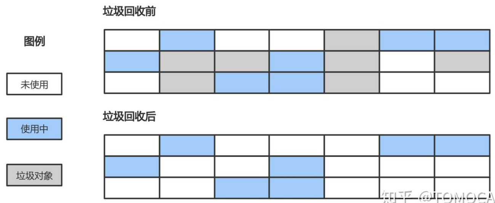

优点包括：

- 算法吞吐量较高，即运行用户代码时间 / （运行用户代码时间 + 运行垃圾收集时间）较高
- 空间利用率高：同标记-复制相比不需要额外空间复制对象，也不需要像引用计数算法为每个对象设置引用计数器

缺点包括：

- 清除后会产生大量的内存碎片空间，导致程序在运行时可能没法为较大的对象分配内存空间，导致提前进行下一次垃圾回收

### 标记-复制算法

标记-复制`Mark-Copy`算法将内存分成大小相同的两块，当某一块的内存使用完了之后就将使用中的对象挨个复制到另一块内存中，最后将当前内存恢复未使用的状态。

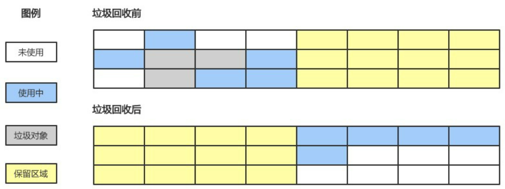

优点包括：

- 标记-清除法需要在清除阶段对大量垃圾对象进行扫描，标记-复制则只需要从`GC Root`对象出发，将“可到达”的对象复制到另一块内存后直接清理当前这块的内存，因此提升了垃圾回收的效率
- 解决了内存碎片化的问题，防止分配较大连续空间时的提前`GC`问题

缺点包括：

- 同标记-清除法相比，在“可达”对象占比较高的情况下有复制对象的开销
- 内存利用率较低，相当于可利用的内存仅有一半

### 标记-整理算法

标记-整理`Mark-Compact`算法综合了标记-清除法和标记-复制法的优势，既不会产生内存碎片化的问题，也不会有一半内存空间浪费的问题。该方法首先标记出所有“可达”的对象，然后将存活的对象移动到内存空间的一端，最后清理掉端边界以外的内存。

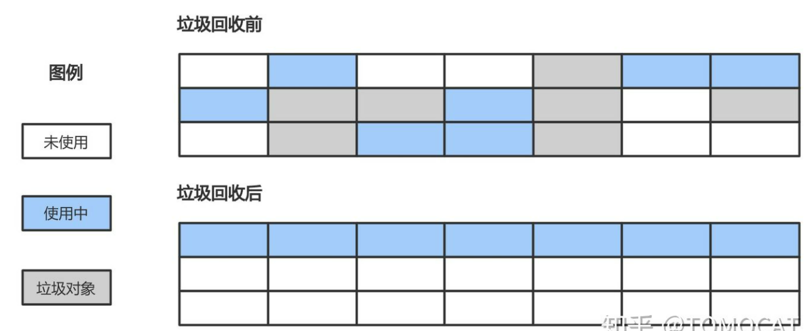

优点包括：

- 避免了内存碎片化的问题
- 在对象存活率较高的情况下，标记-整理算法由于不需要复制对象效率更高，因此更加适合老年代算法

缺点包括：

- 整理过程较为复杂，需要多次遍历内存导致`STW`时间比标记-清除算法更长

### 三色标记法

前面提到的“标记”类算法都有一个共同的瑕疵，即在进行垃圾回收的时候会暂停整个程序（`STW`问题）。三色标记法是对“标记”阶段的改进，在不暂停程序的情况下即可完成对象的可达性分析。`GC`线程将所有对象分为三类：

- 白色：未搜索的对象，在回收周期开始时所有对象都是白色，在回收周期结束时所有的白色都是垃圾对象
- 灰色：正在搜索的对象，但是对象身上还有一个或多个引用没有扫描
- 黑色：已搜索完的对象，所有的引用已经被扫描完

三色标记法属于增量式`GC`算法，回收器首先将所有的对象着色成白色，然后从`GC Root`出发，逐步把所有“可达”的对象变成灰色再到黑色，最终所有的白色对象即是“不可达”对象。

具体的实现如下：

- 初始时所有对象都是白色对象
- 从`GC Root`对象出发，扫描所有可达对象并标记为灰色，放入待处理队列
- 从队列取出一个灰色对象并标记为黑色，将其引用对象标记为灰色放入队列
- 重复上一步骤，直到灰色对象队列为空
- 此时所有剩下的白色对象就是垃圾对象

优点：

- 不需要暂停整个程序进行垃圾回收

缺点：

- 如果程序垃圾对象的产生速度大于垃圾对象的回收速度时，可能导致程序中的垃圾对象越来越多而无法及时收集
- 线程切换和上下文转换的消耗会使得垃圾回收的总体成本上升，从而降低系统吞吐量

## 读写屏障技术

### 三色标记法的并发性问题

假设三色标记法执行前，包含如下对象：

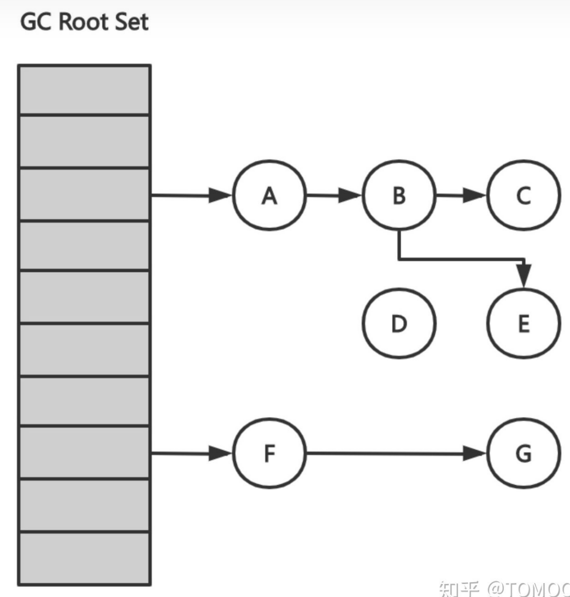

则三色标记法的具体执行过程如下：

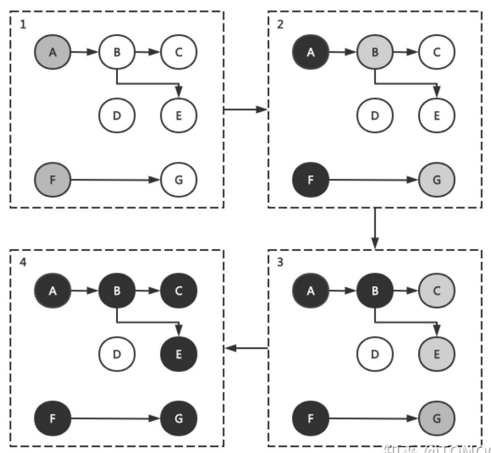

上述三色标记执行过后堆内存中白色对象（只有`D`）会被当做垃圾对象清理掉，如果用户在标记执行过程中建立了从`A`对象到`D`对象的引用，那么会导致后续对`D`的访问出错。这种没有指向合法地址的指针一般被称为“野指针”，会造成严重的程序错误。

### 并发问题原因及解决思路

假设三色标记法和用户程序并发执行，那么下列两个条件**同时满足**就可能出现错误回收非垃圾对象的问题：

- 条件1：某一[黑色对象](https://www.zhihu.com/search?q=黑色对象&search_source=Entity&hybrid_search_source=Entity&hybrid_search_extra={"sourceType"%3A"article"%2C"sourceId"%3A297177002})引用白色对象
- 条件2：对于某个白色对象，所有和它存在可达关系的灰色对象丢失了访问它的可达路径

简单证明一下：如果条件1不满足，那么任何不该被回收的白色对象都能和至少一个灰色对象存在“可达”路径，因此不会有白色对象被遗漏；如果条件2不满足，那么对于某一个白色对象，即使它被黑色对象引用，但至少存在一个和它存在可达关系的灰色对象，因此这个白色对象也不会被回收。

> 一句话总结即是：在三色标记法执行的某个特定时机，只要存在未经访问的能够到达白色对象的可达路径，就可以令黑色对象引用白色对象，反正该白色对象在后面标记中会被识别为“可达”对象从而不会被错误回收。
>

一种最简单解决三色标记并发问题的方法是停止所有的赋值器线程，保证标记过程不受干扰，即垃圾回收器中常提到的`STW, stop the world`方法。另外一种思路就是使用赋值器屏障技术使得赋值器在进行指针写操作时同步垃圾回收器，保证不破坏弱三色不变性。

### 读写屏障技术

> 屏障技术：给代码操作内存的顺序添加一些限制，即在内存屏障前执行的动作必须先于在你内存屏障后执行的动作。
>

使用屏障技术可以使得用户程序和三色标记过程并发执行，我们只需要达成下列任意一种三色不变性：

- 强三色不变性：黑色对象永远不会指向白色对象
- 弱三色不变性：黑色对象指向的白色对象至少包含一条由灰色对象经过白色对象的可达路径

`GC`中使用的内存读写屏障技术指的是编译器会在编译期间生成一段代码，该代码在运行期间用户读取、创建或更新对象指针时会拦截内存读写操作，相当于一个`hook`调用，根据`hook`时机不同可分为不同的屏障技术。由于读屏障`Read barrier`技术需要在读操作中插入代码片段从而影响用户程序性能，所以一般使用写屏障技术来保证三色标记的稳健性。

> 我们讲内存屏障技术解决了三色标记法的`STW`缺点，并不是指消除了所有的赋值器挂起问题。需要分清楚`STW`方法是全局性的赋值器挂起而内存屏障技术是局部的赋值器挂起。
>

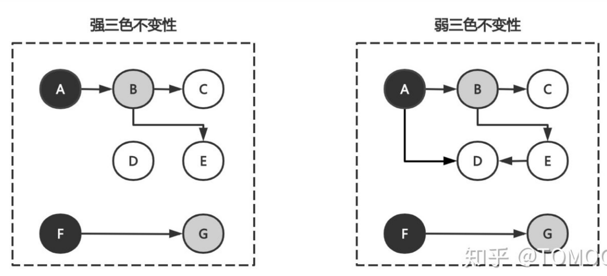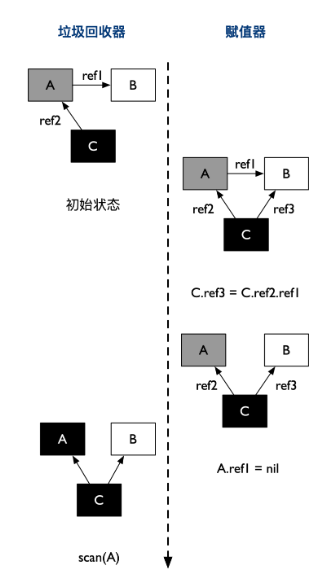

> 大体上将就是在赋值器进行指针操作时，能够通知垃圾回收器，对被操作的对象做额外的扫描，从而防止破坏三色不变形
>


## Go语言垃圾回收

[写屏障](https://golang.design/under-the-hood/zh-cn/part2runtime/ch08gc/barrier/)

### Golang GC发展历史

`Golang`每次改版几乎都伴随着垃圾回收机制的改进，其中里程碑式的改动主要包括：

> 注意：`gc pause`时间的缩短也就意味着程序的响应速度更快
>

- `go v1.1`：标记-清除法，整个过程都需要`STW`
- `go v1.3`：标记-清除法，标记过程仍然需要`STW`但清除过程并行化，`gc pause`约几百`ms`
- `go v1.5`：引入插入写屏障技术的三色标记法，仅在堆空间启动插入写屏障，全部扫描后需要`STW`重新扫描栈空间，`gc pause`耗时降到`10ms`以下
- `go v1.8`：引入混合写屏障技术的三色标记法，仅在堆空间启动混合写屏障，不需要在`GC`结束后对栈空间重新扫描，`gc pause`时间降低至`0.5ms`以下
- `go v1.14`：引入新的页分配器用于优化内存分配的速度

当前Golang使用的垃圾回收机制是**三色标记发**配合**写屏障**和**辅助GC**，三色标记法是**标记-清除法**的一种增强版本。

### **回顾Golang内存管理内容**

每一个`Go`程序在启动时都会向操作系统申请一块内存（仅仅是虚拟的地址空间，并不会真正分配内存），在`X64`上申请的内存会被分成`512M`、`16G`和`512G`的三块空间，分别对应`spans`、`bitmap`和`arena`。

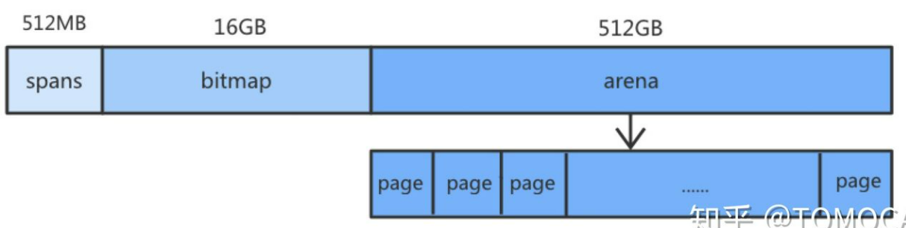

- `arena`：堆区，运行时该区域每`8KB`会被划分成一个页，存储了所有在堆上初始化的对象
- `bitmap`：标识`arena`中哪些地址保存了对象，`bitmap`中一个字节的内存对应`arena`区域中`4`个指针大小的内存，并标记了是否包含指针和是否扫描的信息（一个指针大小为`8B`，因此`bitmap`的大小为`512GB/(4*8)=16GB`）

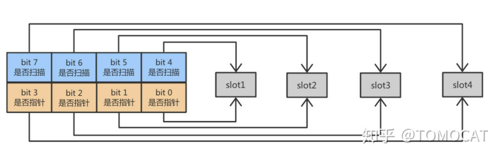

* `spans`：存放`mspan`的指针，其中每个`mspan`会包含多个页，`spans`中一个指针（`8B`）表示`arena`中某一个`page`（`8KB`），因此`spans`的大小为 512GB/(1024)=512MB

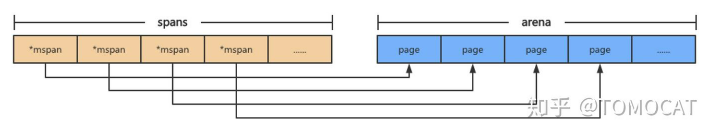

### Golang GC实现

`go v1.5`至今都是基于三色标记法实现的垃圾回收机制，从而将长时间的`STW`分隔成多段较短时间的`STW`，`Golang`将垃圾回收阶段分成三个状态：

- `GC`开始前将所有对象标记为白色
- 将`GC Root`对象（`golang`中是**栈对象**和**全局变量**的指针）加入灰色对象队列
- 使用并发的`goroutine`扫描队列中的指针，如果指针还引用了其他指针，那么将被引用的加入灰色对象队列，被扫描的对象标记为黑色

### Golang GC四个阶段

前面提到Golang的GC属于并发式垃圾回收（意味着不需要长时间的STW，GC大部分执行过程是和用户代码并行的），它可以分为四个阶段：

- 清除终止`Sweep Termination`：
- - 暂停程序
  - 清扫未被回收的内存管理单元span，当上一轮GC的清扫工作完成后才可以开始新一轮的GC
- 标记`Mark`：
- - 切换至`_GCmark`，开启写屏障和用户程序协助`Mutator Assiste`并将根对象添加到三色标记法队列
  - 恢复程序，标记进程和`Mutator Assiste`进程会开始并发标记内存中的对象，混合写屏障将被删除的指针和新加入的指针都标记成灰色，新创建的对象标记成黑色
  - 扫描根对象（包括所有goroutine的栈、全局对象以及不在堆中的运行时数据结构），扫描goroutine栈期间会暂停当前处理器
  - 依次处理三色标记法队列，将扫描过的对象标记为黑色并将它们指向的对象标记成灰色
  - 使用分布式终止算法检查剩余的工作，发现标记阶段完成后进入标记终止阶段
- 标记终止`Mark Termination`
- - 暂停程序，切换至`_GCmarktermination`并关闭辅助标记的用户程序
  - 清理处理器上的线程缓存
- 清除`Sweep`
- - 将状态切换至`_GCoff`，关闭混合写屏障
  - 恢复用户程序，所有新创建的对象标记为白色
  - 后台并发清理所有的内存管理单元span，当goroutine申请新的内存管理单元时就会触发清理

> 在GC过程中会有两种后台任务（G），包括标记任务和清扫任务。可以同时执行的标记任务约是P数量的四分之一，即go所说的25%CPU用于GC的依据。清扫任务会在程序启动后运行，进入清扫阶段时唤醒。
>

### 辅助GC

由于Golang使用了并发式的垃圾回收，将原本需要STW较长时间的GC过程分散到多次小规模的GC。当用户分配内存的速度超过GC回收速度时，Golang会通过辅助GC暂停用户程序进行垃圾回收，防止内存因分配对象速度过快消耗殆尽的问题。

### 触发时机

触发垃圾回收首先要满足三个前提条件：

- `memstats.enablegc`：允许垃圾回收
- `panicking == 0`：程序没有panic
- `gcphase == _GCoff`：处于`_Gcoff`阶段

对应的触发时机包括：

- `gcTriggerHeap`：堆内存的大小达到一定阈值
- `gcTriggerTime`：距离上一次垃圾回收超过一定阈值时
- `gcTriggerCycle`：如果当前没有启动GC则开始新一轮的GC

```go
// test reports whether the trigger condition is satisfied, meaning
// that the exit condition for the _GCoff phase has been met. The exit
// condition should be tested when allocating.
func (t gcTrigger) test() bool {
    if !memstats.enablegc || panicking != 0 || gcphase != _GCoff {
        return false
    }
    switch t.kind {
    case gcTriggerHeap:
        // Non-atomic access to heap_live for performance. If
        // we are going to trigger on this, this thread just
        // atomically wrote heap_live anyway and we'll see our
        // own write.
        return memstats.heap_live >= memstats.gc_trigger
    case gcTriggerTime:
        if gcpercent < 0 {
            return false
        }
        lastgc := int64(atomic.Load64(&memstats.last_gc_nanotime))
        return lastgc != 0 && t.now-lastgc > forcegcperiod
    case gcTriggerCycle:
        // t.n > work.cycles, but accounting for wraparound.
        return int32(t.n-work.cycles) > 0
    }
    return true
}
```

### **GC调优常见方法**

* 减少对象的分配，合理重复利用。避免`string`与`[]byte`转化。两者发生转换的时候，底层数据结结构会进行复制，因此导致 `gc` 效率会变低

- 尽量使用小数据类型，比如使用`int8`代替`int`。
- 少使用`+`连接`string`：go语言中`string`是一个只读类型，针对`string`的每一个操作都会创建一个新的`string`。大量小文本拼接时优先使用`strings.Join`，大量大文本拼接时使用`bytes.Buffer`。

> 虽然Golang有自动垃圾回收机制，但是GC不是万能的，最好还是养成手动回收内存的习惯：比如手动把不再使用的内存释放，把对象置成`nil`，也可以考虑在合适的时候调用`runtime.GC()`触发GC
>

## GC触发条件

自动垃圾回收的触发条件有两个：

* 超过内存大小阈值
* 达到定时时间 阈值是由一个gcpercent的变量控制的,当新分配的内存占已在使用中的内存的比例超过gc precent时就会触发。比如一次回收完毕后，内存的使用量为5M，那么下次回收的时机则是内存分配达到10M的时候。也就是说，并不是内存分配越多，垃圾回收频率越高。如果一直达不到内存大小的阈值呢？这个时候GC就会被定时时间触发，比如一直达不到10M，那就定时（默认2min触发一次）触发一次GC保证资源的回收。
