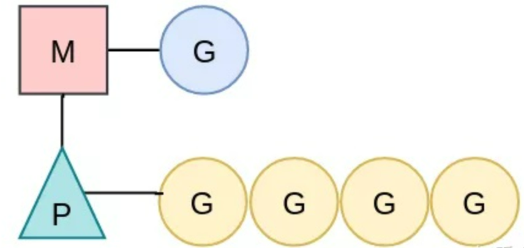
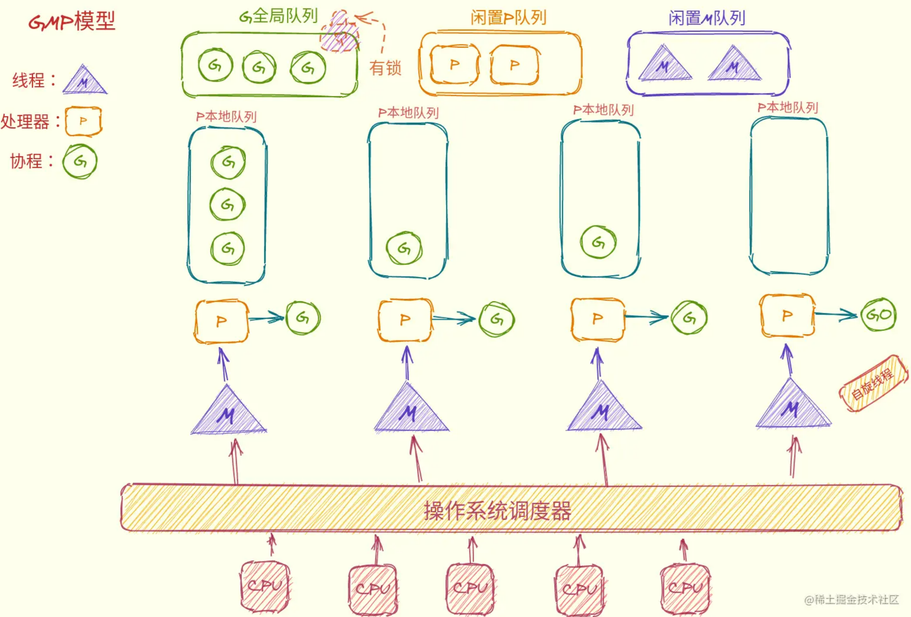
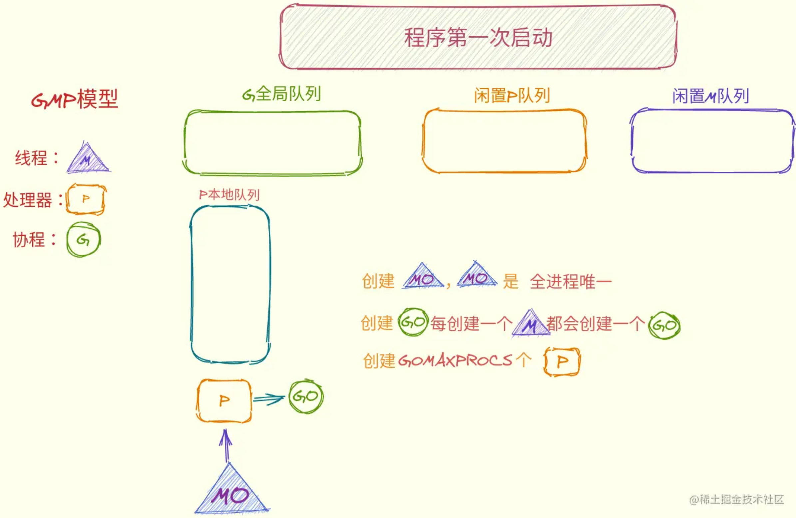
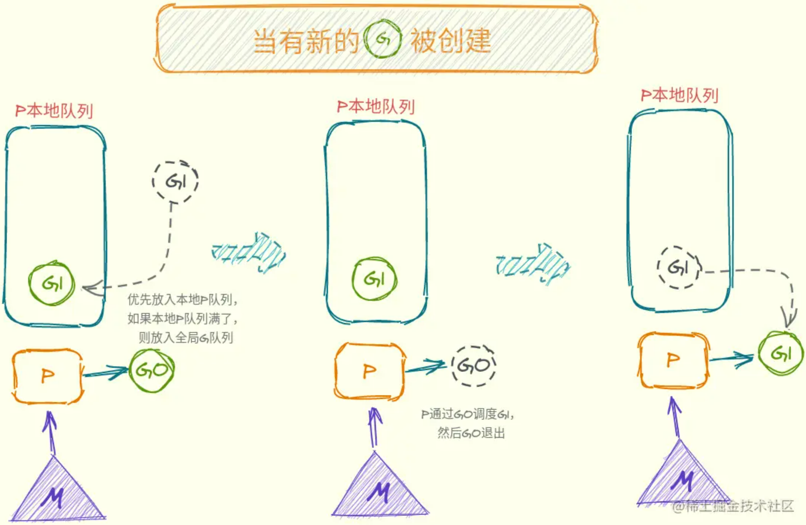
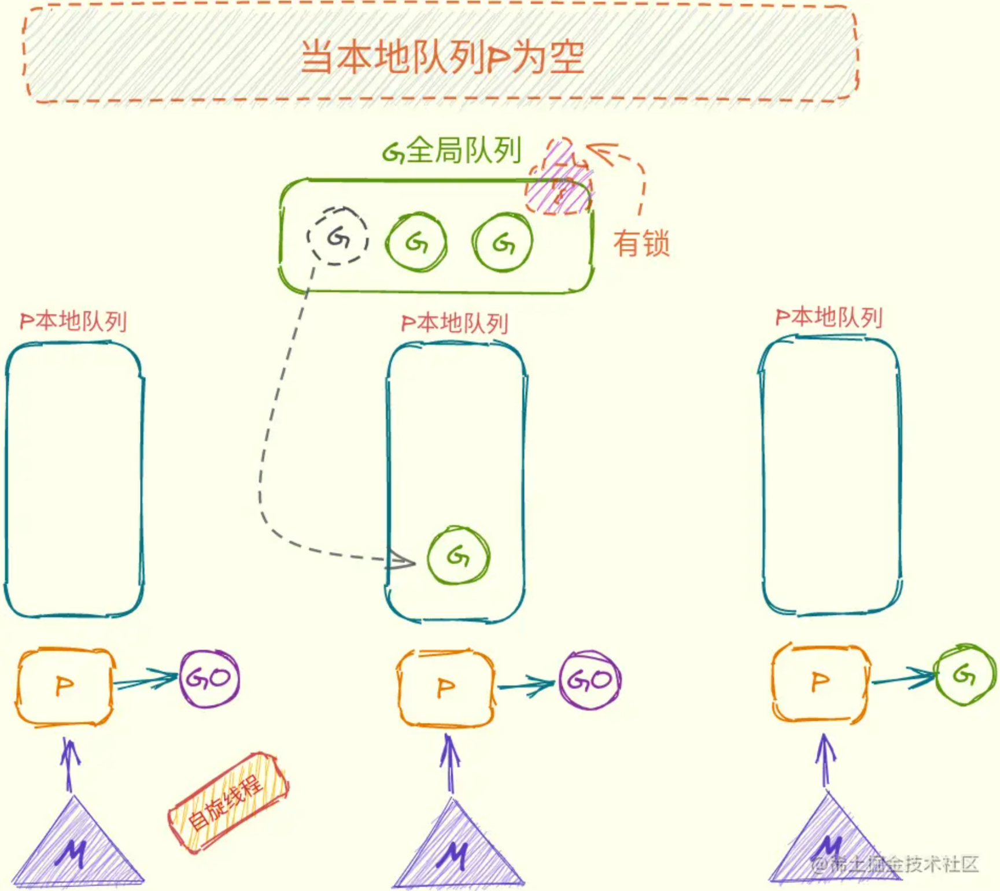
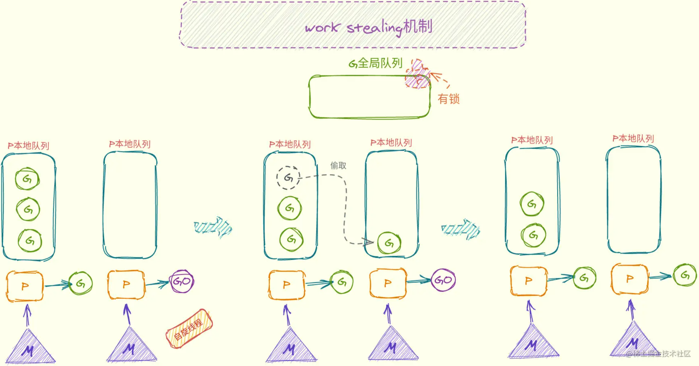
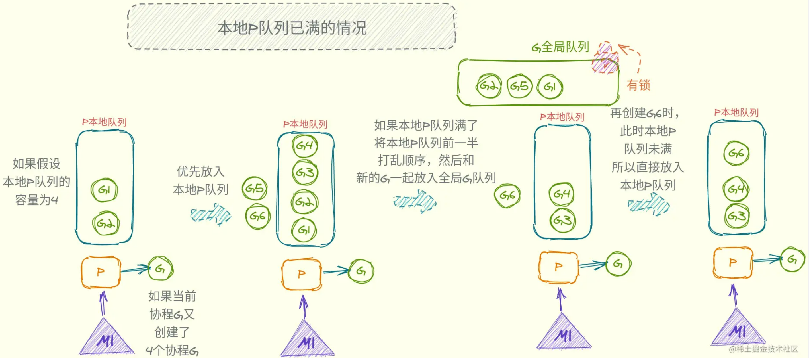
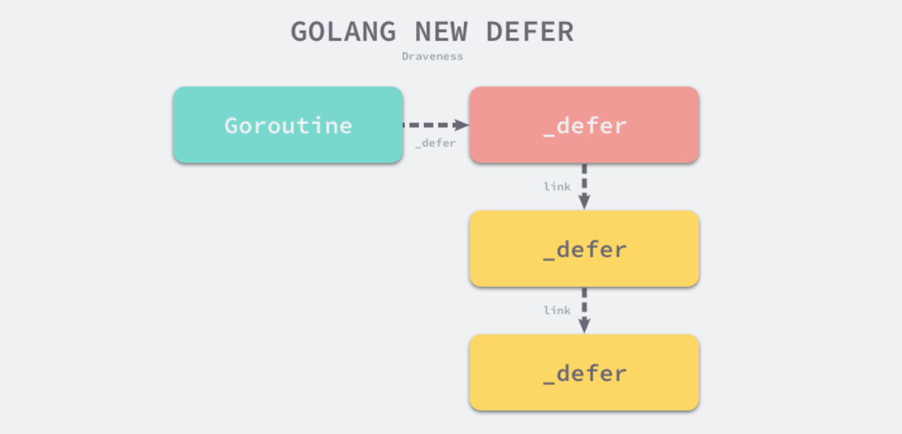
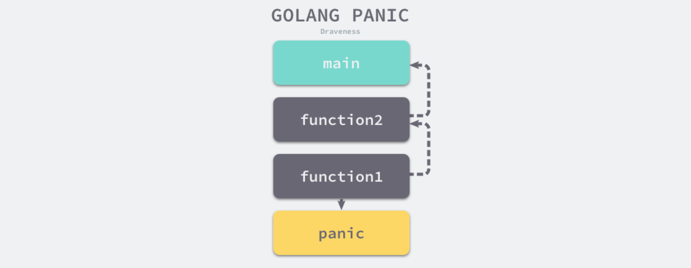
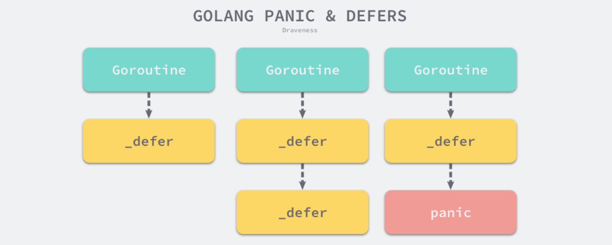

## 接口interface

#### *什么是接口*

- 接口类型是一种抽象的类型，它描述了一系列方法的集合。
- 接口约定：接口类型中定义的方法即为约定，若一个具体类型实现了所有这些方法，则该类型就满足该接口的约定，或者说它是这个接口类型的实例（实现了该接口）。
- 可替换性(LSP里氏替换)：满足相同接口约定的类型之间可进行相互替换。例如：若一个方法的形参定义为接口类型，那么它可以接收任何满足该接口约定的类型的实参。
- 接口内嵌：接口类型可通过组合已有的接口来定义
- io.Writer接口提供了所有的类型写入bytes的抽象，包括文件类型，内存缓冲区，网络链接，HTTP客户端，压缩工具，哈希等等；io.Reader可以代表任意可以读取bytes的类型，io.Closer可以是任意可以关闭的值，例如一个文件或是网络链接。还有fmt.Stringer接口等
- 接口类型名一般以“er”结尾

#### *什么是接口值*

- 接口值：即接口变量的值，由两个部分组成，**一个具体的类型**和**那个类型的值**。它们被称为接口的动态类型和动态值
- 接口值的零值：动态类型type和对应的动态值value均为nil，如var w io.Writer
- 空接口值：当且仅当接口的动态类型type和对应的动态值value均为nil时，才为空接口值，此时它等于nil
- 接口变量的赋值与调用过程：
- - 如w = os.Stdout，这个赋值过程调用了一个具体类型到接口类型的隐式转换，这和显式的使用io.Writer(os.Stdout)是等价的。这个接口值w的动态类型被设为os.Stdout指针的类型描述符，它的动态值持有os.Stdout的拷贝
  - 调用一个包含os.File类型指针的接口值的Write方法，w.Write([]byte("hello"))，使得(os.File).Write方法被调用
- 一个接口值可以持有任意大的动态值，不论动态值多大，接口值总是可以容下它
- 接口值的可比较性：
- - 时刻记住：只能比较动态类型是可比较类型的接口值。
  - 如果接口值的动态类型是可比较的，那么它们之间就可以使用==和!=来进行比较：两个接口值相等仅当它们都是nil值或者它们的动态类型相同并且动态值也根据这个动态类型的操作相等。
  - 如果接口值是可比较的，那么它们可以用在map的键或者作为switch语句的操作数
  - 非接口类型要么是安全的可比较类型（如基本类型和指针）要么是完全不可比较的类型（如切片，映射类型，和函数），但是在比较接口值或者包含了接口值的聚合类型时，我们必须要意识到潜在的panic。同样的风险也存在于使用接口作为map的键或者switch的操作数。
- 注意：一个包含nil指针的接口不是nil接口（空接口），此时调用接口方法会发生panic错误。即一个接口值的动态类型type != nil，但动态值value == nil，此时的接口值 w != nil。（当把一个值为nil的非接口类型的变量转换为接口类型时，即出现这种情况）
- 技巧：**使用接口时，直接声明一个接口类型的变量，然后再对它赋值，之后使用该变量时，就可以直接把它和nil比较来判断是否为空接口**

## struct中嵌入匿名interface

- 把 interface 作为 struct 的一个匿名成员，就可以假设 struct 就是此成员 interface 的一个实现，而不管 struct 是否已经实现 interface 所定义的函数。

[*https://www.jianshu.com/p/a5bc8add7c6e*](https://www.jianshu.com/p/a5bc8add7c6e)

## 空结构体struct{}

- 空结构体也是结构体，只是 size 为 0 的类型而已；
- 所有的空结构体都有一个共同的地址：zerobase 的地址；
- 空结构体可以作为 receiver ，receiver 是空结构体作为值的时候，编译器其实直接忽略了第一个参数的传递，编译器在编译期间就能确认生成对应的代码；
- map 和 struct{} 结合使用常常用来节省一点点内存，使用的场景一般用来判断 key 存在于 map；
- chan 和 struct{} 结合使用是一般用于信号同步的场景，用意并不是节省内存，而是我们真的并不关心 chan 元素的值；
- slice 和 struct{} 结合好像真的没啥用；

[*https://juejin.cn/post/6908733156707287048*](https://juejin.cn/post/6908733156707287048)

## 类型断言

#### *经常地我们对一个接口值的动态类型是不确定的，如方法的形参为接口类型时，此时就需要检验它是否符合我们需要的类型。*

- 断言类型的语法：x.(T)，这里x表示一个接口的类型，T表示一个类型（也可为接口类型）。
- 一个类型断言检查一个接口对象x的动态类型是否和断言的类型T匹配。

#### *类型断言分两种情况：*

- 第一种，如果断言的类型T是一个具体类型，类型断言x.(T)就检查x的动态类型是否和T的类型相同。
- - 如果这个检查成功了，类型断言的结果是一个类型为T的对象，该对象的值为接口变量x的动态值。换句话说，具体类型的类型断言从它的操作对象中获得具体的值。
  - 如果检查失败，接下来这个操作会抛出panic，除非用两个变量来接收检查结果，如：f, ok := w.(*os.File)
- 第二种，如果断言的类型T是一个接口类型，类型断言x.(T)检查x的动态类型是否满足T接口。
- - 如果这个检查成功，则检查结果的接口值的动态类型和动态值不变，但是该接口值的类型被转换为接口类型T。换句话说，对一个接口类型的类型断言改变了类型的表述方式，改变了可以获取的方法集合（通常更大），但是它保护了接口值内部的动态类型和值的部分。
  - 如果检查失败，接下来这个操作会抛出panic，除非用两个变量来接收检查结果，如：f, ok := w.(io.ReadWriter)

如果断言的操作对象x是一个nil接口值，那么不论被断言的类型T是什么这个类型断言都会失败。

## init函数

先于main函数执行，实现包级别的一些初始化操作

#### *主要作用*

- 初始化不能采用初始化表达式初始化的变量。
- 程序运行前的注册。
- 实现sync.Once功能。

#### *特点*

- init函数先于main函数自动执行，不能被其他函数调用；
- init函数没有输入参数、返回值；
- 每个包可以有多个init函数；
- 包的每个源文件也可以有多个init函数，这点比较特殊；
- 同一个包的init执行顺序，golang没有明确定义，编程时要注意程序不要依赖这个执行顺序。
- 不同包的init函数按照包导入的依赖关系决定执行顺序。

```go
var T int64 = a()

func init() {
  	fmt.Println("init in main.go ")
}

func a() int64 {
  	fmt.Println("calling a()")
  	return 2
}

func main() {         
  	fmt.Println("calling main")   
}
```

#### *输出*

```bash
calling a()
init in main.go
calling main
```

## 函数传参

- Go内置基础类型如下
- - 布尔型：bool
  - 整型：int int64 int32 int16 int8 uint8 uint16 uint32 uint64 uint
  - 浮点型：float32 float64
  - 复数型：complex64 complex128
  - 字符串：string
  - 字符型：rune
  - 错误型：error
  - 未命名类型：array、slice、map、channel 等和具体元素类型、长度等有关
  - 接口： interface
  - 函数： funcation
- Go里边函数传参只有值传递一种方式，值传递是指在调用函数时将实际参数复制一份传递到函数中，这样在函数中如果对参数进行修改，将不会影响到实际参数。
- 形参为指向实参地址的指针，当对形参的指向操作时，就相当于对实参本身进行的操作。
- slice、map、channel都是引用类型，但是跟c++的不同；
- slice能够通过函数传参后，修改对应的数组值，是因为 slice 内部保存了引用数组的指针，并不是因为引用传递。
- **slice和map作为函数参数时也是传值，但是如果对结构内元素进行的修改，修改的是原数据。如果是对其进行整体赋值，则不会修改原数据，相当于拷贝出一个新的临时变量**。

#### *如果一个函数的参数是接口类型：*

- 如果实现接口的方法的接收器是指针类型，则传参给接口类型时必需是指针，且对参数的修改或整体赋值会影响到实际参数
- 如果不是，则随便传

#### *如果一个函数的参数类型为结构体：*

- 如果结构体中包含map、slice、channel，则对于这部分类型参数的修改会影响到实际参数，但如果是整体赋值，则不影响
- 对于结构体中其它类型的参数如int、float等的修改不会影响到实际参数

## channel

* 通道类型是Go自带的，相当于是一个先进先出的队列，同时唯一一个可以满足并发安全性的类型。声明一个通道类型变量的时候，首先需要确定通道类型的元素类型,然后还要确定通道的容量，默认容量是0。
* > channel中的数据只能读一次（若有多个接收端同时读一个channel）
  >

#### *通道的发送和接收特性*

- 对于同一个通道，发送操作之间是互斥的，接收操作之间也是互斥的。
- - 简单来说就是在同一时刻，Go的运行系统只会执行对同一个通道的任意个发送操作中的某一个，直到这个元素值被完全复制进该通道之后，其他发送操作才会执行。针对接收操作也是这样。对于通道中的同一个值，发送操作和接收操作也是互斥的。如正在被复制进通道但还未复制完成的元素值，这时接收方也不会看到和取走。
- 发送操作和接收操作中对元素值的处理都是不可分割的。
- - 不可分割意思就是发送操作要么还没复制元素，要么已经复制完毕，不会出现值只复制了一部分的情况。
- 发送操作在完全完成之前会被阻塞。接收操作也是如此。
- - 发送操作包括，“复制元素值”，“放置副本到通道内” 二个步骤。在这二个步骤完成之前，发送操作会一直阻塞，他之后的代码是不会执行的。
  - 接收操作包括“复制通道内元素值”，“放置副本到接收方”，“删除原值”三个操作。这三个操作在完成之前也是会一直阻塞的。

#### *发送操作和接收操作在什么时候会被阻塞？*

- 读写一个未初始化的channel会阻塞
- 对于缓存通道
- - 如果通道已满，所有的发送操作就会阻塞，直到通道中有元素被取走
  - 如果通道已空，所有的接收操作就会阻塞，直到通道中有新的元素
- 对于非缓存通道
- - 无论发送操作还是接受操作一开始就是阻塞的，只有配对的操作出现才会开始执行。

#### *收发操作何时会引起**panic**？*

- 通道关闭，再进行发送操作会引发panic
- 关闭一个未初始化的通道会引发panic
- 关闭一个已经关闭的通道也会引发panic
- 注意：从关闭的 channel 读数据不会 panic，读出 channel 中已有的数据之后再读就是 channel 类似的默认值，比如 chan int 类型的 channel 关闭之后读取到的值为 0。这是为了支持一个channel有单个上游写入，多个下游读取的场景

```go
elem, ok := <-ch1
```

- 当我们把接收表达式的结果同时赋给两个变量时，第二个变量的类型为bool类型。它的值如果为false就说明通道已经关闭，并且再没有元素值可取了。
- 注意，如果通道关闭时，里面还有元素值未被取出，那么接收表达式的第一个结果，仍会是通道中的某一个元素值，而第二个结果值一定会是true。因此，通过接收表达式的第二个结果值，来判断通道是否关闭是可能有延时的。

#### *for-range遍历*

- 这种方式会在通道关闭时自动中断循环，不需要退出条件，并且range方法不返回第二个bool值

#### *channel关闭*

- 给被关闭通道发送数据将会触发 panic
- 从已关闭的通道接收数据时将不会发生阻塞
- 关闭channel也是一种同时给多个goroutine发信号的方法。由于**一个被关闭的channel可以被无数次读取**，所以不管有多少goroutine在等待它，关闭channel都比在channel上写n次来打开每个goroutine更快更合适。

```go
func channelClose() {
	begin := make(chan interface{})
  	var wg sync.WaitGroup
  	for i := 0; i < 5; i++ {
    	wg.Add(1)
    	go func(i int) {
      		defer wg.Done()
      		<-begin
      		fmt.Printf("%v has begin\n", i)
    	}(i)
  	}
  	fmt.Printf("Unblocking...")
  	close(begin)
  	wg.Wait()
}
```

#### *无缓冲channel*

* 如果容量为零或未设置，则通道将被无缓冲，只有在发送方和接收方都准备就绪时通信才能成功

## go语言中函数为一等公民（First-class citizen）

#### *什么是一等公民？*

- 在编程语言中，所谓一等公民，是指支持所有操作的实体，这些操作通常包括作为参数传递，从函数返回，修改并分配给变量等。
- 比如 int 类型，它支持作为参数传递，可以从函数返回，也可以赋值给变量，因此它是一等公民。
- 类似的，函数是一等公民，意味着可以把函数赋值给变量或存储在数据结构中，也可以把函数作为其它函数的参数或者返回值。
- 函数作为一等公民的概念是 1960 年由英国计算机学家 Christopher Strachey提出来的。然而，并非所有语言都将函数作为一等公民，特别是早期，比如 C 语言中函数就不是一等公民，一些功能通过函数指针来实现的；再比如 C++、Java 等，都是后来的版本才加上的。
- 一般来说，函数式编程语言、动态语言和现代的编程语言，函数都会作为一等公民，比如：Scala、Julia 等函数式语言，JavaScript、Python 等动态语言，Go、Rust、Swift 等现代的编译型语言。

## go语言如何支持函数为一等公民功能？

#### *匿名函数*

```go
func main() {
  	fn := func() {
    	fmt.Println("This is anonymous function!")
 	}
  	fn()
  	fmt.Printf("The type of fn: %T\n", fn)
}

// output:
// This is anonymous function!
// The type of fn: func()
```

- 在 Go 中，匿名函数最常使用的场景是开启一个 goroutine

#### *定义函数类型*

- 定义函数类型和其他类型类似，同时后半部分和匿名函数类似，只不过没有函数实现。比如 net/http 包中的 HandlerFunc 函数类型：

```go
type HandlerFunc func(ResponseWriter, *Request)
```

- 使用这个类型：

```go
var h http.HandlerFunc = func(w ResponseWriter, req *Request) {
  	fmt.Fprintln(w, "Hello World!")
}
```

#### *函数作为参数*

- 一个函数作为另一个函数的参数，也就是回调，在 JS 中很常见。在 Go 语言中也经常出现。根据 Gin 的 API 定义，router.GET 方法的签名如下：

```go
func (group *RouterGroup) GET(relativePath string, handlers ...HandlerFunc) Iroutes
```

- 其中 HandlerFunc 是一个函数类型，它的定义如下：

```go
type HandlerFunc func(*Context)
```

- 所以，router.GET("/users", Users) 中，Users 只是 GET 函数的参数，参数类型是 HandlerFunc，而 Users 的定义只要符合 HandlerFunc 即可：

```go
func Users(ctx *gin.Context) {}
```

- 因为这里将函数 Users 作为参数，所以自然不需要给 Users 传递参数，Uers 的调用有 GET 内部负责，即所谓的回调。

#### *函数作为返回值*

- 函数作为返回值，在 Go 中，这样的函数一定是匿名函数。在进行 Web 开发时，中间件就会使用上函数作为返回值，还是以 Gin 为例，定义一个 Logger 中间件：

```go
func Logger() gin.HandlerFunc {
  	return func(c *gin.Context) {
    	t := time.Now()
        // Set example variable
        c.Set("example", "12345")
        // before request
        c.Next()
        // after request
        latency := time.Since(t)
        log.Print(latency)
        // access the status we are sending
        status := c.Writer.Status()
        log.Println(status)
  	}
}
```

- 从上文知道，gin.HandlerFunc 是一个函数类型，因此需要返回一个该类型的实例，而匿名函数（函数字面值）只要和 gin.HandlerFunc 类型的底层类型一致，会进行隐式转换，所以可以直接返回 func(c *gin.Context) {} 这个匿名类型。

#### *闭包*

## 闭包

在计算机科学中，闭包（英语：Closure），又称词法闭包（Lexical Closure）或函数闭包（function closures），是在支持头等函数的编程语言中实现词法绑定的一种技术。闭包在实现上是一个结构体，它存储了一个函数（通常是其入口地址）和一个关联的环境（相当于一个符号查找表）。环境里是若干对符号和值的对应关系，它既要包括约束变量（该函数内部绑定的符号），也要包括自由变量（在函数外部定义但在函数内被引用），有些函数也可能没有自由变量。闭包跟函数最大的不同在于，当捕捉闭包的时候，它的自由变量会在捕捉时被确定，这样即便脱离了捕捉时的上下文，它也能照常运行。捕捉时对于值的处理可以是值拷贝，也可以是名称引用，这通常由语言设计者决定，也可能由用户自行指定（如 C++）。

关于（函数）闭包，有几个关键点：

- 函数是一等公民；
- 闭包所处环境，可以引用环境里的值；
- 环境里的参数和变量不会被垃圾回收机制回收

#### *go闭包实例*

```go
func app() func(string) string {
    t := "Hi"
    c := func(b string) string {
        t = t + " " + b
        fmt.Println(&t, b)
        return t
    }
    return c
}

func main() {
    a := app()
    b := app()
    a("go")      
    a("haha")  
    fmt.Println(a("All")) 
    fmt.Println(b("All")) 
}
```

以上函数输出值为：
0xc000042240 go
0xc000042240 haha
0xc000042240 All
Hi go haha All
0xc000042260 All
Hi All

#### *使用闭包的好处*

- 创建私有变量，减少全局变量，防止变量名污染。
- 可以操作外部作用域的变量，变量不会被浏览器回收，保存变量的值
- 保存函数执行时的状态，如在迭代器中使用

对闭包来说，函数在该语言中得是一等公民。一般来说，一个函数返回另外一个函数，这个被返回的函数可以引用外层函数的局部变量，这形成了一个闭包。通常，闭包通过一个结构体来实现，它存储一个函数和一个关联的上下文环境。但 Go 语言中，匿名函数就是一个闭包，它可以直接引用外部函数的局部变量，因为 Go 规范和 FAQ 都这么说了。

## make与new的区别

Go语言中 `new` 和 `make` 是两个内置函数，主要用来创建并分配类型的内存。

Go语言中的 new 和 make 主要区别如下：

* make 只能用来分配及初始化类型为 slice、map、chan 的数据。new 可以分配任意类型的数据；
* new 分配返回的是指针，即类型 *Type。make 返回引用，即 Type；
* new 分配的空间被清零。make 分配空间后，会进行初始化；

```go
// The new built-in function allocates memory. The first argument is a type,
// not a value, and the value returned is a pointer to a newly
// allocated zero value of that type.
func new(Type) *Type

// 从上面的代码可以看出，new 函数只接受一个参数，这个参数是一个类型，
// 并且返回一个指向该类型内存地址的指针。同时 new 函数会把分配的内存置为零，也就是类型的零值。

var sum *int
sum = new(int) //分配空间
*sum = 98
fmt.Println(*sum)

// new 也可以为自定义的类型分配空间
type Student struct {
   name string
   age int
}
var s *Student
s = new(Student) //分配空间
s.name ="dequan"
fmt.Println(s)

// new也可以用于分配切片
a := new([]int)
*a = append(*a, 3)
fmt.Println(len(*a))
fmt.Println(*a)

// 用new分配map好像没必要？
a := new(map[int]int)
*a = make(map[int]int)
(*a)[0] = 1
fmt.Println((*a)[0])
```

make 也是用于内存分配的，但是和 new 不同，它只用于 chan、map 以及 slice 的内存创建，而且它返回的类型就是这三个类型本身，而不是他们的指针类型，因为这三种类型就是引用类型，所以就没有必要返回他们的指针了。

```go
// The make built-in function allocates and initializes an object of type
// slice, map, or chan (only). Like new, the first argument is a type, not a
// value. Unlike new, make's return type is the same as the type of its
// argument, not a pointer to it. The specification of the result depends on
// the type:
// Slice: The size specifies the length. The capacity of the slice is
// equal to its length. A second integer argument may be provided to
// specify a different capacity; it must be no smaller than the
// length, so make([]int, 0, 10) allocates a slice of length 0 and
// capacity 10.
// Map: An empty map is allocated with enough space to hold the
// specified number of elements. The size may be omitted, in which case
// a small starting size is allocated.
// Channel: The channel's buffer is initialized with the specified
// buffer capacity. If zero, or the size is omitted, the channel is
// unbuffered.
func make(t Type, size ...IntegerType) Type
```

## GMP并发模型

[GMP调度模型](https://zhuanlan.zhihu.com/p/261057034)

[Go并发奥秘](https://juejin.cn/post/6944925506340913188)

### 简介

Goroutine的并发编程模型基于GMP模型，简要解释一下GMP的含义：

**G（协程）:** 表示goroutine，每个goroutine都有自己的栈空间，定时器，初始化的栈空间在2k左右，空间会随着需求增长。

**M（线程）:** 抽象化代表内核线程，记录内核线程栈信息，当goroutine调度到线程时，使用该goroutine自己的栈信息。

**P（处理器）:** 代表调度器，负责调度goroutine，维护一个本地goroutine队列，M从P上获得goroutine并执行，同时还负责部分内存的管理。



M代表一个工作线程，在M上有一个P和G，P是绑定到M上的，G是通过P的调度获取的，在某一时刻，一个M上只有一个G（g0除外）。在P上拥有一个G队列，里面是已经就绪的G，是可以被调度到线程栈上执行的协程，称为运行队列。



### M0和G0

**M0**

`M0`是启动程序后的编号为0的主线程，这个M对应的实例会在全局变量runtime.m0中，不需要在`heap`上分配，`M0`负责执行初始化操作和启动第一个`G`， 在之后`M0`就和其他的`M`一样了。

**G0**

`G0`是每次启动一个M都会第一个创建的`gourtine`，`G0`仅用于负责调度的`G`，`G0`不指向任何可执行的函数, 每个`M`都会有一个自己的`G0`。在调度或系统调用时会使用`G0`的栈空间, 全局变量的`G0`是`M0`的`G0`。



### 新的协程被创建和执行

当有新的协程G被创建时， **会优先放入被创建的当前P本地队列** ，如果本地P队列满了，则放入全局G队列。然后P通过`G0`调度到新的G，然后`G0`退出，P执行新的G。



> 关于M的数量：
>
> 1、Go语⾔本身是限定M的最⼤量是10000  
> 2、runtime/debug包中的SetMaxThreads函数来设置  
> 3、有⼀个M阻塞，会创建⼀个新的M  
> 4、如果有M空闲，那么就会回收或者睡眠
>

### 自旋线程

当本地P队列为空，当前线程就会变成自旋线程，此时`G0`不断的寻找可执行的G(优先从全局G队列查找)，然后找到后放入本地P队列，然后P切换到新找到的G继续执行。



### work stealing机制

上面的自旋线程是优先从全局G队列里查找可执行的G，当全局G队列也为空时，他就会从其它的P队列里偷取G，然后放入本地P队列。



### 本地P队列已满

如果本地P队列满了，将本地P队列前一半打乱顺序，然后和新的G一起放入全局G队列



> 注：本地P队列大小为256
>

## 切片与数组

数组：数组是具有固定长度且拥有零个或者多个相同数据类型元素的序列。 数组的长度是数组类型的一部分。

* 数组创建时需要指定大小，且大小不可改变
* 数组是值传递，当做参数传递时会进行复制

```go
a := [3]int{1,3,4}
b := [5]int{1,2,3,4,5}
fmt.Println(reflect.TypeOf(a))     // [3]int
fmt.Println(reflect.TypeOf(b))     // [5]int
```

切片：切片表示一个拥有相同类型元素的可变长度的序列。 切片是一种轻量级的数据结构，它有三个属性：指针、长度和容量。

* 切片不需要指定大小
* 切片是引用传递
* 切片可以通过数组来进行初始化，也可以通过`make`函数进行初始化。初始化时`len`=`cap`,在追加元素时如果容量`cap`不足时将按`len`的`2`倍扩容
* 切片底层其实也是数组，通过指针来确定起止位置

```go
c := make([]int, 3)
```

切片的本质结构：

```go
type slice struct {
    array unsafe.Pointer
    len   int
    cap   int
}
```

> 切片中的第一个字是指向切片底层数组的指针，这是切片的存储空间，第二个字段是切片的长度，第三个字段是容量。将一个切片变量分配给另一个变量只会复制三个机器字，大切片跟小切片的区别无非就是 `Len` 和 `Cap`的值比小切片的这两个值大一些，如果发生拷贝，本质上就是拷贝上面的三个字段。
>

**切片的拷贝**

* 使用`=`操作符拷贝切片，这种就是浅拷贝
* 使用`[:]`下标的方式复制切片，这种也是浅拷贝
* 使用`Go`语言的内置函数`copy()`进行切片拷贝，这种就是深拷贝

```go
// 深拷贝
a := []int{1,2,3}
// 方法一
b := make([]int, len(a))  
copy(b, a)
// 方法二
b := append([]int(nil), a...)
```

### 切片的扩容策略

切片在扩容时会进行内存对齐，这个和内存分配策略相关。进行内存对齐之后，新 slice 的容量是要 大于等于老 `slice` 容量的 `2倍`或者`1.25倍`，当原 `slice` 容量小于 `1024` 的时候，新 `slice` 容量变成原来的 `2` 倍；原 `slice` 容量超过 `1024`，新 `slice` 容量变成原来的`1.25`倍。

### 切片作为参数传递

当切片作为参数传递时，其实就是一个结构体的传递，因为`Go`语言参数传递只有值传递，传递一个切片就会浅拷贝原切片，但因为底层数据的地址没有变，所以在函数内对切片的修改，也将会影响到函数外的切片，举例：

```go
func modifySlice(s []string)  {
 s[0] = "song"
 s[1] = "Golang"
 fmt.Println("out slice: ", s)
}

func main()  {
 s := []string{"asong", "Golang梦工厂"}
 modifySlice(s)
 fmt.Println("inner slice: ", s)
}
// 运行结果
out slice:  [song Golang]
inner slice:  [song Golang]
```

不过也有特例:

```go
func appendSlice(s []string)  {
 s = append(s, "快关注！！")
 fmt.Println("out slice: ", s)
}

func main()  {
 s := []string{"asong", "Golang梦工厂"}
 appendSlice(s)
 fmt.Println("inner slice: ", s)
}
// 运行结果
out slice:  [asong Golang梦工厂 快关注！！]
inner slice:  [asong Golang梦工厂]
```

当参数直接传递切片时， **如果指向底层数组的指针被覆盖或者修改（copy、重分配、append触发扩容），此时函数内部对数据的修改将不再影响到外部的切片，代表长度的len和容量cap也均不会被修改** 。

PS：如果你想修改切片中元素的值，并且更改切片的容量和底层数组，则应该按指针传递😀，如下所示

```go
func appendSlice(s *[]string) {
    *s = append(*s, "快关注！！")
    fmt.Println("out slice: ", *s)
}

func main() {
    s := []string{"asong", "Golang梦工厂"}
    appendSlice(&s)
    fmt.Println("inner slice: ", s)
}
```

### 切片的range遍历

使用`range`遍历切片时会先拷贝一份，然后再遍历拷贝数据

```go
type user struct {
    name string
    age  uint64
}

func main() {
    u := []user{
	{"asong", 23},
	{"song", 19},
	{"asong2020", 18},
    }
    for _, v := range u {
	if v.age != 18 {
	    v.age = 20
	}
    }
    fmt.Println(u)
}
// 输出 [{asong 23} {song 19} {asong2020 18}]
// 因为使用range遍历切片u，变量v是拷贝切片中的数据，修改拷贝数据不会对原切片有影响。
```

## 内建函数builtin

内建函数仅仅是一个标识符，在Go源码编译期间，Go编译器遇到内建函数标识符时会将其替换为若干runtime的调用

## defer

### 执行顺序：

**后进先出，return之后执行**

每个`goroutine`都有一个延迟调用链表，链表中的元素是`runtime._defer`结构体。所有的`runtime._defer`结构体都会通过`link`字段串联成链表。当用户调用`defer`时，都会创建一个`runtime._defer`结构体并把它追加到链表的最前面。而执行时从头往后执行，所以后调用的`defer`会优先执行。

[go设计与实现：defer](https://draveness.me/golang/docs/part2-foundation/ch05-keyword/golang-defer/)

```go
type _defer struct {
	siz       int32
	started   bool
	openDefer bool
	sp        uintptr
	pc        uintptr
	fn        *funcval
	_panic    *_panic
	link      *_defer
}
```



### 预计算参数

```go
func main() {
    startedAt := time.Now()
    defer fmt.Println(time.Since(startedAt))

    time.Sleep(time.Second)
}
// 输出：0s
```

调用 `defer` 关键字会立刻拷贝函数中引用的外部参数，所以 `time.Since(startedAt)` 的结果不是在 `main` 函数退出之前计算的，而是在 `defer` 关键字调用时计算的，最终导致上述代码输出 0s。

想要解决这个问题的方法非常简单，我们只需要向 `defer` 关键字传入匿名函数：

```go
func main() {
	startedAt := time.Now()
	defer func() { fmt.Println(time.Since(startedAt)) }()

	time.Sleep(time.Second)
}
```

虽然调用 `defer` 关键字时也使用值传递，但是因为拷贝的是函数指针，所以 `time.Since(startedAt)` 会在 `main` 函数返回前调用并打印出符合预期的结果。


## panic与recover

panic触发递归延时调用



* `panic` 能够改变程序的控制流，调用 `panic` 后会立刻停止执行当前函数的剩余代码，并在当前 Goroutine 中递归执行调用方的 `defer`；
* `recover` 可以中止 `panic` 造成的程序崩溃。它是一个只能在 `defer` 中发挥作用的函数，在其他作用域中调用不会发挥作用；

### 跨协程失效

panic只会触发当前goroutine的defer



### 失效的崩溃恢复

```go
func main() {
	defer fmt.Println("in main")
	if err := recover(); err != nil {
		fmt.Println(err)
	}

	panic("unknown err")
}

$ go run main.go
in main
panic: unknown err

goroutine 1 [running]:
main.main()
	...
exit status 2
```

`recover` 只有在发生 `panic` 之后调用才会生效。然而在上面的控制流中，`recover` 是在 `panic` 之前调用的，并不满足生效的条件，所以我们需要在 `defer` 中使用 `recover` 关键字。

### 嵌套崩溃

Go 语言中的 `panic` 是可以多次嵌套调用的。

```go
func main() {
	defer fmt.Println("in main")
	defer func() {
		defer func() {
			panic("panic again and again")
		}()
		panic("panic again")
	}()

	panic("panic once")
}

//in main
//panic: panic once
//        panic: panic again
//        panic: panic again and again
```

遇到panic时，遍历本协程的defer链表，并执行defer。在执行defer过程中:遇到recover则停止panic，返回recover处继续往下执行。**如果没有遇到recover，遍历完本协程的defer链表后，向stderr抛出panic信息。**

> `panic`也存在一个链表，不同的是`panic` 打印信息 **从链表尾开始** ，也就是根据链表项插入顺序逐一输出。
>
> [panic](https://juejin.cn/post/7038176915492093988)
>
> [panic的秘密](https://jishuin.proginn.com/p/763bfbd71308)
>
