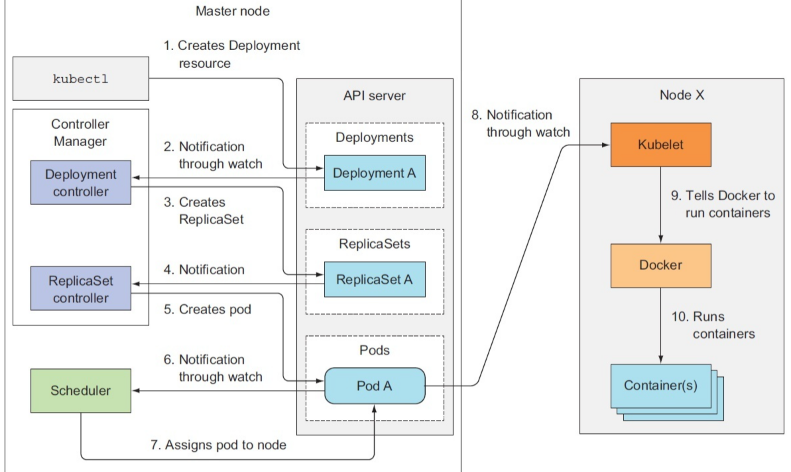
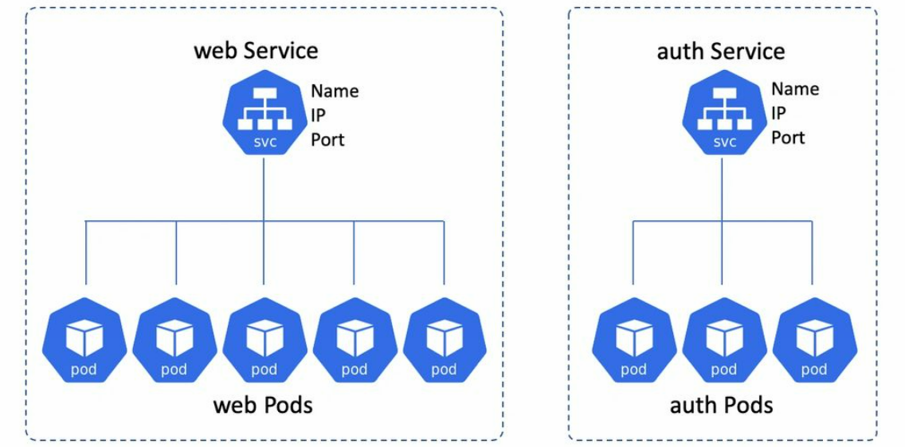
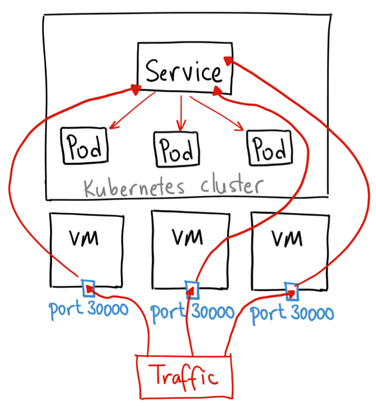
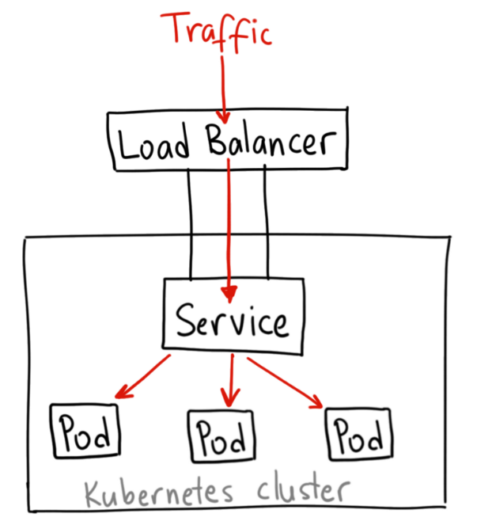
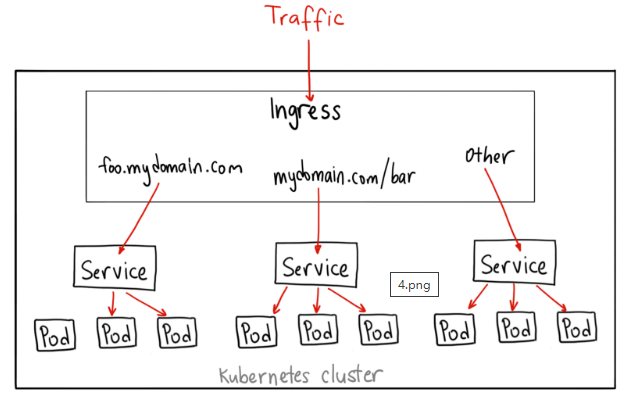

## 什么是Kubernetes

一个开源容器管理工具，负责容器部署，容器扩缩容以及负载平衡。作为Google的创意之作，它提供了出色的社区，并与所有云提供商合作。因此，我们可以说Kubernetes不是*一个容器化平台，而是一个多容器管理解决方案。*

## Kubernetes与Docker的关系

Docker提供容器的生命周期管理，Docker镜像构建运行时容器。但是，由于这些单独的容器必须通信，因此使用Kubernetes。因此，我们说Docker构建容器，这些容器通过Kubernetes相互通信。因此，可以使用Kubernetes手动关联和编排在多个主机上运行的容器

# Pod

## 创建流程

1. 用户通过Kubectl或者其它API客户端向APIServer发起创建Pod请求；
2. APIServer将Pod的相关信息存储到Etcd中，等待写入操作完成，APIServer返回确认信息到客户端；
3. APIServer会监听并反映Etcd中的状态变化；
4. K8s的其它组件通过List-Watch机制跟踪检查APIServer上的相关信息变动；
5. Kube-scheduler会watch APIServer上pod的变化，并做相应的Reconcile操作。如果该Pod是新创建的，并且未绑定到任何一个节点，则进行调度计算，为它绑定一个节点，并且将结果更新到APIServer；
6. APIServer将调度结果保存到Etcd中；
7. 每个节点上的Kubelet会watch调度到本节点上的Pod，并尝试在当前节点调用CRI接口创建Pod，返回容器的状态结果给APIServer；
8. APIServer将Pod信息存入Etcd中

## 生命周期

### Pod阶段

Pod遵循一个预定义的生命周期，起始于`Pending`阶段，如果至少有一个主要容器正常启动，则进入`Running`阶段，之后取决于Pod中是否有容器以失败状态结束而进入`Succeeded`或者`Failed`阶段

> Pod的阶段在spec.phase字段中定义，除上述外还有`Unknown`阶段，表示因某些原因无法获取Pod的状态，这通常是因为与Pod所在主机通信失败导致的
>

Pod在其生命周期中只会被**调度1次**。一旦Pod被调度到某个节点，Pod会一直在该节点运行，直到Pod停止或被终止

### Pod内部容器状态

Kubernetes 会跟踪 Pod 中每个容器的状态，就像它跟踪 Pod 总体上的阶段一样

容器的状态有三种：`Waiting`（等待）、`Running`（运行中）和 `Terminated`（已终止）。

> 通过 `kubectl describe pod <pod 名>`查看Pod中每个容器的状态
>

1. Waiting：如果容器并不处在 `Running` 或 `Terminated` 状态之一，它就处在 `Waiting` 状态。 处于 `Waiting` 状态的容器仍在运行它完成启动所需要的操作：例如，从某个容器镜像 仓库拉取容器镜像，或者向容器应用 [Secret](https://kubernetes.io/zh-cn/docs/concepts/configuration/secret/) 数据等等。
2. Running：`Running` 状态表明容器正在执行状态并且没有问题发生。
3. Terminated：处于 `Terminated` 状态的容器已经开始执行并且或者正常结束或者因为某些原因失败

# Deployment

因为K8s中Pod本身不具有自愈能力，因此一般不直接部署Pod，而是使用一种更高级的抽象（控制器controller）来管理Pod

> Controller：控制器监视资源对象的实际状态，并与对象期望的状态进行对比，然后调整实际状态，使之与期望状态相匹配
>

Deployment是workload的一种，为Pod和Replicaset提供声明式的更新能力。Deployment 并没有直接对 pod 进行管理，是通过管理 Replicaset（rs） 来实现对 pod 的副本控制。Deployment 通过对 rs 的控制实现了版本管理：每次发布对应一个版本，每个版本有一个 rs，在注解中标识版本号，而 rs 再每次根据 pod template 和副本数运行相应的 pod。deployment 只需要保证任何情况下 rs 的状态都在预期，rs 保证任何情况下 pod 的状态都在预期

> 我们往往不会直接在集群中使用 ReplicaSet 部署一个新的微服务，一方面是因为 ReplicaSet 的功能其实不够强大，一些常见的更新、扩容和缩容运维操作都不支持，Deployment 的引入就是为了就是为了支持这些复杂的操作。
>

## 资源文件

```yaml
apiVersion: apps/v1
kind: Deployment
metadata:
  name: nginx-deployment
  labels:
    app: nginx
spec:
  replicas: 3  # 副本数
  selector:    # Replicaset选择器
    matchLabels:
      app: nginx
  template:   # pod 模板
    metadata:
      labels:
        app: nginx
    spec:
      containers:
      - name: nginx
        image: nginx:1.14.2
        ports:
        - containerPort: 80
```

## Deployment Controller

```go
type DeploymentController struct {
    // rs控制器，用于对rs进行认领和弃养操作
    rsControl controller.RSControlInterface
    // 与apiserver进行交互的客户端
    client    clientset.Interface
  
    eventBroadcaster record.EventBroadcaster
    eventRecorder    record.EventRecorder
  
    // 具体的同步函数，初始化时进行赋值，为syncDeployment
    syncHandler func(ctx context.Context, dKey string) error
    // 用于将需要同步的deployment入队
    enqueueDeployment func(deployment *apps.Deployment)
  
    // 从informer中获取各种监听对象
    dLister appslisters.DeploymentLister
    rsLister appslisters.ReplicaSetLister
    podLister corelisters.PodLister
  
    // 分别用来标识资源是否同步过
    dListerSynced cache.InformerSynced
    rsListerSynced cache.InformerSynced
    podListerSynced cache.InformerSynced
  
    // Deployment同步队列，一个个取出来进行同步操作
    queue workqueue.RateLimitingInterface
}
```

`DeploymentController` 作为管理 Deployment 资源的控制器

1. 启动时通过 `Informer` 监听三种不同资源的通知，Pod、ReplicaSet 和 Deployment；

    ```go
    // NewDeploymentController函数
    dInformer.Informer().AddEventHandler(cache.ResourceEventHandlerFuncs{
        AddFunc:    dc.addDeployment,
        UpdateFunc: dc.updateDeployment,
        DeleteFunc: dc.deleteDeployment,
    })
    rsInformer.Informer().AddEventHandler(cache.ResourceEventHandlerFuncs{
        AddFunc:    dc.addReplicaSet,
        UpdateFunc: dc.updateReplicaSet,
        DeleteFunc: dc.deleteReplicaSet,
    })
    podInformer.Informer().AddEventHandler(cache.ResourceEventHandlerFuncs{
        DeleteFunc: dc.deletePod,
    })
    ```
2. 当Pod、ReplicaSet、Deployment变动时，会触发`enqueueDeployment`函数，将对应变动的deployment加入到同步队列中；

    * Deployment的变动
    * Deployment相关的Replicaset的变动
    * Deployment相关的Pod数量为0时，Pod的删除事件
3. `syncDeployment`函数会消费同步队列中的对象，做对应同步操作，使得Deployment的当前状态符合期望状态；

    1. 根据传入的键获取 Deployment 资源；
    2. 调用 `getReplicaSetsForDeployment` 获取集群中与 Deployment 相关的全部 ReplicaSet；

        1. 查找集群中的全部 ReplicaSet；
        2. 根据 Deployment 的选择器对 ReplicaSet 建立或者释放从属关系；
    3. 调用 `getPodMapForDeployment` 获取当前 Deployment 对象相关的从 ReplicaSet 到 Pod 的映射；

        1. 根据选择器查找全部的 Pod；
        2. 根据 Pod 的控制器 ReplicaSet 对上述 Pod 进行分类；
    4. 如果当前的 Deployment 处于暂停状态或者需要进行扩容，就会调用 `sync` 方法同步 Deployment;
    5. 在正常情况下会根据规格中的策略对 Deployment 进行更新；

        1. `Recreate` 策略会调用 `rolloutRecreate` 方法，它会先杀掉所有存在的 Pod 后启动新的 Pod 副本；
        2. `RollingUpdate` 策略会调用 `rolloutRolling` 方法，根据 `maxSurge` 和 `maxUnavailable` 配置对 Pod 进行滚动更新；

## 创建流程

当我们在 Kubernetes 集群中创建 Deployment 对象时，它不只会创建 Deployment 资源，还会创建 ReplicaSet，然后由 Replicaset 创建Pod

​


# Kubernetes网络与负载均衡

## Pod网络模型

Kubernetes 集群中的所有 Pod 都处于同一个平面的 Pod 网络，有自己的 IP 地址

* 集群中的每个Pod都会获得自己独一无二的IP地址

  * Pod能够与所有其它节点上的Pod通信，且不需要经过网络地址转换（NAT）
  * 节点上的代理可以和节点上的所有Pod通信
  * Pod内部的容器可以通过localhost直接通信
* Pod的IP地址是不稳定的，扩缩容、滚动更新都会导致Pod的IP发生变化

## Service

Service 在一组提供服务的 Pod 之上创建一个稳定的网络端点，并为这些 Pod 进行负载分配。

> 当每个 Service 创建时，会被分配一个唯一的 IP 地址（也称为 clusterIP）。 这个 IP 地址与 Service 的生命周期绑定在一起，只要 Service 存在，它就不会改变。
>

客户端和 Service 通信，Service 负责把流量负载均衡给 Pod。

​

底部的 Pod 会因为伸缩、更新、故障等情况发生变化，而 Service 会对这些变化进行跟踪。同时 Service 的名字、IP 和端口都不会发生变化

### 资源文件

假定有一组 Pod，它们对外暴露了 9376 端口，同时还被打上 `app=MyApp` 标签

```yaml
apiVersion: v1
kind: Service
metadata:
  name: my-service   # 服务名
spec:
  selector:
    app: MyApp     # 标签选择器
  ports:
    - protocol: TCP
      port: 80           # 访问service的端口
      targetPort: 9376   # pod暴露的端口
```

上述资源文件中service将请求代理到pod的9376端口

Pod 中的端口定义是有名字的，你可以在 Service 的 `targetPort` 属性中引用这些名称。 例如，我们可以通过以下方式将 Service 的 `targetPort` 绑定到 Pod 端口

```yaml
apiVersion: v1
kind: Pod
metadata:
  name: nginx
  labels:
    app.kubernetes.io/name: proxy
spec:
  containers:
  - name: nginx
    image: nginx:stable
    ports:
      - containerPort: 80
        name: http-web-svc
      
---
apiVersion: v1
kind: Service
metadata:
  name: nginx-service
spec:
  selector:
    app.kubernetes.io/name: proxy
  ports:
  - name: name-of-service-port
    protocol: TCP
    port: 80
    targetPort: http-web-svc
```

### 访问服务（集群内部）

Kubernetes支持两种查找服务的主要模式: `环境变量`和 `DNS`。前者开箱即用，而后者则需要 `CoreDNS`集群插件

#### 环境变量

当 Pod 在节点上运行时，kubelet 会针对每个活跃的 Service 为 Pod 添加一组环境变量。 

```bash
REDIS_MASTER_SERVICE_HOST=10.0.0.11
REDIS_MASTER_SERVICE_PORT=6379
REDIS_MASTER_PORT=tcp://10.0.0.11:6379
REDIS_MASTER_PORT_6379_TCP=tcp://10.0.0.11:6379
REDIS_MASTER_PORT_6379_TCP_PROTO=tcp
REDIS_MASTER_PORT_6379_TCP_PORT=6379
REDIS_MASTER_PORT_6379_TCP_ADDR=10.0.0.11
```

但这引入了一个顺序的问题。

* 如果Pod先于Service存在，那这个Service的环境变量是无法注入到该Pod中去的。要改正的话可以先终止这个Pod，然后等待Deployment重新创建。

  * `kubectl scale deployment my-nginx --replicas=0`
  * `kubectl scale deployment my-nginx --replicas=2`

#### DNS

Kubernetes 提供了一个自动为其它 Service 分配 DNS 名字的 DNS 插件 Service

* 查看：`kubectl get services kube-dns --namespace=kube-system`

DNS 服务器（例如 CoreDNS）监视 Kubernetes API 中的新服务，并为每个服务创建一组 DNS 记录。 如果在整个集群中都启用了 DNS，则所有 Pod 都应该能够通过其 DNS 名称自动解析服务。

例如，如果你在 Kubernetes 命名空间 `my-ns` 中有一个名为 `my-service` 的服务， 则控制平面和 DNS 服务共同为 `my-service.my-ns` 创建 DNS 记录。

* `my-ns` 命名空间中的 Pod 应该能够通过按名检索 `my-service` 来找到服务 （`my-service.my-ns` 也可以工作）；
* 其他命名空间中的 Pod 必须将名称限定为 `my-service.my-ns`。 这些名称将解析为为服务分配的集群 IP；

#### IP地址

当然也可以直接使用Service的IP地址来访问服务

### 服务类型

Kubernetes `ServiceTypes` 允许指定你所需要的 Service 类型，默认是 `ClusterIP`。

`Type` 的取值以及行为如下：

* `ClusterIP`：通过集群的内部 IP 暴露服务，选择该值时服务只能够在集群内部访问。 这也是默认的 `ServiceType`。（但是可以通过k8s的代理访问`kubectl proxy --port=8080`）
* [`NodePort`](https://kubernetes.io/zh-cn/docs/concepts/services-networking/service/#type-nodeport)：通过每个节点上的 IP 和静态端口（`NodePort`）暴露服务。 `NodePort` 服务会路由到自动创建的 `ClusterIP` 服务。 通过请求 `<节点 IP>:<节点端口>`，你可以从集群的外部访问一个 `NodePort` 服务。
* [`LoadBalancer`](https://kubernetes.io/zh-cn/docs/concepts/services-networking/service/#loadbalancer)：使用云提供商的负载均衡器向外部暴露服务。 外部负载均衡器可以将流量路由到自动创建的 `NodePort` 服务和 `ClusterIP` 服务上。
* [`ExternalName`](https://kubernetes.io/zh-cn/docs/concepts/services-networking/service/#externalname)：通过返回 `CNAME` 和对应值，可以将服务映射到 `externalName` 字段的内容（例如，`foo.bar.example.com`）。 无需创建任何类型代理。

### 发布服务（集群外部）

除了`NodePort`、`LoadBalancer`，也可以使用`Ingress`来暴露服务，这三者都是将集群外部流量导入到集群内的方式。

#### NodePort

创建Service时指定type为NodePort

```yaml
apiVersion: v1
kind: Service
metadata:
  name: my-service
spec:
  type: NodePort   # type字段设置服务类型
  selector:
    app: MyApp
  ports:
      # 默认情况下，为了方便起见，`targetPort` 被设置为与 `port` 字段相同的值。
    - port: 80
      targetPort: 80
      # 可选字段
      # 默认情况下，为了方便起见，Kubernetes 控制平面会从某个范围内分配一个端口号（默认：30000-32767）
      nodePort: 30007
```

原理：在所有的集群节点上开放一个特定端口，任何发送到该端口的流量都被转发到对应服务



使用场景：

* 每个端口只能是一种服务

#### LoadBalancer

LoadBalancer 服务是暴露服务到 internet 的标准方式，在使用支持外部负载均衡器的云提供商的服务时，设置 type 的值为 "LoadBalancer"， 将为 Service 提供负载均衡器。

```yaml
apiVersion: v1
kind: Service
metadata:
  name: my-service
spec:
  selector:
    app: MyApp
  type: LoadBalancer      # 设置type
  ports:
    - protocol: TCP
      port: 80
      targetPort: 9376
  clusterIP: 10.0.171.239
status:
  loadBalancer:
    ingress:
      - ip: 192.0.2.127    # 负载均衡器的IP地址
```

原理：在 NodePort 上面又做了一层转换，NodePort 是集群里面每个节点上面一个端口，LoadBalancer 是在所有的节点前又挂一个负载均衡。比如在阿里云上挂一个 SLB，这个负载均衡会提供一个统一的入口，并把所有它接触到的流量负载均衡到每一个集群节点的 node pod 上面去。然后 node pod 再转化成 ClusterIP，去访问到实际的 pod 上面。



#### Ingress

Ingress 公开从集群外部到集群内服务的 HTTP 和 HTTPS 路由。 流量路由由 Ingress 资源上定义的规则控制。

```yaml
apiVersion: networking.k8s.io/v1
kind: Ingress
metadata:
  name: minimal-ingress
  annotations:
    nginx.ingress.kubernetes.io/rewrite-target: /
spec:
  ingressClassName: nginx-example
  rules:
  - http:
      paths:    # 路由列表
      - path: /testpath
        pathType: Prefix
        backend:
          service:
            name: test    # 目标service
            port:
              number: 80
```

​

Ingress 不会公开任意端口或协议。 将 HTTP 和 HTTPS 以外的服务公开到 Internet 时，通常使用 Service.Type=NodePort 或 Service.Type=LoadBalancer 类型的 Service。

# 升级

## Deployment升级策略

在deployment的`spec.strategy`里可以设置更新pod时的策略

* Recreate：杀死所有正在运行的pod，然后创建新pod
* RollingUpdate：滚动升级（默认）

```yaml
apiVersion: apps/v1
kind: Deployment
metadata:
  name: dev-api
  labels:
    name: dev-api
spec:
  replicas: 2
  minReadySeconds: 5
  strategy:     # 更新pod时的策略
    type: RollingUpdate   # 可选Recreate与RollingUpdate
    rollingUpdate:
      maxSurge: 1            # 新创建的pod的最大数量，允许存在的pod数量超过期望值
      maxUnavailable: 1      # 不可用的pod的最大数量
  selector:
    matchLabels:
      name: dev-api
  template:
    metadata:
      labels:
       name: dev-api
    spec:
      containers:
      - name: dev-api
        image: vinterhe/n-p-xh:1.1
        imagePullPolicy: Never
        ports:
        - containerPort: 80
        command: ["/bin/sh","-c"]
```

## 滚动升级

滚动更新 允许通过使用新的实例逐步更新 Pod 实例，零停机进行 Deployment 更新。新的 Pod 将在具有可用资源的节点上进行调度。

默认情况下，更新期间不可用的 pod 的最大值和可以创建的新 pod 数都是 1。这两个选项都可以配置为（pod）数字或百分比。 在 Kubernetes 中，更新是经过版本控制的，任何 Deployment 更新都可以恢复到以前的（稳定）版本。

### 操作

更新之前先升级镜像

* 执行：`kubectl set image deployment demo-dp demo=bebullish/demo:v2`
* 也可以直接在yaml文件里修改

命令：

* 如果修改了yaml文件

  * `kubectl apply -f ****.yaml`
* 如果没有更改yaml文件却想要平滑重启

  * `kubectl rollout restart deployment <deployment>`
* 查看滚动升级的状态

  * `kubectl rollout status deployment/<deployment>`
* 暂停升级

  * `kubectl rollout pause deployment <deployment>`
* 恢复升级

  * `kubectl rollout resume deployment <deployment>`
* 查看升级历史

  * `kubectl rollout history deployment <deployment>`

    ```bash
    REVISION  CHANGE-CAUSE
    1         kubectl apply --filename=api.yml --record=true
    2         kubectl apply --filename=api.yml --record=true
    ```
  * 所有通过`kubectl xxxx --record`都会被kubernetes记录到etcd进行持久化，这无疑会占用etcd资源，最重要的是，时间久了，当你`kubectl get rs`时，会有成百上千的垃圾RS返回给你，这其实也没有太大的作用，一般保留几个版本就可以了。
* 回滚到某一版本

  * `kubectl rollout undo deployment <deployment> --to-revision=2`

### 步骤

* 当镜像版本有更新时，既要保证服务可用，又要保证在线更新，流程应该是：

  1. 先增加一个pod，镜像版本为新版本
  2. pod可用之后，删除一个老版本pod
  3. 循环第1、2步，直到老版本pod全部删除，新版本的pod全部可用
* 上述的这个过程就是replicaset的作用，它根据需求，自动的增加新版本pod，然后删除老版本pod，直到老版本pod全部删除，新版本的pod全部可用
* 如果此时版本需要回退，那replicaset需要把刚才的步骤逆向更新一遍，实现版本回退
* deployment的作用就是管理replicaset。deployment会保存各个版本的replicaset，一旦需要进行版本回滚，deployment会立即回滚replicaset的版本，从而控制pod状态

## 金丝雀发布（灰度发布）

* 在金丝雀发布开始后，先启动一个新版本应用，但是并不直接将流量切过来，而是测试人员对新版本进行线上测试，启动的这个新版本应用，就是我们的金丝雀。如果没有问题，那么可以将少量的用户流量导入到新版本上，然后再对新版本做运行状态观察，收集各种运行时数据，如果此时对新旧版本做各种数据对比，就是所谓的A/B测试。
* 当确认新版本运行良好后，再逐步将更多的流量导入到新版本上，在此期间，还可以不断地调整新旧两个版本的运行的服务器副本数量，以使得新版本能够承受越来越大的流量压力。直到将100%的流量都切换到新版本上，最后关闭剩下的老版本服务，完成金丝雀发布。
* 如果在金丝雀发布过程中（灰度期）发现了新版本有问题，就应该立即将流量切回老版本上，这样，就会将负面影响控制在最小范围内。

总之，金丝雀发布指的是在生产环境中分阶段逐步更新后端应用的版本（需要具备流量控制能力），在小范围验证符合预期之后，再推广至整个生产环境。

### k8s实现

[金丝雀发布](https://juejin.cn/post/7092601525389754404)


# 选举机制
