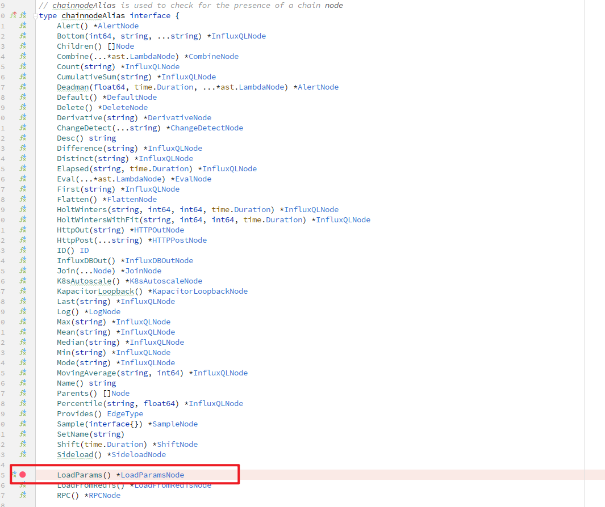

# Kapacitor 告警阈值参数化

告警阈值参数化是指对不同 tag 值的 point 采用不同的阈值进行告警判断

## Kapacitor 自带的告警阈值参数化策略

在 kapacitor 中，使用 sideload、template、udf function 都可以实现告警阈值的参数化

### sideload

sideload 本质上是将参数放到文件中，当调用 sideload 节点时根据对应 tag 的值找到对应文件并读取参数。由于对每一个 point 都需要读取一次配置文件，磁盘 IO 开销极大，也拖累的流处理任务的执行速度

### template

template 将参数定义成变量并创建成模板，定义任务时传入 json 格式的参数文件，更据其中定义的参数值创建任务。该种方式对每一个不同 tag 的 point 创建单独的任务来执行，实际使用时的性能与直接创建一个个任务没有多大不同。当任务数量较多时 cpu 负载较大（协程数量过多）

### udf function

udf function 是用户自定义处理节点的一种方式。用户根据 kapacitor 提供的 sdk 开发自定义处理节点。每一个 udf function 都为单独的进程，通过 socket 的方式与 kapacitor 进行通信。使用 udf function 的好处在于不需要对 kapacitor 的源码进行修改，坏处在于 socket 通信需要一定的开销，在流量较大的情况下处理延时较大。

## 自定义 node 实现告警阈值参数化

在对性能要求及其敏感的情况下可以采用自定义 node 的方式来实现告警阈值参数化。所谓自定义 node 是在 kapacitor 的源码中添加新的 pipeline 处理节点。

[官方文档](https://docs.influxdata.com/kapacitor/v1.6/working/custom_output/)

### 例子

比如说要实现一个名为 loadParams 的自定义 node，功能设计如下

* 根据选择的 tag 与每条数据对应该 tag 的 tag 值，采用不同的阈值（threshold）以及操作符（operator）进行告警
* 阈值与操作符采用 json 序列化的方式保存在 redis 中，node 执行时从 redis 中读取(也可以直接采用 map 表的方式保存在内存中，这里这么设计是因为保存在 redis 中可以从外部进行修改，并且当阈值个数较多时自己实现的 map 由于冲突等原因索引性能会下降，而 redis 针对这方面做了优化)
* 对每条数据，可以采用多个 tag 进行联合查询，使用的 tag 的数目可以是任意的
* 每条数据可以有多个阈值（可以实现不同的告警级别），每个阈值都有一个名称（name），并对应一个操作符以及一个运算结果。此外，每个阈值都有一个默认值（defaultVal）和默认操作符（defaultOp）。阈值的数目也可以是任意的，但必须满足：阈值的数目====操作符的数目====默认值的数目==默认操作符的数目==结果的数目
* 结果通过选定的 field 与每个设定的阈值及对应的操作符运算得到，为 bool 值，运算结果添加到每条数据中，告警时采用 lambda 表达式判断结果的真假生成告警

首先需要设计 loadparams 的 tick 脚本编写规则

```go
|loadFromRedis()
.redis("127.0.0.1:6379")        
.password("123456xyz")            
.db(0)                             
.tag('cpu', 'host')                 
.field('usage_idle')
.threshold('min', '>', 40.0, 'res1')
.threshold('max', '<', 80.0, 'res2')
```

| Setters               | Discription                        |
| ----------------------- | ------------------------------------ |
| redis(addr string)<br />  | addr：redis 数据库的地址           |
| password(pass string) | pass：redis 数据库的密码           |
| db(database int)      | database：使用的 redis 数据库编号  |
| tag(tag …string)     | tag：选择的 tag 名，可以有任意个   |
| field(field string)   | field：选择的 field 名，只能有一个 |

其中 threshold 方法可以多次使用，添加多个阈值。例如对上述脚本

* 绑定 127.0.0.1:6379 地址的 redis 数据库，数据库密码为 123456xyz，编号为 0；
* 选择 2 个 tag：cpu、host 来确定数据的种类
* 选取名为 usage_idle 的 field 作为操作的数据，并且设置了 min 和 max 两个阈值
* 为 min 设置了默认操作符 >、默认值 40.0 以及运算结果 res1
* 为 max 设置了默认操作符 <、默认值 80.0 以及运算结果 res2
* 运算结果 res1 与 res2 会添加到每条数据中
* 执行时，采用以下表达式产生运算结果：re1 = (usage_idle > min)，re2 = (usage_idle < max)


redis 存储设计

采用 hash 的方式存储到 redis 中。

* key：task id
* field：将 tag 值以"#"连接起来作为 field 值
* value：序列化后的 json
  * ```json
    [
        {
            "upper_limit": 35.0,          // 阈值上限
            "lower_limit": 15.0           // 阈值下限
            "level": 1                    // 告警等级,越大越严重
        },
        {
            "upper_limit": 32.0,
            "lower_limit": 12.0
            "level": 2
        },
        {
            "upper_limit": 30.0,
            "lower_limit": 10.0
            "level": 3
        }
    ]
    ```

然后需要对源码进行扩展并实现自定义 node

新建 ./pipeline/loadparams.go 并实现 loadparams 的 tick 脚本编写规则解析器

```go
package pipeline

import (
	"encoding/json"
	"fmt"
)
// tick 脚本编写规则
//|loadParams()
//		.redis("81.70.203.104:6379")
//		.password("123456xyz")
//		.database(0)
//		.tag('cpu', 'host')
//		.field('usage_idle')
type LoadParamsNode struct {
	chainnode
	// 数据源 (弃用)
	//Filename string `tick:"Source" json:"source"`
	// 选择的tag, 可以有多个
	Tags []string `tick:"Tag" json:"tag"`
	// 选择的field和阈值, 1个field对应的阈值可以有多个
	FieldName string `json:"field" tick:"Field"`
	// redis
	RedisAddr string `tick:"Redis" json:"redis"`
	Pass  string `tick:"Password" json:"password"`
	DB        int    `tick:"Database" json:"database"`
}

type threshold struct {
	DefaultOperator string
	DefaultValue    float64
	Result          string
}

func newLoadParamsNode(want EdgeType) *LoadParamsNode {
	return &LoadParamsNode{
		chainnode: newBasicChainNode("loadParams", want, want),
	}
}

// 下方对loadparams node中每一个setter实现了其对应的go函数
func (n *LoadParamsNode) Tag(tags ...string) *LoadParamsNode {
	n.Tags = tags
	return n
}

func (n *LoadParamsNode) Field(name string) *LoadParamsNode {
	n.FieldName = name
	return n
}

func (n *LoadParamsNode) Redis(addr string) *LoadParamsNode {
	n.RedisAddr = addr
	return n
}

func (n *LoadParamsNode) Password(password string) *LoadParamsNode {
	n.Pass = password
	return n
}

func (n *LoadParamsNode) Database(database int64) *LoadParamsNode {
	n.DB = int(database)
	return n
}

// 自定义的json序列化与反序列化方式，用于在输出任务信息时使用
func (n *LoadParamsNode) MarshalJSON() ([]byte, error) {
	type Alias LoadParamsNode
	var raw = &struct {
		TypeOf
		*Alias
	}{
		TypeOf: TypeOf{
			Type: "loadParams",
			ID:   n.ID(),
		},
		Alias: (*Alias)(n),
	}
	return json.Marshal(raw)
}

func (n *LoadParamsNode) UnmarshalJSON(data []byte) error {
	type Alias LoadParamsNode
	var raw = &struct {
		TypeOf
		*Alias
	}{
		Alias: (*Alias)(n),
	}
	err := json.Unmarshal(data, raw)
	if err != nil {
		return err
	}
	if raw.Type != "loadParams" {
		return fmt.Errorf("error unmarshaling node %d of type %s as LoadParamsNode", raw.ID, raw.Type)
	}
	n.setID(raw.ID)
	return nil
}

```

新建 ./pipeline/tick/locaparams.go 并编写

```go
package tick

import (
	"github.com/influxdata/kapacitor/pipeline"
	"github.com/influxdata/kapacitor/tick/ast"
)

type LoadParamsNode struct {
	Function
}

func newLoadParams(parents []ast.Node) *LoadParamsNode {
	return &LoadParamsNode{
		Function{
			Parents: parents,
		},
	}
}

func (n *LoadParamsNode) Build(d *pipeline.LoadParamsNode) (ast.Node, error) {
	n.Pipe("loadParams")   
	n.Dot("redis", d.RedisAddr)   
	n.Dot("password", d.Pass)  
	n.Dot("db", d.DB)    
	n.Dot("tag", d.Tags)         
	n.Dot("field", d.FieldName)   

	return n.prev, n.err
}

```

新建 ./loadParams.go 并实现 loadparam 的具体执行流程

```go
package kapacitor

import (
	"encoding/json"
	"errors"
	"github.com/go-redis/redis"
	"github.com/influxdata/kapacitor/edge"
	"github.com/influxdata/kapacitor/pipeline"
	"log"
	"strings"
)

type LoadParamsNode struct {
	node
	taskID string
	l      *pipeline.LoadParamsNode
	keys   []string // 保存所有键
	rdb    *redis.Client
}

type paramsState struct {
	name     []string
	value    []float64
	operator []string
}

type paramList struct {
	TagValues  []string  `json:"tagValues"`
	Names      []string  `json:"names"`
	Thresholds []float64 `json:"thresholds"`
	Operators  []string  `json:"operators"`
}

type params struct {
	ParamLists []paramList `json:"list"`
}

func newLoadParamsNode(et *ExecutingTask, n *pipeline.LoadParamsNode, d NodeDiagnostic) (*LoadParamsNode, error) {
	//log.Println("new load params task")
	ln := &LoadParamsNode{
		node:   node{Node: n, et: et, diag: d},
		taskID: et.Task.ID,
		l:      n,
		rdb: redis.NewClient(&redis.Options{
			Addr:     n.RedisAddr,
			Password: n.Pass,
			DB:       n.DB,
		}),
	}

	// 测试连接
	_, err := ln.rdb.Ping().Result()
	if err != nil {
		log.Println("failed to connected to redis : " + err.Error())
		return ln, errors.New("failed to connected to redis : " + ln.l.RedisAddr)
	}

	ln.node.runF = ln.runLoadParams
	ln.node.stopF = ln.DeleteState // 停止时删除redis中的状态
	return ln, nil
}

func (n *LoadParamsNode) runLoadParams(snapshot []byte) error {
	consumer := edge.NewConsumerWithReceiver(
		n.ins[0],
		edge.NewReceiverFromForwardReceiverWithStats(
			n.outs,
			edge.NewTimedForwardReceiver(n.timer, n),
		),
	)
	return consumer.Consume() // 调用 point, beginbatch等方法
}

func (n *LoadParamsNode) doLoadParams(p edge.FieldsTagsTimeSetter) error {
	// 根据当前点的tag值获取对应的阈值
	type Constraint struct {
		UpperLimit float64 `json:"upper_limit"`
		LowerLimit float64 `json:"lower_limit"`
		Level      int     `json:"level"`
	}

	var tags []string
	for _, t := range n.l.Tags {
		tags = append(tags, p.Tags()[t])
	}
	queryKey := strings.Join(tags, "#") // 使用连接符#
	var threshold []Constraint
  
	// 读取redis
	res, err := n.rdb.HGet(n.taskID, queryKey).Result()
	if err != nil {
		// 如果读取失败或者redis中没有对应该point tag的记录，则返回，不进行后续处理
                // 这么设计是为了通过redis中是否有对应point的阈值来控制是否对该point进行告警判断
		//log.Println("search redis failed: " + n.taskID + " " + queryKey + " " + err.Error())
		return err
	} else {
		err := json.Unmarshal([]byte(res), &threshold)
		if err != nil {
			log.Println("failed to parse json: " + err.Error())
			return err
		}
	}


	field := p.Fields().Copy()
	result := true //是否正常,true表示正常
	level := 0     // 告警等级
	var lowerLimit, upperLimit float64
	for _, ct := range threshold {
		if field[n.l.FieldName].(float64) > ct.UpperLimit || field[n.l.FieldName].(float64) < ct.LowerLimit {
			result = false         // 告警
			if ct.Level > level { // 设置告警等级
				level = ct.Level
				lowerLimit = ct.LowerLimit
				upperLimit = ct.UpperLimit
			}
		}
	}
	// cal_result=true正常, false 异常
	log.Println(queryKey, result, level)

	field["cal_result"] = result           // 将运算结果注入到每个point的field中，名称固定为cal_result
	field["cal_level"] = level             // 将告警等级注入到每个point的field中，名称固定为cal_level
	field["upper_limit"] = upperLimit      // 将阈值上下限注入到每个point的field中
	field["lower_limit"] = lowerLimit
	p.SetFields(field)
	return nil
}

func (n *LoadParamsNode) DeleteState() {
	//TODO:是否需要删除redis中的状态有待考虑
	//keys, err := n.rdb.HKeys(n.taskID).Result()
	//if err != nil {
	//	log.Println("redis search failed")
	//	return
	//}
	//_, err = n.rdb.HDel(n.taskID, keys...).Result()
	//if err != nil {
	//	log.Println("del redis hashset failed")
	//}
	//log.Println("del redis")
}

func (n *LoadParamsNode) BeginBatch(begin edge.BeginBatchMessage) (edge.Message, error) {
	begin = begin.ShallowCopy()
	return begin, nil
}

func (n *LoadParamsNode) BatchPoint(bp edge.BatchPointMessage) (edge.Message, error) {
	bp = bp.ShallowCopy()
	if err := n.doLoadParams(bp); err != nil {
		return nil, nil // 如果找不到匹配的阈值，则过滤该point
	}
	return bp, nil
}

func (n *LoadParamsNode) EndBatch(end edge.EndBatchMessage) (edge.Message, error) {
	end = end.ShallowCopy()
	return end, nil
}

func (n *LoadParamsNode) Point(p edge.PointMessage) (edge.Message, error) {
	p = p.ShallowCopy()
	if err := n.doLoadParams(p); err != nil {
		return nil, nil // 如果找不到匹配的阈值，则过滤该point
	}
	return p, nil
}

func (n *LoadParamsNode) Barrier(b edge.BarrierMessage) (edge.Message, error) {
	return b, nil
}

func (n *LoadParamsNode) DeleteGroup(d edge.DeleteGroupMessage) (edge.Message, error) {
	return d, nil
}

func (n *LoadParamsNode) Done() {

}

```


接着修改以下文件

pipeline/json.go




pipeline/node.go


task.go


pipeline/tick/ast.go


最后在 tick 脚本中使用 loadparams

```go
stream
    |from()
        .database('telegraf')
        .retentionPolicy('autogen')
        .measurement('cpu')
    |loadParams()
        .redis('127.0.0.1:6379')
        .password('*******')
        .database(0)
        .tag('cpu', 'host')
        .field('usage_idle')
    |groupBy('cpu', 'host')
    |stateCount(lambda: !"cal_result")
        .delay(2)
  
    ......
```