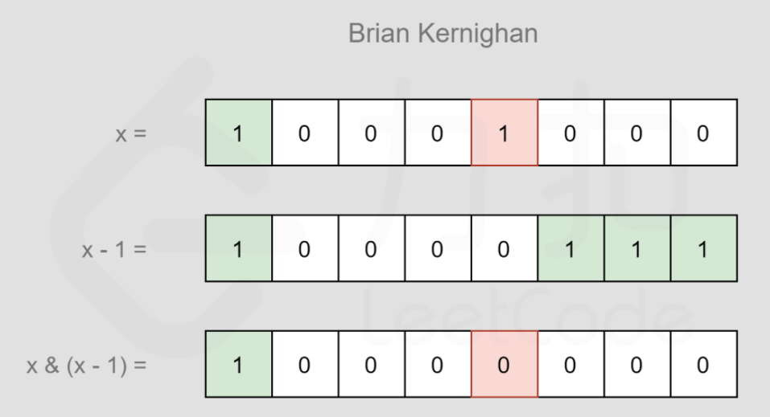

## 贪心


## 位运算  

#### Brian Kernighan 算法

用于判断一个数字$n$的比特位中$1$的个数。

这个算法的意思是，对任何一个数 $n$，$n \& ( n − 1 )$ 的结果是$n$的比特位最右端的$1$变为$0$的结果。<br />



```go
count := 0
for x > 0 {
    x = x&(x-1)
    count++
}
```

## 链表

[19.删除链表的倒数第N个节点](https://leetcode-cn.com/problems/remove-nth-node-from-end-of-list/)：快慢指针法

[21.合并两个有序链表](https://leetcode-cn.com/problems/remove-nth-node-from-end-of-list/)

[23.合并k个链表](https://leetcode-cn.com/problems/merge-k-sorted-lists/)：分治法，先两两合并

[206.反转链表](https://leetcode-cn.com/problems/reverse-linked-list/)

```go
func reverseList(head *ListNode) *ListNode {
    if head == nil || head.Next == nil {
        return head 
    }
    var p0 *ListNode = nil 
    p1, p2 := head, head.Next
    for p2 != nil {
        p1.Next = p0 
        p0, p1 = p1, p2 
        p2 = p2.Next
    }
    p1.Next = p0 
    return p1 
}
```

[114.二叉树展开成为链表](https://leetcode-cn.com/problems/flatten-binary-tree-to-linked-list/)：中序遍历，用列表存储中序遍历结果，最后把列表拼成链表（注意所有的左子树指针都应该设为nil）

[141.判断是否有环形链表](https://leetcode-cn.com/problems/linked-list-cycle/)：快慢指针，p1一次走1格，p2一次走2格，如果存在环，则p1、p2迟早会相遇。

* [287.寻找重复数](https://leetcode-cn.com/problems/find-the-duplicate-number/)：采用寻找环形链表的思想

[142.返回环形链表的开始节点](https://leetcode-cn.com/problems/linked-list-cycle-ii/)：先使用快慢指针确定p1、p2相遇的位置，再设p3=head，p3与p1同步走，它们相遇的位置就是环的起点

[146.LRU](https://leetcode-cn.com/problems/lru-cache/)：哈希表+双向链表

[148.链表排序](https://leetcode-cn.com/problems/sort-list/)：归并排序、插入排序等


## 回溯

[22.括号生成](https://leetcode-cn.com/problems/generate-parentheses/)

[39.组合总和](https://leetcode-cn.com/problems/combination-sum/)：对每一个数字都有选与不选，或者多选这几个条件，以此为基础进行回溯

[全排列](https://leetcode-cn.com/problems/permutations/)：go里面回溯起来比较麻烦，因为切片共享底层数组，需要进行深拷贝

* ```go
  // 回溯：相当于对一颗树进行深度遍历
  func permute(nums []int) [][]int {
      var res [][]int 
      var backTrace func(cand []int)
      temp := []int{}    // 存储遍历路径
      backTrace = func(cand []int) {
          if len(cand) == 0 { // 表示遍历到叶子节点
              res = append(res, append([]int(nil), temp...))  // 深拷贝
          }
          for i := range cand {
              backup := append([]int(nil), cand...)
              temp = append(temp, cand[i])
              backTrace(append(backup[:i], backup[i+1:]...))
              temp = temp[:len(temp)-1]
          }
      }
      backTrace(nums)
      return res 
  }
  ```

[79.单词搜索](https://leetcode-cn.com/problems/word-search/)：有点类似于图的深度优先搜索


## 中心扩散

[5.最长回文子串](https://leetcode-cn.com/problems/longest-palindromic-substring/)


## 二叉树

### 先序遍历

```go
// 递归法
func preorderTraversal(root *TreeNode) []int {
    var res []int 
    var preOrder func(node *TreeNode) 
    preOrder = func(node *TreeNode) {
        if node == nil {
            return 
        } 
        res = append(res, node.Val)
        preOrder(node.Left)
        preOrder(node.Right)
    }
    preOrder(root)
    return res 
}

// 迭代法：使用栈
func preorderTraversal(root *TreeNode) []int {
    var res []int 
    stack := []*TreeNode{}
    for len(stack) > 0 || root != nil {
        for root != nil {
            res = append(res, root.Val)
            stack = append(stack, root)
            root = root.Left 
        }
        root = stack[len(stack)-1]
        stack = stack[:len(stack)-1]
        root = root.Right 
    }
    return res 
}
```

### 中序遍历

```go
// 递归

// 迭代法：使用栈
func inorderTraversal(root *TreeNode) []int {
    var res []int 
    stack := []*TreeNode{}
    for len(stack) > 0 || root != nil {
        for root != nil {
            stack = append(stack, root)
            root = root.Left
        }
        root = stack[len(stack)-1]
        stack = stack[:len(stack)-1]
        res = append(res, root.Val)
        root = root.Right
    }
    return res 
}
```

### 后序遍历

```go
// 递归
func postorderTraversal(root *TreeNode) []int {
    res := []int{}
    var postOrder func(node *TreeNode)
    postOrder = func(node *TreeNode) {
        if node == nil {
            return 
        }
        postOrder(node.Left)
        postOrder(node.Right)
        res = append(res, node.Val)
    }
    postOrder(root)
    return res 
}

// 迭代法：
func postorderTraversal(root *TreeNode) []int {
    res := []int{}
    stack := []*TreeNode{}
    var prev *TreeNode   // 用于记录上一个遍历的点
    for len(stack) > 0 || root != nil {
        for root != nil {
            stack = append(stack, root)
            root = root.Left
        }
        root = stack[len(stack)-1]
        stack = stack[:len(stack)-1]
        if root.Right == nil || root.Right == prev {
            res = append(res, root.Val)
            prev = root 
            root = nil 
        } else {
            stack = append(stack, root)      // 再次入栈
            root = root.Right 
        }
    }
    return res 
}
```

### 层序遍历

```go
// 使用队列
func levelOrder(root *TreeNode) [][]int {
    if root == nil {
        return [][]int{}
    }
    type pair struct{
        node *TreeNode
        depth int
    }
    queue := []pair{{node: root, depth: 0}}
    var res [][]int 
    var temp []int 
    curDepth := 0
    for len(queue) > 0 {
        cur := queue[0]
        queue = queue[1:]
        if cur.depth != curDepth {
            res = append(res, temp)
            temp = []int{}
            curDepth = cur.depth
        }
        temp = append(temp, cur.node.Val)
        if cur.node.Left != nil {
            queue = append(queue, pair{node: cur.node.Left, depth: cur.depth+1})
        }
        if cur.node.Right != nil {
            queue = append(queue, pair{node: cur.node.Right, depth: cur.depth+1})
        }
    }
    if len(temp) > 0 {
        res = append(res, temp)
    }
    return res 
}
```

[114.二叉树展开为链表](https://leetcode-cn.com/problems/flatten-binary-tree-to-linked-list/)：用一个队列保存前序遍历的结果，最后把该队列重建为链表

[104.二叉树的最大深度](https://leetcode-cn.com/problems/maximum-depth-of-binary-tree/)：深度优先搜索or广度优先搜索

```go
func maxDepth(root *TreeNode) int {
    if root == nil {
        return 0
    }
    return max(maxDepth(root.Left), maxDepth(root.Right)) + 1
}

func max(a, b int) int {
    if a > b {
        return a 
    }
    return b 
}
```

[96.不同的二叉搜索树](https://leetcode-cn.com/problems/unique-binary-search-trees/)：动态规划

```go
func numTrees(n int) int {
    dp := make([]int, n+1)
    dp[0], dp[1] = 1, 1
    for i := 2; i <= n; i++ {  
        for j := 1; j <= i; j++ { // 表示以j作为根节点
            dp[i] += dp[j-1]*dp[i-j]  
        }
    }
    return dp[n]
}
```

[98.验证二叉搜索树](https://leetcode-cn.com/problems/validate-binary-search-tree/)：中序遍历结果为递增序列，PS：必须为严格递增。或者使用递归法

[101.对称二叉树](https://leetcode-cn.com/problems/symmetric-tree/)：验证二叉树是否镜像，递归

[104.二叉树的最大深度](https://leetcode-cn.com/problems/maximum-depth-of-binary-tree/)：递归

### 路径问题

[124.二叉树的最大路径和](https://leetcode-cn.com/problems/binary-tree-maximum-path-sum/)：递归 😄

```go
func max(a, b int) int {
    if a > b {
        return a 
    }
    return b
}

func maxPathSum(root *TreeNode) int {
    res := -1 << 31
    var travel func(node *TreeNode) int 
    travel = func(node *TreeNode) int {
        if node == nil {
            return 0
        }
        leftMax := max(0, travel(node.Left))
        rightMax := max(0, travel(node.Right))
        res = max(res, node.Val + leftMax + rightMax)
        return node.Val + max(leftMax, rightMax)
    }
    _ = travel(root)
    return res 
}
```

[437.路径总和3](https://leetcode-cn.com/problems/path-sum-iii/)：

* 双重递归，深度优先搜索，每个点都可以选或者不选，若当前点的父节点选了，则当前点必须选。用flag表示当前点的父节点有无被选中。
* 前缀和，使用深度优先搜索遍历整棵树，保存从根节点遍历到当前节点时候的路径和，记为sum
* ```go
  func pathSum(root *TreeNode, targetSum int) (ans int) {
      preSum := map[int64]int{0: 1}
      var dfs func(*TreeNode, int64)
      dfs = func(node *TreeNode, curr int64) {
          if node == nil {
              return
          }
          curr += int64(node.Val)
          ans += preSum[curr-int64(targetSum)]
          preSum[curr]++
          dfs(node.Left, curr)
          dfs(node.Right, curr)
          preSum[curr]--
          return
      }
      dfs(root, 0)
      return
  }
  ```

[113.二叉树的路径总和](https://leetcode-cn.com/problems/path-sum-ii/)：递归

```go
func pathSum(root *TreeNode, targetSum int) [][]int {
    var res [][]int
    var travel func(node *TreeNode, target int, path []int) 
    travel = func(node *TreeNode, target int, path []int) {
        path = append(path, node.Val)
        if node.Left == nil && node.Right == nil && node.Val == target {
            res = append(res, path)
            return 
        }
        if node.Left != nil {
            travel(node.Left, target-node.Val, append([]int(nil), path...))
        }
        if node.Right != nil {
            travel(node.Right, target-node.Val, append([]int(nil), path...))
        }
    }
    if root != nil {
        travel(root, targetSum, []int{})
    }
    return res 
}
```

### 构造二叉树

前序遍历+中序遍历

> 根据前序遍历的特点, 知前序序列(PreSequence)的首个元素(PreSequence[0])为二叉树的根(root),  然后在中序序列(InSequence)中查找此根(root),  根据中序遍历特点, 知在查找到的根(root) 前边的序列为根的左子树的中序遍历序列,  后边的序列为根的右子树的中序遍历序列。 设在中序遍历序列(InSequence)根前边有left个元素. 则在前序序列(PreSequence)中, 紧跟着根(root)的left个元素序列(即PreSequence[1...left]) 为根的左子树的前序遍历序列, 在后边的为根的右子树的前序遍历序列.而构造左子树问题其实跟构造整个二叉树问题一样，只是此时前序序列为PreSequence[1...left]), 中序序列为InSequence[0...left-1], 分别为原序列的子串, 构造右子树同样, 显然可以用递归方法解决。<br />
>

```go
func buildTree(preorder []int, inorder []int) *TreeNode {
    if len(preorder) == 0 && len(inorder) == 0 {
        return nil 
    }
    if len(preorder) != len(inorder) {
        return nil 
    }
    root := &TreeNode{
        Val: preorder[0],
    }
    i := 0
    for ; i < len(inorder) && inorder[i] != preorder[0]; i++ {}
    root.Left = buildTree(preorder[1:i+1], inorder[:i])
    root.Right = buildTree(preorder[i+1:], inorder[i+1:])
    return root 
}
```

中序遍历+后序遍历

```go
func buildTree(inorder []int, postorder []int) *TreeNode {
    if len(inorder) != len(postorder) || len(postorder) == 0 {
        return nil 
    }
    root := &TreeNode{
        Val: postorder[len(postorder)-1],
    }
    i := 0
    for ; i < len(inorder) && inorder[i] != postorder[len(postorder)-1]; i++ {}
    root.Left = buildTree(inorder[:i], postorder[:i])
    root.Right = buildTree(inorder[i+1:], postorder[i:len(postorder)-1])
    return root 
}
```

### 翻转二叉树

[226.翻转二叉树](https://leetcode-cn.com/problems/invert-binary-tree/)：递归

```go
func invertTree(root *TreeNode) *TreeNode {
    if root == nil {
        return root 
    }
    left := invertTree(root.Left)
    right := invertTree(root.Right)
    root.Left = right
    root.Right = left
    return root 
}
```

### 最近公共祖先

[236.最近公共祖先](https://leetcode-cn.com/problems/lowest-common-ancestor-of-a-binary-tree/)

p 和 q 在 root 的子树中，且分列 root 的 异侧（即分别在左、右子树中）；  
p = root，且 q 在 root 的左或右子树中；  
q = root ，且 p 在 root 的左或右子树中；

```go
func lowestCommonAncestor(root, p, q *TreeNode) *TreeNode {
    if root == nil {
        return nil 
    }
    if root.Val == p.Val || root.Val == q.Val {
        return root 
    }
    left := lowestCommonAncestor(root.Left, p, q)  // 找它的子节点中有没有p或者q
    right := lowestCommonAncestor(root.Right, p, q)
    if left != nil && right != nil {
        return root 
    }
    if left != nil {
        return left 
    }
    return right 
}
```

### 搜索树转化为累加树

[538](https://leetcode-cn.com/problems/convert-bst-to-greater-tree/)

反向中序遍历

```go
func convertBST(root *TreeNode) *TreeNode {
    sum := 0
    var inOrder func(node *TreeNode)
    inOrder = func(node *TreeNode) {
        if node != nil {
            inOrder(node.Right)
            sum += node.Val
            node.Val = sum 
            inOrder(node.Left)   
        }
    }
    inOrder(root)
    return root 
}
```

### 二叉树的直径

[543.二叉树的直径](https://leetcode-cn.com/problems/diameter-of-binary-tree/)

```go
func max(a, b int) int {
    if a > b {
        return a 
    }
    return b 
}

func diameterOfBinaryTree(root *TreeNode) int {
    var ans int 
    var dfs func (node *TreeNode) int 
    dfs = func(node *TreeNode) int {
        if node == nil {
            return 0
        }
        left := dfs(node.Left)
        right := dfs(node.Right)
        ans = max(ans, left+right+1)
        return 1 + max(left, right)
    }
    _ = dfs(root)
    return ans - 1
}
```


## 前缀树

[208.前缀树](https://leetcode-cn.com/problems/implement-trie-prefix-tree/)


## 图

### 深度优先搜索

递归or栈

```cpp
#include<bits/stdc++.h>
using namespace std;
 
// This class represents a directed graph using adjacency
// list representation
class Graph
{
    int V;    // No. of vertices
    list<int> *adj;    // adjacency lists
public:
    Graph(int V);  // Constructor
    void addEdge(int v, int w); // to add an edge to graph
    void DFS(int s);  // prints all vertices in DFS manner
    // from a given source.
};
 
Graph::Graph(int V)
{
    this->V = V;
    adj = new list<int>[V];
}
 
void Graph::addEdge(int v, int w)
{
    adj[v].push_back(w); // Add w to v’s list.
}
 
// prints all not yet visited vertices reachable from s
void Graph::DFS(int s)
{
    // Initially mark all vertices as not visited
    vector<bool> visited(V, false);
 
    // Create a stack for DFS
    stack<int> stack;
 
    // Push the current source node.
    stack.push(s);
 
    while (!stack.empty())
    {
        // Pop a vertex from stack and print it
        int s = stack.top();
        stack.pop();
 
        // Stack may contain same vertex twice. So
        // we need to print the popped item only
        // if it is not visited.
        if (!visited[s])
        {
            cout << s << " ";
            visited[s] = true;
        }
 
        // Get all adjacent vertices of the popped vertex s
        // If a adjacent has not been visited, then push it
        // to the stack.
        for (auto i = adj[s].begin(); i != adj[s].end(); ++i)
            if (!visited[*i])
                stack.push(*i);
    }
}
 
// Driver program to test methods of graph class
int main()
{
    Graph g(5); // Total 5 vertices in graph
    g.addEdge(1, 0);
    g.addEdge(0, 2);
    g.addEdge(2, 1);
    g.addEdge(0, 3);
    g.addEdge(1, 4);
 
    cout << "Following is Depth First Traversal\n";
    g.DFS(0);
 
    return 0;
}
```

[200.岛屿数量](https://leetcode-cn.com/problems/number-of-islands/)：相当于求联通分量

```go
func numIslands(grid [][]byte) int {
    n, m := len(grid), len(grid[0])
    visit := make([][]bool, n)
    for i := range visit {
        visit[i] = make([]bool, m)
    }
    dirs := [][]int{{0, -1}, {0, 1}, {1, 0}, {-1, 0}}
    var dfs func(i, j int) 
    dfs = func(i, j int) {
        visit[i][j] = true
        for _, d := range dirs {
            ni, nj := d[0]+i, d[1]+j
            if ni >= 0 && ni < n && nj >= 0 && nj < m && !visit[ni][nj] && grid[ni][nj] == '1' {
                dfs(ni, nj)
            }
        }
    }
    var ans int = 0
    for i := 0; i < n; i++ {
        for j := 0; j < m; j++ {
            if !visit[i][j] && grid[i][j] == '1' {
                ans++
                dfs(i, j)
            } 
        }
    }
    return ans 
}

// 栈实现
type pair struct{i, j int}

func numIslands(grid [][]byte) int {
    n, m := len(grid), len(grid[0])
    visit := make([][]bool, n)
    for i := range visit {
        visit[i] = make([]bool, m)
    }
    dirs := [][]int{{0, -1}, {0, 1}, {1, 0}, {-1, 0}}
    var dfs func(i, j int) 
    dfs = func(i, j int) {
        stack := []pair{{i, j}}
        for len(stack) > 0 {
            top := stack[len(stack)-1]
            stack = stack[:len(stack)-1]
            visit[top.i][top.j] = true 
            for _, d := range dirs {
                ni, nj := d[0]+top.i, d[1]+top.j
                if ni >= 0 && ni < n && nj >= 0 && nj < m && !visit[ni][nj] && grid[ni][nj] == '1' {
                    stack = append(stack, pair{i: ni, j: nj})
                }
            }
        }
    }
    var ans int = 0
    for i := 0; i < n; i++ {
        for j := 0; j < m; j++ {
            if !visit[i][j] && grid[i][j] == '1' {
                ans++
                dfs(i, j)
            } 
        }
    }
    return ans 
}
```

### 广度优先搜索

递归or队列

```go
var height [][]int
bfs := func(visit [][]bool, i, j int) {
        if visit[i][j] {
            return
        }
        dirs := [][]int{{0, 1}, {0, -1}, {-1, 0}, {1, 0}}
        queue := []pair{{i: i, j: j}}
        visit[i][j] = true
        for len(queue) > 0 {
            cur := queue[0]
            queue = queue[1:]
            for _, d := range dirs {
                ni, nj := cur.i+d[0], cur.j+d[1]
                if ni >= 0 && ni < n && nj >= 0 && nj < m {
                    if heights[ni][nj] >= heights[cur.i][cur.j] && !visit[ni][nj] {
                        queue = append(queue, pair{i: ni, j: nj})
                        visit[ni][nj] = true      // 放在此处
                    }
                }
            }
        }
    }
```

### 拓扑排序

[207.课程表](https://leetcode-cn.com/problems/course-schedule/)：采用基于广度优先搜索的拓扑排序

### Tarjan算法求割点与桥

[查找集群内的关键链接](https://leetcode-cn.com/problems/critical-connections-in-a-network/comments/)

```cpp
// x 代表当前搜索树的根节点，in_edge 代表其对应的序号（tot）
void tarjan(int x, int in_edge) {
    // 在搜索之前，先初始化节点 x 的时间戳与追溯值
    dfn[x] = low[x] = ++num;
    // 通过 head 变量获取节点 x 的直接连接的第一个相邻节点的序号
    // 通过 Next 变量，迭代获取剩下的与节点 x 直接连接的节点的序号
    for (int i = head[x]; i; i = Next[i]) {
        // 此时，i 代表节点 y 的序号
        int y = ver[i];
        // 如果当前节点 y 没有被访问过
        if (!dfn[y]) {
            // 递归搜索以 y 为跟的子树
            tarjan(y, i);
            // 计算 x 的追溯值
            low[x] = min(low[x], low[y]);
            // 桥的判定法则
            if (low[y] > dfn[x])
                bridge[i] = bridge[i ^ 1] = true; // 标记当前节点是否为桥（具体见下文）
        }
        else if (i != (in_edge ^ 1)) // 当前节点被访问过，且 y 不是 x 的“父节点”（具体见下文）
            low[x] = min(low[x], dfn[y]);
    }
}
```

## 优先队列

```go
import "container/heap"

type IntHeap []int  // 定义一个类型

func (h IntHeap) Len() int { return len(h) }  // 绑定len方法,返回长度
func (h IntHeap) Less(i, j int) bool {  // 绑定less方法
    return h[i] < h[j]  // 如果h[i]<h[j]生成的就是小根堆，如果h[i]>h[j]生成的就是大根堆
}
func (h IntHeap) Swap(i, j int) {  // 绑定swap方法，交换两个元素位置
    h[i], h[j] = h[j], h[i]
}

func (h *IntHeap) Pop() interface{} {  // 绑定pop方法，从最后拿出一个元素并返回
    old := *h
    n := len(old)
    x := old[n-1]
    *h = old[0 : n-1]
    return x
}

func (h *IntHeap) Push(x interface{}) {  // 绑定push方法，插入新元素
    *h = append(*h, x.(int))
}

func main() {
	h := &IntHeap{2, 1, 5, 6, 4, 3, 7, 9, 8, 0}  // 创建slice
	heap.Init(h)  // 初始化heap
	fmt.Println(*h)
	fmt.Println(heap.Pop(h))  // 调用pop
	heap.Push(h, 6)  // 调用push
	fmt.Println(*h)
	for len(*h) > 0 {
		fmt.Printf("%d ", heap.Pop(h))
	}

}
```


## 排列组合

[31.下一个排列](https://leetcode-cn.com/problems/next-permutation/)：从后往前进行两遍扫描，并使用双指针反转


## 动态规划

[32.最长有效括号](https://leetcode-cn.com/problems/longest-valid-parentheses/)：用$dp[i]$表示以$s[i]$结尾的最长有效括号数

[55.跳跃游戏](https://leetcode-cn.com/problems/jump-game/)：用$dp[i]$表示在$nums[i]$位置还可以跳跃的最大长度

[62.不同路径](https://leetcode-cn.com/problems/unique-paths/)、[64.最小路径和](https://leetcode-cn.com/problems/minimum-path-sum/)，同类题目，用$dp[i]$表示到$nums[j][i]$的路径长度，并且可以优化空间复杂度

[70.爬楼梯](https://leetcode-cn.com/problems/minimum-path-sum/)：类似于斐波那契数列

[72.编辑距离](https://leetcode-cn.com/problems/edit-distance/)：用$dp[i][j]$表示从$word1[:i]$变换到$woed2[:j]$的最小变换次数

* ```go
  // add dp[i][j] = dp[i][j-1] + 1
  // update dp[i][j] = dp[i-1][j-1] + 1
  // del dp[i][j] = dp[i-1][j] + 1

  func minDistance(word1 string, word2 string) int {
      n, m := len(word1), len(word2)
      dp := make([][]int, n+1)
      for i := range dp {
          dp[i] = make([]int, m+1)
          dp[i][0] = i 
      }
      for i := 0; i <= m; i++ {
          dp[0][i] = i
      }
      for i := 1; i <= n; i++ {
          for j := 1; j <= m; j++ {
              dp[i][j] = min(dp[i-1][j-1], min(dp[i-1][j], dp[i][j-1])) + 1
              if word1[i-1] == word2[j-1] {
                  dp[i][j] = min(dp[i-1][j-1], dp[i][j])
              }
          }
      }
      return dp[n][m]
  }

  func min(a, b int) int {
      if a < b {
          return a 
      }
      return b
  }
  ```

[139.单词拆分](https://leetcode-cn.com/problems/word-break/)：哈希表+动态规划

### 子序列问题

[152.乘积最大子数组](https://leetcode-cn.com/problems/maximum-product-subarray/)：用两个dp[] 分别保存以当前数结尾乘积最小和最大的值，因为可能有负负得正的情况

[300.最长递增子序列](https://leetcode-cn.com/problems/longest-increasing-subsequence/)：dp[i]表示以nums[i]结尾的最长递增子序列的长度

[53.最大子数组和](https://leetcode-cn.com/problems/maximum-subarray/)：用$dp[i]$表示以$nums[i]$结尾的子数组的最大和

### 打家劫舍问题

[198.打家劫舍](https://leetcode-cn.com/problems/house-robber/)：用两个dp分别记录当前房屋偷或者不偷的情况

[337.打家劫舍3](https://leetcode-cn.com/problems/house-robber-iii/)：树状动态规划问题

```go
// 树状dp模板

func max(a, b int) int {
    if a > b {
        return a
    }
    return b 
}

func dfs(root *TreeNode) (int, int) {
    if root == nil {
        return 0, 0
    }
    l1, l2 := dfs(root.Left)   // 分别表示取root和不取root
    r1, r2 := dfs(root.Right)
    return root.Val + l2 + r2, max(l1, l2) + max(r1, r2)
}

func rob(root *TreeNode) int {
    d1, d2 := dfs(root)
    return max(d1, d2)
}
```


### 股票问题

[309.最佳买卖股票的时机含冷冻期](https://leetcode-cn.com/problems/best-time-to-buy-and-sell-stock-with-cooldown/)：三个状态分别表示第i天持有股票，不持有股票且处于冷冻期，不持有股票且不处于冷冻期

### 背包问题

* 0-1背包问题：$dp[i][j]$表示是否能够从前 $i$ 个硬币取出若干个使得和为 $j$

  * [416.分割等和子集](https://leetcode-cn.com/problems/partition-equal-subset-sum/)
  * 474. 一和零
  * 494. 目标和
  * 879. 盈利计划
  * [1049.最后一块石头的重量](https://leetcode-cn.com/problems/last-stone-weight-ii/)
  * ```cpp
    // 模板
    // 0-1背包问题母代码(二维)
    void bags()
    {
        vector<int> weight = {1, 3, 4};   //各个物品的重量
        vector<int> value = {15, 20, 30}; //对应的价值
        int bagWeight = 4;                //背包最大能放下多少重的物品

        // 二维数组：状态定义:dp[i][j]表示从0-i个物品中选择不超过j重量的物品的最大价值
        vector<vector<int>> dp(weight.size() + 1, vector<int>(bagWeight + 1, 0));

        // 初始化:第一列都是0，第一行表示只选取0号物品最大价值
        for (int j = bagWeight; j >= weight[0]; j--)
            dp[0][j] = dp[0][j - weight[0]] + value[0];

        // weight数组的大小 就是物品个数
        for (int i = 1; i < weight.size(); i++) // 遍历物品(第0个物品已经初始化)
        {
            for (int j = 0; j <= bagWeight; j++) // 遍历背包容量
            {
                if (j < weight[i])           //背包容量已经不足以拿第i个物品了
                    dp[i][j] = dp[i - 1][j]; //最大价值就是拿第i-1个物品的最大价值
                //背包容量足够拿第i个物品,可拿可不拿：拿了最大价值是前i-1个物品扣除第i个物品的 重量的最大价值加上i个物品的价值
                //不拿就是前i-1个物品的最大价值,两者进行比较取较大的
                else
                    dp[i][j] = max(dp[i - 1][j], dp[i - 1][j - weight[i]] + value[i]);
            }
        }
        cout << dp[weight.size() - 1][bagWeight] << endl;
    }

    // 空间优化
    void test_1_wei_bag_problem()
    {
        vector<int> weight = {1, 3, 4};
        vector<int> value = {15, 20, 30};
        int bagWeight = 4;

        // 初始化
        vector<int> dp(bagWeight + 1, 0);
        for (int i = 0; i < weight.size(); i++)
        { // 遍历物品
            for (int j = bagWeight; j >= weight[i]; j--)
            {                                                     // 遍历背包容量(一定要逆序)
                dp[j] = max(dp[j], dp[j - weight[i]] + value[i]); //不取或者取第i个
            }
        }
        cout << dp[bagWeight] << endl;
    }
    ```
* 完全背包问题：与0-1背包的不同在于所有物品可以有无数多个

  * [322.零钱兑换](https://leetcode-cn.com/problems/coin-change/)：$dp[i]$ 表示凑成 $i$ 的最少硬币个数
  * 518.零钱兑换2
  * 数位成本和为目标值的最大数字
* 多重背包问题：

## 二分查找

[33.搜索旋转排序数组](https://leetcode-cn.com/problems/search-in-rotated-sorted-array/)

[34.在排序的数组中查找元素的第一个和最后一个位置](https://leetcode-cn.com/problems/find-first-and-last-position-of-element-in-sorted-array/)


## 双指针

[42.接雨水](https://leetcode-cn.com/problems/trapping-rain-water/)


## 矩阵

[48.旋转图像](https://leetcode-cn.com/problems/rotate-image/submissions/)：先水平翻转，再主对角线翻转


## 哈希表

[49.字母异位词分组](https://leetcode-cn.com/problems/group-anagrams/)：为不同的词构造hash key，构造方法可以为字母排序，或者为每一个字母分配一个质数表示，用质数乘积来表示键


## 排序

### 冒泡排序

```go
func sort(nums []int) {
    for i := 0; i < len(nums)-1; i++ {
        for j := i+1; j < len(nums); j++ {
            if nums[i] > nums[j] {
                nums[i], nums[j] = nums[j], nums[i]
            }
        }
    }
}
```

### 快速排序（不稳定的排序）

快速排序的操作是这样的：首先从数列的右边开始往左边找，我们设这个下标为 i，也就是进行减减操作（i--），找到第 1 个比基准数小的值，让它与基准值交换；接着从左边开始往右边找，设这个下标为 j，然后执行加加操作（j++），找到第 1 个比基准数大的值，让它与基准值交换；然后继续寻找，直到 i 与 j 相遇时结束，最后基准值所在的位置即 k 的位置，也就是说 k 左边的值均比 k 上的值小，而 k 右边的值都比 k 上的值大。

```go
func QuickSort(nums []int, begin, end int) {
    if begin < 0 || end >= len(nums) || begin >= end {
        return 
    }
    key := nums[begin]
    i, j := begin, end 
    for i < j {
        for i < j && nums[j] > key {
            j--
        }
        if i < j {
            nums[i] = nums[j]
            i++
        }
        for i < j && nums[i] < key {
            i++
        }
        if i < j {
            nums[j] = nums[i]
            j--
        }
    }
    nums[i] = key
    QuickSort(nums, begin, i-1)
    QuickSort(nums, i+1, end)
}
```

### 堆排序（不稳定的排序）

将排序的数组视为完全二叉树

* 建堆(初始化+调整堆, 时间复杂度为O(n));
* 拿堆的根节点和最后一个节点交换(siftdown, 时间复杂度为O(n*log n) ).

```go
// 大顶堆
func adjust(nums []int, root, length int) {
    lchild := root*2+1
    if lchild < length {
        rchild := lchild+1
        maxIndex := lchild     // 保存左右子树中最大值的下标
        if rchild < length && nums[rchild] > nums[maxIndex] {
            maxIndex = rchild
        }
        if nums[root] < nums[maxIndex] {
            nums[root], nums[maxIndex] = nums[maxIndex], nums[root]   
            adjust(nums, maxIndex, length)
        }
    }
}

func heapSort(nums []int) {
    n := len(nums)
    // 建堆
    for i := (n-1)/2; i >= 0; i-- {
        adjust(nums, i, n)
    }
    // 堆排序
    for i := n-1; i > 0; i-- {
        nums[0], nums[i] = nums[i], nums[0]
        adjust(nums, 0, i)
    }
}
```

### 数对排序问题

**一般这种数对，还涉及排序的，根据第一个元素正向排序，根据第二个元素反向排序，或者根据第一个元素反向排序，根据第二个元素正向排序，往往能够简化解题过程**。

[406.根据身高重建队列](https://leetcode-cn.com/problems/queue-reconstruction-by-height/)：先排序，再插队

```go
func reconstructQueue(people [][]int) [][]int {
    sort.Slice(people, func(i, j int) bool {
        return people[i][0] > people[j][0] || (people[i][0] == people[j][0] && people[i][1] < people[j][1])
    })
    res := [][]int{}
    for i := 0; i < len(people); i++ {
        if people[i][1] >= len(res) {
            res = append(res, people[i])
        } else {
            res = append(res[:people[i][1]], append([][]int{people[i]}, res[people[i][1]:]...)...)
        }
    }
    return res 
}
```

## 栈与单调栈

哨兵机制，中心扩散法以空间换时间

[84.柱状图中的最大矩形](https://leetcode-cn.com/problems/largest-rectangle-in-histogram/)

```go
// 单调栈, 本质上还是枚举高度
func largestRectangleArea(heights []int) int {
    ans := 0
    stack := []int{}      // 单调栈
    heights = append([]int{0}, heights...)   // 左边加上哨兵
    heights = append(heights, 0)  // 右边加上哨兵
    for i := 0; i < len(heights); i++ {
        for len(stack) > 0 && heights[i] < heights[stack[len(stack)-1]] {
            cur := stack[len(stack)-1]
            stack = stack[:len(stack)-1]
            left := -1
            if len(stack) > 0 {
                left = stack[len(stack)-1] + 1
            }
            right := i - 1
            ans = max(ans, (right-left+1)*heights[cur])
        }
        stack = append(stack, i)
    }
    return ans 
}

func max(a, b int) int {
    if a > b {
        return a 
    }
    return b
}
```

[85.最大矩形](https://leetcode-cn.com/problems/maximal-rectangle/)：可以转换为柱状图中的最大矩形来求解

PS：如果是最大正方形的话就可以用动态规划做了

[394.字符串编码](https://leetcode-cn.com/problems/decode-string/)

[739.每日温度](https://leetcode-cn.com/problems/daily-temperatures/)：可以维护一个存储下标的单调栈，从栈底到栈顶的下标对应的温度列表中的温度依次递减。如果一个下标在单调栈里，则表示尚未找到下一次温度更高的下标

```go
func dailyTemperatures(temperatures []int) []int {
    n := len(temperatures)
    ans := make([]int, n)
    // 单调栈解法
    stack := []int{}   // 存储下标，下标所代表的温度递减
    for i := 0; i < n; i++ {
        temperature := temperatures[i]
        for len(stack) > 0 && temperature > temperatures[stack[len(stack)-1]] {
            preIndex := stack[len(stack)-1]
            stack = stack[:len(stack)-1]
            ans[preIndex] = i - preIndex
        }
        stack = append(stack, i)
    }
    return ans 
}
```

## 位运算

[2044.统计按位或能得到的最大值的子集数目](https://leetcode-cn.com/problems/count-number-of-maximum-bitwise-or-subsets/)：二进制枚举。


## 滑动窗口

### 模板

```go
```


[239.滑动窗口最大值](https://leetcode-cn.com/problems/sliding-window-maximum/)：双端队列

```go
func maxSlidingWindow(nums []int, k int) []int {
    n := len(nums)
    res := []int{}
    dqueue := []int{}            // 存储下标i, 倒序排列, 第一个下标对应的元素永远为最大值
    for i := 0; i < n; i++ {
        for len(dqueue) > 0 && nums[dqueue[len(dqueue)-1]] < nums[i] {
            dqueue = dqueue[:len(dqueue)-1]
        }
        dqueue = append(dqueue, i)
        if i >= k-1 {
            for len(dqueue) > 0 && dqueue[0] < i-k+1 {
                dqueue = dqueue[1:]
            }
            res = append(res, nums[dqueue[0]])
        }
    }
    return res 
}
```

## 卡特兰数

递归定义：$f_n=f_0*f_{n-1}+f_1*f_{n-2}+\cdots + f_{n-1}*f_{0}$  

通项公式：$C_n=\frac{C_{2n}^{n}}{n+1}$  

递推公式：$C_1=1,C_n=C_{n-1}\frac{4*n-2}{n+1}$

化简后可得：$f_n=C_{2n}^n-C_{2n}^{n-1}$

场景：有一些操作，这些操作有着一定的限制，如一种操作数不能超过另外一种操作数，或者两种操作不能有交集等，这些操作的合法操作顺序的数量

### 案例

你现在有**n**个**0**和**n**个**1**，问有多少个长度为**2**n的序列，使得序列的任意一个前缀中**1**的个数都大于等于**0**的个数

* 合法的序列个数为$C_{2n}^n-C_{2n}^{n-1}$

你有**n**个左括号，**n**个右括号，问有多少个长度为**2**n的括号序列使得所有的括号都是合法的

* 合法的序列个数为$C_{2n}^n-C_{2n}^{n-1}$
* 要使所有的括号合法，实际上就是在每一个前缀中左括号的数量都不少于右括号的数量

有一个栈，我们有**2**n次操作，**n**次进栈，**n**次出栈，问有多少种合法的进出栈序列

* 合法的序列个数为$C_{2n}^n-C_{2n}^{n-1}$
* 要使序列合法，在任何一个前缀中进栈次数都不能少于出栈次数

二叉树的构成问题：有**n**个点，问用这**n**个点最终能构成多少二叉树？

* 一个二叉树分为根节点，左子树，右子树，其中左子树和右子树也是二叉树，左右子树节点个数加起来等于**n**−**1**。和卡特兰数的递归定义是一模一样的。


## 快速幂

```go
func myPow(x float64, n int) float64 {
    if n >= 0 {
        return quickPow(x, n)
    } else {
        return 1.0/quickPow(x, -n)
    }
}

func quickPow(x float64, n int) float64 {
    if n == 0 {
        return 1.0
    }
    res := quickPow(x, n/2)
    if n%2 == 0 {
        return res*res
    } 
    return res*res*x
}
```
