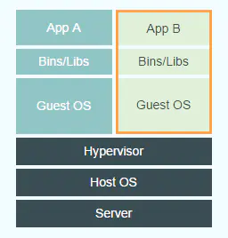
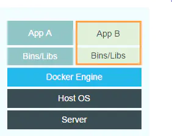

## 什么是Docker

docker是一个容器化平台，它以容器的形式将应用程序及其所有依赖项打包在一起，以确保应用程序在任何环境中都能无缝运行

## Docker与虚拟机有何不同



两者都是资源隔离的方案

* 虚拟机实现资源隔离的方法是利用独立的OS，并利用Hypervisor虚拟化CPU、内存、IO设备等实现的
* docker并没有和虚拟机一样利用一个完全独立的Guest OS实现环境隔离，它利用的是目前linux内核本身支持的容器方式实现资源和环境隔离。简单的说，docker利用namespace实现系统环境的隔离；利用Cgroup实现资源限制；利用镜像实现根目录环境的隔离。
* docker 是轻量级的沙盒，在其中运行的只是应用，虚拟机里面还有额外的系统

## 什么是Docker镜像

Docker镜像是Docker容器的源代码，Docker镜像用于创建容器。使用build命令创建镜像

## 什么是Docker容器

Docker容器包括应用程序及其所有依赖项，作为操作系统的独立进程运行

## Docker容器的4种状态

运行、已暂停、重新启动、已退出

## Dockerfile中最常见的指令是什么

* FROM：指定基础镜像
* LABEL：功能是为镜像指定标签
* RUN：运行指定的命令
* CMD：容器启动时要运行的命令

## Dockerfile中的命令COPY与ADD有什么区别

COPY与ADD的区别COPY的SRC只能是本地文件，而ADD不仅能够将构建命令所在的主机本地的文件或目录，而且能够将远程URL所对应的文件或目录，作为资源复制到镜像文件系统，其他用法一致。

可以认为ADD是增强版的COPY

```dockerfile
COPY <src> <dest>
ADD <sec> <dest>
```

## Docker常用命令

* docker pull 拉取或者更新指定镜像
* docker push 将镜像推送至远程仓库
* docker rm 删除容器
* docker rmi 删除镜像
* docker images 列出所有镜像
* docker ps 列出所有容器

## 容器与主机之间的数据拷贝命令

docker cp

主机到容器：docker cp /www 96f7f14e99ab:/www/  

容器到主机：docker cp 96f7f14e99ab:/www /tmp/

## 解释以下Dockerfile的UNBUILD指令

`ONBUILD` 它后面跟的是其它指令，比如 `RUN`, `ADD` 等，这些指令在当前镜像构建时并不会被执行，只有以当前镜像为基础镜像，去构建下一级镜像的时候才会被执行

## 如何在生产中监控Docker

* Docker提供docker stats和docker事件等工具来监控生产中的Docker。我们可以使用这些命令获取重要统计数据的报告。
* Docker统计数据：当我们使用容器ID调用docker stats时，我们获得容器的CPU，内存使用情况等。它类似于Linux中的top命令。
* Docker事件：Docker事件是一个命令，用于查看Docker守护程序中正在进行的活动流。
* 一些常见的Docker事件是：attach，commit，die，detach，rename，destroy等。我们还可以使用各种选项来限制或过滤我们感兴趣的事件

## 如何清理后台停止的容器

docker  rm

## 如何查看镜像支持的环境变量

docker run IMAGE env命令

## Docker网络模型

* **bridge** （默认）: 当Docker进程启动时，会在主机上创建一个名为docker0的虚拟网桥，此主机上启动的Docker容器会连接到这个虚拟网桥上。虚拟网桥的工作方式和物理交换机类似，这样主机上的所有容器就通过交换机连在了一个二层网络中。
* **none** ：使用none模式，Docker容器拥有自己的Network Namespace，但是，并不为Docker容器进行任何网络配置。也就是说，这个Docker容器没有网卡、IP、路由等信息。需要我们自己为Docker容器添加网卡、配置IP等。
* **host** ：如果启动容器的时候使用host模式，那么这个容器将不会获得一个独立的Network Namespace，而是和宿主机共用一个Network Namespace。容器将不会虚拟出自己的网卡，配置自己的IP等，而是使用宿主机的IP和端口。但是，容器的其他方面，如文件系统、进程列表等还是和宿主机隔离的。
* **container**：这个模式指定新创建的容器和已经存在的一个容器共享一个 Network Namespace，而不是和宿主机共享。新创建的容器不会创建自己的网卡，配置自己的 IP，而是和一个指定的容器共享 IP、端口范围等。同样，两个容器除了网络方面，其他的如文件系统、进程列表等还是隔离的。

## Docker技术三大要点

* **cgroup**：CGroups 全称control group，用来限定一个进程的资源使用，由Linux 内核支持，可以限制和隔离Linux进程组 (process groups) 所使用的物理资源 ，比如cpu，内存，磁盘和网络IO，是Linux container技术的物理基础。
* **namespace**：一种资源隔离技术。如果CGroup设计出来的目的是为了隔离上面描述的物理资源，那么namespace则用来隔离PID(进程ID),IPC,Network等系统资源。每个Namespace里面的资源对其他Namespace都是透明的。不同container内的进程属于不同的Namespace，彼此透明，互不干扰。
* **unionFS**（联合文件系统）：unionFS可以把文件系统上多个目录(也叫分支)内容联合挂载到同一个目录下，而目录的物理位置是分开的。UnionFS允许只读和可读写目录并存，就是说可同时删除和增加内容。UnionFS应用的地方很多，比如在多个磁盘分区上合并不同文件系统的主目录，或把几张CD光盘合并成一个统一的光盘目录(归档)。
