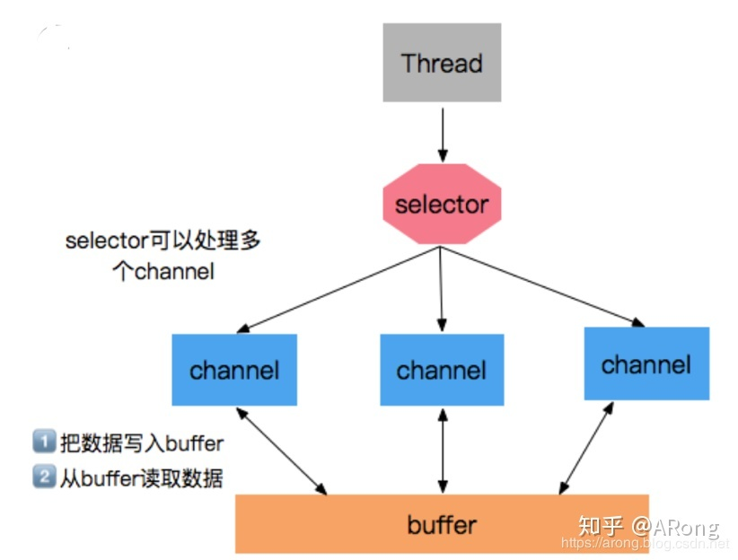
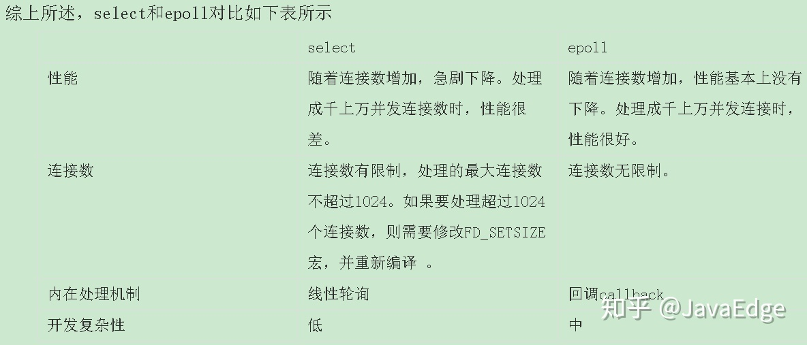
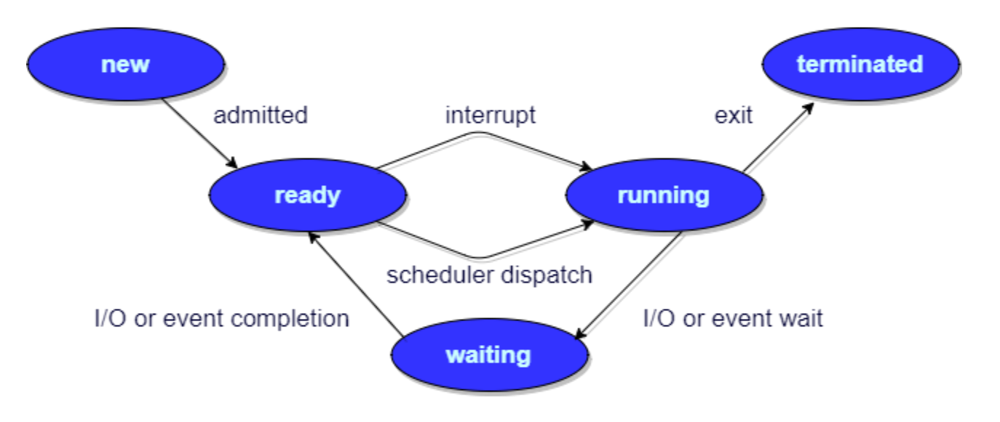

## 5种IO模型

```dockerfile
[1]blockingIO - 阻塞IO
[2]nonblockingIO - 非阻塞IO
[3]IOmultiplexing - IO多路复用
[4]signaldrivenIO - 信号驱动IO
[5]asynchronousIO - 异步IO
```

## BIO与NIO

什么是IO模型？

* IO模型是操作系统对输入和输出做的一系列规范和实现。

同步与异步？**侧重于IO进程能不能立即响应信号**

* 同步：同步指的是调用者发起IO调用后，IO进程在处理完成之前，都不返回信号。
* 异步：异步指的是调用者发起IO调用后，IO进程立即返回接受信号，此时调用者和IO进程都在并发执行各自的任务。当IO进程完成任务后，通过回调机制通知调用者。

阻塞与非阻塞？**侧重于调用者是否需要等待IO进程**

* 阻塞：调用者发起IO调用之后，需要等待IO进程完成任务，需要挂起当前进程。
* 非阻塞：调用者发起IO调用之后，调用者可以继续执行其他任务而不需要挂起。

三种IO模型即为BIO【同步阻塞IO】、NIO【同步非阻塞IO】、AIO【异步非阻塞IO】。 首先可以先简单地体会一下三种IO模型的情景：假设你需要等待开水的煮开： 1. 同步阻塞：你蹲在开水壶旁边，什么都不做，等着开水的煮开。 2. 同步非阻塞：你跑去看书学习，隔一段时间来看看开水是否煮开。 3. 异步非阻塞：你跑去看书学习，当开水煮开的时候会发出响声，听到响声后你再回来。

* BIO：同步阻塞，实现模式为一个连接一个线程，即当有客户端连接时，服务器端需为其单独分配一个线程，如果该连接不做任何操作就会造成不必要的线程开销，BIO适用于连接数目较小且固定的架构，对服务器资源的要求较高。
* NIO：同步非阻塞。相对于BIO来说出现了几个核心的组件，分别是 Selector（选择器）、Channle（通道）和 Buffer（缓冲区）

  * 
  * 缓冲区的出现导致了NIO和BIO的不同：读数据时可以先读一部分到缓冲区中，然后处理其他事情；写数据时可以先写一部分到缓冲区中，然后处理其他事情。读和写操作可以不再持续，所以不会阻塞。当缓冲区满后才会将其放入真正地读/写。
  * NIO的所有IO操作都从Channle开始： - 从通道进行数据读取 ：创建一个缓冲区，然后请求通道读取数据。 - 从通道进行数据写入 ：创建一个缓冲区，填充数据，并要求通道写入数据。
  * 选择器可以让单个线程处理多个通道，达到复用的目的。
* AIO：是NIO的改进版，主要基于事件和回调机制来实现异步处理

## epoll、poll与select

[一文搞懂select、poll、epoll的区别](https://zhuanlan.zhihu.com/p/272891398)

什么是多路复用：

* 多路: 指的是多个socket网络连接;
* 复用: 指的是复用一个线程；

多路复用主要有三种技术：select，poll，epoll。epoll是最新的, 也是目前最好的多路复用技术；

但**select，poll，epoll本质上都是同步I/O**，因为他们都需要在读写事件就绪后自己负责进行读写，也就是说这个读写过程是阻塞的，而异步I/O则无需自己负责进行读写，异步I/O的实现会负责把数据从内核拷贝到用户空间。




## 内核态与用户态

* **用户态** ：提供应用程序运行的空间，为了使应用程序访问到内核管理的资源，例如CPU，内存，I/O等。
* **内核态** ：本质是内核，一种特殊的软件程序 **，** 用于控制计算机的硬件资源，例如协调CPU资源，分配内存资源，并且提供稳定的环境供应用程序运行。

> 每个进程都有两个栈，分别是用户栈与内核栈，对应用户态与内核态的使用
>

用户态只能受限的访问内存, 且不允许访问外设(硬盘、网卡等)；内核态CPU可以访问内存所有数据, 包括外设，且可以将自己从一个程序切换到另一个程序。

**为什么要有用户态和内核态？**

由于需要限制不同的程序之间的访问能力, 防止他们获取别的程序的内存数据, 或者获取外设的数据并发送到网络，操作系统划分出两个权限等级： **用户态** 和 **内核态。**简单来说，就是： **对不同的操作给予不同的“权限”** 。

**用户态和内核态的切换？**

用户程序跑在用户态下，但是如果需要执行一些操作例如申请内存，网络读写时，自己的权限不够，就需要转换到内核态去让内核的code帮忙干一些事情，这样就存在用户态和内核态切换的过程。

**如何从用户态切换到内核态？**系统调用、异常（缺页异常等），外设中断

## 线程、进程、协程的区别

进程：进程是程序的一次执行过程，是程序在执行过程中的分配和管理资源的基本单位，每个进程都有自己的地址空间，进程至少有 5 种状态：初始态、执行态、等待态、就绪态、终止态。

线程：线程是CPU调度和分派的基本单位，一个进程可以包含多个线程，它可以和同一进程下的其他线程共享全部资源。

* 联系：线程是进程中的一部分，一个进程可以有多个线程，但线程只能存在于一个进程中。
* 区别：

  * 根本区别：进程是操作系统资源调度的基本单位，线程是任务的调度执行的基本单位
  * 开销方面：进程都有自己的独立数据空间，程序之间的切换开销大；线程也有自己的运行栈和程序计数器，线程间的切换开销较小。
  * 共享空间：进程拥有各自独立的地址空间、资源，所以共享复杂，需要用IPC（Inter-Process Communication，进程间通信），但是同步简单。而线程共享所属进程的资源，因此共享简单，但是同步复杂，需要用加锁等措施。

> 注：线程在切换的过程中需要保存当前线程Id、线程状态、堆栈、寄存器状态等信息。
>

> 设计线程的原因？
>
> 操作系统模型中，进程有两个功能：  
> 	1. 任务的调度执行基本单位  
> 	2. 资源的所有权  
> 线程的出现就是将这两个功能分离开来了：thread 执行任务的调度和执行 ； process 资源所有权
>
> 这样的好处是：
>
> 	• 操作系统中有两个重要概念：并发和隔离  
> 	• 并发：提高硬件利用率，进程的上下文切换比线程的上下文切换效率低，所以线程可以提高并发的效率  
> 	• 隔离：计算机的资源是共享的，当程序发生奔溃时，需要保证这些资源要被回收，进程的资源是独立的，奔溃时不会影响其他程 序的进行，线程资源是共享的，奔溃时整个进程也会奔溃  
> 	• 线程和并发有关系，进程和隔离有关系
>

GO中的协程：

* 多个协程可由一个或多个线程管理，协程的调度发生在其所在的线程中。
* 可以被调度，调度策略由应用层代码定义，即可被高度自定义实现。
* 执行效率高。
* 占用内存少。

协程和线程的区别在于：

* 线程切换需要陷入内核，然后进行上下文切换，而协程在用户态由协程调度器完成，不需要陷入内核，这代价就小了；
* 另外，协程的切换时间点是由调度器决定的，而不是系统内核决定的，尽管他们切换点都是时间片超过一定阈值，或者进入I/O或睡眠等状态；
* 再次，还有垃圾回收的考虑，因为go实现了垃圾回收，而垃圾回收的必要条件是内存位于一致状态，这就需要暂停所有的线程，如果交给系统去做，那么会暂停所有的线程使其一致，而在go里面调度器知道什么时候内存位于一致状态，那么就没有必要暂停所有运行的协程。

**为什么协程需要的空间大小更小？**

## 进程有哪几种状态

* **创建状态(new)** ：进程正在被创建，尚未到就绪状态。
* **就绪状态(ready)** ：进程已处于准备运行状态，即进程获得了除了处理器之外的一切所需资源，一旦得到处理器资源(处理器分配的时间片)即可运行。
* **运行状态(running)** ：进程正在处理器上上运行(单核 CPU 下任意时刻只有一个进程处于运行状态)。
* **阻塞状态(waiting)** ：又称为等待状态，进程正在等待某一事件而暂停运行如等待某资源为可用或等待 IO 操作完成。即使处理器空闲，该进程也不能运行。
* **结束状态(terminated)** ：进程正在从系统中消失。可能是进程正常结束或其他原因中断退出运行。



## 进程间通信（IPC）方式

**为什么需要进行进程间通信？**

* 数据传输：一个进程需要将它的数据发送给另一个进程;
* 资源共享：多个进程之间共享同样的资源;
* 通知事件：一个进程需要向另一个或一组进程发送消息，通知它们发生了某种事件;
* 进程控制：有些进程希望完全控制另一个进程的执行(如Debug进程)，该控制进程希望能够拦截另一个进程的所有操作，并能够及时知道它的状态改变。

**进程间通信原理**

每个进程各自有不同的用户地址空间,任何一个进程的全局变量在另一个进程中都看不到，所以进程之间要交换数据必须通过内核,在内核中开辟一块缓冲区,进程1把数据从用户空间拷到内核缓冲区,进程2再从内核缓冲区把数据读走,内核提供的这种机制称为进程间通信机制。

**进程间常见的几种通信方式**

* 管道：管道又称匿名管道，这是一种最基本的IPC机制，由pipe函数创建

  * 它是半双工的（即数据只能在一个方向上流动），具有固定的读端和写端。
  * 它只能用于具有亲缘关系的进程之间的通信（也是父子进程或者兄弟进程之间）。
  * 它可以看成是一种特殊的文件，对于它的读写也可以使用普通的read、write 等函数。但是它不是普通的文件，并不属于其他任何文件系统，并且只存在于内存中。
* FIFO（有名管道）

  * 上一种进程间通信的方式是匿名的，所以只能用于具有亲缘关系的进程间通信，命名管道的出现正好解决了这个问题。FIFO不同于管道之处在于它提供一个路径名与之关联，以FIFO的文件形式存储文件系统中。**命名管道是一个设备文件，因此即使进程与创建FIFO的进程不存在亲缘关系，只要可以访问该路径，就能够通过FIFO相互通信**。
* 消息队列：消息队列，是消息的链接表，存放在内核中。一个消息队列由一个标识符（即队列ID）来标识。

  * 消息队列是面向记录的，其中的消息具有特定的格式以及特定的优先级。
  * 消息队列独立于发送与接收进程。进程终止时，消息队列及其内容并不会被删除。
  * 消息队列可以实现消息的随机查询,消息不一定要以先进先出的次序读取,也可以按消息的类型读取。
  * ```c++
    #include <sys/msg.h>
    // 创建或打开消息队列：成功返回队列ID，失败返回-1
    int msgget(key_t key, int flag);
    // 添加消息：成功返回0，失败返回-1
    int msgsnd(int msqid, const void *ptr, size_t size, int flag);
    // 读取消息：成功返回消息数据的长度，失败返回-1
    int msgrcv(int msqid, void *ptr, size_t size, long type,int flag);
    // 控制消息队列：成功返回0，失败返回-1
    int msgctl(int msqid, int cmd, struct msqid_ds *buf);
    ```

* 信号量：信号量（semaphore）与已经介绍过的 IPC 结构不同，它是一个计数器。信号量用于实现进程间的互斥与同步，而不是用于存储进程间通信数据。

  * 信号量用于进程间同步，若要在进程间传递数据需要结合共享内存。
  * 信号量基于操作系统的 PV 操作，程序对信号量的操作都是原子操作。
  * 每次对信号量的 PV 操作不仅限于对信号量值加 1 或减 1，而且可以加减任意正整数。
  * 支持信号量组。
* 共享内存

  * 共享内存是最快的一种 IPC，因为进程是直接对内存进行存取。
  * 因为多个进程可以同时操作，所以需要进行同步。
  * 信号量+共享内存通常结合在一起使用，信号量用来同步对共享内存的访问。

## 进程调度算法

* **先到先服务(FCFS)调度算法** : 从就绪队列中选择一个最先进入该队列的进程为之分配资源，使它立即执行并一直执行到完成或发生某事件而被阻塞放弃占用 CPU 时再重新调度。
* **短作业优先(SJF)的调度算法** : 从就绪队列中选出一个估计运行时间最短的进程为之分配资源，使它立即执行并一直执行到完成或发生某事件而被阻塞放弃占用 CPU 时再重新调度。
* **时间片轮转调度算法** : 时间片轮转调度是一种最古老，最简单，最公平且使用最广的算法，又称 RR(Round robin)调度。每个进程被分配一个时间段，称作它的时间片，即该进程允许运行的时间。
* **多级反馈队列调度算法** ：前面介绍的几种进程调度的算法都有一定的局限性。如**短进程优先的调度算法，仅照顾了短进程而忽略了长进程** 。多级反馈队列调度算法既能使高优先级的作业得到响应又能使短作业（进程）迅速完成。，因而它是目前 **被公认的一种较好的进程调度算法** ，UNIX 操作系统采取的便是这种调度算法。
* **优先级调度** ： 为每个流程分配优先级，首先执行具有最高优先级的进程，依此类推。具有相同优先级的进程以 FCFS 方式执行。可以根据内存要求，时间要求或任何其他资源要求来确定优先级。

## 死锁

**什么是死锁？**

*死锁*是指两个或两个以上的进程在执行过程中，由于竞争资源或者由于彼此通信而造成的一种阻塞的现象，若无外力作用，它们都将无法推进下去。

**死锁的4个必要条件**

* **互斥** ：资源必须处于非共享模式，即一次只有一个进程可以使用。如果另一进程申请该资源，那么必须等待直到该资源被释放为止。
* **占有并等待** ：一个进程至少应该占有一个资源，并等待另一资源，而该资源被其他进程所占有。
* **不可抢占** ：资源不能被抢占。只能在持有资源的进程完成任务后，该资源才会被释放。
* **循环等待** ：有一组等待进程 `{P0, P1,..., Pn}`， `P0` 等待的资源被 `P1` 占有，`P1` 等待的资源被 `P2` 占有，......，`Pn-1` 等待的资源被 `Pn` 占有，`Pn` 等待的资源被 `P0` 占有。

**死锁的预防**

只要破坏了这4个必要条件中的任意一个条件，死锁就不会发生。

## 虚拟内存

虚拟内存是计算机系统内存管理的一种技术。它使得应用程序认为它拥有连续可用的内存（一个连续完整的地址空间），而实际上，它通常是被分隔成多个物理内存碎片，还有部分暂时存储在外部磁盘存储器上，在需要时进行数据交换。

作用

* 使得大型程序编写更容易
* 对真正的物理内存的使用更加高效

### 虚拟内存的实现

1. **请求分页存储管理** ：建立在分页管理之上，为了支持虚拟存储器功能而增加了请求调页功能和页面置换功能。请求分页是目前最常用的一种实现虚拟存储器的方法。*请求分页存储管理系统中，在作业开始运行之前，仅装入当前要执行的部分段即可运行。假如在作业运行的过程中发现要访问的页面不在内存，则由处理器通知操作系统按照对应的页面置换算法将相应的页面调入到主存，同时操作系统也可以将暂时不用的页面置换到外存中。*
2. **请求分段存储管理** ：建立在分段存储管理之上，增加了请求调段功能、分段置换功能。请求分段储存管理方式就如同请求分页储存管理方式一样，在作业开始运行之前，仅装入当前要执行的部分段即可运行；在执行过程中，可使用请求调入中断动态装入要访问但又不在内存的程序段；当内存空间已满，而又需要装入新的段时，根据置换功能适当调出某个段，以便腾出空间而装入新的段。
3. **请求段页式存储管理**

### 局部性原理

1. **时间局部性** ：如果程序中的某条指令一旦执行，不久以后该指令可能再次执行；如果某数据被访问过，不久以后该数据可能再次被访问。产生时间局部性的典型原因，是由于在程序中存在着大量的循环操作。
2. **空间局部性** ：一旦程序访问了某个存储单元，在不久之后，其附近的存储单元也将被访问，即程序在一段时间内所访问的地址，可能集中在一定的范围之内，这是因为指令通常是顺序存放、顺序执行的，数据也一般是以向量、数组、表等形式簇聚存储的。

时间局部性是通过将近来使用的指令和数据保存到高速缓存存储器中，并使用高速缓存的层次结构实现。空间局部性通常是使用较大的高速缓存，并将预取机制集成到高速缓存控制逻辑中实现。虚拟内存技术实际上就是建立了 “内存一外存”的两级存储器的结构，利用局部性原理实现髙速缓存。


## 内存管理机制

1. **块式管理** ： 远古时代的计算机操系统的内存管理方式。将内存分为几个固定大小的块，每个块中只包含一个进程。如果程序运行需要内存的话，操作系统就分配给它一块，如果程序运行只需要很小的空间的话，分配的这块内存很大一部分几乎被浪费了。这些在每个块中未被利用的空间，我们称之为碎片。
2. **页式管理** ：把主存分为大小相等且固定的一页一页的形式，页较小，相对相比于块式管理的划分力度更大，提高了内存利用率，减少了碎片。页式管理通过页表对应逻辑地址和物理地址。
3. **段式管理** ： 页式管理虽然提高了内存利用率，但是页式管理其中的页实际并无任何实际意义。 段式管理把主存分为一段段的，段是有实际意义的，每个段定义了一组逻辑信息，例如,有主程序段 MAIN、子程序段 X、数据段 D 及栈段 S 等。 段式管理通过段表对应逻辑地址和物理地址。
4. **段页式管理** ：段页式管理机制结合了段式管理和页式管理的优点。简单来说段页式管理机制就是把主存先分成若干段，每个段又分成若干页，也就是说 **段页式管理机制** 中段与段之间以及段的内部的都是离散的。

分页和分段的区别

1. **共同点** ：

    * 分页机制和分段机制都是为了提高内存利用率，减少内存碎片。
    * 页和段都是离散存储的，所以两者都是离散分配内存的方式。但是，每个页和段中的内存是连续的。
2. **区别** ：

    * 页的大小是固定的，由操作系统决定；而段的大小不固定，取决于我们当前运行的程序。
    * 分页仅仅是为了满足操作系统内存管理的需求，而段是逻辑信息的单位，在程序中可以体现为代码段，数据段，能够更好满足用户的需要。

## 缓存

### LRU算法

哈希表+双向链表实现

```go
type LRUCache struct {
    size int
    capacity int
    cache map[int]*DLinkedNode
    head, tail *DLinkedNode
}

type DLinkedNode struct {
    key, value int
    prev, next *DLinkedNode
}

func initDLinkedNode(key, value int) *DLinkedNode {
    return &DLinkedNode{
        key: key,
        value: value,
    }
}

func Constructor(capacity int) LRUCache {
    l := LRUCache{
        cache: map[int]*DLinkedNode{},
        head: initDLinkedNode(0, 0),
        tail: initDLinkedNode(0, 0),
        capacity: capacity,
    }
    l.head.next = l.tail
    l.tail.prev = l.head
    return l
}

func (this *LRUCache) Get(key int) int {
    if _, ok := this.cache[key]; !ok {
        return -1
    }
    node := this.cache[key]
    this.moveToHead(node)
    return node.value
}


func (this *LRUCache) Put(key int, value int)  {
    if _, ok := this.cache[key]; !ok {
        node := initDLinkedNode(key, value)
        this.cache[key] = node
        this.addToHead(node)
        this.size++
        if this.size > this.capacity {
            removed := this.removeTail()
            delete(this.cache, removed.key)
            this.size--
        }
    } else {
        node := this.cache[key]
        node.value = value
        this.moveToHead(node)
    }
}

func (this *LRUCache) addToHead(node *DLinkedNode) {
    node.prev = this.head
    node.next = this.head.next
    this.head.next.prev = node
    this.head.next = node
}

func (this *LRUCache) removeNode(node *DLinkedNode) {
    node.prev.next = node.next
    node.next.prev = node.prev
}

func (this *LRUCache) moveToHead(node *DLinkedNode) {
    this.removeNode(node)
    this.addToHead(node)
}

func (this *LRUCache) removeTail() *DLinkedNode {
    node := this.tail.prev
    this.removeNode(node)
    return node
}
```
