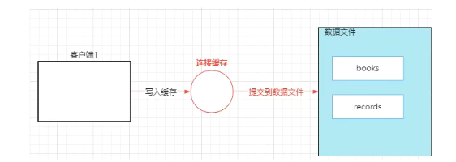
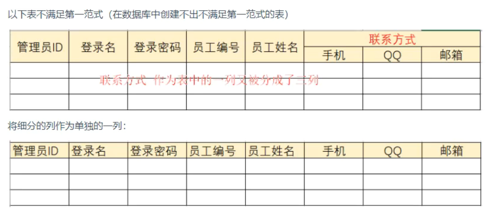
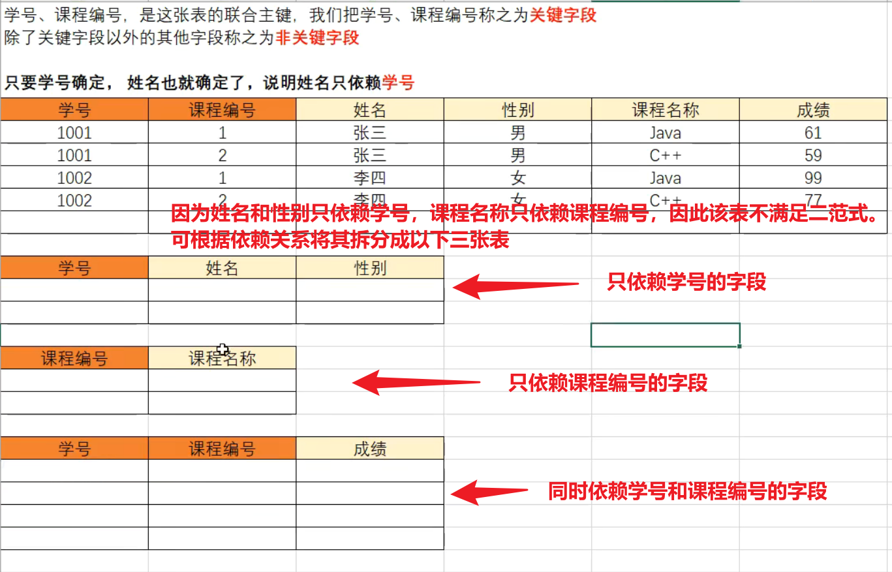
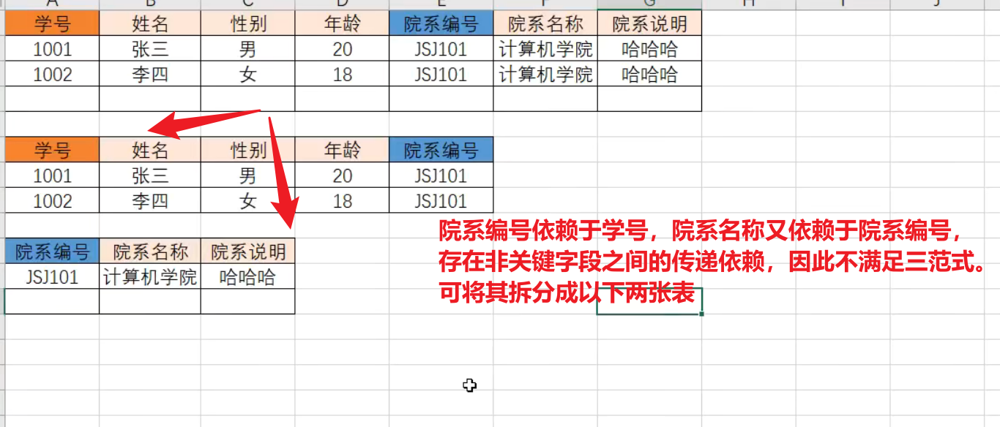
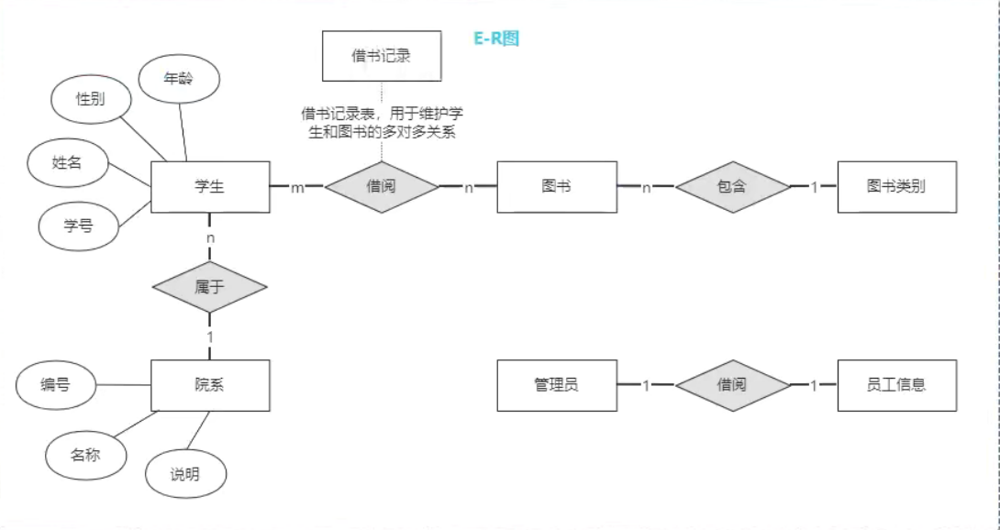
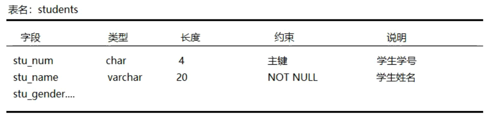
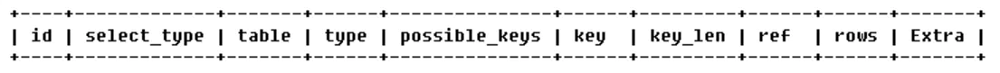

## 存储过程

作用：

* 将能够完成特定功能的SQL语句进行封装

优点：

* SQL语句无需通过网络传输，减小开销
* 防止SQL语句在网络传输中被恶意修改，提高安全性
* 存储过程编译保存在数据库中，每次执行只需修改参数，无需重新编译
* 存储过程中多个SQL语句中存在逻辑关系，支持逻辑流程控制，可以实现更为复杂的业务

缺点：

* 存储过程是根据不同的数据库进行编译，创建，当需要切换到其它数据库时需要重新编写存储过程
* 存储过程受限于数据库产品，较难进行高性能的优化
* 在互联网项目中如果需要数据库的高并发访问，使用存储过程会增加数据库的执行时间（因为将复杂的业务交给了数据库进行处理，而本来这应该是程序做的事情）

## 触发器

触发器就是一种特殊的存储过程。触发器无需调用，当对数据表中的数据执行DML操作时会自动触发这个SQL片段的执行而无需手动调用

* 在MySQL中只有执行insert、delete、update操作才能触发触发器的执行
* 比如执行insert时自动进行日志记录

```sql
create trigger tri_name
<before|after>          -- 定义触发时机,before或者after
<insert|delete|update>  -- 定义DML类型
on <table_name>
for each row            -- 声明为行级触发器
```

```sql
create trigger tri_test
before insert on students for each row
<sql_statement>;
```

```sql
show triggers;
drop trigger tri_test
```

使用`new`与`old`关键字在触发器中获取触发这个触发器的DML操作的数据

* `new`用于获取`insert`操作添加的数据或者`update`操作修改后的数据
* `old`用于获取`delete`操作删除前的数据或者`update`操作修改前的数据

优点：

* 触发器是自动执行的，当对触发器相关的表执行相应的DML操作时立即执行
* 触发器可以实现表中数据的级联操作，有利于保证数据的完整性
* 触发器可以对DML操作的数据进行更为复杂的合法性校验

缺点：

* 使用触发器实现的业务逻辑如果出现问题将难以定位，后期维护困难
* 大量使用触发器容易导致代码结构杂乱，增加了程序的复杂性
* 当触发器操作的数据量比较大时，执行效率会大大降低

> 在互联网项目里应避免使用触发器
>
> 对于并发量不大的项目可以选择使用存储过程，但是在互联网项目中不提倡使用存储过程（存储过程将实现业务的逻辑交给数据库处理，一则增加了数据库的负载，二则不利于数据库迁移）
>

## 视图

视图，就是由数据库中一张表或者多张表根据特定的条件查询出来的数据构造成的虚拟表

作用：

* 安全性：如果直接将数据表授权给用户操作，那么用户可以CRUD数据表中的所有数据，假如我们想要对数据表中的部分数据进行保护，可以将公开的数据生成视图，授权用户访问视图；用户可以通过查询视图可以获取数据表中公开的数据，从而达到将数据表中的部分数据对用户隐藏
* 简单性：如果我们需要查询的数据来源于多张数据表，可以使用多表连接查询来实现；我们通过视图将这些表连接的结果对用户开放，用户则可以通过直接查询视图获得多表数据，操作更便捷

```sql
create view view_name
as
select_statement   -- 根据查询语句的结果生成视图
```

```sql
-- 创建视图
create view view_test
as
select * from student where gender='men';
-- 查询视图
select * from view_test;
-- 查询视图结构
desc view_test;
-- 修改视图
-- 方式1
create or replace view view_test
as
select * from student where gender='women';
-- 方式2
alter view view_test
as
select * from student where gender='women';
-- 删除视图(并不会影响原表数据)
drop view view_test;
```

> **新增数据**：如果在视图中添加数据，数据会被添加到原数据表
>
> **删除数据**：如果在视图中删除数据，数据也将从原表中删除
>
> **修改数据**：如果在视图中修改数据，数据也会在原表中修改
>
> 如果视图的数据来源于多张表的连接，上述操作可能失败
>

*不建议对视图进行增删改*

## 索引

在互联网应用中，在数据库中存储的数据可能会很多，影响数据表中数据的查询速度。索引用于提高数据表中数据的查询效率。

> 将数据表中某一/几列的值取出来构造成便于查找的结构进行存储(通常是B树或者B+树)，生成数据表的目录。当进行数据查询的时候，则先在目录中查找得到对应的数据的地址，然后在数据表中根据地址快速的获取数据记录，避免全表扫描
>

### 索引的分类

在MySQL中根据创建索引的列的不同，可以分为：

* 主键索引：在数据表的主键字段创建的索引（被`primary key`修饰的列）。**创建数据表时将字段声明为主键会自动创建主键索引**
* 唯一索引：在数据表中的唯一列创建的索引（被`unique`修饰的列）。**创建数据表时将字段声明为唯一会自动创建唯一索引**
* 普通索引：在普通字段上创建的索引
* 组合索引：2个及以上字段联合起来创建的索引

### 索引操作

```sql
-- 查询数据表的索引
show indexes from <table_name>;
-- 创建唯一索引，要求列的值不能重复
create unique index index_name on table_name(col_name);
-- 创建普通索引
create index index_name on table_name(col_name);
-- 创建组合索引
create index index_name on table_name(col_name1, col_name2);
```

* 全文索引：MySQL5.6版本新增的索引，可以通过此索引进行全文检索操作。但由于MySQL的全文索引不支持中文，因此不被开发者关注，在应用开发中通常通过数据库中间件实现全文检索

  * ```sql
    create fulltext index <index_name> on <table_name>(<col_name>);
    ```

**索引创建完成后无需显式调用，会根据查询所使用的列自动使用索引**（如果是组合索引，则全部列都使用才会触发）

在命令行窗口中可以查看查询语句的查询规划：

```sql
explain select * from ...;
```

查看索引

```sql
-- 以下三种皆可
show create table <table_name>;
show indexes from <table_name>;
show keys from <table_name>;
```

删除索引

```sql
drop index <index_name> on <table_name>;
```

### 使用总结

优点：

* 索引大大降低了查询时扫描的数据量
* 索引可以避免服务器排序，将随机IO变成顺序IO

缺点：

* 索引是根据数据表列创建的，当数据表中数据发生DML操作时，索引也需要更新
* 索引文件会占用额外的磁盘空间，不要过多索引

数据表中数据不多时，全表扫描可能更快，不需要使用索引

数据量很大但是DML操作很频繁时（主要是用来做索引的列的更新频繁）不建议使用索引

不要在数据重复度高的列上创建索引

创建索引之后，要注意查询SQL语句的编写，避免索引失效

使用短索引，如果对长字符串建立索引，应该指定一个前缀长度

## 事务

完成特定的业务的多个数据库DML操作步骤称之为一个事务

### ACID特性

* **原子性**（A）：一个事务中的多个DML操作要么同时执行成功，要么同时执行失败
* **一致性**（C）：事务必须使数据库从一个一致性状态变换到另外一个一致性状态
* **隔离性**（I）：数据库允许多个事务同时执行，多个并行的事务之间不能相互影响
* **持久性**（D）：事务完成之后对数据的操作是永久的

### 事务管理

在MySQL中，默认的DML指令的执行是自动提交的，即当执行一个DML指令后自动提交到数据库中



开启事务（即关闭自动提交）

```sql
-- 开启事务
start transaction;  
insert ...
-- 事务回滚（撤销当前事务已经在连接缓存中的操作）
-- rollback; 
update ...
-- 事务提交（将连接缓存中的操作写入数据文件）
commit;
```

### 隔离机制

MySQL数据库事务隔离级别：设两个事务T1、T2

* **读未提交**：T2可以读取T1执行但未提交的数据，如果此时T1回滚了，则导致*脏读*
* **读已提交**：T2只能读取T1已经提交的数据，可以避免脏读，但是可能导致*不可重复读*（同一个事务中两次查询操作读取到的数据不一致）

  * > T2进行第一次查询之后在第二次查询之前，T1修改并提交了数据，T2两次读到的数据不一致
    >
* **可重复读**：T2执行第一次查询之后，在事务结束之前其它事务不能修改对应的数据，避免了不可重复读的问题，但可能导致*幻读*(T2对数据表中的数据进行修改然后查询，在查询之前T1向表中新增了数据，导致T2以为修改了所有的数据，但却查询出了与修改不一致的数据，即T1新增的数据)

  * > 不可重复读是读取了其他事务更改的数据，**针对update操作**
    >
    > 幻读是读取了其他事务新增的数据，**针对insert和delete操作**
    >
* **串行化**：同时只允许一个事务对数据表进行操作；避免了*脏读*、*不可重复读*、*幻读*问题

|隔离级别|脏读|不可重复读|幻读|
| ------------------| ------| ------------| ------|
|read uncommitted|*|*|*|
|read committed||*|*|
|repeatable read|||*|
|serializable||||

可以设置数据库默认的事务隔离级别来控制事务之间的隔离性，也可以通过客户端与数据库连接来设置（在应用程序中设置）

MySQL默认的隔离级别为`可重复读`

```sql
-- 查看隔离级别
select @@<table_name>;   -- 8.0.3之前
select @@transaction_isolation; -- 8.0.3之后

-- 设置默认隔离级别
set session transaction isolation level read committed;
```

## 数据库设计

* 根据应用系统功能，分析数据实体
* 提取实体的数据项
* 根据数据库三范式规范数据的数据项：如果实体的数据项不满足数据库三范式，可能会导致数据的冗余，从而引起数据维护困难，破坏数据的一致性等问题
* 绘制ER图（实体关系图，直观地展示实体与实体之间的关系）
* 数据库建模：三线图进行数据表设计、PowerDesigner等
* 建库建表：编写SQL指令
* 测试

**第一范式**：要求数据表中的字段不可再分（事实上在数据库中创建不出不满足第一范式的表）



**第二范式**：不存在非关键字段对关键字段的部分依赖



**第三范式**：不存在非关键字段之间的传递依赖



> 满足第三范式的关系一定满足第二范式，在消除的时候应该先除部分依赖，然后再消传递依赖
>

E-R图：实体关系图，用于直观的体现实体与实体之间的关联关系（一对一、一对多、多对多）



三线图：



* 每个实体创建一张数据表
* 多对多关联：需额外创建一个数据表维护关系（例如`学生`与`图书`之间的多对多关系用`借书记录`表示）
* 一对多、多对多关联：在多的一端添加外键与一的一端的主键建立外键约束
* 一对一关联：在任意一端创建外键与另一端的主键建立外键关联，并将外键设置为`unique`

# 面经

## MySQL索引使用有哪些注意事项

索引有些情况下会失效

* 查询条件包含`or`时
* 存在隐式类型转换，例如age字段是int，我们where age = "1"，就会触发隐式类型转换
* like通配符会导致索引失效。注意："ABC%“会走range索引，”%ABC"索引才会失效
* 联合索引，查询时的条件列不是联合索引中的第一个列，索引失效
* 对索引字段进行函数运算
* mysql估计使用全表扫描要比使用索引快,则不使用索引

索引不适用于以下场景

* 数据量少的不适合加索引
* 更新比较频繁的也不适合加索引
* 离散性低的字段不适合加索引（如性别）

## MySQL执行计划

`explain`命令查看

```sql
mysql> explain select * from sensor_location where project_id=19;
+----+-------------+-----------------+------------+------+--------------------+--------------------+---------+-------+------+----------+-------+
| id | select_type | table           | partitions | type | possible_keys      | key                | key_len | ref   | rows | filtered | Extra |
+----+-------------+-----------------+------------+------+--------------------+--------------------+---------+-------+------+----------+-------+
|  1 | SIMPLE      | sensor_location | NULL       | ref  | FK39BE0E9A63DEF65F | FK39BE0E9A63DEF65F | 5       | const |   60 |   100.00 | NULL  |
+----+-------------+-----------------+------------+------+--------------------+--------------------+---------+-------+------+----------+-------+
```



* id：序号
* select_type：查询中每个select字句的类型

  * SIMPLE：表示此查询不含UNION查询或子查询
  * PRIMARY：表示此查询是最外层的查询
  * SUBQUERY：子查询中的第一个SELECT
  * 。。。
* table：输出的行所引用的表
* **type**：联合查询所使用的类型，表示MySQL在表中找到所需行的方式，又称“访问类型”。type显示的是访问类型，是较为重要的一个指标，结果值从好到坏依次是：

  * `system`(表中只有一行记录) > `const`(通过索引一次命中) > `eq_ref`(唯一性索引扫描) > `ref`(非唯一性索引扫描) > `fulltext` > `ref_or_null` > `index_merge` （表示使用了合并索引）> `unique_subquery` > `index_subquery` > `range`(只检索给定范围的行) > `index`(只遍历索引树) > `ALL`(全表扫描) ，一般来说，得保证查询至少达到range级别，最好能达到ref。
* possible_keys：指出MySQL能使用哪个索引在该表中找到行
* **key**：显示MySQL实际决定使用的键。如果没有索引被选择，键是NULL
* key_len：显示MySQL决定使用的键长度。表示索引中使用的字节数，可通过该列计算查询中使用的索引的长度。如果键是NULL，长度就是NULL。
* ref：命中的索引的字段名
* rows：这个数表示mysql要遍历多少数据才能找到，表示MySQL根据表统计信息及索引选用情况，估算的找到所需的记录所需要读取的行数，在innodb上可能是不准确的
* **extra**：额外信息，如`using index`(表示使用了覆盖索引，性能不错)、`useing where`(sql使用了where过滤，效率较高)、`using temporary`(查询有使用临时表，一般用于排序、分组和多表join的情况，查询效率不高，建议优化)

## 排查MySQL死锁的步骤

* 查看死锁日志show engine innodb status;
* **找出死锁Sql**
* 分析sql加锁情况
* 模拟死锁案发
* **分析死锁日志**
* 分析死锁结果

## 如何优化SQL

* 加索引
* 避免返回不必要的数据
* 适当分批量进行（分页）
* 优化sql结构
* 主从架构，提升读性能
* 分库分表

show status 命令了解各种 sql 的执行频率

通过慢查询日志定位那些执行效率较低的 sql 语句

explain 分析低效 sql 的执行计划

## 分库分表设计

* 水平分库：以字段为依据，按照一定策略（hash、range等），将一个库中的数据拆分到多个库中。
* 水平分表：以字段为依据，按照一定策略（hash、range等），将一个表中的数据拆分到多个表中。
* 垂直分库：以表为依据，按照业务归属不同，将不同的表拆分到不同的库中。
* 垂直分表：以字段为依据，按照字段的活跃性，将表中字段拆到不同的表（主表和扩展表）中。

> 垂直分表也就是把“大表拆成小表”，基于列字段进行的。拆分的原则一般是表中的字段较多，将不常用的或者是数据较大，长度较长的拆分到扩展表里，如text类类型字段。把访问频次低、字段大的商品描述信息单独的放在一张表里，访问频次较为多的商品基本信息单独的放在一张表里。
>
> 垂直拆分的原则：把不常用的字段单独的放在一张表里，把大字段拆分出来放在附表中，把业务经常组合查询的列放在一张表中。
>
> 水平分表都是大表拆小表，垂直分表是按表结构进行拆分，水平分表是按数据结构进行拆分。把一个表的数据分到一个数据库的多张表里，每个表只有这个表的部分数据，其核心就是把一个大表分割成多个小表，每一个的结构是一样的，数据不一样，全部表的数据合起来就是全部的数据，针对数据量巨大的单张表(比如订单表)照某种规则(RANGE,HASH取模等)，切分到多张表里面去。
>

可能遇到的问题

* 事务问题：需要用分布式事务啦
* 跨节点Join的问题：解决这一问题可以分两次查询实现
* 跨节点的count,order by,group by以及聚合函数问题：分别在各个节点上得到结果后在应用程序端进行合并。
* 数据迁移，容量规划，扩容等问题
* ID问题：数据库被切分后，不能再依赖数据库自身的主键生成机制啦，最简单可以考虑UUID
* 跨分片的排序分页问题（后台加大pagesize处理？）<br />

## InnoDB与MyISAM的区别

* InnoDB**支持事务**，MyISAM不支持事务
* InnoDB**支持外键**，MyISAM不支持外键
* InnoDB **支持 MVCC**(多版本并发控制)，MyISAM 不支持
* select count(*) from table时，MyISAM更快，因为它有一个变量保存了整个表的总行数，可以直接读取，InnoDB就需要全表扫描。
* Innodb不支持全文索引，而MyISAM支持全文索引（5.7以后的InnoDB也支持全文索引）
* InnoDB**支持表、行级锁**，而MyISAM支持表级锁。
* InnoDB表**必须有主键**，而MyISAM可以没有主键
* Innodb表需要更多的内存和存储，而MyISAM可被压缩，存储空间较小，。
* Innodb按主键大小有序插入，MyISAM记录插入顺序是，按记录插入顺序保存。
* InnoDB 存储引擎提供了具有提交、回滚、崩溃恢复能力的事务安全，与 MyISAM 比 InnoDB 写的效率差一些，并且会占用更多的磁盘空间以保留数据和索引
* InnoDB 属于索引组织表，使用共享表空间和多表空间储存数据。MyISAM用.frm、.MYD、.MTI来储存表定义，数据和索引。

## 数据库索引的原理，为什么要用 B+树，为什么不用二叉树

[数据库索引为什么用B+数实现](https://zhuanlan.zhihu.com/p/57359459)

可以从几个维度去看这个问题，查询是否够快，效率是否稳定，存储数据多少，以及查找磁盘次数，为什么不是二叉树，为什么不是平衡二叉树，为什么不是B树，而偏偏是B+树呢？

为什么不是一般二叉树？

* 当数据量大时，树的高度会比较高（树的高度决定着它的IO操作次数，IO操作耗时大），查询会比较慢。
* 每个磁盘块（节点/页）保存的数据太小（IO本来是耗时操作，每次IO只能读取到一个关键字，显然不合适），没有很好的利用操作磁盘IO的数据交换特性，也没有利用好磁盘IO的预读能力（空间局部性原理），从而带来频繁的IO操作。

为什么不是平衡二叉树呢？

* 我们知道，在内存比在磁盘的数据，查询效率快得多。如果树这种数据结构作为索引，那我们每查找一次数据就需要从磁盘中读取一个节点，也就是我们说的一个磁盘块，但是平衡二叉树可是每个节点只存储一个键值和数据的，如果是B树，可以存储更多的节点数据，树的高度也会降低，因此读取磁盘的次数就降下来啦，查询效率就快啦。

> 简洁版：B树或B+树每个节点可以存储更多的信息，使整个树结构更“扁平”，从根节点到叶子节点只要 3-4次IO即可（一般B+树索引深度也就是3、4层），如果用二叉树则这颗树会非常深
>

那为什么不是B树而是B+树呢？

* b+树的中间节点不保存数据，所以磁盘页能容纳更多节点元素，更“矮胖”；
* b+树查询必须查找到叶子节点，b树只要匹配到即可不用管元素位置，因此b+树查找更稳定（并不慢）；
* 对于*范围查找*来说，b+树只需遍历叶子节点链表即可，b树却需要重复地中序遍历

> B+树的特点
>
> 1. 所有的叶子结点中包含了全部关键字的信息，及指向含这些关键字记录的指针，且叶子结点本身依关键字的大小自小而大顺序链接。
> 2. 所有的非叶子结点可以看成是索引部分，结点中仅含其子树中的最大（或最小）关键字。
> 3. 通常在b+树上有两个头指针，一个指向根结点，一个指向关键字最小的叶子结点。
> 4. 同一个数字会在不同节点中重复出现，根节点的最大元素就是b+树的最大元素。
>

## 聚簇索引与非聚簇索引的区别

都采用了B+树来存储

* 聚簇索引：将数据存储和索引放在一起、并且是按照一定的顺序组织的，找到索引也就找到了数据，数据的物理存放顺序与索引顺序是一致的，即：只要索引是相邻的，那么对应的数据一定也是相邻的存放在磁盘上的。
* 非聚簇索引：叶子节点不存储数据，存储的是数据行地址，也就是说根据索引查找到数据行的位置再去磁盘查找数据，这就有点类似一本书的目录，比如要找到第三章第一节，那就现在目录里面查找，找到对应的页码后再去对应的页码看文章。

区别：

* 一个表中只能拥有一个聚集索引，而非聚集索引一个表可以存在多个。
* 聚集索引，索引中键值的逻辑顺序决定了表中相应行的物理顺序；非聚集索引，索引中索引的逻辑顺序与磁盘上行的物理存储顺序不同。
* 索引是通过B+树的数据结构来描述的，我们可以这么理解聚簇索引：索引的叶节点就是数据节点。而非聚簇索引的叶节点仍然是索引节点，只不过有一个指针指向对应的数据块。
* 聚集索引：物理存储按照索引排序；非聚集索引：物理存储不按照索引排序；
* 查找通过聚簇索引可以直接获取到数据，相比非聚簇索引需要第二次查询(覆盖索引除外)效率要高
* 聚簇索引对范围查询的效率很高，因为其数据是按照大小排列的
* 聚簇索引适合用在排序场合，非聚簇索引不适合；频繁更新的列不应使用聚簇索引

InnoDB中一定有主键，主键一定是聚簇索引

MyISM使用的是非聚簇索引，没有聚簇索引<br />

## limit1000000加载很慢的话如何解决

如果id是连续的话可以返回上次查询的最大记录（偏移量），再往下limit

在业务允许的情况下限制页数

## 如何选择合适的分布式主键方案

雪花算法：生成的ID是一个**64 bit**的`long`型的数字且按 **时间趋势递增** 。大致由首位无效符、时间戳差值、机器编码，序列号四部分组成。

* 首位无效符：第一个 bit 作为符号位，因为我们生成的都是正数，所以第一个 bit 统一都是 0。
* 时间戳：占用 41 bit ，精确到毫秒。41位最好可以表示2^41-1毫秒，转化成单位年为 69 年。
* 机器编码：占用10bit，其中高位 5 bit 是数据中心 ID，低位 5 bit 是工作节点 ID，最多可以容纳 1024 个节点。
* 序列号：占用12bit，每个节点每毫秒0开始不断累加，最多可以累加到4095，一共可以产生 4096 个ID。

## 事务的隔离级别有哪些？MySQL的默认隔离级别是什么？

隔离性是指，多个用户的并发事务访问同一个数据库时，一个用户的事务不应该被其他用户的事务干扰，多个并发事务之间要相互隔离。

InnoDB实现了四种不同事务的隔离级别：

* 读未提交(Read Uncommitted)
* 读提交(Read Committed, RC)
* 可重复读(Repeated Read, RR)
* 串行化(Serializable)

InnoDB默认的隔离级别是`可重复读`

## 在高并发情况下，如何做到安全的修改同一行数据

要安全的修改同一行数据，就要保证一个线程在修改时其它线程无法更新这行记录。一般有悲观锁和乐观锁两种方案

悲观锁思想就是，当前线程要进来修改数据时，别的线程都得拒之门外~ 比如，可以使用select…for update

```sql
select * from user where name='jay' for update
```

以上这条sql语句会锁定了User表中所有符合检索条件（name=‘jay’）的记录。本次事务提交之前，别的线程都无法修改这些记录。

乐观锁思想就是，有线程过来，先放过去修改，如果看到别的线程没修改过，就可以修改成功，如果别的线程修改过，就修改失败或者重试。实现方式：乐观锁一般会使用版本号机制或CAS算法实现

> **乐观锁** ：乐观锁在操作数据时非常乐观，认为别人不会同时修改数据。因此乐观锁不会上锁，只是在执行更新的时候判断一下在此期间别人是否修改了数据：如果别人修改了数据则放弃操作，否则执行操作。
>
> **悲观锁** ：悲观锁在操作数据时比较悲观，认为别人会同时修改数据。因此操作数据时直接把数据锁住，直到操作完成后才会释放锁；上锁期间其他人不能修改数据。
>

> CAS算法基本思想：先备份旧数据，然后基于旧数据构造新数据，更新的时候只有当原内存地址的数据等于备份的旧数据时才进行更新。（使用原语实现）
>

## select for update有什么含义，会锁表还是锁行还是其他

select查询语句是不会加锁的，但是select for update除了有查询的作用外，还会加锁呢，而且它是悲观锁哦。至于加了是行锁还是表锁，这就要看是不是用了索引/主键啦。 没用索引/主键的话就是表锁，否则就是是行锁。

## MySQL事务的四大特性以及实现原理

* 原子性： 事务作为一个整体被执行，包含在其中的对数据库的操作要么全部被执行，要么都不执行。是使用 `undo log`来实现的，如果事务执行过程中出错或者用户执行了rollback，系统通过`undo log`日志返回事务开始的状态。
* 一致性： 指在事务开始之前和事务结束以后，数据不会被破坏，假如A账户给B账户转10块钱，不管成功与否，A和B的总金额是不变的。由其它三大特性保证。
* 隔离性： 多个事务并发访问时，事务之间是相互隔离的，即一个事务不影响其它事务运行效果。简言之，就是事务之间是进水不犯河水的。通过**锁以及MVCC**，使事务相互隔离开。
* 持久性： 表示事务完成以后，该事务对数据库所作的操作更改，将持久地保存在数据库之中。使用 `redo log`来实现，只要`redo log`日志持久化了，当系统崩溃，即可通过`redo log`把数据恢复。

> Redo log:
>
> 重做日志(redo log)用来保证事务的持久性，即事务ACID中的D。
>
> 实际上它可以分为以下两种类型：
>
> * 物理Redo日志
> * 逻辑Redo日志
>
> 在InnoDB存储引擎中， **大部分情况下 Redo是物理日志，记录的是数据页的物理变化** 。而逻辑Redo日志，不是记录页面的实际修改，而是记录修改页面的一类操作，比如新建数据页时，需要记录逻辑日志。关于逻辑Redo日志涉及更加底层的内容，这里我们只需要记住绝大数情况下，Redo是物理日志即可，DML对页的修改操作，均需要记录Redo。
>
> 什么时候写Redo?
>
> * 在数据页修改完成之后，在脏页刷出磁盘之前，写入redo日志。注意的是先修改数据，后写日志
> * **redo日志比数据页先写回磁盘**
> * 聚集索引、二级索引、undo页面的修改，均需要记录Redo日志
>

> Undo Log：
>
> undo log主要记录的是数据的逻辑变化，为了在发生错误时回滚之前的操作，需要将之前的操作都记录下来，然后在发生错误时才可以回滚。
>
> undo是一种逻辑日志，有两个作用：
>
> * 用于事务的回滚
> * MVCC
>
> undo日志，只将数据库逻辑地恢复到原来的样子，在回滚的时候，它实际上是做的相反的工作，比如一条INSERT ，对应一条 DELETE，对于每个UPDATE,对应一条相反的 UPDATE,将修改前的行放回去。undo日志用于事务的回滚操作进而保障了事务的原子性。
>
> undo log的写入时机
>
> * DML操作修改聚簇索引前，记录undo日志
> * 二级索引记录的修改，不记录undo日志
>
> 需要注意的是，undo页面的修改，同样需要记录redo日志。
>
> undo log 是否是redo log的逆过程？其实从前文就可以得出答案了，undo log是逻辑日志，对事务回滚时，只是将数据库逻辑地恢复到原来的样子，而redo log是物理日志，记录的是数据页的物理变化，显然undo log不是redo log的逆过程。
>

## 如果某个表有近千万数据，CRUD比较慢，如何优化

分库分表、索引优化（检查是否使用了索引，是否是最优索引）

## 如何写SQL可以有效的使用到复合索引

> 在单个列上创建的索引我们称为单列索引，在2个以上的列上创建的索引称为复合索引。在单个列上创建索引相对简单，通常只需要考虑列的选择率即可，选择性越好，代表数据越分散，创建出来的索引性能也就更好
>
> 创建复合索引最重要的是列顺序的选择，这关系到索引能否使用上，或者影响多少个谓词条件能使用上索引。复合索引的使用遵循最左匹配原则，只有索引左边的列匹配到，后面的列才能继续匹配
>

当我们创建一个组合索引的时候，如(k1,k2,k3)，相当于创建了（k1）、(k1,k2)和(k1,k2,k3)三个索引，这就是最左匹配原则。

```sql
select * from table_1 where k1=a and k2=b and k3=c
```

有关于复合索引，我们需要关注查询Sql条件的顺序，确保最左匹配原则有效，同时可以删除不必要的冗余索引。

## MySQL中in与exists的区别

exists对外表用loop逐条查询，每次查询都会查看exists的条件语句，当exists里的条件语句能够返回记录行时（无论记录行是的多少，只要能返回），条件就为真，返回当前loop到的这条记录；反之，如果exists里的条件语句不能返回记录行，则当前loop到的这条记录被丢弃，exists的条件就像一个bool条件，当能返回结果集则为true，不能返回结果集则为false

```sql
select * from A where exists (select 1 from B where A.id = B.id)
```

in查询就是先将子查询条件的记录全都查出来，假设结果集为B，共有m条记录，然后再将子查询条件的结果集分解成m个，再进行m次查询。**in查询的子条件返回结果必须只有一个字段**

```sql
select * from A where id in (select id from B)
```

简单来说in与exists的区别就是内外循环的顺序不同

mysql优化原则，就是小表驱动大表，小的数据集驱动大的数据集，从而让性能更优。 因此，我们要选择最外层循环小的，也就是，如果B的数据量小于A，适合使用in，如果B的数据量大于A，即适合选择exists，这就是in和exists的区别。

## 数据库自增主键可能遇到什么问题

使用自增主键对数据库做分库分表，可能出现诸如主键重复等的问题

## MySQL的MVCC（多版本并发控制）

**MVCC最大的优势：读不加锁，写才加锁，读写不冲突。在读多写少的OLTP应用中，读写不冲突是非常重要的，极大的增加了系统的并发性能**

MVCC用于实现**可重复读**这个事务隔离级别

innodb存储引擎，会在每行数据的最后加两个隐藏列，一个保存行的创建时间，一个保存行的删除时间，但是这儿存放的不是时间，而是**事务id**，事务id是mysql自己维护的**自增**的，全局唯一

Innodb存储引擎，对于同一个ID，不同的事务创建或修改，每个事务都有自己的快照 （会插入一条记录）

在一个事务内查询的时候，**mysql只会查询创建事务id <= 当前事务id的行，这样可以确保这个行是在当前事务中创建，或者是之前创建的；同时一个行的删除事务id要么没有定义（就是没删除），要么是比当前事务id大（在事务开启之后才被删除）**；满足这两个条件的数据都会被查出来

那么如果某个事务执行期间，别的事务更新了一条数据呢？这个很关键的一个实现，其实就是在innodb中，是 **插入了一行记录** ，然后将新插入的记录的创建时间设置为新的事务的id，同时将这条记录之前的那个版本的删除时间设置为新的事务的id。

这样的话，你的这个事务其实对某行记录的查询，始终都是查找的之前的那个快照，因为之前的那个快照的创建时间小于等于自己事务id，然后删除时间的事务id比自己事务id大，所以这个事务运行期间，会一直读取到这条数据的同一个版本

## 数据库中间件

Mycat、shard-jdbc等，Mycat 是基于 Proxy，它复写了 MySQL 协议，将 Mycat Server 伪装成一个 MySQL 数据库

## 数据库主从延迟怎么解决

常见的数据库集群架构是一主多从，主从同步，读写分离。其中一个主库提供写服务，多个从库提供读服务，并且可以通过增加从库提升读性能。定时在主从之间同步数据。因为是定时的，所以会导致主从同步有延时

解决方案：

* **忽略**：有些业务本身允许一定的延时，如百度搜索、qq消息等
* **强制读主**：使用一个高可用主库提供数据库服务，读和写都落到主库上，采用缓存来提升系统读性能，这是常见的微服务架构
* **选择性读主**：可以利用一个缓存记录必须读主的数据，**当有写请求时，将哪个库，哪个表，哪个主键三个信息拼装一个key设置到cache里，这条记录的超时时间，设置为“主从同步时延”，当读请求发生时，也把哪个库，哪个表，哪个主键的数据呢，也将这三个信息拼装一个key，到cache里去查询**。。。

## 什么是数据库连接池，为什么要使用数据库连接池

数据库连接池原理：在内部对象池中，维护一定数量的数据库连接，并对外暴露数据库连接的获取和返回方法。

应用程序和数据库建立连接的过程

* 通过TCP协议的三次握手和数据库服务器建立连接
* 发送数据库用户账号密码，等待数据库验证用户身份
* 完成身份验证后，系统可以提交SQL语句到数据库执行
* 把连接关闭，TCP四次挥手告别。

数据库连接池好处

* 资源重用 (连接复用)
* 更快的系统响应速度
* 新的资源分配手段 统一的连接管理，避免数据库连接泄漏

## 一条SQL语句在MySQL中是如何执行的

* 连接器：第一步，先连接到数据库上，当客户端（应用）连接到MySQL服务器时，服务器需要对其进行认证，认证基于用户名、原始主机信息和密码，一旦客户端连接成功，服务器会继续验证客户端是否具有执行某个特定查询的权限
* 查询缓存：每次MySQL执行过的语句及其结果会以key-value形式缓存在内存中，key是查询语句，value是查询结果。如果查询能够在缓存中找到key，那么这个value就会被直接返回客户端
* 分析器：如果没有命中缓存，就会执行SQL语句，首先让MySQL知道我们需要做什么，因此需要对SQL语句解析，包括语法分析、语义分析以及代码生成。最后生成**执行计划**
* 优化器：经过分析器MySQL知道我们需要什么了，在开始执行前，还要经过优化器进行处理，优化器是在表里面有多个索引时，决定使用哪个索引，或者在一个语句有多表关联（join）时，决定各个表的连接顺序
* 执行器：MySQL通过分析器知道要做什么，通过优化器知道怎么做，开始执行前，要先判断一下是否有表TABLE查询权限，如果有则打开表，根据表的引擎定义，去使用这个引擎提供的接口。根据执行计划，调用存储引擎API来查询数据

## 数据库存储日期格式时，如何考虑时区转换问题

* datetime适合记录创建时间、修改时间等不涉及时间加减转换的场景
* timestamp类型适合用来记录需要进行时间运算的场景

> datatime与timestamp
>
> 相同点
>
> 1. 两个数据类型存储时间的格式一致。均为 `YYYY-MM-DD HH:MM:SS`
> 2. 两个数据类型都包含「日期」和「时间」部分。
> 3. 两个数据类型都可以存储微秒的小数秒（秒后6位小数秒）
>
> 区别
>
> 表示范围
>
> * `DATETIME`：`1000-01-01 00:00:00.000000` 到 `9999-12-31 23:59:59.999999`
> * `TIMESTAMP`：`'1970-01-01 00:00:01.000000' UTC` 到 `'2038-01-09 03:14:07.999999' UTC`
>
> 空间占用
>
> * `TIMESTAMP` ：占 4 个字节（小数秒+3 个字节）
> * `DATETIME`：在 MySQL 5.6.4 之前，占 8 个字节 ，之后版本，占 5 个字节。（小数秒+3 个字节）
>
> 是否会转换
>
> * `TIMESTAMP`：TIMESTAMP 的值是从「当前时间」转换成 UTC 时间，或者反过来转换。
> * `DATETIME`：不会做任何转换，也不会检测时区，你给什么数据，它存什么数据。
>

## 一条SQL执行的时间过长，如何优化

* 查看是否涉及多表和子查询，优化Sql结构，如去除冗余字段，是否可拆表等
* 优化索引结构，看是否可以适当添加索引
* 数量大的表，可以考虑进行分离/分表（如交易流水表）
* 数据库主从分离，读写分离
* explain分析sql语句，查看执行计划，优化sql
* 查看mysql执行日志，分析是否有其他方面的问题

## blob与text有什么区别

* Blob用于存储二进制数据，而Text用于存储大字符串。
* Blob值被视为二进制字符串（字节字符串）,它们没有字符集，并且排序和比较基于列值中的字节的数值。
* text值被视为非二进制字符串（字符字符串）。它们有一个字符集，并根据字符集的排序规则对值进行排序和比较。

## MySQL里记录货币用什么字段类型比较好

* 货币在数据库中MySQL常用Decimal和Numeric类型表示，这两种类型被MySQL实现为同样的类型。他们被用于保存与金钱有关的数据。

  * > decimal长度不确定，是以字符串的形式保存数值，最多可以存储38个数字，Numeric默认8个字节
    >
* salary DECIMAL(9,2)，9(precision)代表将被用于存储值的总的小数位数，而2(scale)代表将被用于存储小数点后的位数。存储在salary列中的值的范围是从-9999999.99到9999999.99。
* DECIMAL和NUMERIC值作为字符串存储，而不是作为二进制浮点数，以便保存那些值的小数精度。

> float:浮点型，含字节数为4，32bit，数值范围为-3.4E38~3.4E38（7个有效位）
>
> double:双精度实型，含字节数为8，64bit数值范围-1.7E308~1.7E308（15个有效位）
>
> decimal:数字型，128bit，不存在精度损失，常用于银行帐目计算。（28个有效位）<br />
>

## MySQL有哪几种锁

按锁的粒度分：

* 行锁：锁某行数据，锁粒度最小，并发度高（**InnoDB默认是行锁**）
* 表锁：锁整张表，锁粒度最大，并发度低
* 间隙锁：用于封锁索引记录中的间隔（一段数据）

还可以分为：

* 共享锁：共享锁之间不互斥，读读可以并行；

  * ```sql
    SELECT * FROM table_name WHERE ... LOCK IN SHARE MODE
    ```
* 排他锁：排他锁与任何锁互斥，写读，写写不可以并行

  * ```sql
    SELECT * FROM table_name WHERE ... FOR UPDATE
    ```

还可以分为：

* 乐观锁：顾名思义，就是对数据的处理持乐观态度，乐观的认为数据一般情况下不会发生冲突，只有提交数据更新时，才会对数据是否冲突进行检测。**乐观锁的实现不依靠数据库提供的锁机制，需要我们自已实现，实现方式一般是记录数据版本，一种是通过版本号，一种是通过时间戳。当我们提交数据更新时，判断当前的版本号与第一次读取出来的版本号是否相等。如果相等，则予以更新，否则认为数据过期，拒绝更新，让用户重新操作。**
* 悲观锁：顾名思义，就是对于数据的处理持悲观态度，总认为会发生并发冲突，获取和修改数据时，别人会修改数据。所以在整个数据处理过程中，需要将数据锁定。**悲观锁的实现，通常依靠数据库提供的锁机制实现，比如mysql的排他锁**。

此外还有：

* 意向锁：意向锁是指，未来的某个时刻，事务可能要加共享/排它锁了，先提前声明一个意向
* 记录锁：用于封锁索引记录。select * from t where id=1 for update; 它会在id=1的索引记录上加锁，以阻止其他事务插入，更新，删除id=1的这一行
* 临键锁：是记录锁与间隙锁的组合，它的封锁范围，既包含索引记录，又包含索引区间

## Hash索引与B+树的区别是什么

* B+树可以进行范围查询，Hash索引不能。
* B+树支持联合索引的最左侧原则，Hash索引不支持（即联合索引的部分索引无法使用）。
* B+树支持order by排序，Hash索引不支持。
* Hash索引在等值查询上比B+树效率更高。
* B+树使用like 进行模糊查询的时候，like后面（比如%开头）的话可以起到优化的作用，Hash索引根本无法进行模糊查询<br />

## mysql 的内连接、左连接、右连接有什么区别

* Inner join 内连接，在两张表进行连接查询时，只保留两张表中完全匹配的结果集
* left join 在两张表进行连接查询时，会返回左表所有的行，即使在右表中没有匹配的记录。
* right join 在两张表进行连接查询时，会返回右表所有的行，即使在左表中没有匹配的记录。

## 什么是内连接、外连接、交叉连接、笛卡尔积呢

* 内连接（inner join）：取得两张表中满足存在连接匹配关系的记录。
* 外连接（outer join）：取得两张表中满足存在连接匹配关系的记录，以及某张表（或两张表）中不满足匹配关系的记录。
* 交叉连接（cross join）：显示两张表所有记录一一对应，没有匹配关系进行筛选，也被称为：笛卡尔积。

## 百万级别或以上的数据，你是如何删除的

* 我们想要删除百万数据的时候可以先删除索引
* 然后批量删除其中无用数据
* 删除完成后重新创建索引。

## 什么是死锁？怎么解决？

死锁是指两个或多个事务在同一资源上相互占用，并请求锁定对方的资源，从而导致恶性循环的现象

死锁有四个必要条件：互斥条件，请求和保持条件，环路等待条件，不剥夺条件。 解决死锁思路，一般就是切断环路，尽量避免并发形成环路。

* 如果不同程序会并发存取多个表，尽量约定以相同的顺序访问表，可以大大降低死锁机会。
* 在同一个事务中，尽可能做到一次锁定所需要的所有资源，减少死锁产生概率；
* 对于非常容易产生死锁的业务部分，可以尝试使用升级锁定颗粒度，通过表级锁定来减少死锁产生的概率；
* 如果业务处理不好可以用分布式事务锁或者使用乐观锁
* 死锁与索引密不可分，解决索引问题，需要合理优化你的索引，

## 索引覆盖是什么？

索引覆盖就是一个SQL在执行时，需要查找的字段只用从索引中就能够获得，不必读取数据行。

如何查看SQL有没有使用索引覆盖？

* 使用explain查询SQL的执行计划，如果使用了索引覆盖，在extra字段会输出using index

如何实现索引覆盖？

* 最常见的方法就是：将被查询的字段，建立到联合索引（如果只有一个字段，普通索引也可以）里去。
