## 计算机网络体系结构

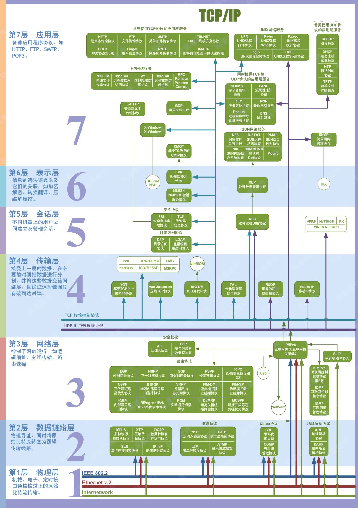

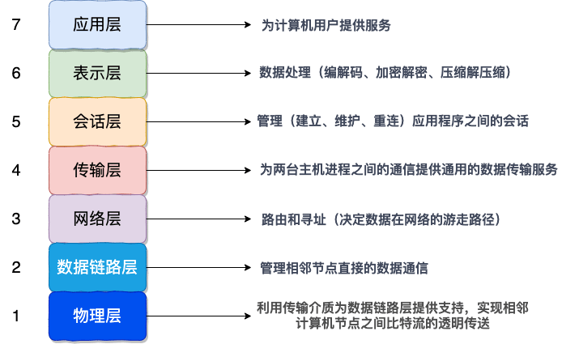

1. **传输层的主要任务就是负责向两台终端设备进程之间的通信提供通用的数据传输服务**。
2. **网络层负责为分组交换网上的不同主机提供通信服务**，**选择合适的路由，使源主机运输层所传下来的分株，能通过网络层中的路由器找到目的主机。**
3. **数据链路层的作用是将网络层交下来的 IP 数据报组装成帧，在两个相邻节点间的链路上传送帧。**
4. **物理层的作用是实现相邻计算机节点之间比特流的透明传送，尽可能屏蔽掉具体传输介质和物理设备的差异**。

## 网络为什么要分层

1. **各层之间相互独立** ：各层之间相互独立，各层之间不需要关心其他层是如何实现的，只需要知道自己如何调用下层提供好的功能就可以了（可以简单理解为接口调用）**。这个和我们对开发时系统进行分层是一个道理。**
2. **提高了整体灵活性** ：每一层都可以使用最适合的技术来实现，你只需要保证你提供的功能以及暴露的接口的规则没有改变就行了。**这个和我们平时开发系统的时候要求的高内聚、低耦合的原则也是可以对应上的。**
3. **大问题化小** ： 分层可以将复杂的网络间题分解为许多比较小的、界线比较清晰简单的小问题来处理和解决。这样使得复杂的计算机网络系统变得易于设计，实现和标准化。 **这个和我们平时开发的时候，一般会将系统功能分解，然后将复杂的问题分解为容易理解的更小的问题是相对应的，这些较小的问题具有更好的边界（目标和接口）定义。**

## IP数据报的格式

分为首部和数据部分

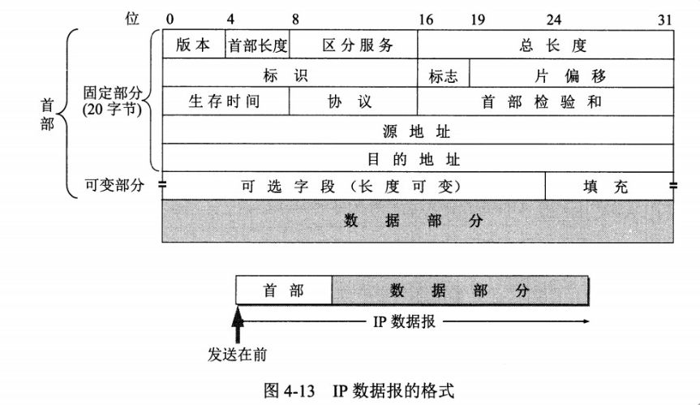

* **版本** : 有 4（IPv4）和 6（IPv6）两个值；
* **首部长度** : 占 4 位，因此最大值为 15。值为 1 表示的是 1 个 32 位字的长度，也就是 4 字节。因为**首部固定长度为 20 字节**，因此该值最小为 5。如果可选字段的长度不是 4 字节的整数倍，就用尾部的填充部分来填充。
* **区分服务** : 用来获得更好的服务，一般情况下不使用。
* **总长度** : 包括首部长度和数据部分长度。
* **生存时间** ：TTL，它的存在是为了防止无法交付的数据报在互联网中不断兜圈子。以路由器跳数为单位，当 TTL 为 0 时就丢弃数据报。
* **协议** ：指出携带的数据应该上交给哪个协议进行处理，例如 ICMP、TCP、UDP 等。
* **首部检验和** ：因为数据报每经过一个路由器，都要重新计算检验和，因此检验和不包含数据部分可以减少计算的工作量。
* **标识** : 在数据报长度过长从而发生分片的情况下，相同数据报的不同分片具有相同的标识符。
* **片偏移** : 和标识符一起，用于发生分片的情况。片偏移的单位为 8 字节

> 理论上IP数据报最大长度为$2^{16}-1=65535$字节，其中数据部分最大长度为$65535-20=65515$字节，即减去$20$字节的首部。但是很少有底层的物理层网络能够封装如此大的数据包，因此将IP数据报分片传输，目的主机将分片重组还原为一个数据报。
>
> * 以太网的最大传输单元$MTU$为$1500$字节。
> * 当数据报分片时，每个分片都会得到一个首部。分片首部的大部分内容和原数据相同，如IP地址、版本号、协议和标识等等。所不同的主要就是标志、总长度和分片偏移字段。分片可以带也可以不带原数据报的选项。
>

## IP地址的分类

由两部分组成，网络号和主机号，其中不同分类具有不同的网络号长度，并且是固定的。

IP 地址 ::= {< 网络号 >, < 主机号 >}

IP地址分为五大类：A类、B类、C类、D类和E类

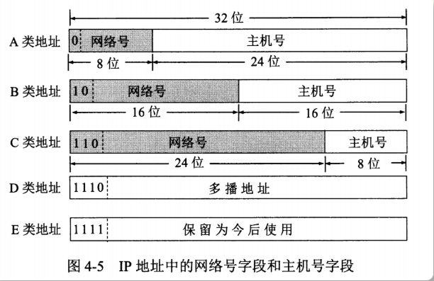

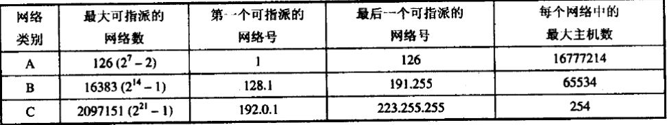

## NAT协议

NAT（网络地址转换）有三种方法：静态转换、动态转换、端口复用。  
静态转换：私网地址转换为固定公网地址，当公网地址被占用，则相应设备无法联网。  
动态转换：私网地址转换为不固定的公网地址，避免了公网地址被占用的问题。  
端口复用：私网地址通过同一个公网地址的不同端口传输。这样隐藏了内部网络中的主机，避免了根据地址的攻击。同时节约了ip地址资源。

## 有了MAC地址为什么还要IP地址

如果我们只使用 MAC 地址进行寻址的话，我们需要路由器记住每个 MAC 地址属于哪一个子网，不然每一次路由器收到数据包时都要满世界寻找目的 MAC 地址。而我们知道 MAC 地址的长度为 48 位，也就是说最多总共有 2 的 48 次方个 MAC 地址，这就意味着每个路由器需要 256 T 的内存，这显然是不现实的。

和 MAC 地址不同，IP 地址是和地域相关的，在一个子网中的设备，我们给其分配的 IP 地址前缀都是一样的，这样路由器就能根据 IP 地址的前缀知道这个设备属于哪个子网，剩下的寻址就交给子网内部实现，从而大大减少了路由器所需要的内存。

> 总结：光有MAC地址的话，寻址困难。IP地址和地域有关，可以分区域寻址，效率更高。
>

## ARP工作原理

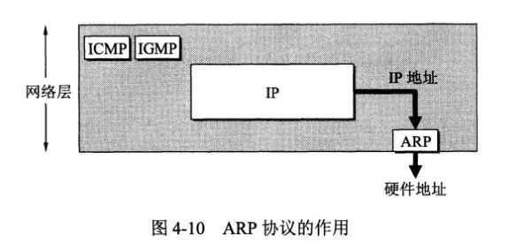

ARP 实现由 IP 地址得到 MAC 地址

1：首先，每个主机都会在自己的ARP缓冲区中建立一个ARP列表，以表示IP地址和MAC地址之间的对应关系。

2：当源主机要发送数据时，首先检查ARP列表中是否有对应IP地址的目的主机的MAC地址，如果有，则直接发送数据，如果没有，就向本网段的所有主机发送ARP数据包，该数据包包括的内容有： **源主机IP地址，源主机MAC地址，目的主机的IP地址** 。

3：当本网络的所有主机收到该ARP数据包时，首先检查数据包中的IP地址是否是自己的IP地址，如果不是，则忽略该数据包，如果是，则首先从数据包中取出源主机的IP和MAC地址写入到ARP列表中，如果已经存在，则覆盖，然后将自己的MAC地址写入ARP响应包中，告诉源主机自己是它想要找的MAC地址。

4：源主机收到ARP响应包后。将目的主机的IP和MAC地址写入ARP列表，并利用此信息发送数据。如果源主机一直没有收到ARP响应数据包，表示ARP查询失败。

广播发送ARP请求，单播发送ARP响应。

## TCP如何保证传输可靠

TCP提供一种面向连接的、可靠的字节流服务

* **数据包校验** ：目的是检测数据在传输过程中的任何变化，若校验出包有错，则丢弃报文段并且不给出响应，这时TCP发送数据端超时后会重发数据；
* **对失序数据包重排序** ：既然TCP报文段作为IP数据报来传输，而IP数据报的到达可能会失序，因此TCP报文段的到达也可能会失序。TCP将对失序数据进行重新排序，然后才交给应用层；
* **丢弃重复数据** ：对于重复数据，能够丢弃重复数据；
* **应答机制** ：当TCP收到发自TCP连接另一端的数据，它将发送一个确认。这个确认不是立即发送，通常将推迟几分之一秒；
* **超时重发** ：当TCP发出一个段后，它启动一个定时器，等待目的端确认收到这个报文段。如果不能及时收到一个确认，将重发这个报文段；
* **流量控制** ：TCP连接的每一方都有固定大小的缓冲空间。TCP的接收端只允许另一端发送接收端缓冲区所能接纳的数据，这可以防止较快主机致使较慢主机的缓冲区溢出，这就是流量控制。TCP使用的流量控制协议是可变大小的滑动窗口协议。

## TCP的拥塞控制如何实现

拥塞控制和流量控制不同，前者是一个全局性的过程，而后者指点对点通信量的控制。拥塞控制的方法主要有以下四种： A、慢启动 B、拥塞避免 C、快重传 D、快恢复

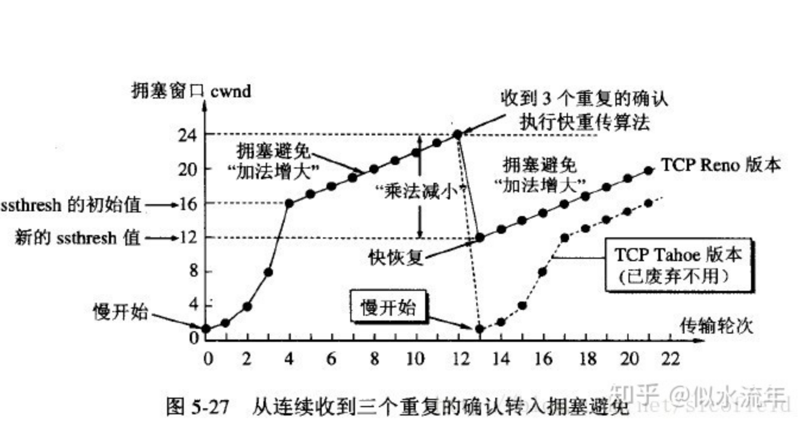

发送方需要维护一个叫做拥塞窗口（cwnd）的状态变量

* 慢启动：不要一开始就发送大量的数据，先探测一下网络的拥塞程度，也就是说由小到大逐渐增加拥塞窗口的大小。为了防止拥塞窗口过大增长，还需要维护一个慢开始门限变量，当拥塞窗口超过这个门限变量时转为执行拥塞避免算法。
* 拥塞避免：拥塞避免算法让拥塞窗口缓慢增长，即每经过一个往返时间RTT就把发送方的拥塞窗口cwnd加1，而不是加倍，这样拥塞窗口按线性规律缓慢增长。
* 快重传：快重传要求接收方在收到一个 **失序的报文段** 后就立即发出  **重复确认** （为的是使发送方及早知道有报文段没有到达对方）而不要等到自己发送数据时捎带确认。快重传算法规定，发送方只要一连收到三个重复确认就应当立即重传对方尚未收到的报文段，而不必继续等待设置的重传计时器时间到期。
* 快恢复：快重传配合使用的还有快恢复算法，当**发送方连续收到三个重复确认**时，就执行“乘法减小”算法，把ssthresh门限减半，但是接下去并不执行慢开始算法：因为如果网络出现拥塞的话就不会收到好几个重复的确认，所以发送方现在认为网络可能没有出现拥塞。所以此时不执行慢开始算法，而是将cwnd设置为ssthresh的大小，然后执行拥塞避免算法。

## socket

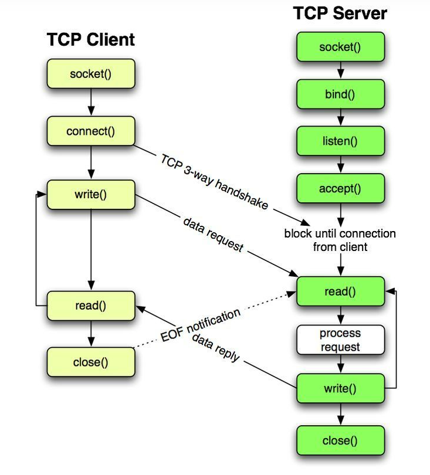

## TCP协议中的标志位

SYN：同步标志

* 该标志仅在三次握手建立TCP连接时有效。它提示TCP连接的服务端检查序列编号，该序列编号为TCP连接初始端(一般是客户端)的初始序列编号。

ACK：确认标志

* 表示确认收到请求

RST：复位标志

* 用于复位相应的TCP连接，即连接重置。

URG：紧急标志

* 用于保证TCP连接不被中断，并且督促中间层设备尽快处理。

PSH：推标志

* 该标志置位时，接收端不将该数据进行队列处理，而是尽可能快将数据转由应用处理。在处理 telnet 或 rlogin 等交互模式的连接时，该标志总是置位的。即表示有data传输。

FIN：结束标志

* 带有该标志置位的数据包用来结束一个TCP回话，但对应端口仍处于开放状态，准备接收后续数据。

## TCP三次握手

[参考文献](https://www.eet-china.com/mp/a44399.html)

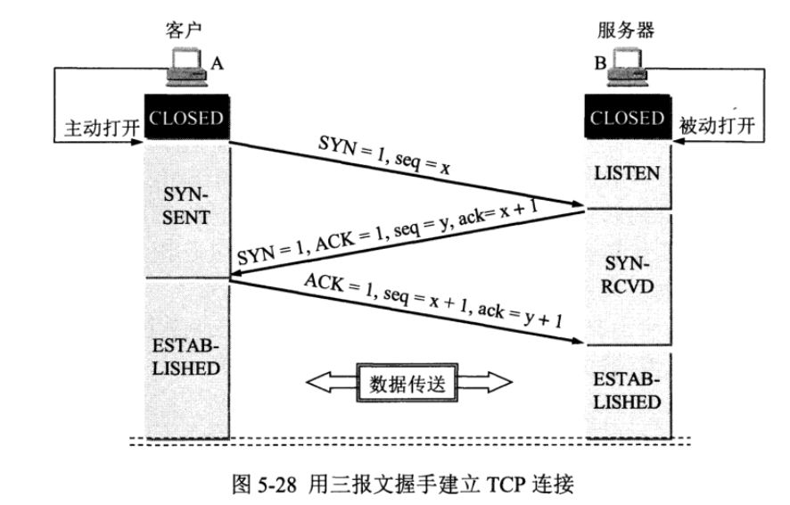

> * 第一次握手：客户端发送 `SYN` 报文，并进入 `SYN_SENT` 状态，等待服务器的确认；
> * 第二次握手：服务器收到 `SYN` 报文，需要给客户端发送 `ACK` 确认报文，同时服务器也要向客户端发送一个 `SYN` 报文，所以也就是向客户端发送 `SYN + ACK` 报文，此时服务器进入 `SYN_RCVD` 状态；
> * 第三次握手：客户端收到 `SYN + ACK` 报文，向服务器发送确认包，客户端进入 `ESTABLISHED` 状态。待服务器收到客户端发送的 `ACK` 包也会进入 `ESTABLISHED` 状态，完成三次握手。
>

SYN：同步SYN(SYNchronization)，在连接建立使用来同步序号。SYN置1表示这是一个连接请求或连接接受请求。（SYN标志位用于同步序列号）

ACK：确认ACK(ACKnowledgment)，仅当ACK=1时确认号字段才有效。TCP规定，在连接建立后所有的报文段都必须把ACK置1。

seq: 序号。

ack: 确认号。

* 最初两端的TCP进程都处于CLOSE(关闭)状态。上图中A主动打开连接，B被动打开连接。
* B打开连接后处于LISTEN(监听状态)，等待客户的连接请求。
* A向B发送请求报文，SYN=1,ACK=0,选择一个初始序号seq=x。
* B 收到连接请求报文，如果同意建立连接，则向 A 发送连接确认报文，SYN=1，ACK=1，确认号为ack= x+1，同时也选择一个初始的序号 seq=y。
* A 收到 B 的连接确认报文后，还要向 B 发出确认，ACK=1，确认号为ack= y+1，序号为 seq=x+1。
* B 收到 A 的确认后，连接建立。

> 为什么要3次握手？
>
> 三次握手的主要目的是双方确认自己与对方的发送和接收是正常的
>
> * 第一次握手：Client 什么都不能确认；Server 确认了对方发送正常，自己接收正常
> * 第二次握手：Client 确认了：自己发送、接收正常，对方发送、接收正常；Server 确认了：对方发送正常，自己接收正常
> * 第三次握手：Client 确认了：自己发送、接收正常，对方发送、接收正常；Server 确认了：自己发送、接收正常，对方发送、接收正常
>
> 所以三次握手就能确认双发收发功能都正常，缺一不可。
>

## TCP四次挥手

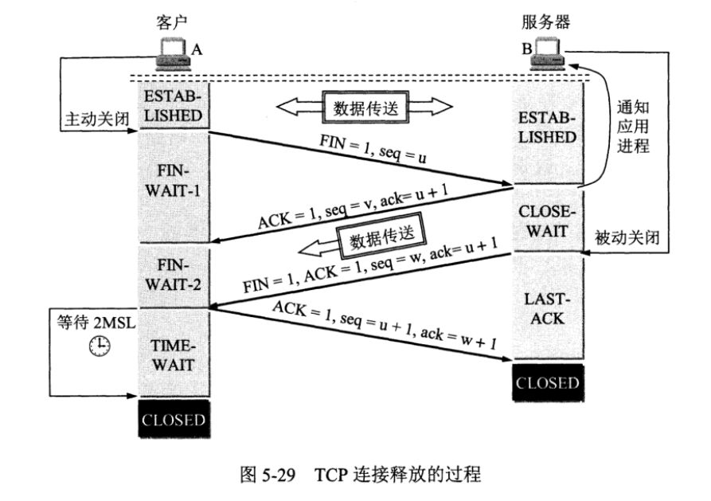

数据传输结束后，通信的双方都可释放连接。

FIN： 终止FINs,用来释放一个连接。当FIN等于1时，表明此报文段的发送方的数据已发送完毕，并要求释放传输连接。

ACK：确认ACK(ACKnowledgment),仅当ACK=1时确认号字段才有效。TCP规定，在连接建立后所有的报文段都必须把ACK置1。

seq： 序号。

ack：确认号。

以下描述不讨论序号和确认号，因为序号和确认号的规则比较简单。并且不讨论 ACK，因为 ACK 在连接建立之后都为 1。

* A 发送连接释放报文，FIN=1。
* B 收到之后发出确认，此时 TCP 属于半关闭状态，B 能向 A 发送数据但是 A 不能向 B 发送数据。
* 当 B 不再需要连接时，发送连接释放报文，FIN=1。
* A 收到后发出确认，进入 TIME-WAIT 状态，等待 2 MSL（最大报文存活时间）后释放连接。
* B 收到 A 的确认后释放连接。

**CLOSE-WAIT**：客户端发送了 FIN 连接释放报文之后，服务器收到了这个报文，就进入了 CLOSE-WAIT 状态。这个状态是为了让服务器端发送还未传送完毕的数据，传送完毕之后，服务器会发送 FIN 连接释放报文。

**TIME-WAIT**：客户端接收到服务器端的 FIN 报文后进入此状态，此时并不是直接进入 CLOSED 状态，还需要等待一个时间计时器设置的时间 2MSL。

> TCP四次挥手的原因:
>
> 这是因为服务端的LISTEN状态下的SOCKET当收到SYN报文的连接请求后，它可以把ACK和SYN(ACK起应答作用，而SYN起同步作用)放在一个报文里来发送。但关闭连接时，当收到对方的FIN报文通知时， **它仅仅表示对方没有数据发送给你了；但未必你所有的数据都全部发送给对方了，** 所以你可能未必会马上会关闭SOCKET,也即你可能还需要发送一些数据给对方之后，再发送FIN报文给对方来表示你同意现在可以关闭连接了，所以它这里的ACK报文和FIN报文多数情况下都是分开发送的。
>
> 简单来讲就是因为TCP是全双工的，两个方向的连接需要单独关闭
>

> 为什么建立连接握手3次，关闭连接握手4次？
>
> 其实在 TCP 握手的时候，接收端发送 `SYN+ACK` 的包是将一个 `ACK` 和一个 `SYN` 合并到一个包中，所以减少了一次包的发送，三次完成握手。
>
> 对于四次挥手，因为 TCP 是全双工通信，在主动关闭方发送 FIN 包后，接收端可能还要发送数据，不能立即关闭服务器端到客户端的数据通道，所以也就不能将服务器端的 `FIN` 包与对客户端的 `ACK` 包合并发送，只能先确认 `ACK`，然后服务器待无需发送数据时再发送 `FIN` 包，所以四次挥手时必须是四次数据包的交互。
>

> 为什么A在TIME-WAIT状态必须等待2MSL的时间呢？
>
> * MSL（Maximum Segment Lifetime），指一段 TCP 报文在传输过程中的最大生命周期。2 MSL 即是服务器端发出 FIN 报文和客户端发出的 ACK 确认报文所能保持有效的最大时长。
> * 若服务器在 1 MSL 内没有收到客户端发出的 ACK 确认报文，再次向客户端发出 FIN 报文。如果客户端在 2 MSL 内收到了服务器再次发来的 FIN 报文，说明服务器由于一些原因并没有收到客户端发出的 ACK 确认报文。客户端将再次向服务器发出 ACK 确认报文，并重新开始 2 MSL 的计时。
> * 若客户端在 2MSL 内没有再次收到服务器发送的 FIN 报文，则说明服务器正常接收到客户端 ACK 确认报文，客户端可以进入 CLOSE 阶段，即完成四次挥手。
>

## TCP超时重传机制

[TCP超时重传](https://www.cnblogs.com/xiaolincoding/p/12732052.html)


## UDP与TCP的区别

1. TCP面向连接，传输数据之前要需要建立会话。UDP是无连接的。
2. TCP提供可靠传输，保证数据不丢包、不重复且按顺序到达；UDP只尽努力交付，不保证可靠交付
3. TCP提供了拥塞控制；UDP不提供
4. TCP是面向字节流的；UDP面向报文。（应用层交给UDP多长的报文，UDP就照样发送，即一次发送一个报文）
5. TCP只支持点到点通信；UDP支持一对一、一对多、多对多的交互通信。
6. TCP首部开销大20字节，UDP首部开销小8字节。

TCP一般用于文件传输、邮件、远程登录等对可靠性要求较高的场景

UDP一般用于即时通信、在线视频、语音电话等

## TCP与UDP首部

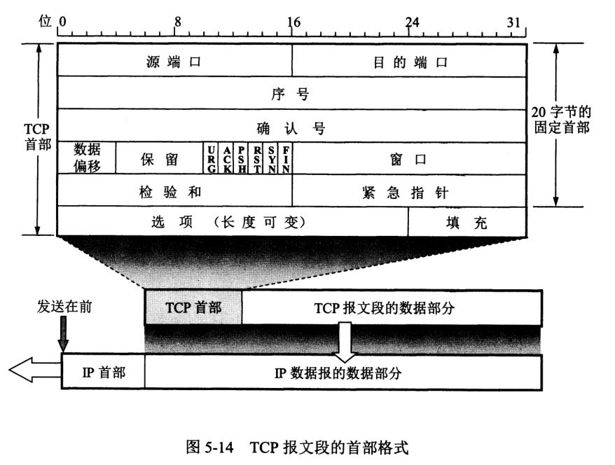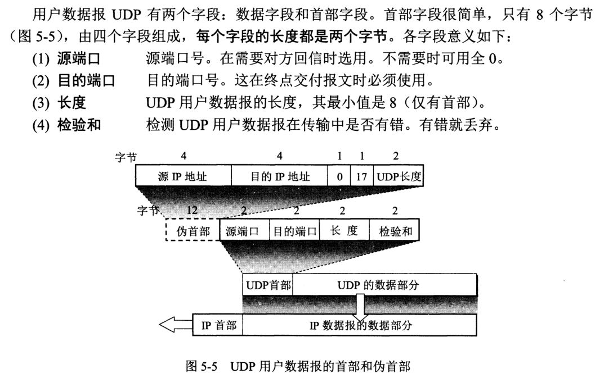

## IP数据报格式

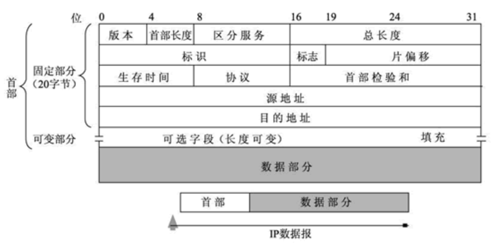

## MSL、TTL、RTT区别

MSL（Maximum Segment Lifetime）：报文最大生存时间。指任何报文在网络上存在的最长时间，超过这个时间报文将被丢弃。RFC793规定MSL为2分钟，实际应用中常用的是30秒、1分钟和2分钟等。

TTL（Time to Live）：生存时间，为一个IP数据报可以经过的最大路由跳数，由源主机设置初始值，每经过一个路由器此值就减1，当此值为0时数据报将被丢弃，同时发送ICMP报文通知源主机。

RTT（Round Trip Time）：往返时间，表示从发送端发送数据开始，到发送端收到接收端的确认报文（接收端收到数据后立刻发送确认）总共经历的时延。

## TCP和UDP对应的协议

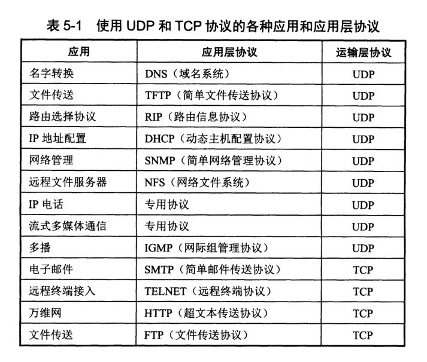

## 什么是TCP沾包，如何解决

> 单看传输层，TCP是「面向字节流」传输的，本身是没有「包」的概念的，接收方将接收的报文段（segment）的数据提取出来按序放置在缓存中。  
>
> 但是从应用层的角度看是有「包」的概念的，例如http/1.1中采用了「管道(pipeline)」的思想，即可以多个http数据流「复用」同一个TCP，因此各个http数据流之间是「纠缠」的，那么就需要在应用层进行处理，「区分不同」的数据流，自然就需要处理「粘包」的问题。
>

首先TCP 协议，在大多数场景下，是不存在丢包和包乱序问题的，TCP 通信是可靠通信方式，TCP 协议栈通过序列号和包重传确认机制保证数据包的有序和一定被正确发到目的地

TCP是流式协议，因此我们需要人为规定出每一次发送时的字节流边界，以便接收端知道从什么位置取出多少字节来当成一个数据包去解析。

所谓粘包就是连续给对端发送两个或者两个以上的数据包，对端在一次收取中收到的数据包数量可能大于 1 个，当大于 1 个时，可能是几个（包括一个）包加上某个包的部分，或者干脆就是几个完整的包在一起。当然，也可能收到的数据只是一个包的部分，这种情况一般也叫半包。

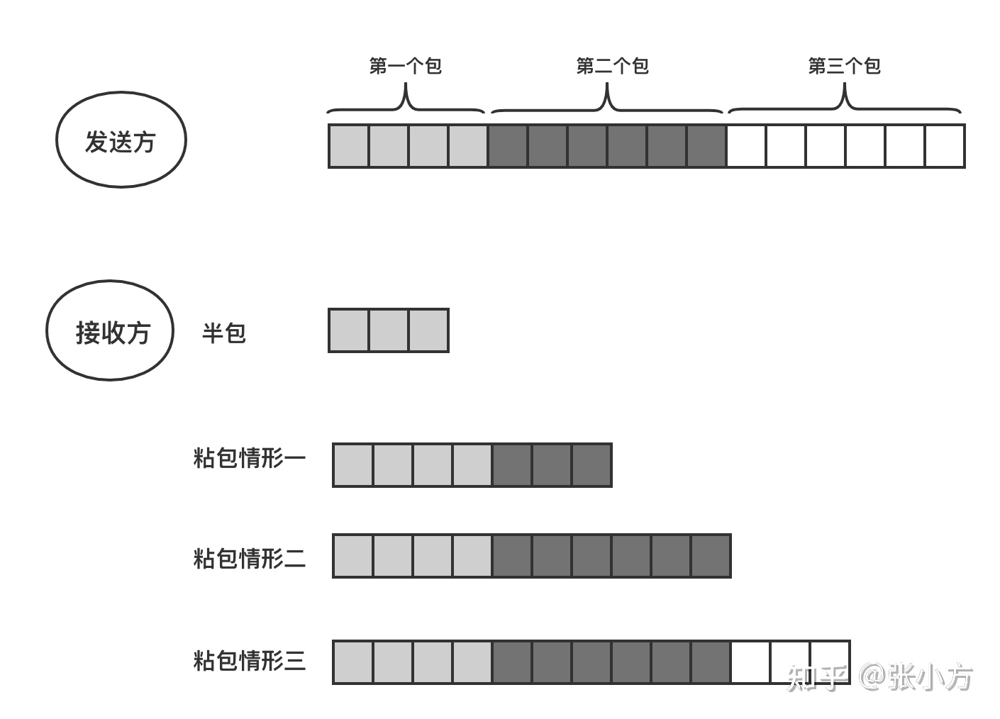

无论是半包还是粘包问题，其根源是 TCP 协议是流式数据格式。解决问题的思路还是想办法从收到的数据中把包与包的边界给区分出来。那么如何区分呢？一般有三种分包方法：

* **固定包长的数据包**：顾名思义，即每个协议包的长度都是固定的。举个例子，例如我们可以规定每个协议包的大小是 64 个字节，每次收满 64 个字节，就取出来解析（如果不够，就先存起来）。这种通信协议的格式简单但灵活性差。如果包内容不足指定的字节数，剩余的空间需要填充特殊的信息，如 \0；如果包内容超过指定字节数，又得分包分片，需要增加额外处理逻辑——在发送端进行分包分片，在接收端重新组装包片。
* **以指定字符（串）为包的结束标志**：这种协议包比较常见，即字节流中遇到特殊的符号值时就认为到一个包的末尾了。一般用于一些包含各种命令控制的应用中，其不足之处就是如果协议数据包内容部分需要使用包结束标志字符，就需要对这些字符做转码或者转义操作，以免被接收方错误地当成包结束标志而误解析。
* **包头 + 包体格式**：这种格式的包一般分为两部分，即包头和包体，包头是固定大小的，且包头中必须含有一个字段来说明接下来的包体有多大。由于包头大小是固定的，对端先收取包头大小字节数目（当然，如果不够还是先缓存起来，直到收够为止），然后解析包头，根据包头中指定的包体大小来收取包体，等包体收够了，就组装成一个完整的包来处理。

## TCP一定可靠吗

不一定。TCP的可靠性保证机制是对数据进行校验，计算校验和（checksum）。然而有时候就是会出现数据错误但是校验通过的情况。因此有条件的话可以在通信协议中增加自己的校验机制

> TCP校验和覆盖TCP首部和TCP数据，而IP首部中的校验和只覆盖IP的首部，不覆盖IP数据报中的任何数据。TCP校验和、IP校验和的计算方法是基本一致的，除了计算的范围不同。
>
> TCP的校验和是必需的，而UDP的校验和是可选的。TCP和UDP计算校验和时，都要加上一个12字节的伪首部。
>

## HTTP请求与响应格式

Http请求

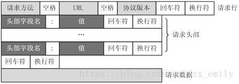

* 请求行：请求行由三个标记组成： **请求方法、请求URI和HTTP版本** ，它们用空格分隔
* 请求头：由关键字/值对组成，每行一对，关键字和值用冒号分隔

  * User-Agent、Accept、Content-Length、Content-Type、Host等
* 空行：最后一个请求头标之后是一个空行，发送回车符和退行，通知服务器以下不再有头
* 请求数据

Http响应

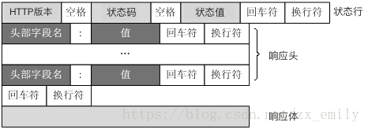

* 状态行：状态行由三个标记组成：**HTTP版本、响应代码和响应描述**

  * 响应代码：3位的数字代码，指出请求的成功或失败
  * 响应描述：为响应代码的可读性解释
* 响应头：像请求头标一样，它们指出服务器的功能，标识出响应数据的细节
* 空行：最后一个响应头标之后是一个空行，发送回车符和退行，表明服务器以下不再有头
* 响应数据

## HTTP协议包含哪些请求

* GET：向特定的资源发出请求。
* POST：向指定资源提交数据进行处理请求（例如提交表单或者上传文件）。数据被包含在请求体中。POST请求可能会导致新的资源的创建和/或已有资源的修改。
* OPTIONS：返回服务器针对特定资源所支持的HTTP请求方法。也可以利用向Web服务器发送'*'的请求来测试服务器的功能性。
* PUT：向指定资源位置上传其最新内容。
* DELETE：请求服务器删除Request-URI所标识的资源。
* ...

## HTTP中GET与POST的区别

(1). 从功能上讲，GET一般用来从服务器上获取资源，POST一般用来更新服务器上的资源；

(2). 从REST服务角度上说，GET是幂等的，即读取同一个资源，总是得到相同的数据，而POST不是幂等的，因为每次请求对资源的改变并不是相同的；进一步地，GET不会改变服务器上的资源，而POST会对服务器资源进行改变；

(3). 从请求参数形式上看，GET请求的数据会附在URL之后，即将请求数据放置在HTTP报文的 请求头 中，以?分割URL和传输数据，参数之间以&相连。特别地，如果数据是英文字母/数字，原样发送；否则，会将其编码为 application/x-www-form-urlencoded MIME 字符串(如果是空格，转换为+，如果是中文/其他字符，则直接把字符串用BASE64加密，得出如：%E4%BD%A0%E5%A5%BD，其中％XX中的XX为该符号以16进制表示的ASCII)；而POST请求会把提交的数据则放置在是HTTP请求报文的 请求体 中。

(4). 就安全性而言，POST的安全性要比GET的安全性高，因为GET请求提交的数据将明文出现在URL上，而且POST请求参数则被包装到请求体中，相对更安全。

(5). 从请求的大小看，GET请求的长度受限于浏览器或服务器对URL长度的限制，允许发送的数据量比较小，而POST请求则是没有大小限制的。

> 对于GET方式的请求，浏览器会把http header和data一并发送出去，服务端响应200，请求成功。
>
> 对于POST方式的请求，浏览器会先发送http header给服务端，告诉服务端等一下会有数据过来，服务端响应100 continue，告诉浏览器我已经准备接收数据，浏览器再post发送一个data给服务端，服务端响应200，请求成功。
>

## HTTP请求的完整过程

* 建立 TCP 连接（之前可能还有一次DNS域名解析）
* 三次握手建立TCP完成后，客户端向服务器发送请求行，比如 GET https://www.baidu.com?name=xx&addr=xx HTTP1.1
* 客户端发送请求头信息，发送完了header后会接着发送一个空白行，GET请求没有数据，POST请求要发送body数据
* 服务器接收到以上信息后，开始处理业务，处理完有了结果以后，服务器开始应答
* 服务器返回响应头信息，发送完response header以后，再发送一个空白行
* 然后服务器向客户端发送数据
* 发送完了服务器四次挥手关闭 TCP 连接<br />

## 常见的HTTP状态码

状态代码有三位数字组成，第一个数字定义了响应的类别，且有五种可能取值： 1xx：指示信息--表示请求已接收，继续处理 2xx：成功--表示请求已被成功接收、理解、接受 3xx：重定向--要完成请求必须进行更进一步的操作 4xx：客户端错误--请求有语法错误或请求无法实现 5xx：服务器端错误--服务器未能实现合法的请求

```bash
200 OK      //客户端请求成功
400 Bad Request  //客户端请求有语法错误，不能被服务器所理解
401 Unauthorized //请求未经授权，这个状态代码必须和WWW-Authenticate报头域一起使用 
403 Forbidden  //服务器收到请求，但是拒绝提供服务
404 Not Found  //请求资源不存在，eg：输入了错误的URL
500 Internal Server Error //服务器发生不可预期的错误
503 Server Unavailable  //服务器当前不能处理客户端的请求，一段时间后可能恢复正常
```

## HTTPS与HTTP的区别

[我是这样理解HTTP与HTTPS的](https://www.cnblogs.com/jesse131/p/9080925.html)

Http协议运行在TCP之上，明文传输，客户端与服务器端都无法验证对方的身份；

Https是Http的加强安全版本，它基于Http并使用额外的SSL/TLS协议用作加密和安全认证；

二者之间存在如下不同：(端口、加密、速度、CA)

* 端口不同：Http与Https使用不同的连接方式，用的端口也不一样，前者是80，后者是443；
* 资源消耗：和HTTP通信相比，Https通信会由于加减密处理消耗更多的CPU和内存资源；
* 开销：Https通信需要证书，而证书一般需要向认证机构（CA）购买；
* Https的加密机制是一种共享密钥加密和公开密钥加密并用的混合加密机制。

http+加密+认证+完整性保护=https

> Https的优点：保密性好，信任度高
>

## 对称加密与非对称加密

* 对称密钥加密：又称私钥加密，即信息的发送方和接收方用同一个密钥去加密和解密数据。
* 非对称加密：又称公钥加密，它需要使用一对密钥来分别完成加密和解密操作，一个公开发布，即公开密钥，另一个由用户自己秘密保存，即私用密钥。信息发送者用公开密钥去加密，而信息接收者则用私用密钥去解密。

SSL/TLS协议的基本思路是采用公钥加密法，也就是说，**客户端先向服务器端索要公钥，然后用公钥加密信息，服务器收到密文后，用自己的私钥解密**

* 如何保证公钥不被篡改？将公钥放在数字证书中，只要证书是可信的，公钥就是可信的。
* 公钥加密计算量太大，如何减少耗用的时间？每一次对话（session），客户端和服务器端都生成一个"对话密钥"（session key），用它来加密信息。由于"对话密钥"是对称加密，所以运算速度非常快，而服务器公钥只用于加密"对话密钥"本身，这样就减少了加密运算的消耗时间。

## DNS域名解析过程

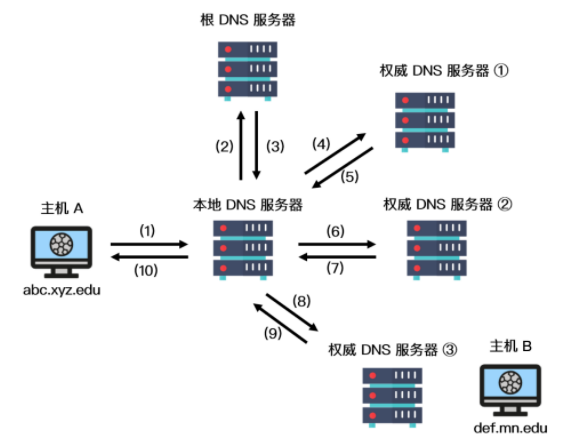

1. 客户机向其本地域名服务器发出DNS请求报文
2. 本地域名服务器收到请求后，查询本地缓存，假设没有该记录，则以DNS客户的身份向根域名服务器发出解析请求
3. 根域名服务器收到请求后，判断该域名所属域，将对应的顶级域名服务器的IP地址返回给本地域名服务器
4. 本地域名服务器向顶级域名服务器发出解析请求报文
5. 顶级域名服务器收到请求后，将所对应的授权域名服务器的IP地址返回给本地域名服务器
6. 本地域名服务器向授权域名服务器发起解析请求报文
7. 授权域名服务器收到请求后，将查询结果返回给本地域名服务器
8. 本地域名服务器将查询结果保存到本地缓存，同时返回给客户机

## DNS为什么使用UDP

更正确的答案是 DNS 既使用 TCP 又使用 UDP。

当进行**区域传送**（主域名服务器向辅助域名服务器传送变化的那部分数据）时会使用 TCP，因为数据同步传送的数据量比一个请求和应答的数据量要多，而 TCP 允许的报文长度更长，因此为了保证数据的正确性，会使用基于可靠连接的 TCP。

当客户端向 DNS 服务器查询域名 ( 域名解析) 的时候，一般返回的内容不会超过 UDP 报文的最大长度，即 512 字节。用 UDP 传输时，不需要经过 TCP 三次握手的过程，从而大大提高了响应速度，但这要求域名解析器和域名服务器都必须自己处理超时和重传从而保证可靠性。

> 从速度与传输内容两方面考虑
>

## cookie与session的区别

Cookie和Session都是客户端与服务器之间保持状态的解决方案，具体来说，cookie机制采用的是在客户端保持状态的方案，而session机制采用的是在服务器端保持状态的方案

* 实现机制：Session的实现常常依赖于Cookie机制，通过Cookie机制回传SessionID；
* 大小限制：Cookie有大小限制并且浏览器对每个站点也有cookie的个数限制，Session没有大小限制，理论上只与服务器的内存大小有关；
* 安全性：Cookie存在安全隐患，通过拦截或本地文件找得到cookie后可以进行攻击，而Session由于保存在服务器端，相对更加安全；
* 服务器资源消耗：Session是保存在服务器端上会存在一段时间才会消失，如果session过多会增加服务器的压力。
* 存放位置：cookie数据存放在客户的浏览器上，session数据放在服务器上。

## 在浏览器中输入www.baidu.com后执行的全部过程

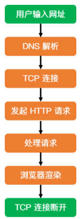

客户端：

* 浏览器：DNS解析IP地址->发起HTTP会话请求
* 传输层：把HTTP会话请求分成报文段，添加源和目的端口
* 网络层：查找路由表确定到达服务器的路径
* 链路层：ARP查找目的地址，发送报文

> 首先浏览器会输入的地址进行DNS解析，得到IP地址，然后通过这个IP地址与服务器建立TCP连接，建立连接完成后就可以发送HTTP请求。然后服务器会处理这个HTTP请求，处理完成后返回一个HTTP响应，这个响应通常是HTML页面。浏览器接收到响应后就对响应数据进行渲染并展示。这一次HTTP请求就结束了。
>

## 交换机、路由器、网关

* 物理层：转发器
* 数据链路层：网桥、交换机
* 网络层：路由器
* 传输层：网关

> 交换机的端口不具有实际的MAC地址,因此交换机只是把接收到的消息转发出去而已，它的各端口并不以实际的发送方或接收方的身份参与到以太网包的传递过程；而路由器的端口具有MAC 地址IP地址，所以它的端口是作为以太网包实际的接收方与发送方的身份存在的。
>
> 当交换机不知道将包转发到哪一个端口时，它会将包转发到除了源端口以外的所有端口；而当路由器不知道将包转发到哪一端口时，它就直接丢弃这个包。产生这种区别的原因是他们所连接的网络的规模不同——交换机工作在局域网，它所连接的网络规模比较小，向所有端口转发也不会造成多大问题；但路由器工作的环境是互联网，它的规模是远大于互联网的，若向所有端口转发则会产生大量的网络包，造成网络拥塞。
>

## Http1.0、2.0、3.0的区别

**HTTP1.0**

* 1.0的HTTP版本，是一种**无状态，无连接**的应用层协议。 HTTP1.0规定浏览器和服务器保持短暂的链接。
* 浏览器每次请求都需要与服务器建立一个TCP连接，服务器处理完成以后立即断开TCP连接（无连接），服务器不跟踪也每个客户单，也不记录过去的请求（无状态）。
* 这种无状态性可以借助**cookie/session**机制来做身份认证和状态记录。
* 存在的问题

  * 无法复用连接：每次发送请求，都需要进行一次TCP连接，而TCP的连接释放过程又是比较费事的。这种无连接的特性会使得网络的利用率变低。
  * 队头阻塞：由于HTTP1.0规定下一个请求必须在前一个请求响应到达之前才能发送，假设前一个请求响应一直不到达，那么下一个请求就不发送，后面的请求就阻塞了。

**HTTP1.1**

* HTTP1.1继承了HTTP1.0的简单，克服了HTTP1.0性能上的问题。
* 长连接：HTTP1.1增加Connection字段，通过设置**Keep-Alive**保持HTTP连接不断卡。避免每次客户端与服务器请求都要重复建立释放建立TCP连接。提高了网络的利用率。
* 管道化：HTTP1.1支持请求管道化（pipelining）。基于HTTP1.1的长连接，使得请求管线化成为可能。 管线化使得请求能够“并行”传输。
* 此外，HTTP1.1还加入了缓存处理（强缓存和协商缓存），新的字段如cache-control，支持断点传输，以及增加了Host字段（使得一个服务器能够用来创建多个Web站点）

**HTTP2.0**

* **二进制分帧**：HTTP2.0通过在应用层和传输层之间增加一个二进制分层帧，突破了HTTP1.1的性能限制，改进传输性能。
* **多路复用（链接共享）— 真并行传输**：所有HTTP2.0通信都在一个TCP链接上完成，这个链接可以承载任意流量的双向数据流。
* **头部压缩**：在HTTP1.X中，头部元数据都是以纯文本的形式发送的，通常会给每个请求增加500-8000字节的负荷。比如cookie，默认情况下，浏览器会在每次请求的时候，把cookie附在header上面发给服务器。HTTP2.0使用encoder来减少需要传输的header大小，通讯双方各自cache一份header_files表，既避免重复header的传输，又减少了需要传输的大小。
* **服务器推送**（websocket）：服务器除了最初请求的响应外，服务器还可以额外向客户端推送资源，而无需客户端明确的需求。

**HTTP3.0**

* 基于google的QUIC协议，而quic协议是使用udp实现的
* 减少了tcp三次握手时间，以及tls握手时间
* 解决了http 2.0中前一个stream丢包导致后一个stream被阻塞的问题
* 优化了重传策略，重传包和原包的编号不同，降低后续重传计算的消耗
* 连接迁移，不再用tcp四元组确定一个连接，而是用一个64位随机数来确定这个连接
* 更合适的流量控制

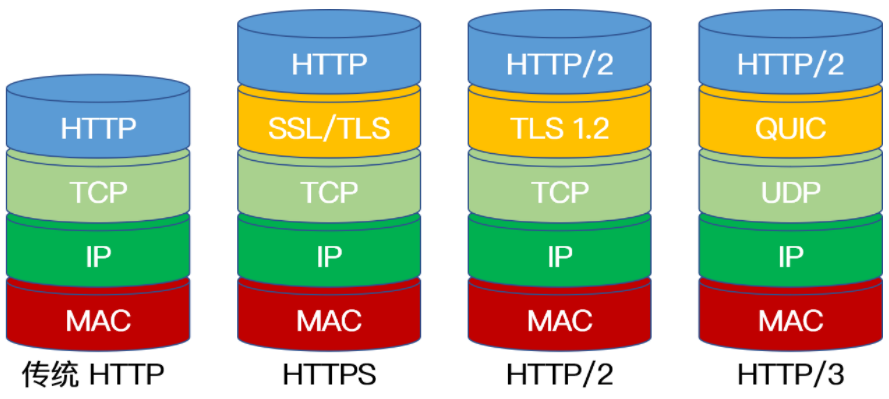

## Websocket

* WebSocket 是一种在单个TCP连接上进行全双工通信的协议。WebSocket 使得客户端和服务器之间的数据交换变得更加简单，允许服务端主动向客户端推送数据。
* 在 WebSocket API 中，浏览器和服务器只需要完成一次握手，两者之间就直接可以创建持久性的连接， 并进行双向数据传输。
* WebSocket本质上一种计算机网络应用层的协议，用来弥补http协议在持久通信能力上的不足。

特点：

* 建立在 TCP 协议之上，服务器端的实现比较容易。
* 与 HTTP 协议有着良好的兼容性。默认端口也是80和443，并且握手阶段采用 HTTP 协议，因此握手时不容易屏蔽，能通过各种 HTTP 代理服务器。
* 数据格式比较轻量，性能开销小，通信高效。
* 可以发送文本，也可以发送二进制数据。
* 没有同源限制，客户端可以与任意服务器通信。
* 协议标识符是`ws`（如果加密，则为`wss`），服务器网址就是 URL。

**为什么要有Websocket？**

因为 HTTP 协议有一个缺陷：通信只能由客户端发起，不具备服务器推送能力。

这种单向请求的特点，注定了如果服务器有连续的状态变化，客户端要获知就非常麻烦。我们只能使用[`&#34;"`轮询`&#34;"`](https://link.juejin.cn?target=https%3A%2F%2Fwww.pubnub.com%2Fblog%2F2014-12-01-http-long-polling%2F "https://www.pubnub.com/blog/2014-12-01-http-long-polling/")：每隔一段时候，就发出一个询问，了解服务器有没有新的信息。最典型的场景就是聊天室。轮询的效率低，非常浪费资源（因为必须不停连接，或者 HTTP 连接始终打开）。

http协议本身是没有持久通信能力的，但是我们在实际的应用中，是很需要这种能力的，所以，为了解决这些问题，WebSocket协议由此而生

**Websocket与HTTP的区别？**

* **相同点：** 都是一样基于TCP的，都是可靠性传输协议。都是应用层协议。
* **联系：** WebSocket在建立握手时，数据是通过HTTP传输的。但是建立之后，在真正传输时候是不需要HTTP协议的。

**Websocket的缺点？**

* 少部分浏览器不支持

## URL与URI的区别

URL，即统一资源定位符 (Uniform Resource Locator )，URL 其实就是我们平时上网时输入的网址，它标识一个互联网资源，并指定对其进行操作或获取该资源的方法。例如 https://leetcode-cn.com/problemset/all/ 这个 URL，标识一个特定资源并表示该资源的某种形式是可以通过 HTTP 协议从相应位置获得。

从定义即可看出，URL 是 URI 的一个子集，两者都定义了资源是什么，而 URL 还定义了如何能访问到该资源。URI 是一种语义上的抽象概念，可以是绝对的，也可以是相对的，而URL则必须提供足够的信息来定位，是绝对的。简单地说，只要能唯一标识资源的就是 URI，在 URI 的基础上给出其资源的访问方式的就是 URL。

URI：资源是什么？  
URL：资源是什么，如何获取？
