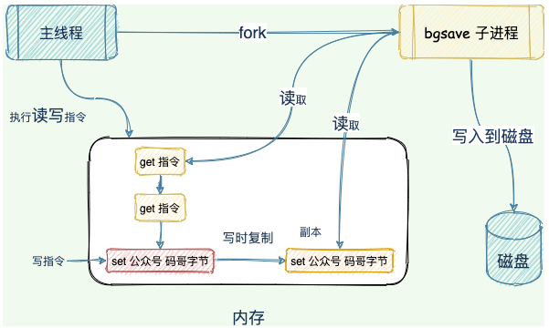

## 数据类型

**在Redis中，键总是一个字符串对象，而值可以是字符串、列表、集合等对象**

### string

Redis 的字符串是动态字符串，是可以修改的字符串，内部结构实现上类似于 Java 的 ArrayList，采用预分配冗余空间的方式来减少内存的频繁分配

### list

Redis的列表相当于JAVA语言里面的LinkedList，注意它是链表而不是数组。这意味着list的插入和删除操作非常快，但是索引定位很慢

### set

Redis的集合相当于Java语言里面的hashset，它内部的键值对是无序且唯一的。它的内部实现相当于一个特殊的字典，字典中所有的value都是一个值NULL。当集合中的最后一个元素移除之后，数据结构将自动删除，内存被回收

### hash

Redis的字典相当于JAVA语言里面的HashMap，它是无序字典。内部实现结构上同JAVA的HashMap也是一致的，同样的数组+链表二维结构。第一维hash的数组位置碰撞时，就会将碰撞的元素用链表存起来。

不同的是，Redis的字典的值只能是字符串，且rehash时采用的是渐进式rehash。渐进式rehash会在rehash的同时，保留新旧两个hash结构。查询时会同时查询两个hash结构，然后在后续的定时任务中以及hash的子指令中，循环渐进地将旧hash的内容一点点迁移到新的hash结构中。

> 什么时候进行rehash？         会导致 dict 中元素增加的函数，都会判断装载因子是否大于 5，如果是，则开启 rehash。
>

当hash移除了最后一个元素后，该数据结构自动删除，内存被回收

```bash
hset books java "think in java"
```

### zset（sorted set）

Redis的zset类似于JAVA的SortedSet与HashMap的结合体，一方面它是一个set，保证了内部value的唯一性，另一方面它可以给每个value赋予一个score，代表这个value的排序权重。它的内部实现用的是一种称为“跳跃列表”的数据结构。

```bash
zadd books 9.0 "think in java"
```

> zset实现机制：HashMap+跳表
>
> HashMap里放的是成员到score的映射，而跳跃表里存放的是所有的成员，排序依据是HashMap里存的score,使用跳跃表的结构可以获得比较高的查找效率，并且在实现上比较简单。
>

# 面试题

## 谈一下你对Redis的了解？

Redis（全称：Remote Dictionary Server远程字典服务）是一个开源的使用ANSI C语言编写、支持网络、可基于内存亦可持久化的日志型、Key-Value数据库，并提供多种语言的API。

Redis 与其他 key – value 缓存产品有以下三个特点：

* Redis支持数据的持久化，可以将内存中的数据保存在磁盘中，重启的时候可以再次加载进行使用。
* Redis不仅仅支持简单的key-value类型的数据，同时还提供list，set，zset，hash等数据结构的存储。
* Redis支持数据的备份，即master-slave模式的数据备份。

## Redis一般有哪些使用场景？

* 缓存：减轻MySQL的查询压力，提升系统性能。
* 排行榜：利用Redis的SortSet（有序集合）实现。
* 计算器/限速器：利用 Redis 中原子性的自增操作，我们可以统计类似用户点赞数、用户访问数等。这类操作如果用 MySQL，频繁的读写会带来相当大的压力；限速器比较典型的使用场景是限制某个用户访问某个 API 的频率，常用的有抢购时，防止用户疯狂点击带来不必要的压力。
* 好友关系：利用集合的一些命令，比如求交集、并集、差集等。可以方便解决一些共同好友、共同爱好之类的功能。
* 消息队列：除了 Redis 自身的发布/订阅模式，我们也可以利用 List 来实现一个队列机制，比如：到货通知、邮件发送之类的需求，不需要高可靠，但是会带来非常大的 DB 压力，完全可以用 List 来完成异步解耦。
* Session 共享：Session 是保存在服务器的文件中，如果是集群服务，同一个用户过来可能落在不同机器上，这就会导致用户频繁登陆；采用 Redis 保存 Session 后，无论用户落在那台机器上都能够获取到对应的 Session 信息。

> Redis不适合的场景
>
> 数据量太大、数据访问频率非常低的业务都不适合使用 Redis，数据太大会增加成本，访问频率太低，保存在内存中纯属浪费资源。
>

## Redis有哪些常见的功能？

* 数据缓存功能
* 分布式锁功能
* 支持数据持久化
* 支持事务
* 支持消息队列

## Redis支持的数据类型有哪些？

* string字符串

  * 字符串类型是 Redis 最基础的数据结构，首先键是字符串类型，而且其他几种结构都是在字符串类型基础上构建的。字符串类型实际上可以是字符串：简单的字符串、XML、JSON；数字：整数、浮点数；二进制：图片、音频、视频。
  * 使用场景：缓存、计数器、共享 Session、限速。
* hash哈希

  * 在 Redis中哈希类型是指键本身是一种键值对结构，如 value={{field1,value1},……{fieldN,valueN}}
  * 使用场景：哈希结构相对于字符串序列化缓存信息更加直观，并且在更新操作上更加便捷。所以常常用于用户信息等管理，但是哈希类型和关系型数据库有所不同，哈希类型是稀疏的，而关系型数据库是完全结构化的，关系型数据库可以做复杂的关系查询，而 Redis 去模拟关系型复杂查询开发困难且维护成本高。
* list列表

  * 列表类型是用来储存多个有序的字符串，列表中的每个字符串成为元素，一个列表最多可以储存 2 ^ 32 – 1 个元素，在 Redis 中，可以队列表两端插入和弹出，还可以获取指定范围的元素列表、获取指定索引下的元素等，列表是一种比较灵活的数据结构，它可以充当栈和队列的角色。
  * 使用场景：Redis 的 lpush + brpop 命令组合即可实现阻塞队列，生产者客户端是用 lpush 从列表左侧插入元素，多个消费者客户端使用 brpop 命令阻塞式的“抢”列表尾部的元素，多个客户端保证了消费的负载均衡和高可用性。
* set集合

  * 集合类型也是用来保存多个字符串的元素，但和列表不同的是集合中不允许有重复的元素，并且集合中的元素是无序的，不能通过索引下标获取元素，Redis 除了支持集合内的增删改查，同时还支持多个集合取交集（sinter）、并集（sunion）、差集（sdiff）。合理的使用好集合类型，能在实际开发中解决很多实际问题。
  * 使用场景：如：一个用户对娱乐、体育比较感兴趣，另一个可能对新闻感兴趣，这些兴趣就是标签，有了这些数据就可以得到同一标签的人，以及用户的共同爱好的标签，这些数据对于用户体验以及曾强用户粘度比较重要。
* zset（sorted set）有序集合

  * 有序集合和集合有着必然的联系，它保留了集合不能有重复成员的特性，但不同得是，有序集合中的元素是可以排序的，但是它和列表的使用索引下标作为排序依据不同的是：它给每个元素设置一个分数，作为排序的依据。
  * 使用场景：排行榜是有序集合经典的使用场景。例如：视频网站需要对用户上传的文件做排行榜，榜单维护可能是多方面：按照时间、按照播放量、按照获得的赞数等。

## Redis为什么这么快？

* 完全基于内存，绝大部分请求是纯粹的内存操作，非常快速
* 数据结构简单，对数据的操作也简单
* 采用单线程，避免了不必要的上下文切换和竞争条件，也不存在多进程或者多线程导致的切换而消耗 CPU，不用去考虑各种锁的问题，不存在加锁释放锁操作，没有因为可能出现死锁而导致的性能消耗
* 使用多路I/O复用模型，非阻塞IO

## 什么是缓存穿透？怎么解决？

缓存穿透是指查询一个一定不存在的数据，由于缓存是不命中时需要从数据库查询，查不到数据则不写入缓存，这将导致这个不存在的数据每次请求都要到数据库去查询，造成缓存穿透。

解决方法：

* 缓存空对象：如果一个查询返回的数据为空（不管是数据不存在，还是系统故障），我们仍然把这个空结果进行缓存，但它的过期时间会很短，最长不超过五分钟。

  * 空值做了缓存，意味着缓存中存了更多的键，需要更多的内存空间，比较有效的方法是针对这类数据设置一个较短的过期时间，让其自动剔除。
  * 缓存和存储的数据会有一段时间窗口的不一致，可能会对业务有一定影响。例如：过期时间设置为 5分钟，如果此时存储添加了这个数据，那此段时间就会出现缓存和存储数据的不一致，此时可以利用消息系统或者其他方式清除掉缓存层中的空对象。
* [布隆过滤器](https://developer.aliyun.com/article/773205)：将所有可能存在的数据哈希到一个足够大的 bitmap 中，一个一定不存在的数据会被这个 bitmap 拦截掉，从而避免了对底层存储系统的查询压力。

## 什么是缓存雪崩？怎么解决？

如果缓存集中在一段时间内失效，所有的查询都落在数据库上，造成了缓存雪崩。

解决方法：

* 加锁排队：在缓存失效后，通过加锁或者队列来控制读数据库写缓存的线程数量。比如对某个 key 只允许一个线程查询数据和写缓存，其他线程等待；
* 数据预热：可以通过缓存 reload 机制，预先去更新缓存，再即将发生大并发访问前手动触发加载缓存不同的 key，设置不同的过期时间，让缓存失效的时间点尽量均匀；
* 做二级缓存，或者双缓存策略：Cache1 为原始缓存，Cache2 为拷贝缓存，Cache1 失效时，可以访问 Cache2，Cache1 缓存失效时间设置为短期，Cache2 设置为长期。
* 在缓存的时候给过期时间加上一个随机值，这样就会大幅度的减少缓存在同一时间过期。

## 怎么保证缓存和数据库数据的一致性？

* 从理论上说，只要我们设置了合理的键的过期时间，我们就能保证缓存和数据库的数据最终是一致的。因为只要缓存数据过期了，就会被删除。随后读的时候，因为缓存里没有，就可以查数据库的数据，然后将数据库查出来的数据写入到缓存中。除了设置过期时间，我们还需要做更多的措施来尽量避免数据库与缓存处于不一致的情况发生。
* 新增、更改、删除数据库操作时同步更新 Redis，可以使用事物机制来保证数据的一致性。

一般有以下几种方案：

* **先更新数据库，后更新缓存**：并发更新数据库场景下，会将脏数据刷到缓存。
* **先更新缓存，后更新数据库**：如果先更新缓存成功，但是数据库更新失败，则肯定会造成数据不一致。
* **先删除缓存，后更新数据库**：[参考文献](https://www.iamshuaidi.com/3664.html "双写一致性方案一：先删除缓存，后更新数据库")

  * 延时双删：先删除Redis缓存，再更新数据库，延迟一段时间（几百毫秒）后再删除Redis缓存。这样如果有其它线程在本线程更新MySQL时将旧数据读取到了Redis中，那么也会被删除掉，保证数据的一致性
* **先更新数据库，后删除缓存**：[参考文献](https://www.iamshuaidi.com/3666.html "双写一致性方案二：先更新数据库，后删除缓存")

  * 这一种情况也会出现问题，比如更新数据库成功了，但是在删除缓存的阶段出错了没有删除成功，那么此时再读取缓存的时候每次都是错误的数据了。

## Redis持久化有几种方式？

持久化就是把内存的数据写到磁盘中去，防止服务宕机了内存数据丢失。Redis 提供了两种持久化方式：RDB（默认） 和 AOF。

**RDB**

RDB 是 Redis DataBase 的缩写。按照一定的时间周期策略把内存的数据以快照的形式保存到硬盘的二进制文件。即 Snapshot 快照存储，对应产生的数据文件为 dump.rdb，通过配置文件中的 save 参数来定义快照的周期。核心函数：rdbSave（生成 RDB 文件）和 rdbLoad（从文件加载内存）两个函数。


**AOF**

AOF 是 Append-only file 的缩写。Redis会将每一个收到的写命令都通过 Write 函数追加到文件最后，类似于 MySQL 的 binlog。当 Redis 重启时会通过重新执行文件中保存的写命令来在内存中重建整个数据库的内容。每当执行服务器（定时）任务或者函数时，flushAppendOnlyFile 函数都会被调用， 这个函数执行以下两个工作：

* WRITE：根据条件，将 aof_buf 中的缓存写入到 AOF 文件；
* SAVE：根据条件，调用 fsync 或 fdatasync 函数，将 AOF 文件保存到磁盘中。


> 相当于从日志中恢复文件
>

**区别**

* AOF 文件比 RDB 更新频率高，优先使用 AOF 还原数据；
* AOF比 RDB 更安全也更大；
* RDB 性能比 AOF 好；
* 如果两个都配了优先加载 AOF。

## Redis内存淘汰策略有哪些？

* volatile-lru：从已设置过期时间的数据集（server. db[i]. expires）中挑选最近最少使用的数据淘汰；
* volatile-ttl：从已设置过期时间的数据集（server. db[i]. expires）中挑选将要过期的数据淘汰。
* volatile-random：从已设置过期时间的数据集（server. db[i]. expires）中任意选择数据淘汰。
* allkeys-lru：从数据集（server. db[i]. dict）中挑选最近最少使用的数据淘汰。
* allkeys-random：从数据集（server. db[i]. dict）中任意选择数据淘汰。
* no-enviction（驱逐）：禁止驱逐数据。

## Redis常见性能问题和解决方案？

* Master 最好不要做任何持久化工作，如 RDB 内存快照和 AOF 日志文件。如果数据比较重要，某个 Slave 开启 AOF 备份数据，策略设置为每秒同步一次；
* 为了主从复制的速度和连接的稳定性， Master 和 Slave 最好在同一个局域网内；
* 主从复制不要用图状结构，用单向链表结构更为稳定，即：Master <- Slave1 <- Slave2 <- Slave3…

## Redis过期键的删除策略？

我们都知道，Redis是key-value数据库，我们可以设置Redis中缓存的key的过期时间。Redis的过期策略就是指当Redis中缓存的key过期了，Redis如何处理。

过期策略通常有以下三种：

* 定时过期：每个设置过期时间的key都需要创建一个定时器，到过期时间就会立即清除。该策略可以立即清除过期的数据，对内存很友好；但是会占用大量的CPU资源去处理过期的数据，从而影响缓存的响应时间和吞吐量。
* 惰性过期：只有当访问一个key时，才会判断该key是否已过期，过期则清除。该策略可以最大化地节省CPU资源，却对内存非常不友好。极端情况可能出现大量的过期key没有再次被访问，从而不会被清除，占用大量内存。
* 定期过期：每隔一定的时间，会扫描一定数量的数据库的expires字典中一定数量的key，并清除其中已过期的key。该策略是前两者的一个折中方案。通过调整定时扫描的时间间隔和每次扫描的限定耗时，可以在不同情况下使得CPU和内存资源达到最优的平衡效果。  
  (expires字典会保存所有设置了过期时间的key的过期时间数据，其中，key是指向键空间中的某个键的指针，value是该键的毫秒精度的UNIX时间戳表示的过期时间。键空间是指该Redis集群中保存的所有键。)

**Redis中同时使用了惰性过期和定期过期两种过期策略。**

## hash冲突怎么办？

Redis 通过**链式哈希**解决冲突： **也就是同一个 桶里面的元素使用链表保存** 。但是当链表过长就会导致查找性能变差可能，所以 Redis 为了追求快，使用了两个全局哈希表。用于 rehash 操作，增加现有的哈希桶数量，减少哈希冲突。

开始默认使用 「hash 表 1 」保存键值对数据，「hash 表 2」 此刻没有分配空间。当数据越来越多触发 rehash 操作，则执行以下操作：

1. 给 「hash 表 2 」分配更大的空间；
2. 将 「hash 表 1 」的数据重新映射拷贝到 「hash 表 2」 中；
3. 释放 「hash 表 1」 的空间。

**值得注意的是，将 hash 表 1 的数据重新映射到 hash 表 2 的过程中并不是一次性的，这样会造成 Redis 阻塞，无法提供服务。**

而是采用了 **渐进式 rehash** ，每次处理客户端请求的时候，先从「 hash 表 1」 中第一个索引开始，将这个位置的 所有数据拷贝到 「hash 表 2」 中，就这样**将 rehash 分散到多次请求过程中**，避免耗时阻塞。

## 什么是RDB内存快照？

在 Redis 执行「写」指令过程中，内存数据会一直变化。所谓的内存快照，指的就是 Redis 内存中的数据在某一刻的状态数据。

好比时间定格在某一刻，当我们拍照的，通过照片就能把某一刻的瞬间画面完全记录下来。

Redis 跟这个类似，就是把某一刻的数据以文件的形式拍下来，写到磁盘上。这个快照文件叫做 **RDB 文件，RDB 就是 Redis DataBase 的缩写。**


在做数据恢复时，直接将 RDB 文件读入内存完成恢复。

## 在生成RDB期间，Redis可以同时处理写请求吗？

可以的，Redis 使用操作系统的多进程**写时复制技术 COW(Copy On Write)** 来实现快照持久化，保证数据一致性。

Redis 在持久化时会调用 glibc 的函数`fork`产生一个子进程，*快照持久化完全交给子进程来处理*，父进程继续处理客户端请求。

当主线程执行写指令修改数据的时候，这个数据就会复制一份副本， `bgsave` 子进程读取这个副本数据写到 RDB 文件。

这既保证了快照的完整性，也允许主线程同时对数据进行修改，避免了对正常业务的影响。



## 如何实现数据尽可能少丢失又能兼顾性能呢？

重启 Redis 时，我们很少使用 rdb 来恢复内存状态，因为会丢失大量数据。我们通常使用 AOF 日志重放，但是重放 AOF 日志性能相对 rdb 来说要慢很多，这样在 Redis 实例很大的情况下，启动需要花费很长的时间。

Redis 4.0 为了解决这个问题，带来了一个新的持久化选项—— **混合持久化** 。将 rdb 文件的内容和增量的 AOF 日志文件存在一起。这里的 AOF 日志不再是全量的日志，而是 **自持久化开始到持久化结束的这段时间发生的增量 AOF 日志** ，通常这部分 AOF 日志很小。

于是 **在 Redis 重启的时候，可以先加载 rdb 的内容，然后再重放增量 AOF 日志就可以完全替代之前的 AOF 全量文件重放，重启效率因此大幅得到提升** 。

## 哈希槽又是如何映射到Redis实例上呢？

Redis cluster一共有$2^{14}$个槽

1. 根据键值对的 key，使用 CRC16 算法，计算出一个 16 bit 的值；
2. 将 16 bit 的值对 16384 执行取模，得到 0 ～ 16383 的数表示 key 对应的哈希槽。
3. 根据该槽信息定位到对应的实例。


## Redis如何做内存优化？

1、 **控制key的数量** ：当使用Redis存储大量数据时，通常会存在大量键，过多的键同样会消耗大量内存。Redis本质是一个数据结构服务器，它为我们提供多种数据结构，如hash，list，set，zset 等结构。使用Redis时不要进入一个误区，大量使用get/set这样的API，把Redis当成Memcached使用。对于存储相同的数据内容利用Redis的数据结构降低外层键的数量，也可以节省大量内存。

2、 **缩减键值对象** ，降低Redis内存使用最直接的方式就是缩减键（key）和值（value）的长度。

* key长度：如在设计键时，在完整描述业务情况下，键值越短越好。
* value长度：值对象缩减比较复杂，常见需求是把业务对象序列化成二进制数组放入Redis。首先应该在业务上精简业务对象，去掉不必要的属性避免存储无效数据。其次在序列化工具选择上，应该选择更高效的序列化工具来降低字节数组大小。

3、 **编码优化** 。Redis对外提供了string,list,hash,set,zet等类型，但是Redis内部针对不同类型存在编码的概念，所谓编码就是具体使用哪种底层数据结构来实现。编码不同将直接影响数据的内存占用和读写效率。

## Redis线程模型？

Reactor单线程模型

1. 事件驱动
2. 可以处理一个或多个输入源
3. 通过多路复用将请求的事件分发给对应的处理器处理

## Redis事务？

**什么是事务？**

事务是一个单独的隔离操作：事务中的所有命令都会序列化、按顺序地执行。事务在执行的过程中，不会被其他客户端发送来的命令请求所打断。

事务是一个原子操作：事务中的命令要么全部被执行，要么全部都不执行。

**Redis事务的概念**

Redis 事务的本质是通过MULTI、EXEC、WATCH等一组命令的集合。事务支持一次执行多个命令，一个事务中所有命令都会被序列化。在事务执行过程，会按照顺序串行化执行队列中的命令，其他客户端提交的命令请求不会插入到事务执行命令序列中。

> multi开启事务、命令入队、exec执行事务或discard取消事务
>
> watch监视某个（多个）key，如果在事务执行之前这个（或多个）key被其他命令所改动，那么事务将被打断
>
> ```bash
> WATCH mykey
> val = GET mykey
> val = val + 1
> MULTI
> SET mykey $val
> EXEC
> ```
>

总结说：redis事务就是一次性、顺序性、排他性的执行一个队列中的一系列命令。

**Redis事务的三个阶段**

1. 事务开始 MULTI
2. 命令入队
3. 事务执行 EXEC

事务执行过程中，如果服务端收到有EXEC、DISCARD、WATCH、MULTI之外的请求，将会把请求放入队列中排

**事务管理（ACID）概述**

* 原子性（Atomicity）

原子性是指事务是一个不可分割的工作单位，事务中的操作要么都发生，要么都不发生。

* 一致性（Consistency）

事务前后数据的完整性必须保持一致。

* 隔离性（Isolation）

多个事务并发执行时，一个事务的执行不应影响其他事务的执行

* 持久性（Durability）

持久性是指一个事务一旦被提交，它对数据库中数据的改变就是永久性的，接下来即使数据库发生故障也不应该对其有任何影响

**Redis的事务总是具有ACID中的一致性和隔离性**，其他特性是不支持的。当服务器运行在*AOF*持久化模式下，并且appendfsync选项的值为always时，事务也具有耐久性。

**Redis事务支持隔离性吗**

Redis 是单进程程序，并且它保证在执行事务时，不会对事务进行中断，事务可以运行直到执行完所有事务队列中的命令为止。因此，Redis 的事务是总是带有隔离性的。

**Redis事务保证原子性吗，支持回滚吗**

Redis中，单条命令是原子性执行的，但事务不保证原子性，且没有回滚。事务中任意命令执行失败，其余的命令仍会被执行。

**Redis事务其他实现**

* 基于Lua脚本，Redis可以保证脚本内的命令一次性、按顺序地执行，  
  其同时也不提供事务运行错误的回滚，执行过程中如果部分命令运行错误，剩下的命令还是会继续运行完
* 基于中间标记变量，通过另外的标记变量来标识事务是否执行完成，读取数据时先读取该标记变量判断是否事务执行完成。但这样会需要额外写代码实现，比较繁琐

## Redis是单线程的，如何提高多核CPU的利用率？

可以在同一个服务器部署多个Redis的实例，并把他们当作不同的服务器来使用，在某些时候，无论如何一个服务器是不够的， 所以，如果你想使用多个CPU，你可以考虑一下分片（shard）

## 为什么要做Redis分区？

分区可以让Redis管理更大的内存，Redis将可以使用所有机器的内存。如果没有分区，你最多只能使用一台机器的内存。分区使Redis的计算能力通过简单地增加计算机得到成倍提升，Redis的网络带宽也会随着计算机和网卡的增加而成倍增长

> 主从：一台主库可以拥有多个从库，但是一个从库只能隶属于一个主库，每个Redis实例都包含全部数据（不考虑主从复制延迟的情况下）
>
> 分区：分区是将数据分割到不同的Redis实例的过程，每个Redis实例只包含所有key的一部分
>

## 你知道有哪些Redis分区实现方案？

* 客户端分区：就是在客户端就已经决定数据会被存储到哪个redis节点或者从哪个redis节点读取。大多数客户端已经实现了客户端分区。
* 代理分区：意味着客户端将请求发送给代理，然后代理决定去哪个节点写数据或者读数据。代理根据分区规则决定请求哪些Redis实例，然后根据Redis的响应结果返回给客户端。redis和memcached的一种代理实现就是Twemproxy
* 查询路由(Query routing) ：意思是客户端随机地请求任意一个redis实例，然后由Redis将请求转发给正确的Redis节点。Redis Cluster实现了一种混合形式的查询路由，但并不是直接将请求从一个redis节点转发到另一个redis节点，而是在客户端的帮助下直接redirected到正确的redis节点。

## Redis分区类型

* 范围分区，将一定范围内的对象映射到特定的Redis实例
* 哈希分区，根据HASH算法，均匀的将数据映射到不同的实例

## Redis分区有什么缺点？

* 涉及多个key的操作通常不会被支持。例如你不能对两个集合求交集，因为他们可能被存储到不同的Redis实例（实际上这种情况也有办法，但是不能直接使用交集指令）。
* 同时操作多个key,则不能使用Redis事务.
* 分区使用的粒度是key，不能使用一个非常长的排序key存储一个数据集（The partitioning granularity is the key, so it is not possible to shard a dataset with a single huge key like a very big sorted set）
* 当使用分区的时候，数据处理会非常复杂，例如为了备份你必须从不同的Redis实例和主机同时收集RDB / AOF文件。
* 分区时动态扩容或缩容可能非常复杂。Redis集群在运行时增加或者删除Redis节点，能做到最大程度对用户透明地数据再平衡，但其他一些客户端分区或者代理分区方法则不支持这种特性。然而，有一种预分片的技术也可以较好的解决这个问题。

## 如何解决Redis的并发竞争Key问题？

所谓 Redis 的并发竞争 Key 的问题也就是多个系统同时对一个 key 进行操作，但是最后执行的顺序和我们期望的顺序不同，这样也就导致了结果的不同！

推荐一种方案：分布式锁（zookeeper 和 redis 都可以实现分布式锁）。（如果不存在 Redis 的并发竞争 Key 问题，不要使用分布式锁，这样会影响性能）

基于zookeeper临时有序节点可以实现的分布式锁。大致思想为：每个客户端对某个方法加锁时，在zookeeper上的与该方法对应的指定节点的目录下，生成一个唯一的瞬时有序节点。判断是否获取锁的方式很简单，只需要判断有序节点中序号最小的一个。当释放锁的时候，只需将这个瞬时节点删除即可。同时，其可以避免服务宕机导致的锁无法释放，而产生的死锁问题。完成业务流程后，删除对应的子节点释放锁。

在实践中，当然是从以可靠性为主。所以首推Zookeeper。

## 分布式Redis是前期做还是后期规模上来了再做好？

既然Redis是如此的轻量（单实例只使用1M内存），为防止以后的扩容，最好的办法就是一开始就启动较多实例。即便你只有一台服务器，你也可以一开始就让Redis以分布式的方式运行，使用分区，在同一台服务器上启动多个实例。

一开始就多设置几个Redis实例，例如32或者64个实例，对大多数用户来说这操作起来可能比较麻烦，但是从长久来看做这点牺牲是值得的。

这样的话，当你的数据不断增长，需要更多的Redis服务器时，你需要做的就是仅仅将Redis实例从一台服务迁移到另外一台服务器而已（而不用考虑重新分区的问题）。一旦你添加了另一台服务器，你需要将你一半的Redis实例从第一台机器迁移到第二台机器。

## Redis相比Memcached有哪些优势？

* 数据类型：Memcached所有的值均是简单的字符串，Redis支持更为丰富的数据类型，支持string(字符串)，list(列表)，Set(集合)、Sorted Set(有序集合)、Hash(哈希)等。
* 持久化：Redis支持数据落地持久化存储，可以将内存中的数据保持在磁盘中，重启的时候可以再次加载进行使用。 memcache不支持数据持久存储 。
* 集群模式：Redis提供主从同步机制，以及Cluster集群部署能力，能够提供高可用服务。Memcached没有原生的集群模式，需要依靠客户端来实现往集群中分片写入数据
* 性能对比：Redis的速度比Memcached快很多。
* 网络IO模型：Redis使用单线程的多路 IO 复用模型，Memcached使用多线程的非阻塞IO模式。
* Redis支持服务器端的数据操作：Redis相比Memcached来说，拥有更多的数据结构和并支持更丰富的数据操作，通常在Memcached里，你需要将数据拿到客户端来进行类似的修改再set回去。这大大增加了网络IO的次数和数据体积。在Redis中，这些复杂的操作通常和一般的GET/SET一样高效。所以，如果需要缓存能够支持更复杂的结构和操作，那么Redis会是不错的选择。

## 为什么要用Redis而不用map/guava做缓存？

缓存分为本地缓存和分布式缓存。以java为例，使用自带的map或者guava实现的是本地缓存，最主要的特点是轻量以及快速，生命周期随着jvm的销毁而结束，并且在多实例的情况下，每个实例都需要各自保存一份缓存，缓存不具有一致性。

使用Redis或memcached之类的称为分布式缓存，在多实例的情况下，各实例共用一份缓存数据，缓存具有一致性。缺点是需要保持Redis或memcached服务的高可用，整个程序架构上较为复杂。

对比:

1、Redis 可以用几十 G 内存来做缓存，Map 不行，一般 JVM 也就分几个 G 数据就够大了；

2、Redis 的缓存可以持久化，Map 是内存对象，程序一重启数据就没了；

3、Redis 可以实现分布式的缓存，Map 只能存在创建它的程序里；

4、Redis 可以处理每秒百万级的并发，是专业的缓存服务，Map 只是一个普通的对象；

5、Redis 缓存有过期机制，Map 本身无此功能；Redis 有丰富的 API，Map 就简单太多了；

6、Redis可单独部署，多个项目之间可以共享，本地内存无法共享；

7、Redis有专门的管理工具可以查看缓存数据。

## 如何选择合适的持久化方式？

* 如果是数据不那么敏感，且可以从其他地方重新生成补回的，那么可以关闭持久化。
* 如果是数据比较重要，不想再从其他地方获取，且可以承受数分钟的数据丢失，比如缓存等，那么可以只使用RDB。
* 如果是用做内存数据库，要使用Redis的持久化，建议是RDB和AOF都开启，或者定期执行bgsave做快照备份，RDB方式更适合做数据的备份，AOF可以保证数据的不丢失。

## Redis key的过期时间和永久有效分别怎么设置？

通过expire或pexpire命令，客户端可以以秒或毫秒的精度为数据库中的某个键设置生存时间。

与expire和pexpire命令类似，客户端可以通过expireat和pexpireat命令，以秒或毫秒精度给数据库中的某个键设置过期时间，可以理解为：让某个键在某个时间点过期。

通过persist命令持久化key和value

## 什么是缓存预热？

缓存预热是指系统上线后，提前将相关的缓存数据加载到缓存系统。避免在用户请求的时候，先查询数据库，然后再将数据缓存的问题，用户直接查询事先被预热的缓存数据。

如果不进行预热，那么Redis初始状态数据为空，系统上线初期，对于高并发的流量，都会访问到数据库中， 对数据库造成流量的压力。

缓存预热解决方案：

* 数据量不大的时候，工程启动的时候进行加载缓存动作
* 数据量大的时候，设置一个定时任务脚本，进行缓存的刷新
* 数据量太大的时候，优先保证热点数据进行提前加载到缓存

## 什么是缓存降级？

缓存降级是指当访问量剧增、服务出现问题（如响应时间慢或不响应）或非核心服务影响到核心流程的性能时，即使是有损部分其他服务，仍然需要保证主服务可用。可以将其他次要服务的数据进行缓存降级，从而提升主服务的稳定性。

> 降级的目的是保证核心服务可用，即使是有损的。如去年双十一的时候淘宝购物车无法修改地址只能使用默认地址，这个服务就是被降级了，这里阿里保证了订单可以正常提交和付款，但修改地址的服务可以在服务器压力降低，并发量相对减少的时候再恢复。
>

在进行降级之前要对系统进行梳理，看看系统是不是可以丢卒保帅；从而梳理出哪些必须誓死保护，哪些可降级；比如可以参考日志级别设置预案：

* **一般** ：比如有些服务偶尔因为网络抖动或者服务正在上线而超时，可以自动降级；
* **警告** ：有些服务在一段时间内成功率有波动（如在95~100%之间），可以自动降级或人工降级，并发送告警；
* **错误** ：比如可用率低于90%，或者数据库连接池被打爆了，或者访问量突然猛增到系统能承受的最大阀值，此时可以根据情况自动降级或者人工降级；
* **严重错误** ：比如因为特殊原因数据错误了，此时需要紧急人工降级。

> 服务熔断：当下游的服务因为某种原因突然**变得不可用**或 **响应过慢** ，上游服务为了保证自己整体服务的可用性，不再继续调用目标服务，直接返回，快速释放资源。如果目标服务情况好转则恢复调用。
>
> 服务降级：当下游的服务因为某种原因 **响应过慢** ，下游服务主动停掉一些不太重要的业务，释放出服务器资源，增加响应速度！当下游的服务因为某种原因 **不可用** ，上游主动调用本地的一些降级逻辑，避免卡顿，迅速返回给用户！
>

## Redis真的是单线程？

1. Redisv4.0（引入多线程处理异步任务）
2. Redis 6.0（在网络模型中实现多线程 I/O ）

## Redis6.0为何引入多线程？

很简单，就是 Redis的网络 I/O 瓶颈已经越来越明显了。

随着互联网的飞速发展，互联网业务系统所要处理的线上流量越来越大，Redis的单线程模式会导致系统消耗很多 CPU 时间在网络 I/O 上从而降低吞吐量，要提升 Redis的性能有两个方向：

* 优化网络 I/O 模块
* 提高机器内存读写的速度

后者依赖于硬件的发展，暂时无解。所以只能从前者下手，网络 I/O 的优化又可以分为两个方向：

* 零拷贝技术或者 DPDK 技术
* 利用多核优势

零拷贝技术有其局限性，无法完全适配 Redis这一类复杂的网络 I/O 场景，更多网络 I/O 对 CPU 时间的消耗和 Linux 零拷贝技术。而 DPDK 技术通过旁路网卡 I/O 绕过内核协议栈的方式又太过于复杂以及需要内核甚至是硬件的支持。

总结起来，Redis支持多线程主要就是两个原因：

* 可以充分利用服务器 CPU 资源，目前主线程只能利用一个核
* 多线程任务可以分摊 Redis 同步 IO 读写负荷

## Redis6.0多线程的实现机制

* 主线程负责接收建立连接请求，获取 Socket 放入全局等待读处理队列。
* 主线程处理完读事件之后，通过 RR（Round Robin）将这些连接分配给这些 IO 线程。
* 主线程阻塞等待 IO 线程读取 Socket 完毕。
* 主线程通过单线程的方式执行请求命令，请求数据读取并解析完成，但并不执行。
* 主线程阻塞等待 IO 线程将数据回写 Socket 完毕。


**该设计有如下特点** ：

* IO 线程要么同时在读 Socket，要么同时在写，不会同时读或写。
* IO 线程只负责读写 Socket 解析命令，不负责命令处理。

## Redis6.0采用多线程后，性能提升的效果如何？

Redis 作者 antirez 在 RedisConf 2019 分享时曾提到：Redis 6 引入的多线程 IO 特性对性能提升至少是一倍以上。

## Redis6.0开启多线程后，是否会存在线程并发安全问题？

从实现机制可以看出，Redis 的多线程部分只是用来处理网络数据的读写和协议解析，执行命令仍然是单线程顺序执行。

所以我们不需要去考虑控制 Key、Lua、事务，LPUSH/LPOP 等等的并发及线程安全问题。

## Redis6.0与Memcached多线程模型的对比

**相同点：** 都采用了 Master 线程 -Worker 线程的模型。

**不同点**：Memcached 执行主逻辑也是在 Worker 线程里，模型更加简单，实现了真正的线程隔离，符合我们对线程隔离的常规理解。而 Redis 把处理逻辑交还给 Master 线程，虽然一定程度上增加了模型复杂度，但也解决了线程并发安全等问题。

## 介绍下Redis单副本

Redis单副本，采用单个Redis节点部署架构，没有备用节点实时同步数据，不提供数据持久化和备份策略，适用于数据可靠性要求不高的纯缓存业务场景。

**优点：**

* 架构简单，部署方便；
* 高性价比：缓存使用时无需备用节点（单实例可用性可以用supervisor或crontab保证），当然为了满足业务的高可用性，也可以牺牲一个备用节点，但同时刻只有一个实例对外提供服务；
* 高性能。

**缺点：**

* 不保证数据的可靠性；
* 在缓存使用，进程重启后，数据丢失，即使有备用的节点解决高可用性，但是仍然不能解决缓存预热问题，因此不适用于数据可靠性要求高的业务；
* 高性能受限于单核CPU的处理能力（Redis是单线程机制），CPU为主要瓶颈，所以适合操作命令简单，排序、计算较少的场景。也可以考虑用Memcached替代。

## 介绍下Redis多副本（主从）

Redis多副本，采用主从（replication）部署结构，相较于单副本而言最大的特点就是主从实例间数据实时同步，并且提供数据持久化和备份策略。主从实例部署在不同的物理服务器上，根据公司的基础环境配置，可以实现同时对外提供服务和读写分离策略。

**优点：**

* 高可靠性：一方面，采用双机主备架构，能够在主库出现故障时自动进行主备切换，从库提升为主库提供服务，保证服务平稳运行；另一方面，开启数据持久化功能和配置合理的备份策略，能有效的解决数据误操作和数据异常丢失的问题；
* 读写分离策略：从节点可以扩展主库节点的读能力，有效应对大并发量的读操作。

**缺点：**

* 故障恢复复杂，如果没有RedisHA系统（需要开发），当主库节点出现故障时，需要手动将一个从节点晋升为主节点，同时需要通知业务方变更配置，并且需要让其它从库节点去复制新主库节点，整个过程需要人为干预，比较繁琐；
* 主库的写能力受到单机的限制，可以考虑分片；
* 主库的存储能力受到单机的限制，可以考虑Pika；
* 原生复制的弊端在早期的版本中也会比较突出，如：Redis复制中断后，Slave会发起psync，此时如果同步不成功，则会进行全量同步，主库执行全量备份的同时可能会造成毫秒或秒级的卡顿；又由于COW机制，导致极端情况下的主库内存溢出，程序异常退出或宕机；主库节点生成备份文件导致服务器磁盘IO和CPU（压缩）资源消耗；发送数GB大小的备份文件导致服务器出口带宽暴增，阻塞请求，建议升级到最新版本。

> 主从与分片的区别？
>
> 分片是将原本一个Redis实例的数据拆分成不同的分片放到多个Redis实例上存储
>
> 主从是将一个主节点的Redis实例上的数据复制到各个子节点上，
>

## 介绍下Redis Sentinel（哨兵）

> 主从模式下，当主服务器宕机后，需要手动把一台从服务器切换为主服务器，这就需要人工干预，费事费力，还会造成一段时间内服务不可用。这种方式并不推荐，实际生产中，我们优先考虑哨兵模式。这种模式下，master 宕机，哨兵会自动选举 master 并将其他的 slave 指向新的 master
>

1. 每个Sentinel以每秒钟一次的频率向它所知的Master，Slave以及其他 Sentinel 实例发送一个 PING 命令。
2. 如果一个实例（instance）距离最后一次有效回复 PING 命令的时间超过 down-after-milliseconds 选项所指定的值， 则这个实例会被当前 Sentinel 标记为主观下线。
3. 如果一个Master被标记为主观下线，则正在监视这个Master的所有 Sentinel 要以每秒一次的频率确认Master的确进入了主观下线状态。
4. 当有足够数量的 Sentinel（大于等于配置文件指定的值）在指定的时间范围内确认Master的确进入了主观下线状态， 则Master会被标记为客观下线 。
5. 当Master被 Sentinel 标记为客观下线时，Sentinel 向下线的 Master 的所有 Slave 发送 INFO 命令的频率会从 10 秒一次改为每秒一次 （在一般情况下， 每个 Sentinel 会以每 10 秒一次的频率向它已知的所有Master，Slave发送 INFO 命令 ）。
6. 若没有足够数量的 Sentinel 同意 Master 已经下线， Master 的客观下线状态就会变成主观下线。若 Master 重新向 Sentinel 的 PING 命令返回有效回复， Master 的主观下线状态就会被移除。
7. sentinel节点会与其他sentinel节点进行“沟通”，投票选举一个sentinel节点进行故障处理，在从节点中选取一个主节点，其他从节点挂载到新的主节点上自动复制新主节点的数据。

## 介绍下Redis Cluster

> Redis 的哨兵模式基本已经可以实现高可用，读写分离 ，但是在这种模式下每台 Redis 服务器都存储相同的数据，很浪费内存，所以在 Redis3.0 上加入了 Cluster 集群模式，实现了 Redis 的分布式存储，对数据进行分片，也就是说每台 Redis 节点上存储不同的内容。
>

Redis Cluster是社区版推出的Redis分布式集群解决方案，主要解决Redis分布式方面的需求，比如，当遇到单机内存，并发和流量等瓶颈的时候，Redis Cluster能起到很好的负载均衡的目的。

Redis Cluster集群节点最小配置6个节点以上（3主3从），其中主节点提供读写操作，从节点作为备用节点，不提供请求，只作为故障转移使用。

Redis Cluster采用虚拟槽分区，所有的键根据哈希函数映射到0～16383个整数槽内，每个节点负责维护一部分槽以及槽所印映射的键值数据。

**优点：**

* 无中心架构；
* 数据按照slot存储分布在多个节点，节点间数据共享，可动态调整数据分布；
* 可扩展性：可线性扩展到1000多个节点，节点可动态添加或删除；
* 高可用性：部分节点不可用时，集群仍可用。通过增加Slave做standby数据副本，能够实现故障自动failover，节点之间通过gossip协议交换状态信息，用投票机制完成Slave到Master的角色提升；
* 降低运维成本，提高系统的扩展性和可用性。

**缺点：**

* Client实现复杂，驱动要求实现Smart Client，缓存slots mapping信息并及时更新，提高了开发难度，客户端的不成熟影响业务的稳定性。目前仅JedisCluster相对成熟，异常处理部分还不完善，比如常见的“max redirect exception”。
* 节点会因为某些原因发生阻塞（阻塞时间大于clutser-node-timeout），被判断下线，这种failover是没有必要的。
* 数据通过异步复制，不保证数据的强一致性。
* 多个业务使用同一套集群时，无法根据统计区分冷热数据，资源隔离性较差，容易出现相互影响的情况。
* Slave在集群中充当“冷备”，不能缓解读压力，当然可以通过SDK的合理设计来提高Slave资源的利用率。
* Key批量操作限制，如使用mset、mget目前只支持具有相同slot值的Key执行批量操作。对于映射为不同slot值的Key由于Keys不支持跨slot查询，所以执行mset、mget、sunion等操作支持不友好。
* Key事务操作支持有限，只支持多key在同一节点上的事务操作，当多个Key分布于不同的节点上时无法使用事务功能。
* Key作为数据分区的最小粒度，不能将一个很大的键值对象如hash、list等映射到不同的节点。  
  不支持多数据库空间，单机下的Redis可以支持到16个数据库，集群模式下只能使用1个数据库空间，即db 0。
* 复制结构只支持一层，从节点只能复制主节点，不支持嵌套树状复制结构。
* 避免产生hot-key，导致主库节点成为系统的短板。
* 避免产生big-key，导致网卡撑爆、慢查询等。
* 重试时间应该大于cluster-node-time时间。
* Redis Cluster不建议使用pipeline和multi-keys操作，减少max redirect产生的场景。

## Redis高可用方案具体怎么实施？

使用官方推荐的哨兵(sentinel)机制就能实现，当主节点出现故障时，由Sentinel自动完成故障发现和转移，并通知应用方，实现高可用性。它有四个主要功能：

* 集群监控，负责监控Redis master和slave进程是否正常工作。
* 消息通知，如果某个Redis实例有故障，那么哨兵负责发送消息作为报警通知给管理员。
* 故障转移，如果master node挂掉了，会自动转移到slave node上。
* 配置中心，如果故障转移发生了，通知client客户端新的master地址。

## 了解主从复制的原理吗？

**1、主从架构的核心原理**

当启动一个slave node的时候，它会发送一个~~PSYNC~~**SYNC**命令给master node

> Redis的同步数据在主从初次启动psync跟sync命令都是全量复制。当服务器断线重连时，sync采用的是全量复制而psync采用的是增量复制
>

如果这是slave node重新连接master node，那么master node仅仅会复制给slave部分缺少的数据; 否则如果是slave node第一次连接master node，那么会触发一次full resynchronization

开始full resynchronization的时候，master会启动一个后台线程，开始生成一份RDB快照文件，同时还会将从客户端收到的所有写命令缓存在内存中。RDB文件生成完毕之后，master会将这个RDB发送给slave，slave会先写入本地磁盘，然后再从本地磁盘加载到内存中。然后master会将内存中缓存的写命令发送给slave，slave也会同步这些数据。

slave node如果跟master node有网络故障，断开了连接，会自动重连。master如果发现有多个slave node都来重新连接，仅仅会启动一个rdb save操作，用一份数据服务所有slave node。

> * 当slave启动后或者断开重连后，会向master发送sync命令。
> * master节点收到sync命令后会开始在后台保存快照（即RDB持久化，在主从复制时，会无条件触发RDB），并将保存快照期间接收到的命令缓存起来。
> * master节点执行RDB持久化完后，向所有slave节点发送快照RDB文件，并在发送快照期间继续记录被执行的写命令。
> * slave节点收到快照文件后丢弃所有旧数据(会清空所有数据)，载入收到的快照。
> * master节点快照发送完毕、slave节点载入快照完毕后，master节点开始向slave节点发送缓冲区中的写命令。
> * slave节点完成对快照的载入，开始接收命令请求，并执行来自主数据库缓冲区的写命令。（从数据库初始化完成）
> * master节点每执行一个写命令就会向slave节点发送相同的写命令，slave节点接收并执行收到的写命令。（命令传播操作，slave节点初始化完成后的操作）
>

**2、主从复制的断点续传**

从Redis 2.8开始，就支持主从复制的断点续传，如果主从复制过程中，网络连接断掉了，那么可以接着上次复制的地方，继续复制下去，而不是从头开始复制一份

master node会在内存中常见一个**backlog**，master和slave都会保存一个replica offset还有一个master id，offset就是保存在backlog中的。如果master和slave网络连接断掉了，slave会让master从上次的replica offset开始继续复制

但是如果没有找到对应的offset，那么就会执行一次resynchronization

**3、无磁盘化复制**

master在内存中直接创建rdb，然后发送给slave，不会在自己本地落地磁盘了

repl-diskless-sync repl-diskless-sync-delay，等待一定时长再开始复制，因为要等更多slave重新连接过来

**4、过期key处理**

*slave不会过期key，只会等待master过期key。如果master过期了一个key，或者通过LRU淘汰了一个key，那么会模拟一条del命令发送给slave。*

## 由于主从延迟导致读取到过期数据怎么处理？

1、通过scan命令扫库：当Redis中的key被scan的时候，相当于访问了该key，同样也会做过期检测，充分发挥Redis惰性删除的策略。这个方法能大大降低了脏数据读取的概率，但缺点也比较明显，会造成一定的数据库压力，否则影响线上业务的效率。

2、Redis加入了一个新特性来解决主从不一致导致读取到过期数据问题，增加了key是否过期以及对主从库的判断，如果key已过期，当前访问的master则返回null；当前访问的是从库，且执行的是只读命令也返回null。

## 主从复制的过程中如果因为网络原因停止复制了怎么办？

如果出现网络故障断开连接了，会自动重连的，从Redis 2.8开始，就支持主从复制的断点续传，可以接着上次复制的地方，继续复制下去，而不是从头开始复制一份。

master如果发现有多个slave node都来重新连接，仅仅会启动一个rdb save操作，用一份数据服务所有slave node。

master node会在内存中创建一个backlog，master和slave都会保存一个replica offset，还有一个master id，offset就是保存在backlog中的。如果master和slave网络连接断掉了，slave会让master从上次的replica offset开始继续复制。

但是如果没有找到对应的offset，那么就会执行一次resynchronization全量复制。

## Redis主从架构数据会丢失吗？

**有两种数据丢失的情况：**

1、异步复制导致的数据丢失：因为master -> slave的复制是异步的，所以可能有部分数据还没复制到slave，master就宕机了，此时这些部分数据就丢失了。

2、脑裂导致的数据丢失：某个master所在机器突然脱离了正常的网络，跟其他slave机器不能连接，但是实际上master还运行着，此时哨兵可能就会认为master宕机了，然后开启选举，将其他slave切换成了master。这个时候，集群里就会有两个master，也就是所谓的脑裂。此时虽然某个slave被切换成了master，但是可能client还没来得及切换到新的master，还继续写向旧master的数据可能也丢失了。因此旧master再次恢复的时候，会被作为一个slave挂到新的master上去，自己的数据会清空，重新从新的master复制数据。

**如何解决**

数据丢失的问题是不可避免的，但是我们可以尽量减少。

在Redis的配置文件里设置参数

```toml
min-slaves-to-write 1
min-slaves-max-lag 10
# min-slaves-to-write默认情况下是0，min-slaves-max-lag默认情况下是10。
```

上面的配置的意思是要求至少有1个slave，数据复制和同步的延迟不能超过10秒。如果说一旦所有的slave，数据复制和同步的延迟都超过了10秒钟，那么这个时候，master就不会再接收任何请求了。

减小min-slaves-max-lag参数的值，这样就可以避免在发生故障时大量的数据丢失，一旦发现延迟超过了该值就不会往master中写入数据。

那么对于client，我们可以采取降级措施，将数据暂时写入本地缓存和磁盘中，在一段时间后重新写入master来保证数据不丢失；也可以将数据写入kafka消息队列，隔一段时间去消费kafka中的数据。

## 故障转移时会从剩下的slave选举一个新的master，被选举为master的标准是什么？

如果一个master被认为odown了，而且majority哨兵都允许了主备切换，那么某个哨兵就会执行主备切换操作，此时首先要选举一个slave来，会考虑slave的一些信息。

**1、跟master断开连接的时长。**

如果一个slave跟master断开连接已经超过了down-after-milliseconds的10倍，外加master宕机的时长，那么slave就被认为不适合选举为master.

```cpp
( down-after-milliseconds * 10) + milliseconds_since_master_is_in_SDOWN_state
```

**2、slave优先级。**

按照slave优先级进行排序，slave priority越低，优先级就越高

**3、复制offset。**

如果slave priority相同，那么看replica offset，哪个slave复制了越多的数据，offset越靠后，优先级就越高

**4、run id**

如果上面两个条件都相同，那么选择一个run id比较小的那个slave。

## Redis cluster中是如何实现数据分布的？

Redis cluster有固定的16384个hash slot（哈希槽），对每个key计算CRC16值，然后对16384取模，可以获取key对应的hash slot。

Redis cluster中每个master都会持有部分slot（槽），比如有3个master，那么可能每个master持有5000多个hash slot。

hash slot让node的增加和移除很简单，增加一个master，就将其他master的hash slot移动部分过去，减少一个master，就将它的hash slot移动到其他master上去。每次增加或减少master节点都是对16384取模，而不是根据master数量，这样原本在老的master上的数据不会因master的新增或减少而找不到。并且增加或减少master时Redis cluster移动hash slot的成本是非常低的。

## Redis cluster节点间通信是什么机制？

Redis cluster节点间采取gossip协议进行通信，所有节点都持有一份元数据，不同的节点如果出现了元数据的变更，则该节点会把数据不断地发送给其他节点让其他节点进行数据变更。通过节点互相之间不断通信来保持整个集群所有节点的数据是完整的。

主要交换故障信息、节点的增加和移除、hash slot信息等。

这种机制的好处在于，元数据的更新比较分散，不是集中在一个地方，更新请求会陆陆续续，打到所有节点上去更新，有一定的延时，降低了压力;

缺点则是元数据更新有延时，可能导致集群的一些操作会有一些滞后。

## 什么是分布式锁？

锁在程序中的作用就是同步工具，保证共享资源在同一时刻只能被一个线程访问，Java中的锁我们都很熟悉了，像synchronized 、Lock都是我们经常使用的，但是Java的锁只能保证单机的时候有效，分布式集群环境就无能为力了，这个时候我们就需要用到分布式锁。

分布式锁，顾名思义，就是分布式项目开发中用到的锁，可以用来控制分布式系统之间同步访问共享资源。

思路是：在整个系统提供一个全局、唯一的获取锁的“东西”，然后每个系统在需要加锁时，都去问这个“东西”拿到一把锁，这样不同的系统拿到的就可以认为是同一把锁。至于这个“东西”，可以是Redis、Zookeeper，也可以是数据库。

一般来说，分布式锁需要满足的特性有这么几点：

1、**互斥性**：在任何时刻，对于同一条数据，只有一台应用可以获取到分布式锁；

2、**高可用性**：在分布式场景下，一小部分服务器宕机不影响正常使用，这种情况就需要将提供分布式锁的服务以集群的方式部署；

3、**防止锁超时**：如果客户端没有主动释放锁，服务器会在一段时间之后自动释放锁，防止客户端宕机或者网络不可达时产生死锁；

4、**独占性**：加锁解锁必须由同一台服务器进行，也就是锁的持有者才可以释放锁，不能出现你加的锁，别人给你解锁了。

## 常见的分布式锁有哪些方案？

实现分布式锁目前有三种流行方案，即基于关系型数据库、Redis、ZooKeeper 的方案

**1、基于关系型数据库，如MySQL**

基于关系型数据库实现分布式锁，是依赖数据库的唯一性来实现资源锁定，比如主键和唯一索引等。

缺点：

* 这把锁强依赖数据库的可用性，数据库是一个单点，一旦数据库挂掉，会导致业务系统不可用。
* 这把锁没有失效时间，一旦解锁操作失败，就会导致锁记录一直在数据库中，其他线程无法再获得到锁。
* 这把锁只能是非阻塞的，因为数据的insert操作，一旦插入失败就会直接报错。没有获得锁的线程并不会进入排队队列，要想再次获得锁就要再次触发获得锁操作。
* 这把锁是非重入的，同一个线程在没有释放锁之前无法再次获得该锁。因为数据中数据已经存在了。

**2、基于Redis实现**

优点：

Redis 锁实现简单，理解逻辑简单，性能好，可以支撑高并发的获取、释放锁操作。

缺点：

* Redis 容易单点故障，集群部署，并不是强一致性的，锁的不够健壮；
* key 的过期时间设置多少不明确，只能根据实际情况调整；
* 需要自己不断去尝试获取锁，比较消耗性能。

**3、基于zookeeper**

优点：

zookeeper 天生设计定位就是分布式协调，强一致性，锁很健壮。如果获取不到锁，只需要添加一个监听器就可以了，不用一直轮询，性能消耗较小。

缺点：

在高请求高并发下，系统疯狂的加锁释放锁，最后 zk 承受不住这么大的压力可能会存在宕机的风险。

## Redis实现分布式锁

分布式锁的三个核心要素

**1、加锁**

使用setnx来加锁。key是锁的唯一标识，按业务来决定命名，value这里设置为test。

```java
setnx key test
```

当一个线程执行setnx返回1，说明key原本不存在，该线程成功得到了锁；当一个线程执行setnx返回0，说明key已经存在，该线程抢锁失败；

**2、解锁**

有加锁就得有解锁。当得到的锁的线程执行完任务，需要释放锁，以便其他线程可以进入。释放锁的最简单方式就是执行del指令。

```java
del key
```

释放锁之后，其他线程就可以继续执行setnx命令来获得锁。

**3、锁超时**

锁超时知道的是：如果一个得到锁的线程在执行任务的过程中挂掉，来不及显式地释放锁，这块资源将会永远被锁住，别的线程北向进来。

所以，setnx的key必须设置一个超时时间，以保证即使没有被显式释放，这把锁也要在一段时间后自动释放。setnx不支持超时参数，所以需要额外指令，

```java
expire key 30
```

#### 上述分布式锁存在的问题

通过上述setnx 、del和expire实现的分布式锁还是存在着一些问题。

**1、SETNX 和 EXPIRE 非原子性**

假设一个场景中，某一个线程刚执行setnx，成功得到了锁。此时setnx刚执行成功，还未来得及执行expire命令，节点就挂掉了。此时这把锁就没有设置过期时间，别的线程就再也无法获得该锁。

**解决措施:**

由于setnx指令本身是不支持传入超时时间的，而在Redis2.6.12版本上为set指令增加了可选参数, 用法如下：

```java
SET key value [EX seconds][PX milliseconds] [NX|XX]
```

* EX second: 设置键的过期时间为second秒；
* PX millisecond：设置键的过期时间为millisecond毫秒；
* NX：只在键不存在时，才对键进行设置操作；
* XX：只在键已经存在时，才对键进行设置操作；
* SET操作完成时，返回OK，否则返回nil。

**2、锁误解除**

如果线程 A 成功获取到了锁，并且设置了过期时间 30 秒，但线程 A 执行时间超过了 30 秒，锁过期自动释放，此时线程 B 获取到了锁；随后 A 执行完成，线程 A 使用 DEL 命令来释放锁，但此时线程 B 加的锁还没有执行完成，线程 A 实际释放的线程 B 加的锁。

**解决办法：**

在del释放锁之前加一个判断，验证当前的锁是不是自己加的锁。

具体在加锁的时候把当前线程的id当做value，可生成一个 UUID 标识当前线程，在删除之前验证key对应的value是不是自己线程的id。

还可以使用 lua 脚本做验证标识和解锁操作。

**3、超时解锁导致并发**

如果线程 A 成功获取锁并设置过期时间 30 秒，但线程 A 执行时间超过了 30 秒，锁过期自动释放，此时线程 B 获取到了锁，线程 A 和线程 B 并发执行。

A、B 两个线程发生并发显然是不被允许的，一般有两种方式解决该问题：

* 将过期时间设置足够长，确保代码逻辑在锁释放之前能够执行完成。
* 为获取锁的线程增加守护线程，为将要过期但未释放的锁增加有效时间。

**4、不可重入**

当线程在持有锁的情况下再次请求加锁，如果一个锁支持一个线程多次加锁，那么这个锁就是可重入的。如果一个不可重入锁被再次加锁，由于该锁已经被持有，再次加锁会失败。Redis 可通过对锁进行重入计数，加锁时加 1，解锁时减 1，当计数归 0 时释放锁。

**5、无法等待锁释放**

上述命令执行都是立即返回的，如果客户端可以等待锁释放就无法使用。

* 可以通过客户端轮询的方式解决该问题，当未获取到锁时，等待一段时间重新获取锁，直到成功获取锁或等待超时。这种方式比较消耗服务器资源，当并发量比较大时，会影响服务器的效率。
* 另一种方式是使用 Redis 的发布订阅功能，当获取锁失败时，订阅锁释放消息，获取锁成功后释放时，发送锁释放消息。

## Redis发布订阅

* 当一个客户端通过 PUBLISH 命令向订阅者发送信息的时候，我们称这个客户端为发布者(publisher)。而当一个客户端使用 SUBSCRIBE 或者 PSUBSCRIBE命令接收信息的时候，我们称这个客户端为订阅者(subscriber)
* 为了解耦发布者(publisher)和订阅者(subscriber)之间的关系，Redis 使用了 channel (频道)作为两者的中介 —— 发布者将信息直接发布给 channel ，而 channel 负责将信息发送给适当的订阅者，发布者和订阅者之间没有相互关系，也不知道对方的存在。
* 通过 SUBSCRIBE 命令订阅某频道后，redis-server 里维护了一个字典，字典的键就是一个个 channel ，而字典的值则是一个链表，链表中保存了所有订阅这个 channel 的客户端。SUBSCRIBE 命令的关键，就是将客户端添加到给定 channel 的订阅链表中。
* 通过 PUBLISH 命令向订阅者发送消息，redis-server 会使用给定的频道作为键，在它所维护的 channel 字典中查找记录了订阅这个频道的所有客户端的链表，遍历这个链表，将消息发布给所有订阅者。
