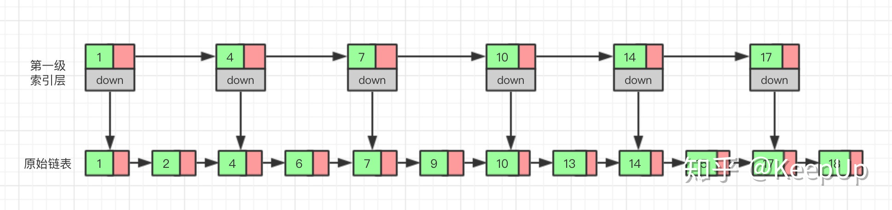
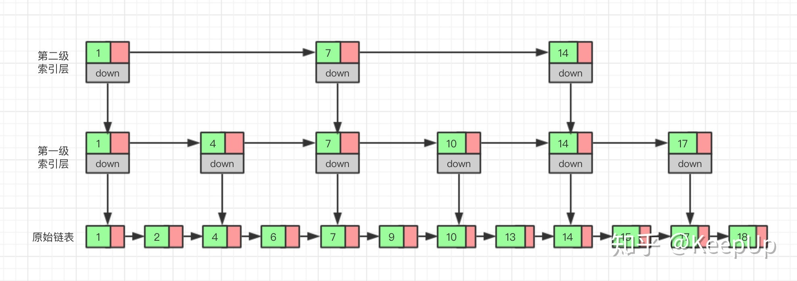
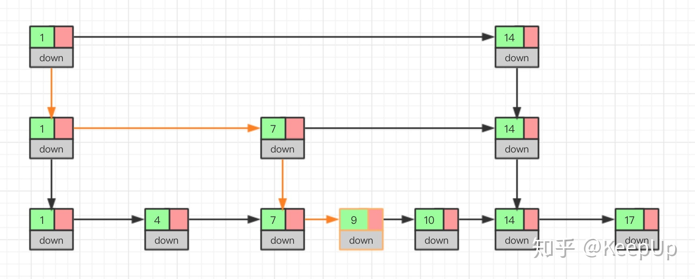
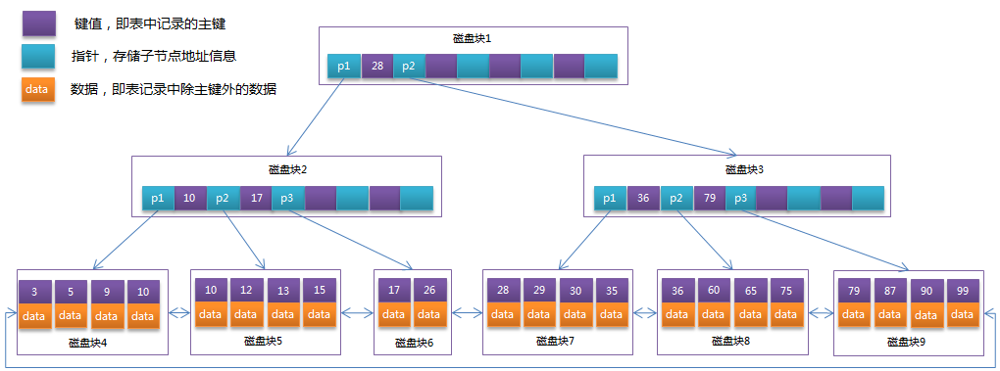

## 哈希表

**什么是Hash Map？**

Hash表也称散列表，也有直接译作哈希表，Hash表是一种根据关键字值（key - value）而直接进行访问的数据结构。它基于数组，通过把关键字映射到数组的某个下标来加快查找速度，但是又和链表、树等数据结构不同，在这些数据结构中查找某个关键字，通常要遍历整个数据结构，也就是O(N)的时间级，但是对于哈希表来说，只是O(1)的时间级。

哈希表也可以当做一种缓存产品来使用，我们知道，频繁的访问数据库会造成非常大的系统开销，因而出现了很多的缓存产品，例如redis；我们也可以将频繁访问的数据存放在哈希表中，这样每次获取哈希表的值就不用从数据库获取，减少系统开销。  

**哈希函数**

哈希函数就是把一个大范围的数字哈希（转化）成一个小范围的数字，这个小范围的数对应着数组的下标。使用哈希函数向数组插入数据后，这个数组就是哈希表。

**哈希冲突**

多个key映射到相同的数组下标，即发生了哈希冲突；常见解决冲突的方法有：开放地址法、链地址法、桶

* 开放地址法

  * 线性探测：指的就是线性的查找空白单元，例如我们要插入的key对应哈希表数组的下标是3，并且这个位置3已经被其它数据占用了，那么会查看下一个位置4是否被占用，若被占用，继续往下递增查找，直到找到一个空白的位置。
  * 二次探测：二次探测的思想是探测相距较远的单元，而不是和原始位置相邻的单元，二次探测可以防止聚集的产生；但是二次探测法也会导致二次聚集的产生。线性探测中，如果哈希函数计算的原始下标是x, 线性探测就是x+1, x+2, x+3, 以此类推；而在二次探测中，探测的过程是x+1, x+4, x+9, x+16，以此类推，到原始位置的距离是步数的平方。
  * 再哈希法：再哈希法是为了消除聚集和二次聚集提出来的；因为线性探测和二次探测产生的探测序列步长总是固定的，容易产生聚集，而再哈希法是指出现冲突后，把关键字用不同的哈希函数再做一遍哈希化，用这个结果作为步长。对于指定的关键字，步长在整个探测中是不变的，不过不同的关键字使用不同的步长。
* 链地址法：链地址法的实现原理就是使用数组加链表，在哈希表每个单元中设置链表，当出现冲突后，不需要在原始的数组中寻找空位，而是将其他同样映射到这个位置的数据项加到链表中。
* 桶：类似于链地址法，它是在每个数据项中使用子数组，而不是链表。这样的数组称为桶。这个方法显然不如链表有效，因为桶的容量不好选择，如果容量太小，可能会溢出，如果太大，又造成性能浪费，而链表是动态分配的，不存在此问题。所以一般不使用桶。

> 对于开放寻址法解决冲突的散列表，由于数据都存储在数组中，因此可以有效地利用 CPU 缓存加快查询速度(数组占用一块连续的空间)。但是删除数据的时候比较麻烦，需要特殊标记已经删除掉的数据。而且，在开放寻址法中，所有的数据都存储在一个数组中，比起链表法来说，冲突的代价更高。所以，使用开放寻址法解决冲突的散列表，负载因子的上限不能太大。这也导致这种方法比链表法更浪费内存空间。
>
> 对于链表法解决冲突的散列表,对内存的利用率比开放寻址法要高。因为链表结点可以在需要的时候再创建，并不需要像开放寻址法那样事先申请好。链表法比起开放寻址法，对大装载因子的容忍度更高。开放寻址法只能适用装载因子小于1的情况。接近1时，就可能会有大量的散列冲突，性能会下降很多。但是对于链表法来说，只要散列函数的值随机均匀，即便装载因子变成10，也就是链表的长度变长了而已，虽然查找效率有所下降，但是比起顺序查找还是快很多。但是，链表因为要存储指针，所以对于比较小的对象的存储，是比较消耗内存的，而且链表中的结点是零散分布在内存中的，不是连续的，所以对CPU缓存是不友好的，这对于执行效率有一定的影响。
>

**聚集与装填因子**

当哈希表变得比较满时，我们每插入一个新的数据，都要频繁的探测插入位置，因为可能很多位置都被前面插入的数据所占用了，这称为聚集。数组填的越满，聚集越可能发生。

已填入哈希表的数据项和哈希表容量的比率叫做装填因子，用来判断什么时候进行扩容

> JAVA HashMap的装填因子是0.75
>

那加载因子为什么是 0.75 而不是 0.5 或者 1.0 呢？这其实是出于容量和性能之间平衡的结果：

* 当加载因子设置比较大的时候，扩容的门槛就被提高了，扩容发生的频率比较低，占用的空间会比较小，但此时发生Hash冲突的几率就会提升，因此需要更复杂的数据结构来存储元素，这样对元素的操作时间就会增加，运行效率也会因此降低；
* 而当加载因子值比较小的时候，扩容的门槛会比较低，因此会占用更多的空间，此时元素的存储就比较稀疏，发生哈希冲突的可能性就比较小，因此操作性能会比较高。

所以综合了以上情况就取了一个 0.5 到 1.0 的平均数 0.75 作为加载因子。  

**关于哈希表的扩容**

创建一个更大的数组，然后把旧数组中的数据插到新的数组中。但是需要注意的是：哈希表是根据数组大小计算给定数据的位置的，所以这些数据项不能再放在新数组中和老数组相同的位置上。因此不能直接拷贝，需要按顺序遍历老数组，调用insert方法插入每个数据项。

注：Java的HashMap扩容时一般把容量大小扩大一倍（为提升效率，哈希表的容量一般设为2的幂）

## 跳表

对于单链表来说，即使数据是已经排好序的，想要查询其中的一个数据，只能从头开始遍历链表，这样效率很低，时间复杂度很高，是 O(n)。

那我们有没有什么办法来提高查询的效率呢？我们可以为链表建立一个“索引”，这样查找起来就会更快，如下图所示，我们在原始链表的基础上，每两个结点提取一个结点建立索引，我们把抽取出来的结点叫做**索引层**或者 **索引** ，down 表示指向原始链表结点的指针。

现在如果我们想查找一个数据，比如说 15，我们首先在索引层遍历，当我们遍历到索引层中值为 14 的结点时，我们发现下一个结点的值为 17，所以我们要找的 15 肯定在这两个结点之间。这时我们就通过 14 结点的 down 指针，回到原始链表，然后继续遍历，这个时候我们只需要再遍历两个结点，就能找到我们想要的数据。好我们从头看一下，整个过程我们一共遍历了 7 个结点就找到我们想要的值，如果没有建立索引层，而是用原始链表的话，我们需要遍历 10 个结点。

通过这个例子我们可以看出来，通过建立一个索引层，我们查找一个基点需要遍历的次数变少了，也就是查询的效率提高了。

那么如果我们给索引层再加一层索引呢？遍历的结点会不会更少呢，效率会不会更高呢？我们试试就知道了。

现在我们再来查找 15，我们从第二级索引开始，最后找到 15，一共遍历了 6 个结点，果然效率更高。

当然，因为我们举的这个例子数据量很小，所以效率提升的不是特别明显，如果数据量非常大的时候，我们多建立几层索引，效率提升的将会非常的明显。**这种通过对链表加多级索引的机构，就是跳表**

* 如果每2个节点建立一个索引，则跳表的时间复杂度为$O(2log(n))$
* 跳表就是用空间来换时间

我们想要为跳表插入或者删除数据，我们首先需要找到插入或者删除的位置，然后执行插入或删除操作，前边我们已经知道了，跳表的查询的时间复杂度为 O(logn），因为找到位置之后插入和删除的时间复杂度很低，为 O(1)，所以最终插入和删除的时间复杂度也为 O(longn)。

我么通过图看一下插入的过程。

删除操作的话，如果这个结点在索引中也有出现，我们除了要删除原始链表中的结点，还要删除索引中的。因为单链表中的删除操作需要拿到要删除结点的前驱结点，然后通过指针操作完成删除。所以在查找要删除的结点的时候，一定要获取前驱结点。当然，如果我们用的是双向链表，就不需要考虑这个问题了。

如果我们不停的向跳表中插入元素，就可能会造成两个索引点之间的结点过多的情况。结点过多的话，我们建立索引的优势也就没有了。所以我们需要维护索引与原始链表的大小平衡，也就是结点增多了，索引也相应增加，避免出现两个索引之间结点过多的情况，查找效率降低。

跳表是通过一个随机函数来维护这个平衡的，当我们向跳表中插入数据的的时候，我们可以选择同时把这个数据插入到索引里，那我们插入到哪一级的索引呢，这就需要随机函数，来决定我们插入到哪一级的索引中。

这样可以很有效的防止跳表退化，而造成效率变低。

## B树与B+树

B树（B-tree）是一种树状数据结构，它能够存储数据、对其进行排序并允许以O(log n)的时间复杂度运行进行查找、顺序读取、插入和删除的数据结构。B树，概括来说是**一个节点可以拥有多于2个子节点的二叉查找树**。

B+树是B树的一种变形体，它与B树的差异在于：

* 有K个子节点的节点必然有K个关键码
* 非叶节点仅具有索引作用，元素信息均存放在叶节点中
* 树的所有叶节点构成一个有序链表，可以按照关键码排序的次序遍历全部记录

B+树的优势：

* 由于B+树在内部节点上不包含数据信息，因此在内存页中能够存放更多的key。 数据存放的更加紧密，具有更好的空间局部性。因此访问叶子节点上关联的数据也具有更好的缓存命中率。
* B+树的叶子节点都是相连的，因此对整棵树的遍历只需要一次线性遍历叶子节点即可。而且由于数据顺序排列并且相连，所以便于区间查找和搜索。而B树则需要进行每一层的递归遍历。相邻的元素可能在内存中不相邻，所以缓存命中性没有B+树好。

> 我们知道二叉查找树的时间复杂度是Ｏ(logN)，效率已经足够高。为什么出现B树和B+树呢？当大量数据存储在磁盘上，进行查询操作时，需要先将数据加载到内存中（磁盘IO操作），而数据并不能一次性全部加载到内存中，只能逐一加载每个磁盘页（对应树的一个节点），并且磁盘IO操作很慢，平衡二叉树由于树深度过大而造成磁盘IO读写过于频繁，进而导致效率低下。为了减少磁盘IO的次数，就需要降低树的深度，那么就引出了B树和B+树：每个节点存储多个元素，采用多叉树结构。这样就提高了效率，比如数据库索引，就是存储在磁盘上，采用的就是B+树的数据结构。
>

> 在MySQL中，一个InnoDB页就是一个B+树节点，默认是16KB，所以默认情况下一颗两层的B+树可以存储2000万行数据，然后通过叶子节点存储所有的数据并进行了排序，并且叶子节点之间有指针，可以更好的支持全表扫描，范围查找等SQL语句
>

## 红黑树

**有了二叉搜索树，为什么还需要平衡二叉树？**

* 在学习二叉搜索树、平衡二叉树时，我们不止一次提到，二叉搜索树容易退化成一条链
* 引入对左右子树高度差有限制的平衡二叉树，保证查找操作的最坏时间复杂度也为$O(log_2N)$

**有了平衡二叉树，为什么还需要红黑树？**

* AVL的左右子树高度差不能超过1，每次进行插入/删除操作时，几乎都需要通过旋转操作保持平衡
* 在频繁进行插入/删除的场景中，频繁的旋转操作使得AVL的性能大打折扣
* 红黑树通过牺牲严格的平衡，换取插入/删除时少量的旋转操作，**整体性能**优于AVL

  * 红黑树插入时的不平衡，不超过两次旋转就可以解决；删除时的不平衡，不超过三次旋转就能解决
* 红黑树的红黑规则，保证最坏的情况下，也能在$O(log_2N)$时间内完成查找操作。

**红黑树规则**

* 节点不是黑色，就是红色（非黑即红）
* **根节点为黑色**
* **叶节点为黑色，且不存储数据**（叶节点是指末梢的空节点 `Nil`或`Null`）
* **一个节点为红色，则其两个子节点必须是黑色的**（根到叶子的所有路径，不可能存在两个连续的红色节点）
* **每个节点到叶子节点的所有路径，都包含相同数目的黑色节点**（相同的黑色高度）

**红黑树的应用**

* Java中，TreeMap、TreeSet都使用红黑树作为底层数据结构
* JDK 1.8开始，HashMap也引入了红黑树：当冲突的链表长度超过8时，自动转为红黑树
* Linux底层的CFS进程调度算法中，vruntime使用红黑树进行存储。
* 多路复用技术的Epoll，其核心结构是红黑树 + 双向链表。  
   
