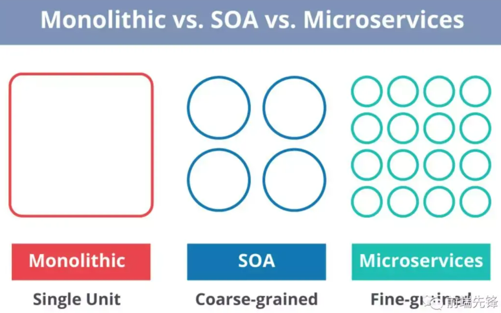

## 微服务架构的优势

|**优势**|**说明**|
| --------------------------| ------------------------------------------------------|
|***独立开发***|所有微服务都可以根据各自的功能轻松开发|
|***独立部署***|根据他们所提供的服务，可以在任何应用中单独部署|
|***故障隔离***|即使应用中的一个服务不起作用，系统仍然继续运行|
|***混合技术栈***|可以用不同的语言和技术来构建同一应用程序的不同服务|
|***粒度缩放***|各个组件可根据需要进行扩展，无需将所有组件融合到一起|

## 你对微服务是怎么理解的

* **微服务** ，又名 **微服务架构** ，是一种架构风格，它将应用构建为一个小型自治服务的集合，以**业务领域为模型。**
* 通俗地说，就像蜜蜂通过对蜡制的等边六角形单元来构建它们的蜂巢。
* 他们最初从使用各种材料的小单元开始，一点点的搭建出一个大型蜂巢。
* 这些小单元组成坚固的结构，将蜂窝的特定部分固定在一起。
* 这里，每个小单元都独立于另一个，但它也与其他小单元相关。
* 这意味着对一个小单元的损害不会损害其他的单元，因此，蜜蜂可以在不影响完整蜂巢的情况下重建这些单元。

## 微服务有哪些特点

* **解耦（Decoupling）** - 系统内的服务很大程度上是分离的。因此整个应用可以被轻松构建、修改和扩展
* **组件化（Componentization）** - 微服务被视为可以被轻松替换和升级的独立组件
* **业务能力（Business Capabilities）** - 微服务非常简单，专注于单一功能
* **自治（Autonomy）** - 开发人员和团队可以相互独立工作，从而提高效率
* **持续交付（ContinousDelivery）** - 允许频繁发版，通过系统自动化完成对软件的创建、测试和审核，
* **责任（Responsibility）** - 微服务不把程序作为项目去关注。相反，他们将程序视为自己负责的产品
* **分散治理（Decentralized Governance）** - 重点是用正确的工具去做正确的事。这意味着没有任何标准化模式或着技术模式。开发人员可以自由选择最合适的工具来解决自己的问题
* **敏捷性（Agility）** - 微服务支持敏捷开发。任何新功能都可以快速开发并被再次丢弃

## 设计微服务的最佳实践是什么

1. 为每个微服务分开数据存储
2. 将代码保持在类似的成熟度等级上
3. 为每个微服务进行单独的构建
4. 部署到容器中
5. 将服务器视为无状态的

## 微服务的架构是如何运作的

* **Clients** – 来自不同设备的不同用户发送请求。
* **Identity Providers** – 对用户或客户端身份进行身份验证，并颁发安全令牌。
* **API Gateway** – 处理客户端请求。
* **Static Content** – 容纳系统的所有内容。
* **Management** – 平衡节点上的服务压力并识别故障。
* **Service Discovery** – 用于找到微服务之间通信路径的向导。
* **Content Delivery Networks** – 代理服务器及其数据中心的分布式网络。
* **Remote Service** – 启用驻留在 IT 设备网络上的远程访问信息。

## 微服务架构的优点和缺点是什么

|**微服务架构的优点**|**微服务架构的缺点**|
| ----------------------------| ----------------------------|
|可以自由使用不同的技术|增加故障排除的难度|
|每个微服务都专注于单一功能|由于远程调用而导致延迟增加|
|支持单个可部署单元|增加配置和其他操作的工作量|
|允许软件的持续发布|难以维持处理的安全性|
|可确保每项服务的安全性|很难跟踪各种边界的数据|
|并行开发和部署多个服务|服务之间难以编码|

## 单体应用、SOA和微服务架构有什么区别

* **单体应用**类似于一个大容器，其中程序的所有组件都被组装在一起并紧密包装。
* **SOA**是一组相互通信的服务。通信可以涉及简单的数据传送，也可以涉及两个或多个协调某些活动的服务。
* **微服务架构**是一种架构风格，它将应用程序构建为以业务域为模型的小型自治服务集合。

## SOA 和微服务架构之间的主要区别是什么

|**SOA**|**微服务**|
| ----------------------------------------------| ---------------------------------------------------------|
|遵循“ **尽可能多的共享** ”架构方法|遵循“ **尽可能少的共享** ”的架构方法|
|侧重点是**业务功能**重用|侧重点在于“ **bounded context** ”的概念|
|遵循**共同治理**并有相关的标准|专注于**人的合作**和其他选择的自由|
|使用 **企业服务总线（ESB）** 进行通信|简单的消息系统|
|支持**多消息协议**|使用 **轻量级协议** ，例如 **HTTP/REST** 等|
|**多线程** ，有更多的开销来处理I / O|**单线程** ，通常使用事件循环进行非锁定 I/O 处理|
|最大化服务的可重用性|专注于**解耦**|
|使用**传统关系数据库**较多|使用**现代关系型数据库**较多|
|系统发生变化时需要修改整体|系统发生变化是创建一项新服务|
|DevOps和持续交付正在变得流行，但尚未成为主流|专注于DevOps和持续交付|

## 微服务有什么特点

* 围绕业务功能组织团队
* 做产品而不是做项目
* 基本的消息传递框架
* 去中心化治理
* 去中心化管理数据
* 基础设施自动化
* 容错设计

## 什么是领域驱动设计（DDD）

* 专注于核心领域逻辑
* 在模型上找到综合的设计
* 不断与领域专家合作，改进应用程序模型并解决与领域相关的问题

## 什么是内聚

**内聚**是一个模块内部各元素之间相关联程度的度量

## 什么是耦合

组件之间依赖关系强度的度量被称为 **耦合** 。好的设计总是**高内聚**和**低耦合**的。

## 什么是REST/RESTful ？它的用途是什么

**Representational State Transfer（REST）/ RESTful** （表述性状态转移）是一种帮助计算机系统通过 Internet 进行通信的架构风格。这使得微服务更容易理解和实现。

微服务可以用 RESTful API 来实现，当然也可以不用，但是用 RESTful API 去构建松散耦合的微服务总是更容易些。

## 什么是幂等性（Idempotence）及用在那里

**幂等性**是能够以同样的方式做两次，而最终结果将保持不变，就好像它只做了一次的特性。

**用法** ：在远程服务或数据源中使用幂等性，以便当它多次接收指令时，只处理一次。

## 什么是服务网格

服务网格（Service Mesh）是处理服务间通信的基础设施层。它负责构成现代云原生应用程序的复杂服务拓扑来可靠地交付请求。在实践中，Service Mesh 通常以轻量级网络代理阵列的形式实现，这些代理与应用程序代码部署在一起，对应用程序来说无需感知代理的存在。

> 如果用一句话来解释什么是 Service Mesh，可以将它比作是应用程序或者说微服务间的 TCP/IP，负责服务之间的网络调用、限流、熔断和监控。对于编写应用程序来说一般无须关心 TCP/IP 这一层（比如通过 HTTP 协议的 RESTful 应用），同样使用 Service Mesh 也就无须关心服务之间的那些原本通过服务框架实现的事情，比如 Spring Cloud、Netflix OSS 和其他中间件，现在只要交给 Service Mesh 就可以了。
>

## 服务网格的特点是什么

* 应用程序间通信的中间层
* 轻量级网络代理
* 应用程序无感知
* 解耦应用程序的重试/超时、监控、追踪和服务发现

## 服务网格如何工作

1. Sidecar（Istio 中使用 [Envoy](https://envoyproxy.io/) 作为 sidecar 代理）将服务请求路由到目的地址，根据请求中的参数判断是到生产环境、测试环境还是 staging 环境中的服务（服务可能同时部署在这三个环境中），是路由到本地环境还是公有云环境？所有的这些路由信息可以动态配置，可以是全局配置也可以为某些服务单独配置。这些配置是由服务网格的控制平面推送给各个 sidecar 的，
2. 当 sidecar 确认了目的地址后，将流量发送到相应服务发现端点，在 Kubernetes 中是 service，然后 service 会将服务转发给后端的实例。
3. Sidecar 根据它观测到最近请求的延迟时间，选择出所有应用程序的实例中响应最快的实例。
4. Sidecar 将请求发送给该实例，同时记录响应类型和延迟数据。
5. 如果该实例挂了、不响应了或者进程不工作了，sidecar 会将把请求发送到其他实例上重试。
6. 如果该实例持续返回 error，sidecar 会将该实例从负载均衡池中移除，稍后再周期性得重试。
7. 如果请求的截止时间已过，sidecar 主动标记该请求为失败，而不是再次尝试添加负载。
8. SIdecar 以 metric 和分布式追踪的形式捕获上述行为的各个方面，这些追踪信息将发送到集中 metric 系统。

## 为什么使用Service Mesh

在传统的 MVC 三层 Web 应用程序架构下，服务之间的通讯并不复杂，在应用程序内部自己管理即可，但是在现今的复杂的大型网站情况下，单体应用被分解为众多的微服务，服务之间的依赖和通讯十分复杂，出现了 twitter 开发的 [Finagle](https://twitter.github.io/finagle/)、Netflix 开发的 [Hystrix](https://github.com/Netflix/Hystrix) 和 Google 的 Stubby 这样的 “胖客户端” 库，这些就是早期的 Service Mesh，但是它们都仅适用于特定的环境和特定的开发语言，并不能作为平台级的 Service Mesh 支持。

在 Cloud Native 架构下，容器的使用赋予了异构应用程序更多的可能性，Kubernetes 增强了应用的横向扩容能力，用户可以快速的编排出复杂环境、复杂依赖关系的应用程序，同时开发者又无须过分关心应用程序的监控、扩展性、服务发现和分布式追踪这些繁琐的事情，进而专注于程序开发，赋予开发者更多的创造性。
