## 概述

一共有23种设计模式

### 5种创建型模式

创建型模式的目的都是提供一个简单的接口，让对象的创建过程与使用者解耦。其中：

* 单例模式主要用于保证一个类仅有一个实例，并提供一个访问它的全局访问点；
* 建造者模式主要解决需要创建对象时需要传入多个参数，或者对初始化顺序有要求的场景；
* 工厂方法模式通过提供一个工厂对象或者工厂方法，为使用者隐藏了对象创建的细节；
* 抽象工厂模式是对工厂方法模式的优化，通过为工厂对象新增一个抽象层，让工厂对象遵循单一职责原则，也避免了霰弹式修改；
* 原型模式则让对象复制更加简单。

### 7种结构型模式

* 组合模式主要解决代码复用的问题，相比于继承关系，组合模式可以避免继承层次过深导致的代码复杂问题，因此面向对象设
* 计领域流传着组合优于继承的原则，而Go语言的设计也很好实践了该原则；
* 适配器模式可以看作是两个不兼容接口之间的桥梁，可以将一个接口转换成Client所希望的另外一个接口，解决了模块之间因为
* 接口不兼容而无法一起工作的问题；
* 桥接模式将模块的抽象部分和实现部分进行分离，让它们能够往各自的方向扩展，从而达到解耦的目的。
* 代理模式为一个对象提供一种代理以控制对该对象的访问，强调的是对本体对象的访问控制；
* 装饰模式能够动态地为本体对象叠加新的行为，强调的是为本体对象添加新的功能；
* 外观模式为子系统提供了一个更高层次的对外统一接口，强调的是分层和解耦；
* 享元模式通过共享对象来降低系统的资源消耗，强调的是如何在多个对象中共享相同的状态。

### 11种行为型模式

* 。。。

## 设计模式的6大原则

### 开闭原则

* 原则思想：尽量通过扩展软件实体来解决需求变化，而不是通过修改已有的代码来完成变化
* 描述：一个软件产品在生命周期内，都会发生变化，既然变化是一个既定的事实，我们就应该在设计的时候尽量适应这些变化，以提高项目的稳定性和灵活性。
* 优点：单一原则告诉我们，每个类都有自己负责的职责，里氏替换原则不能破坏继承关系的体系。

### 里氏代换原则

* 原则思想：使用的基类可以在任何地方使用继承的子类，完美的替换基类。
* 大概意思是：子类可以扩展父类的功能，但不能改变父类原有的功能。子类可以实现父类的抽象方法，但不能覆盖父类的非抽象方法，子类中可以增加自己特有的方法。
* 优点：增加程序的健壮性，即使增加了子类，原有的子类还可以继续运行，互不影响。

### 依赖倒转原则

* 依赖倒置原则的核心思想是面向接口编程.
* 依赖倒转原则要求我们在程序代码中传递参数时或在关联关系中，尽量引用层次高的抽象层类，
* 这个是开放封闭原则的基础，具体内容是：对接口编程，依赖于抽象而不依赖于具体。

### 接口隔离原则

* 这个原则的意思是：使用多个隔离的接口，比使用单个接口要好。还是一个降低类之间的耦合度的意思，从这儿我们看出，其实设计模式就是一个软件的设计思想，从大型软件架构出发，为了升级和维护方便。所以上文中多次出现：降低依赖，降低耦合。
* 例如：支付类的接口和订单类的接口，需要把这俩个类别的接口变成俩个隔离的接口

### 迪米特法则

* 原则思想：一个对象应当对其他对象有尽可能少地了解，简称类间解耦
* 大概意思就是一个类尽量减少自己对其他对象的依赖，原则是低耦合，高内聚，只有使各个模块之间的耦合尽量的低，才能提高代码的复用率。
* 优点：低耦合，高内聚。

### 单一职责原则

* 原则思想：一个方法只负责一件事情。
* 描述：单一职责原则很简单，一个方法 一个类只负责一个职责，各个职责的程序改动，不影响其它程序。 这是常识，几乎所有程序员都会遵循这个原则。
* 优点：降低类和类的耦合，提高可读性，增加可维护性和可拓展性，降低可变性的风险。

## 单例模式Singleton

主要用于保证一个类仅有一个实例，并提供一个访问它的全局访问点。

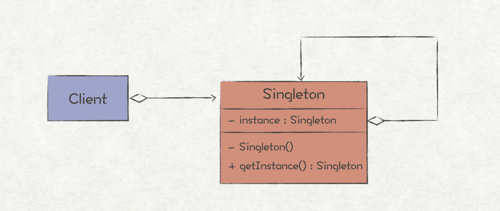

在程序设计中，有一些对象通常我们只需要一个共享的实例，比如线程池、全局缓存、对象池等，这种场景下就适合使用单例模式。

但是，并非所有全局唯一的场景都适合使用单例模式。比如，考虑需要统计一个API调用的情况，有两个指标，成功调用次数和失败调用次数。这两个指标都是全局唯一的，所以有人可能会将其建模成两个单例SuccessApiMetric和FailApiMetric。按照这个思路，随着指标数量的增多，你会发现代码里类的定义会越来越多，也越来越臃肿。这也是单例模式最常见的误用场景，更好的方法是将两个指标设计成一个对象ApiMetric下的两个实例ApiMetic success和ApiMetic fail。

如何判断一个对象是否应该被建模成单例？

* 通常，被建模成单例的对象都有“中心点”的含义，比如线程池就是管理所有线程的中心。所以，在判断一个对象是否适合单例模式时，先思考下，这个对象是一个中心点吗？

**Go实现**

* 在对某个对象实现单例模式时，有两个点必须要注意：（1）限制调用者直接实例化该对象；（2）为该对象的单例提供一个全局唯一的访问方法。
* 对于C++/Java而言，只需把类的构造函数设计成私有的，并提供一个static方法去访问该类点唯一实例即可。但对于Go语言来说，即没有构造函数的概念，也没有static方法，所以需要另寻出路。
* 我们可以利用Go语言package的访问规则来实现，将单例结构体设计成首字母小写，就能限定其访问范围只在当前package下，模拟了C++/Java中的私有构造函数；再在当前package下实现一个首字母大写的访问函数，就相当于static方法的作用了。

```go
// Singleton 饿汉式
type Singleton struct {}

var singleton *Singleton

func init() {
    singleton = &Singleton{}
}

func GetInstance() *Singleton {
    return singleton
}

// 懒汉式,双重检测
import "sync"

var (
    lazySingleton *Singleton
    once          = &sync.Once{}
)

func GetLazySingleton() *Singleton {
    if lazySingleton == nil {
	once.Do(func() {
	    lazySingleton = &Singleton{}
	})
    }
    return lazySingleton
}

```

## 建造者模式Builder

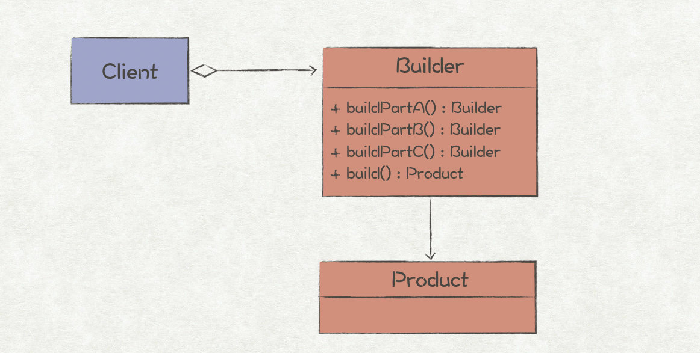

在程序设计中，我们会经常遇到一些复杂的对象，其中有很多成员属性，甚至嵌套着多个复杂的对象。这种情况下，创建这个复杂对象就会变得很繁琐。  

对于C++/Java而言，最常见的表现就是构造函数有着长长的参数列表;而对于Go语言来说，最常见的表现就是多层的嵌套实例化  

针对这种对象成员较多，创建对象逻辑较为繁琐的场景，就适合使用建造者模式来进行优化。  

造者模式的作用有如下几个：

* 封装复杂对象的创建过程，使对象使用者不感知复杂的创建逻辑。
* 可以一步步按照顺序对成员进行赋值，或者创建嵌套对象，并最终完成目标对象的创建。
* 对多个对象复用同样的对象创建逻辑。

```go
type Message struct {
	Header *Header
	Body   *Body
}

type Header struct {
	ScrAddr  string
	ScrPort  uint64
	DestAddr string
	DestPort uint64
	Items    map[string]string
}

type Body struct {
	Items []string
}

// Message对象的builder对象
type builder struct {
	once *sync.Once
	msg  *Message
}

// Builder 创建builder对象
func Builder() *builder {
	return &builder{
		once: &sync.Once{},
		msg: &Message{
			Header: &Header{},
			Body:   &Body{},
		},
	}
}

func (b *builder) WithSrcAddr(srcAddr string) *builder {
	b.msg.Header.ScrAddr = srcAddr
	return b
}

func (b *builder) WithSrcPort(srcPort uint64) *builder {
	b.msg.Header.ScrPort = srcPort
	return b
}

func (b *builder) WithDestAddr(destAddr string) *builder {
	b.msg.Header.DestAddr = destAddr
	return b
}

func (b *builder) WithDestPort(destPort uint64) *builder {
	b.msg.Header.DestPort = destPort
	return b
}

func (b *builder) WithHeaderItem(key, value string) *builder {
	// 保证map只初始化一次
	b.once.Do(func() {
		b.msg.Header.Items = make(map[string]string)
	})
	b.msg.Header.Items[key] = value
	return b
}

func (b *builder) WithBodyItem(record string) *builder {
	b.msg.Body.Items = append(b.msg.Body.Items, record)
	return b
}

// Build 创建Message对象，最后一步调用
func (b *builder) Build() *Message {
	return b.msg
}
```

## 工厂

### 简单工厂

由于 Go 本身是没有构造函数的，一般而言我们采用 NewName 的方式创建对象/接口，当它返回的是接口的时候，其实就是简单工厂模式

```go
type IRuleConfigParser interface { // 定义一个规则解析接口
	Parse(data []byte)
}

type jsonRuleConfigParser struct { // IRuleConfigParser接口的一个实现

}

func (j jsonRuleConfigParser) Parse(data []byte) {

}

type yamlRuleConfigParser struct { // IRuleConfigParser接口的一个实现

}

func (y yamlRuleConfigParser) Parse(data []byte) {

}

func NewIRuleConfigParser(t string) IRuleConfigParser { // 简单工场
	switch t {
	case "json":
		return jsonRuleConfigParser{}
	case "yaml":
		return yamlRuleConfigParser{}
	}
	return nil
}
```

### 工厂方法模式

当对象的创建逻辑比较复杂，不只是简单的 new 一下就可以，而是要组合其他类对象，做各种初始化操作的时候，推荐使用工厂方法模式，将复杂的创建逻辑拆分到多个工厂类中，让每个工厂类都不至于过于复杂

```go
type IRuleConfigParserFactory interface {
	CreateParser() IRuleConfigParser
}

type yamlRuleConfigParserFactory struct { // yamlRuleConfigParser的工厂类

}

func (y yamlRuleConfigParserFactory) CreateParser() IRuleConfigParser {
	return yamlRuleConfigParser{}
}

type jsonRuleConfigParserFactory struct { // jsonRuleConfigParser的工厂类

}

func (j jsonRuleConfigParserFactory) CreateParser() IRuleConfigParser {
	return jsonRuleConfigParser{}
}

// NewIRuleConfigParserFactory 用一个简单工厂封装工厂方法
func NewIRuleConfigParserFactory(t string) IRuleConfigParserFactory {
	switch t {
	case "json":
		return jsonRuleConfigParserFactory{}
	case "yaml":
		return yamlRuleConfigParserFactory{}
	}
	return nil
}
```

### 抽象工厂模式

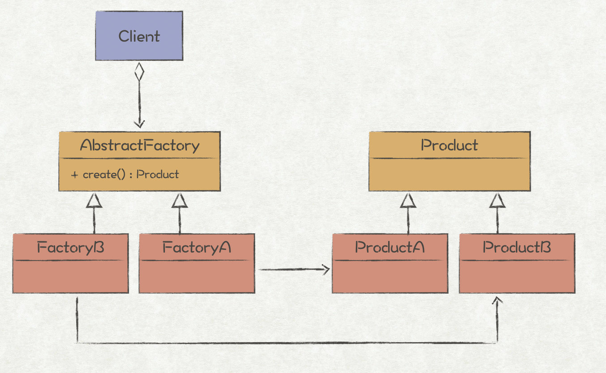

在工厂方法模式中，我们通过一个工厂对象来创建一个产品族，具体创建哪个产品，则通过swtich-case的方式去判断。这也意味着该产品组上，每新增一类产品对象，都必须修改原来工厂对象的代码；而且随着产品的不断增多，工厂对象的职责也越来越重，违反了单一职责原则。

抽象工厂模式通过给工厂类新增一个抽象层解决了该问题。例如，FactoryA和FactoryB都实现抽象工厂接口，分别用于创建ProductA和ProductB。如果后续新增了ProductC，只需新增一个FactoryC即可，无需修改原有的代码；因为每个工厂只负责创建一个产品，因此也遵循了单一职责原则。

与工厂方法模式的区别就在于，工厂方法模式针对的是一个产品等级结构；而抽象工厂模式则是针对的多个产品等级结构

```go
// ISystemConfigParser ISystemConfigParser
type ISystemConfigParser interface {
	ParseSystem(data []byte)
}

// jsonSystemConfigParser jsonSystemConfigParser
type jsonSystemConfigParser struct{}

// ParseSystem Parse
func (j jsonSystemConfigParser) ParseSystem(data []byte) {
	panic("implement me")
}

// IConfigParserFactory 工厂方法接口
type IConfigParserFactory interface {
	CreateRuleParser() IRuleConfigParser
	CreateSystemParser() ISystemConfigParser
}

type jsonConfigParserFactory struct{}

func (j jsonConfigParserFactory) CreateRuleParser() IRuleConfigParser {
	return jsonRuleConfigParser{}
}

func (j jsonConfigParserFactory) CreateSystemParser() ISystemConfigParser {
	return jsonSystemConfigParser{}
}
```

## 原型模式

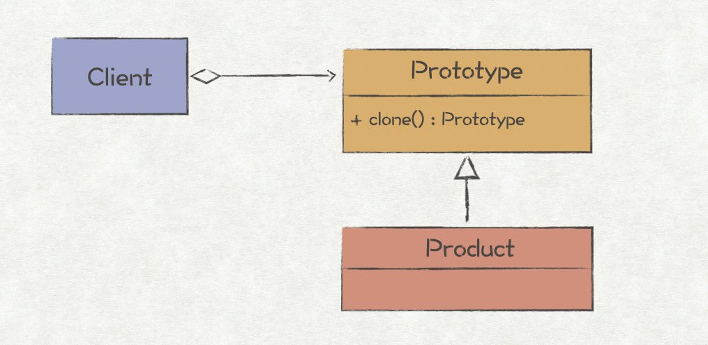

* 原型模式主要解决对象复制的问题，它的核心就是clone()方法，返回Prototype对象的复制品。在程序设计过程中，往往会遇到有一些场景需要大量相同的对象，如果不使用原型模式，那么我们可能会这样进行对象的创建：新创建一个相同对象的实例，然后遍历原始对象的所有成员变量，  
  并将成员变量值复制到新对象中。这种方法的缺点很明显，那就是使用者必须知道对象的实现细节，导致代码之间的耦合。另外，对象很有可能存在除了对象本身以外不可见的变量，这种情况下该方法就行不通了。
* 对于这种情况，更好的方法就是使用原型模式，将复制逻辑委托给对象本身，这样，上述两个问题也都迎刃而解了
* 使用场景

  * 对象的创建成本比较大，并且同一个类的不同对象之间差别不大
  * 对象的创建成本比较大：对象数据需要经过复杂的计算，排序，hash等；需要从rpc、网络、数据库等非常慢的io中获取

```go
type Keyword struct {
	Word      string
	Visit     int
	UpdatedAt *time.Time
}

// Clone 这里使用序列化和反序列化的方式进行深拷贝
func (k *Keyword) Clone() *Keyword {
	var newKeyword Keyword
	b, _ := json.Marshal(k)
	_ = json.Unmarshal(b, &newKeyword)
	return &newKeyword
}

type Keywords map[string]*Keyword

// Clone 复制一个新的 keywords
// updatedWords: 需要更新的关键词列表，由于从数据库中获取数据常常是数组的方式
func (words Keywords) Clone(updateWords []*Keyword) Keywords {
	newKeywords := Keywords{}
	for k, v := range words {
		// 这里是浅拷贝，直接拷贝了地址
		newKeywords[k] = v
	}
	// 替换需要更新的字段，这里用的是深拷贝
	for _, word := range updateWords {
		newKeywords[word.Word] = word.Clone()
	}
	return newKeywords
}
```

## 组合模式

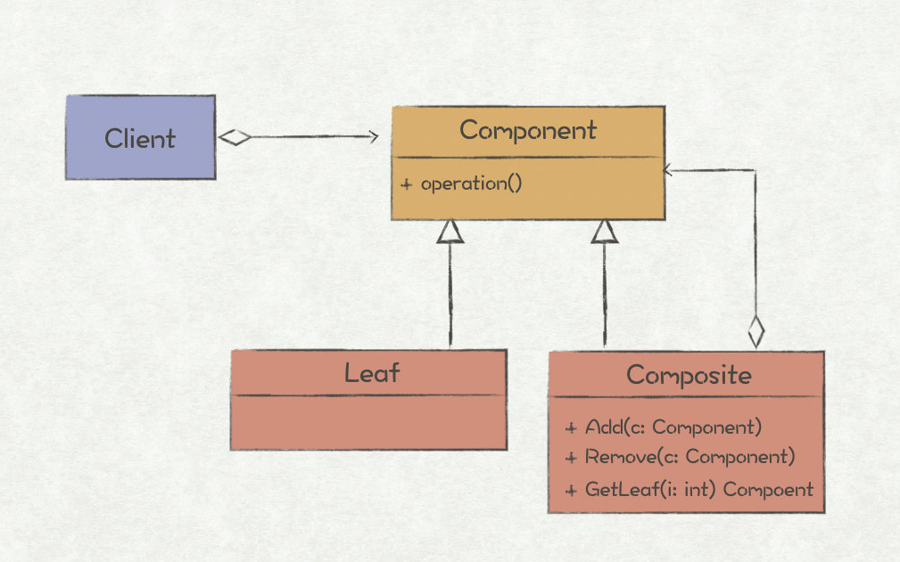

* 在面向对象编程中，有两个常见的对象设计方法，组合和继承，两者都可以解决代码复用的问题，但是使用后者时容易出现继承层次过深，对象关系过于复杂的副作用，从而导致代码的可维护性变差。因此，一个经典的面向对象设计原则是：组合优于继承。
* 我们都知道，组合所表示的语义为“has-a”，也就是部分和整体的关系，最经典的组合模式描述如下：

  * 将对象组合成树形结构以表示“部分-整体”的层次结构，使得用户对单个对象和组合对象的使用具有一致性。
* Go语言天然就支持了组合模式，而且从它不支持继承关系的特点来看，Go也奉行了组合优于继承的原则，鼓励大家在进行程序设计时多采用组合的方法。Go实现组合模式的方式有两种，分别是直接组合（Direct Composition）和嵌入组合（Embedding Composition）

```go
//公司的人员组织就是一个典型的树状的结构，现在假设我们现在有部分，和员工，两种角色，
//一个部门下面可以存在子部门和员工， 员工下面不能再包含其他节点。
//我们现在要实现一个统计一个部门下员工数量的功能

// IOrganization 组织接口，都实现统计人数的功能
type IOrganization interface {
	Count() int
}

// Employee 员工
type Employee struct {
	Name string
}

// Count 人数统计
func (Employee) Count() int {
	return 1
}

// Department 部门
type Department struct {
	Name string

	SubOrganizations []IOrganization
}

// Count 人数统计
func (d Department) Count() int {
	c := 0
	for _, org := range d.SubOrganizations {
		c += org.Count()
	}
	return c
}

// AddSub 添加子节点
func (d *Department) AddSub(org IOrganization) {
	d.SubOrganizations = append(d.SubOrganizations, org)
}

// NewOrganization 构建组织架构 demo
func NewOrganization() IOrganization {
	root := &Department{Name: "root"}
	for i := 0; i < 10; i++ {
		root.AddSub(&Employee{})
		root.AddSub(&Department{Name: "sub", SubOrganizations: []IOrganization{&Employee{}}})
	}
	return root
}
```

## 适配器模式

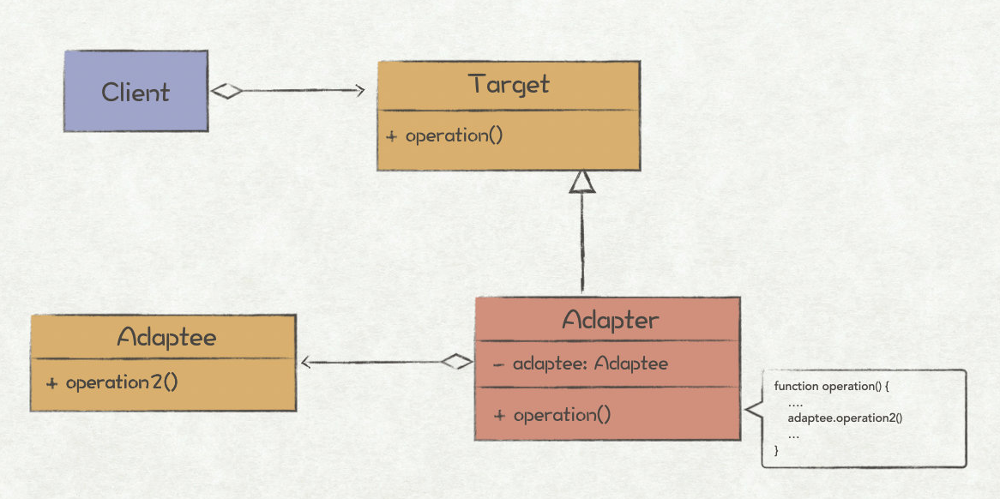

* 适配器模式是最常用的结构型模式之一，它让原本因为接口不匹配而无法一起工作的两个对象能够一起工作。在现实生活中，适配器模式也是处处可见，比如电源插头转换器，可以让英式的插头工作在中式的插座上。适配器模式所做的就是将一个接口Adaptee，通过适配器Adapter转换成Client所期望的另一个接口Target来使用，实现原理也很简单，就是Adapter通过实现Target接口，并在对应的方法中调用Adaptee的接口实现。
* 一个典型的应用场景是，系统中一个老的接口已经过时即将废弃，但因为历史包袱没法立即将老接口全部替换为新接口，这时可以新增一个适配器，将老的接口适配成新的接口来使用。适配器模式很好的践行了面向对象设计原则里的开闭原则（open/closed principle），新增一个接口时也无需修改老接口，只需多加一个适配层即可。

```go
// ICreateServer 创建云主机
type ICreateServer interface {
	CreateServer(cpu, mem float64) error
}

// AWSClient aws sdk
type AWSClient struct{}

// RunInstance 启动实例
func (c *AWSClient) RunInstance(cpu, mem float64) error {
	fmt.Printf("aws client run success, cpu： %f, mem: %f", cpu, mem)
	return nil
}

// AwsClientAdapter 适配器
type AwsClientAdapter struct {
	Client AWSClient
}

// CreateServer 启动实例
func (a *AwsClientAdapter) CreateServer(cpu, mem float64) error {
	a.Client.RunInstance(cpu, mem)
	return nil
}

// AliyunClient aliyun sdk
type AliyunClient struct{}

// CreateServer 启动实例
func (c *AliyunClient) CreateServer(cpu, mem int) error {
	fmt.Printf("aws client run success, cpu： %d, mem: %d", cpu, mem)
	return nil
}

// AliyunClientAdapter 适配器
type AliyunClientAdapter struct {
	Client AliyunClient
}

// CreateServer 启动实例
func (a *AliyunClientAdapter) CreateServer(cpu, mem float64) error {
	a.Client.CreateServer(int(cpu), int(mem))
	return nil
}
```

## 桥接模式

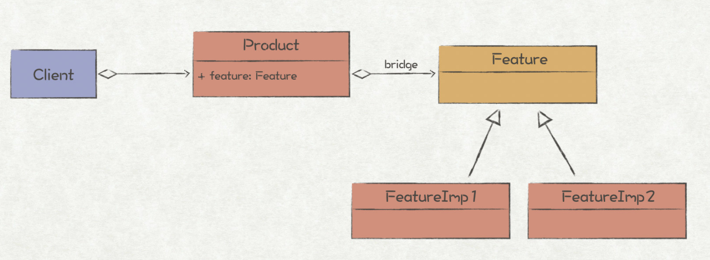

桥接模式主要用于将抽象部分和实现部分进行解耦，使得它们能够各自往独立的方向变化。它解决了在模块有多种变化方向的情况下，用继承所导致的类爆炸问题。

举一个例子，一个产品有形状和颜色两个特征（变化方向），其中形状分为方形和圆形，颜色分为红色和蓝色。如果采用继承的设计方案，那么就需要新增4个产品子类：方形红色、圆形红色、方形蓝色、圆形红色。如果形状总共有m种变化，颜色有n种变化，那么就需要新增m*n个产品子类！

现在我们使用桥接模式进行优化，将形状和颜色分别设计为一个抽象接口独立出来，这样需要新增2个形状子类：方形和圆形，以及2个颜色子类：红色和蓝色。同样，如果形状总共有m种变化，颜色有n种变化，总共只需要新增m+n个子类！

```go
// Computer 电脑接口
type Computer interface {
	Print()
	SetPrinter(printer Printer)
}

// Windows windows电脑
type Windows struct {
	printer Printer
}

func (w Windows) Print() {
	fmt.Println("windows")
}

func (w *Windows) SetPrinter(printer Printer) {
	w.printer = printer
	w.printer.PrintFile()
}

// Mac mac电脑
type Mac struct {
	printer Printer
}

func (m Mac) Print() {
	fmt.Println("mac")
	m.printer.PrintFile()
}

func (m *Mac) SetPrinter(printer Printer) {
	m.printer = printer
}

// Printer 打印机接口
type Printer interface {
	PrintFile()
}

// HP 惠普打印机
type HP struct {
}

func (h HP) PrintFile() {
	fmt.Println("HP")
}

// Epson 爱普生打印机
type Epson struct {
}

func (e Epson) PrintFile() {
	fmt.Println("epson")
}
```

## 代理模式

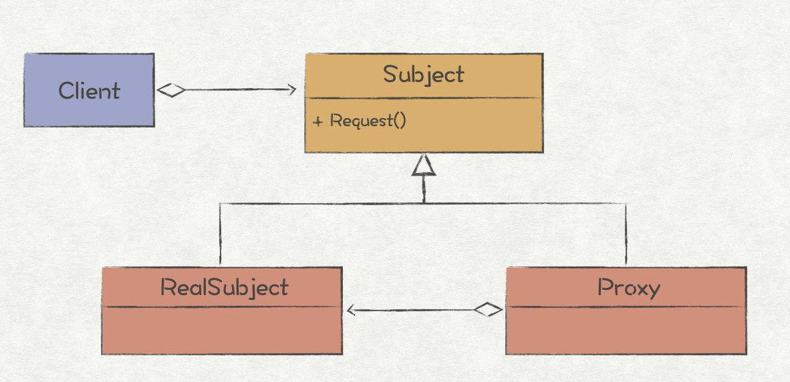

* 代理模式为一个对象提供一种代理以控制对该对象的访问，它是一个使用率非常高的设计模式，即使在现实生活中，也是很常见，比如演唱会门票黄牛。假设你需要看一场演唱会，但是官网上门票已经售罄，于是就当天到现场通过黄牛高价买了一张。在这个例子中，黄牛就相当于演唱会门票的代理，在正式渠道无法购买门票的情况下，你通过代理完成了该目标。
* 从演唱会门票的例子我们也可以看出，使用代理模式的关键在于当Client不方便直接访问一个对象时，提供一个代理对象控制该对象的访问。Client实际上访问的是代理对象，代理对象会将Client的请求转给本体对象去处理。
* 在程序设计中，代理模式也分为好几种：

  * 远程代理（remote proxy），远程代理适用于提供服务的对象处在远程的机器上，通过普通的函数调用无法使用服务，需要经过远程代理来完成。因为并不能直接访问本体对象，所有远程代理对象通常不会直接持有本体对象的引用，而是持有远端机器的地址，通过网络协议去访问本体对象。
  * 虚拟代理（virtual proxy），在程序设计中常常会有一些重量级的服务对象，如果一直持有该对象实例会非常消耗系统资源，这时可以通过虚拟代理来对该对象进行延迟初始化。
  * 保护代理（protection proxy），保护代理用于控制对本体对象的访问，常用于需要给Client的访问加上权限验证的场景。
  * 缓存代理（cache proxy），缓存代理主要在Client与本体对象之间加上一层缓存，用于加速本体对象的访问，常见于连接数据库的场景。
  * 智能引用（smart reference），智能引用为本体对象的访问提供了额外的动作，常见的实现为C++中的智能指针，为对象的访问提供了计数功能，当访问对象的计数为0时销毁该对象。

## 装饰器模式

* 在程序设计中，我们常常需要为对象添加新的行为，很多同学的第一个想法就是扩展本体对象，通过继承的方式达到目的。但是使用继承不可避免地有如下两个弊端：

  * 继承是静态的，在编译期间就已经确定，无法在运行时改变对象的行为。
  * 子类只能有一个父类，当需要添加的新功能太多时，容易导致类的数量剧增。
* 对于这种场景，我们通常会使用装饰模式（Decorator Pattern）来解决，它使用组合而非继承的方式，能够动态地为本体对象叠加新的行为。理论上，只要没有限制，它可以一直把功能叠加下去。装饰模式最经典的应用当属Java的I/O流体系，通过装饰模式，使用者可以动态地为原始的输入输出流添加功能，比如按照字符串输入输出，添加缓存等，使得整个I/O流体系具有很高的可扩展性和灵活性。
* 从结构上看，装饰模式和代理模式具有很高的相似性，但是两种所强调的点不一样。前者强调的是为本体对象添加新的功能，后者强调的是对本体对象的访问控制。当然，代理模式中的智能引用在笔者看来就跟装饰模式完全一样了。

```go
type IDraw interface {
	Draw() string
}

// Square 正方形
type Square struct{}

// Draw Draw
func (s Square) Draw() string {
	return "this is a square"
}

// ColorSquare 有颜色的正方形
type ColorSquare struct {
	square IDraw
	color  string
}

// NewColorSquare NewColorSquare
func NewColorSquare(square IDraw, color string) ColorSquare {
	return ColorSquare{color: color, square: square}
}

// Draw Draw
func (c ColorSquare) Draw() string {
	return c.square.Draw() + ", color is " + c.color
}
```

## 外观模式

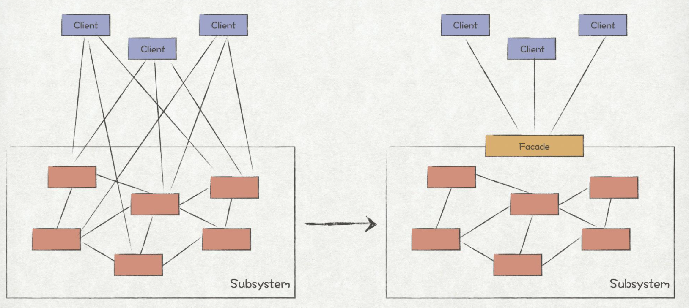

* 外观模式在程序设计中用的非常多，比如我们在商城上点击购买的按钮，对于购买者而言，只看到了购买这一统一的接口，但是对于商城系统而言，其内部则进行了一系列的业务处理，比如库存检查、订单处理、支付、物流等等。外观模式极大地提升了用户体验，将用户从复杂的业务流程中解放了出来。
* 外观模式经常运用于分层架构上，通常我们都会为分层架构中的每一个层级提供一个或多个统一对外的访问接口，这样就能让各个层级之间的耦合性更低，使得系统的架构更加合理。

```go
//假设现在我有一个网站，以前有登录和注册的流程，登录的时候调用用户的查询接口，注册时调用用户的创建接口。
//为了简化用户的使用流程，我们现在提供直接验证码登录/注册的功能，如果该手机号已注册那么我们就走登录流程，
//如果该手机号未注册，那么我们就创建一个新的用户。

type IUser interface {
	Login(phone int, code int) (*User, error)
	Register(phone int, code int) (*User, error)
}

type User struct {
	Name string
}

type IUserFacade interface {
	LoginOrRegister(phone int, code int) (*User, error)
}

type UserService struct {
}

func (s UserService) Login(phone int, code int) (*User, error) {
	return &User{Name: "test login"}, nil
}

func (s UserService) Register(phone int, code int) (*User, error) {
	return &User{Name: "test register"}, nil
}

func (s UserService) LoginOrRegister(phone int, code int) (*User, error) {
	user, err := s.Login(phone, code)
	if err != nil {
		return nil, err
	}
	if user != nil {
		return user, nil
	}
	return s.Register(phone, code)
}
```

## 享元模式

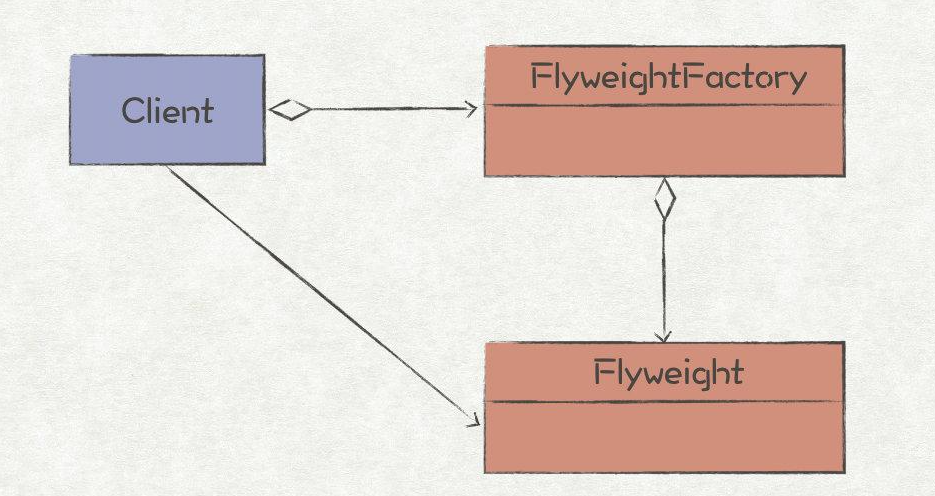

* 在程序设计中，我们常常会碰到一些很重型的对象，它们通常拥有很多的成员属性，当系统中充斥着大量的这些对象时，系统的内存将会承受巨大的压力。此外，频繁的创建这些对象也极大地消耗了系统的CPU。很多时候，这些重型对象里，大部分的成员属性都是固定的，这种场景下，  
  可以使用享元模式进行优化，将其中固定不变的部分设计成共享对象（享元，flyweight），这样就能节省大量的系统内存和CPU。
* 享元模式摒弃了在每个对象中保存所有数据的方式，  
  通过共享多个对象所共有的相同状态， 让你能在有限的内存容量中载入更多对象。
* 当我们决定对一个重型对象采用享元模式进行优化时，首先需要将该重型对象的属性划分为两类，能够共享的和不能共享的。前者我们称为内部状态（intrinsic state），存储在享元中，不随享元所处上下文的变化而变化；后者称为外部状态（extrinsic state），它的值取决于享元所处的上下文，因此不能共享。比如，文章A和文章B都引用了图片A，由于文章A和文章B的文字内容是不一样的，因此文字就是外部状态，不能共享；但是它们所引用的图片A是一样的，属于内部状态，因此可以将图片A设计为一个享元
* 工厂模式通常都会和享元模式结对出现，享元工厂提供了唯一获取享元对象的接口，这样Client就感知不到享元是如何共享的，降低了模块的耦合性。享元模式和单例模式有些类似的地方，都是在系统中共享对象，但是单例模式更关心的是对象在系统中仅仅创建一次，而享元模式更关心的是如何在多个对象中共享相同的状态。

```go
//如果我们现在正在做一个棋牌类的游戏，例如象棋，无论是什么对局，棋子的基本属性其实是固定的，
//并不会因为随着下棋的过程变化。那我们就可以把棋子变为享元，让所有的对局都共享这些对象，以此达到节省内存的目的

var units = map[int]*ChessPieceUnit{
	1: {
		ID:    1,
		Name:  "車",
		Color: "red",
	},
	2: {
		ID:    2,
		Name:  "炮",
		Color: "red",
	},
	// ... 其他棋子
}

// ChessPieceUnit 棋子享元
type ChessPieceUnit struct {
	ID    uint
	Name  string
	Color string
}

// NewChessPieceUnit 工厂
func NewChessPieceUnit(id int) *ChessPieceUnit {
	return units[id]
}

// ChessPiece 棋子
type ChessPiece struct { // 位置会变化，而种类、颜色这些不变
	Unit *ChessPieceUnit
	X    int
	Y    int
}

// ChessBoard 棋局
type ChessBoard struct {
	chessPieces map[int]*ChessPiece
}

// NewChessBoard 初始化棋盘
func NewChessBoard() *ChessBoard {
	board := &ChessBoard{chessPieces: map[int]*ChessPiece{}}
	for id := range units {
		board.chessPieces[id] = &ChessPiece{
			Unit: NewChessPieceUnit(id),
			X:    0,
			Y:    0,
		}
	}
	return board
}

// Move 移动棋子
func (c *ChessBoard) Move(id, x, y int) {
	c.chessPieces[id].X = x
	c.chessPieces[id].Y = y
}
```

## 责任链模式

* 意图:

  * 为某个请求创建一个对象链，每个对象依次检查此请求，并对其进行处理，或者将它传给链中的下一个对象
* 关键代码:

  * 责任链中每个对象都拥有同一个父类（或接口）
* 应用实例:

  * 消息过滤器，权限拦截器
  * 用户发帖内容进行广告过滤，涉黄过滤，敏感词过滤等

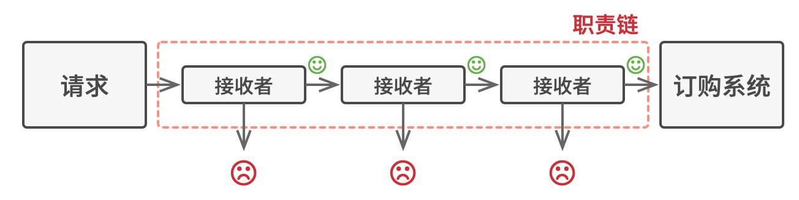

```go
// 例子：敏感词过滤器

// SensitiveWordsFilter 敏感词过滤器接口
type SensitiveWordsFilter interface {
	Filter(content string) bool
}

// SensitiveWordsFilterChain 责任链
type SensitiveWordsFilterChain struct {
	filters []SensitiveWordsFilter
}

// AddFilter 添加一个过滤器
func (c *SensitiveWordsFilterChain) AddFilter(filter SensitiveWordsFilter) {
	c.filters = append(c.filters, filter)
}

// Filter 执行过滤
func (c *SensitiveWordsFilterChain) Filter(content string) bool {
	for _, f := range c.filters {
		if !f.Filter(content) { // 如果发现词是敏感词则立刻返回
			return true
		}
	}
	return false
}

// AdSensitiveWordFilter 广告敏感词过滤
type AdSensitiveWordFilter struct {
}

func (a *AdSensitiveWordFilter) Filter(content string) bool {
	// 实现一些算法
	return false
}

// PoliticalSensitiveWordFilter 政治敏感词过滤
type PoliticalSensitiveWordFilter struct {
}

func (p *PoliticalSensitiveWordFilter) Filter(content string) bool {
	//实现一些算法
	return true
}
```

## 命令模式

* 命令模式是将一个请求封装为一个对象,从而使我们可用不同的请求对客户进行参数化;对请求排队或者记录请求日志,以及支持可撤销的操作.命令模式是一种对象行为型模式,其别名为动作模式或事务模式.

* 优秀的软件设计通常会将关注点进行分离， 而这往往会导致软件的分层。 最常见的例子： 一层负责用户图像界面； 另一层负责业务逻辑。 GUI 层负责在屏幕上渲染美观的图形， 捕获所有输入并显示用户和程序工作的结果。 当需要完成一些重要内容时 （比如计算月球轨道或撰写年度报告）， GUI 层则会将工作委派给业务逻辑底层。
* 这在代码中看上去就像这样： 一个 GUI 对象传递一些参数来调用一个业务逻辑对象。 这个过程通常被描述为一个对象发送请求给另一个对象。

* 命令模式建议 GUI 对象不直接提交这些请求。 你应该将请求的所有细节 （例如调用的对象、 方法名称和参数列表） 抽取出来组成命令类， 该类中仅包含一个用于触发请求的方法。
* 命令对象负责连接不同的 GUI 和业务逻辑对象。 此后， GUI 对象无需了解业务逻辑对象是否获得了请求， 也无需了解其对请求进行处理的方式。 GUI 对象触发命令即可， 命令对象会自行处理所有细节工作。

```go
// 假设现在有一个游戏服务，我们正在实现一个游戏后端
// 使用一个 goroutine 不断接收来自客户端请求的命令，并且将它放置到一个队列当中
// 然后我们在另外一个 goroutine 中来执行它

//------------------------将函数封装为对象-------------------------

// ICommand 命令
type ICommand interface { // 命令接口
	Execute() error
}

type Client struct { // 请求者
	command ICommand
}

func (c Client) Request() error {
	err := c.command.Execute()
	if err != nil {
		return err
	}
	return nil
}

// StartCommand 游戏开始运行
type StartCommand struct{} // 具体接口

// NewStartCommand NewStartCommand
func NewStartCommand( /*正常情况下这里会有一些参数*/ ) *StartCommand {
	return &StartCommand{}
}

// Execute Execute
func (c *StartCommand) Execute() error {
	fmt.Println("game start")
	return nil
}

// ArchiveCommand 游戏存档
type ArchiveCommand struct{} // 具体接口

// NewArchiveCommand NewArchiveCommand
func NewArchiveCommand( /*正常情况下这里会有一些参数*/ ) *ArchiveCommand {
	return &ArchiveCommand{}
}

// Execute Execute
func (c *ArchiveCommand) Execute() error {
	fmt.Println("game archive")
	return nil
}

//------------------------将函数直接作为参数----------------------------

// Command 命令
type Command func() error

// StartCommandFunc 返回一个 Command 命令
// 是因为正常情况下不会是这么简单的函数
// 一般都会有一些参数
func StartCommandFunc() Command {
	return func() error {
		fmt.Println("game start")
		return nil
	}
}

// ArchiveCommandFunc ArchiveCommandFunc
func ArchiveCommandFunc() Command {
	return func() error {
		fmt.Println("game archive")
		return nil
	}
}
```

## 迭代器模式

* 迭代器模式是一种行为设计模式， 让你能在不暴露集合底层表现形式 （列表、 栈和树等） 的情况下遍历集合中所有的元素
* 迭代器模式的主要思想是将集合背后的迭代逻辑提取至不同的、名为迭代器的对象中。此迭代器提供了一种泛型方法，可用于在集合上进行迭代，而又不受其类型影响。
* 除实现自身算法外， 迭代器还封装了遍历操作的所有细节， 例如当前位置和末尾剩余元素的数量。 因此， 多个迭代器可以在相互独立的情况下同时访问集合。
* 迭代器通常会提供一个获取集合元素的基本方法。 客户端可不断调用该方法直至它不返回任何内容， 这意味着迭代器已经遍历了所有元素。
* 所有迭代器必须实现相同的接口。 这样一来， 只要有合适的迭代器， 客户端代码就能兼容任何类型的集合或遍历算法。 如果你需要采用特殊方式来遍历集合， 只需创建一个新的迭代器类即可， 无需对集合或客户端进行修改。

```go
// Iterator 迭代器接口
type Iterator interface {
	HasNext() bool
	Next()
	// CurrentItem 获取当前元素，由于 Go 1.15 中还没有泛型，所以我们直接返回 interface{}
	CurrentItem() interface{}
}

// ArrayInt 数组
type ArrayInt []int

// Iterator 返回迭代器
func (a ArrayInt) Iterator() Iterator {
	return &ArrayIntIterator{
		arrayInt: a,
		index:    0,
	}
}

// ArrayIntIterator 数组迭代
type ArrayIntIterator struct {
	arrayInt ArrayInt
	index    int
}

// HasNext 是否有下一个
func (iter *ArrayIntIterator) HasNext() bool {
	return iter.index < len(iter.arrayInt)-1
}

// Next 游标加一
func (iter *ArrayIntIterator) Next() {
	iter.index++
}

// CurrentItem 获取当前元素
func (iter *ArrayIntIterator) CurrentItem() interface{} {
	return iter.arrayInt[iter.index]
}
```

## 中介者模式

中介者模式是一种行为设计模式，能让你减少对象之间混乱无序的依赖关系。该模式会限制对象之间的直接交互，迫使它们通过一个中介者对象进行合作。

* 对象之间存在大量的关联关系，势必会导致系统结构变得复杂。若一个对象改变，还要跟踪与其相关的对象，跟着一起改变。
* 中介者模式提供了一个中介类，该类通常处理不同类之间的通信，并且支持松耦合，使代码易于维护。

```go
// 假设我们现在有一个较为复杂的对话框，里面包括，登录组件，注册组件，以及选择框
// 当选择框选择“登录”时，展示登录相关组件
// 当选择框选择“注册”时，展示注册相关组件

// Input 假设这表示一个输入框
type Input string

// String String
func (i Input) String() string {
	return string(i)
}

// Selection 假设这表示一个选择框
type Selection string

// Selected 当前选中的对象
func (s Selection) Selected() string {
	return string(s)
}

// Button 假设这表示一个按钮
type Button struct {
	onClick func()
}

// SetOnClick 添加点击事件回调
func (b *Button) SetOnClick(f func()) {
	b.onClick = f
}

// IMediator 中介模式接口
type IMediator interface {
	HandleEvent(component interface{})
}

// Dialog 对话框组件
type Dialog struct {
	LoginButton         *Button
	RegButton           *Button
	Selection           *Selection
	UsernameInput       *Input
	PasswordInput       *Input
	RepeatPasswordInput *Input
}

// HandleEvent HandleEvent
func (d *Dialog) HandleEvent(component interface{}) {
	switch {
	case reflect.DeepEqual(component, d.Selection):
		if d.Selection.Selected() == "登录" {
			fmt.Println("select login")
			fmt.Printf("show: %s\n", d.UsernameInput)
			fmt.Printf("show: %s\n", d.PasswordInput)
		} else if d.Selection.Selected() == "注册" {
			fmt.Println("select register")
			fmt.Printf("show: %s\n", d.UsernameInput)
			fmt.Printf("show: %s\n", d.PasswordInput)
			fmt.Printf("show: %s\n", d.RepeatPasswordInput)
		}
		// others, 如果点击了登录按钮，注册按钮
	}
}
```

## 备忘录模式

* 备忘录模式是一种行为设计模式，允许在不暴露对象实现细节的情况下保存和恢复对象之前的状态
* 备忘录模式就是在不破坏封装的前提下，捕获一个对象的内部状态，并且在对象之外保存这个状态，这样可以在以后将这个对象恢复的原先保存的状态。
* 备忘录模式将创建状态快照 （Snapshot） 的工作委派给实际状态的拥有者原发器（Originator） 对象。 这样其他对象就不再需要从 “外部” 复制编辑器状态了，编辑器类拥有其状态的完全访问权， 因此可以自行生成快照。
* 模式建议将对象状态的副本存储在一个名为备忘录（Memento） 的特殊对象中。除了创建备忘录的对象外， 任何对象都不能访问备忘录的内容。 其他对象必须使用受限接口与备忘录进行交互， 它们可以获取快照的元数据（创建时间和操作名称等）， 但不能获取快照中原始对象的状态。

## 观察者模式

也叫发布-订阅模式，允许你定义一种订阅机制， 可在对象事件发生时通知多个 “观察” 该对象的其他对象

```go
type ISubject interface { // 被观察的主体，也叫发布者
	Register(o IObserver) // 订阅
	Remove(o IObserver)   //删除订阅
	Notify(msg string)    //通知
}

type IObserver interface { // 观察者，也叫订阅者
	Update(msg string)
}

type Subject struct { // 主体实现
	observers []IObserver
}

func (s *Subject) Register(o IObserver) {
	s.observers = append(s.observers, o)
}

func (s *Subject) Remove(o IObserver) {
	for i, ob := range s.observers {
		if ob == o {
			s.observers = append(s.observers[:i], s.observers[i+1:]...)
		}
	}
}

func (s *Subject) Notify(msg string) {
	for _, ob := range s.observers {
		ob.Update(msg)
	}
}

type Observer1 struct { // 观察者1

}

func (o Observer1) Update(msg string) {
	fmt.Printf("observer1 receive %s", msg)
}

type Observer2 struct { // 观察者2

}

func (o Observer2) Update(msg string) {
	fmt.Printf("observer2 receive %s", msg)
}
```

## 状态模式

* 状态模式是一种行为设计模式，让你能在一个对象的内部状态变化时改变其行为，使其看上去就像改变了自身所属的类一样
* 状态模式建议为对象的所有可能状态新建一个类，然后将所有状态的对应行为抽取到这些类中。
* 原始对象被称为上下文 （context）， 它并不会自行实现所有行为，而是会保存一个指向表示当前状态的状态对象的引用， 且将所有与状态相关的工作委派给该对象。
* 如需将上下文转换为另外一种状态，则需将当前活动的状态对象替换为另外一个代表新状态的对象。 采用这种方式是有前提的： 所有状态类都必须遵循同样的接口，而且上下文必须仅通过接口与这些对象进行交互。
* 这个结构可能看上去与策略模式相似，但有一个关键性的不同——在状态模式中，特定状态知道其他所有状态的存在， 且能触发从一个状态到另一个状态的转换； 策略则几乎完全不知道其他策略的存在。

```go
// 这是一个工作流的例子，在企业内部或者是学校我们经常会看到很多审批流程
// 假设我们有一个报销的流程: 员工提交报销申请 -> 直属部门领导审批 -> 财务审批 -> 结束
// 在这个审批流中，处在不同的环节就是不同的状态
// 而流程的审批、驳回就是不同的事件

// Machine 状态机
type Machine struct {
	state IState
}

// SetState 更新状态
func (m *Machine) SetState(state IState) {
	m.state = state
}

// GetStateName 获取当前状态
func (m *Machine) GetStateName() string {
	return m.state.GetName()
}

func (m *Machine) Approval() {
	m.state.Approval(m)
}

func (m *Machine) Reject() {
	m.state.Reject(m)
}

// IState 状态
type IState interface {
	// Approval 审批通过
	Approval(m *Machine)
	// Reject 驳回
	Reject(m *Machine)
	// GetName 获取当前状态名称
	GetName() string
}

// leaderApproveState 直属领导审批
type leaderApproveState struct{}

// Approval 获取状态名字
func (leaderApproveState) Approval(m *Machine) {
	fmt.Println("leader 审批成功")
	m.SetState(GetFinanceApproveState())
}

// GetName 获取状态名字
func (leaderApproveState) GetName() string {
	return "LeaderApproveState"
}

// Reject 获取状态名字
func (leaderApproveState) Reject(m *Machine) {}

func GetLeaderApproveState() IState {
	return &leaderApproveState{}
}

// financeApproveState 财务审批
type financeApproveState struct{}

// Approval 审批通过
func (f financeApproveState) Approval(m *Machine) {
	fmt.Println("财务审批成功")
	fmt.Println("出发打款操作")
}

// Reject 拒绝
func (f financeApproveState) Reject(m *Machine) {
	m.SetState(GetLeaderApproveState())
}

// GetName 获取名字
func (f financeApproveState) GetName() string {
	return "FinanceApproveState"
}

// GetFinanceApproveState GetFinanceApproveState
func GetFinanceApproveState() IState {
	return &financeApproveState{}
}
```

## 策略模式

策略模式是一种定义一系列算法的方法，从概念上来看，所有这些算法完成的都是相同的工作，只是实现不同，它可以以相同的方式调用所有的算法，减少了各种算法类与使用算法类之间的耦合。

一般要实现一个较为完整的策略模式，需要如下组成单元：

1. 上下文控制函数：用来拒绝切换不同算法，屏蔽高层模块（调用者）对策略、算法的直接访问，封装可能存在的变化–可以用简单工程与单例模式封装该函数
2. 抽象要实现的策略接口：定义一个interface，决定好内部包含的具体函数方法定义。
3. 具体的策略角色：每个类实现抽象接口的方法，进行内部具体算法的维护实现即可。

```go
//我们在保存文件的时候，由于政策或者其他的原因可能需要选择不同的存储方式，敏感数据我们需要加密存储，不敏感的数据我们可以直接明文保存

// StorageStrategy 策略接口
type StorageStrategy interface {
	Save(name string, data []byte) error
}

var strategys = map[string]StorageStrategy{
	"file":         &fileStorage{},
	"encrypt_file": &encryptFileStorage{},
}

// NewStorageStrategy NewStorageStrategy
func NewStorageStrategy(t string) (StorageStrategy, error) {
	s, ok := strategys[t]
	if !ok {
		return nil, fmt.Errorf("not found StorageStrategy: %s", t)
	}

	return s, nil
}

// FileStorage 实现策略接口，保存到文件
type fileStorage struct{}

// Save Save
func (s *fileStorage) Save(name string, data []byte) error {
	return ioutil.WriteFile(name, data, os.ModeAppend)
}

// encryptFileStorage 实现策略接口，密保存到文件
type encryptFileStorage struct{}

// Save Save
func (s *encryptFileStorage) Save(name string, data []byte) error {
	// 加密
	data, err := encrypt(data)
	if err != nil {
		return err
	}

	return ioutil.WriteFile(name, data, os.ModeAppend)
}

func encrypt(data []byte) ([]byte, error) {
	// 这里实现加密算法
	return data, nil
}
```

## 模板方法模式

模板方法模式是一种行为设计模式， 它在超类中定义了一个算法的框架， 允许子类在不修改结构的情况下重写算法的特定步骤。

## 访问者模式

访问者模式是一种行为设计模式，它能将算法与其所作用的对象隔离开来。

访问者模式建议将新行为放入一个名为访问者的独立类中，而不是试图将其整合到已有类中。现在，需要执行操作的原始对象将作为参数被传递给访问者中的方法，让方法能访问对象所包含的一切必要数据。
